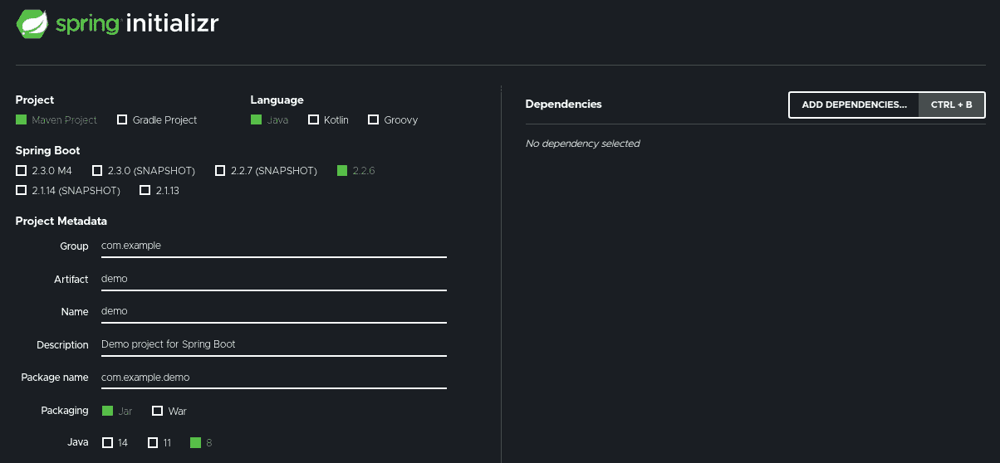

# Series — Inisiasi Project

> 原文：<https://medium.easyread.co/series-inisiasi-project-1e37ffa951ed?source=collection_archive---------0----------------------->

## 2 — Initialize the Project and Save to Repository


Photo by [Syd Wachs](https://unsplash.com/@videmusart?utm_source=unsplash&utm_medium=referral&utm_content=creditCopyText) on [Unsplash](https://unsplash.com/s/photos/preparation?utm_source=unsplash&utm_medium=referral&utm_content=creditCopyText)

# Rest API dengan Spring Boot — Series List

[**0\. Series — REST API dengan Spring Boot**](https://medium.com/easyread/series-rest-api-dengan-spring-boo-2d74060e69fb)[**1\. Series — Dimulai dari Instalasi!**](https://medium.com/easyread/series-dimulai-dari-instalasi-b564fb981d4) **2\. Series — Inisiasi Project — (You’re here)** [**3\. Series — Rancangan dan Konfigurasi Database dengan H2**](https://medium.com/easyread/series-rancangan-dan-konfigurasi-database-dengan-h2-3af60e66e4ef)[**4\. Series — Membuat Data Model dengan Sentuhan Lombok**](https://medium.com/easyread/series-membuat-data-model-dengan-sentuhan-lombok-af4a57a75198)[**5\. Series — Menggunakan Spring JPA (1)**](https://medium.com/easyread/series-menggunakan-spring-jpa-1-da3ea1274f7d)[**6\. Series — Menggunakan Spring JPA (2)**](https://medium.com/easyread/series-menggunakan-spring-jpa-2-8673af359e1a)[**7\. Series — Inisialisasi Data**](https://medium.com/easyread/series-inisialisasi-data-aa2ae7d36691)

Mari kita mulai *series* ini dengan *generate* *project* . Sebenarnya ada 2 pilihan dalam *generate project* untuk *Spring* , yang pertama adalah dengan menggunakan *create project* dari IDE (Intellij, Eclipse, VSCode, Netbeans, dll) dan satu lagi melalui [**spring initialzr**](https://start.spring.io/) .

*Nah* , kali ini kita akan menggunakan *spring initialzr* karena menawarkan kemudahan, yaitu kita bisa *generate* *project* beserta *dependencies* yang kita butuhkan sekaligus. *Spring intialzr* ini akan men- *generate* sebuah *file* `**pom.xml**` yang berisi tentang informasi *project* kita berdasarkan apa yang telah kita buat di *spring* intialzr *form* .



Home page spring initialzr

[Ini](https://start.spring.io/#!type=maven-project&language=java&platformVersion=2.2.6.RELEASE&packaging=jar&jvmVersion=1.8&groupId=com.mariesto.exploration&artifactId=springbootrestfulwithjpa&name=springbootrestfulwithjpa&description=RESTful%20using%20Spring%20Boot%20and%20JPA&packageName=com.mariesto.exploration.springbootrestfulwithjpa&dependencies=lombok,web,data-rest,h2,data-jpa) adalah *sprint initialzr* yang saya gunakan untuk *generate project* yang teman-teman bisa lihat dan modifikasi sesuai keinginan. Apabila sudah selesai tinggal *generate* dan *starter pack* *spring boot* kita, akan otomatis di *download.* Selanjutnya, teman-teman tinggal membuka IDE, *import project* , pilih `**pom.xml**` yang ada di dalam *folder starter pack* yang sudah di *download* and we’re ready. IDE akan secara otomatis membaca *file* `**pom.xml**` kita dan akan membuka *project* kita.

Sekarang, kita akan *install* semua *dependencies* yang kita butuhkan berdasarkan `**pom.xml**` kita dengan menggunakan *command* :

```
**mvn install**
```

**Maven** akan *menginstall* *dependencies* yang kita butuhkan ke *folder* `**.m2**` , lalu akan *mengcompile* semua *resource* tersebut terlebih dahulu dan akan di- *package* ke dalam satu .jar *file* . Teman-teman boleh cek di *folder* target akan ada sebuah .jar *file* dengan nama `**name**-**version**` sesuai data yang ada di **pom.xml** . Setelah proses `**mvn install**` selesai, kita akan memastikan apakah *project* sudah di- *build* dengan aman dengan *command* :

```
**java -jar target/spring-boot-restful-with-jpa-0.0.1-SNAPSHOT.jar**
```

Secara *default* , *spring boot* akan di *run* pada *port* 8080\. Apabila teman-teman mengakses `**localhost:8080**` melalui *browser* atau postman, maka teman-teman akan mendapatkan sebuah *response* yang berarti aplikasi kita berjalan dengan baik. *Response* nya kira-kira seperti di bawah ini.

```
{
  "_links" : {
    "profile" : {
      "href" : "http://localhost:8080/profile"
    }
  }
}
```

Apabila teman-teman ingin menjalankan spring boot pada *port* yang lain, teman-teman bisa menggunakan *command* :

```
java -jar -Dserver.port=**portNumber** target/spring-boot-restful-with-jpa-0.0.1-SNAPSHOT.jar
```

Setelah proyek kita aman dan bisa dijalankan, ada baiknya teman-teman menyimpannya ke repositori. Teman-teman bebas menggunakan apa saja boleh gitlab, github atau yang lain. Apabila teman-teman belum pernah memakai git sebelumnya, teman-teman boleh mengikuti artikel [ini](https://opensource.com/article/18/1/step-step-guide-git) terlebih dulu atau mengikuti langkah yang ada di tulisan berikut [**Belajar Git Dalam Waktu Singkat (Studi Kasus: Github)**](https://medium.com/easyread/belajar-git-dari-dasar-dalam-waktu-singkat-github-82e5e7880b4e) **.**

*See you in the next part* 🔥