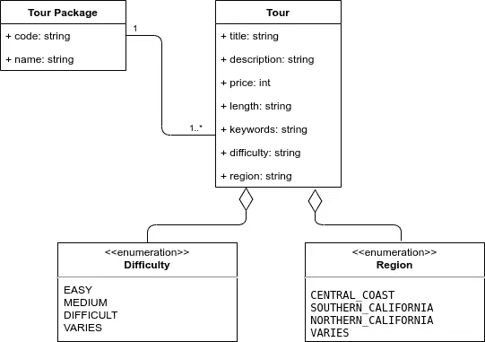
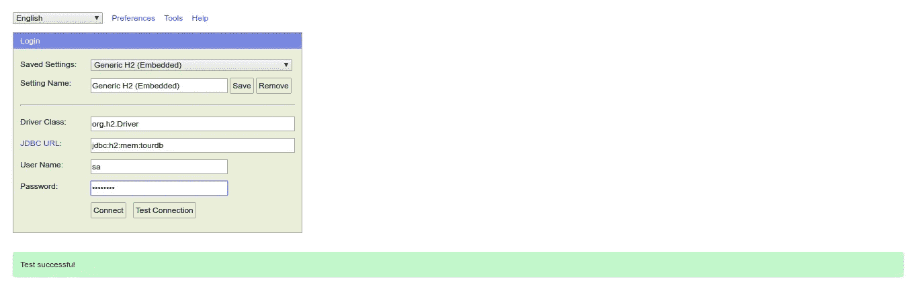

# Series — Rancangan dan Konfigurasi Database dengan H2

> 原文：<https://medium.easyread.co/series-rancangan-dan-konfigurasi-database-dengan-h2-3af60e66e4ef?source=collection_archive---------1----------------------->

## 3 — Connect to Database

Photo by [Jeff Sheldon](https://unsplash.com/@ugmonk?utm_source=unsplash&utm_medium=referral&utm_content=creditCopyText) on [Unsplash](https://unsplash.com/s/photos/design?utm_source=unsplash&utm_medium=referral&utm_content=creditCopyText)

# Rest API dengan Spring Boot — Series List

[**0\. Series — REST API dengan Spring Boot**](https://medium.com/easyread/series-rest-api-dengan-spring-boo-2d74060e69fb)[**1\. Series — Dimulai dari Instalasi!**](https://medium.com/easyread/series-dimulai-dari-instalasi-b564fb981d4)[**2\. Series — Inisiasi Project**](https://medium.com/easyread/series-inisiasi-project-1e37ffa951ed) **3\. Series — Rancangan dan Konfigurasi Database dengan H2 — You’re here** [**4\. Series — Membuat Data Model dengan Sentuhan Lombok**](https://medium.com/easyread/series-membuat-data-model-dengan-sentuhan-lombok-af4a57a75198)[**5\. Series — Menggunakan Spring JPA (1)**](https://medium.com/easyread/series-menggunakan-spring-jpa-1-da3ea1274f7d)[**6\. Series — Menggunakan Spring JPA (2)**](https://medium.com/easyread/series-menggunakan-spring-jpa-2-8673af359e1a)[**7\. Series — Inisialisasi Data**](https://medium.com/easyread/series-inisialisasi-data-aa2ae7d36691)

# Design Model

Untuk *project* ini, kita akan membuat RESTful API dengan studi kasus paket perjalanan *.*

Design Class Diagram

Satu *tour package* bisa terdiri atas beberapa *tour* ( *one-to-many relationship* ). *Tour Package* akan berisi informasi nama paket wisata dan kode paket wisata, sementara *Tour* berisi informasi tentang sebuah wisata. Apabila teman-teman ingin modifikasi ataupun memiliki kasus lain, *feel free to do it* .

# Konfigurasi H2 Database

Kita akan menggunakan H2 database karena H2 ini bersifat ***in-memory database*** , yang artinya *database* ini hanya akan ada saat aplikasi dijalankan dan *database* ini akan hilang ketika aplikasi sudah berhenti. H2 ini juga menyediakan sebuah *dashboard* *admin* yang biasa disebut H2 *Console* .

Dengan melakukan sedikit konfigurasi, kita sudah dapat menggunakan H2 ini. Silahkan teman-teman *edit file* `**application.properties**` menjadi seperti barisan code berikut ini:

Teman-teman dapat mencoba *run* lagi aplikasi tersebut, dan coba akses `**localhost:8080/h2-console**` melalui browser dan akan menampilkan *login form* . Teman-teman cukup mengisikan *username* dan *password* sesuai dengan yang ada di `**application.properties**` *.*

Login Page H2 Console

Teman-teman boleh *test connection* lebih dulu dan apabila sudah berhasil akan *redirect* ke *dashboard page* H2.

See you in the next part 🔥