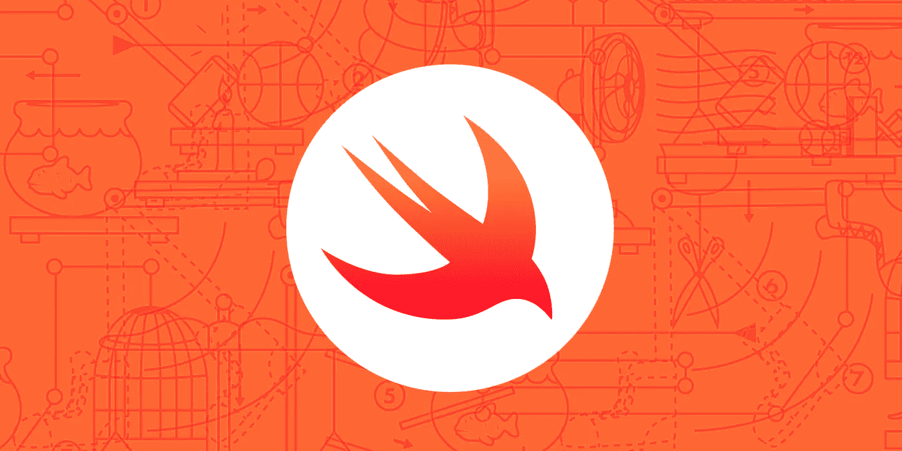

# 使用 Swift 进行无服务器计算

> 原文：<https://medium.com/capital-one-tech/serverless-computing-with-swift-f515ff052919?source=collection_archive---------1----------------------->

## 第 1 部分:Swift 和 AWS Lambda



# 为什么选择无服务器 Swift？

与无服务器计算是否值得追求的问题不同的一个问题是，为什么要在 Swift 中实施无服务器系统？

有三个主要原因使得 Swift 成为 Lambda 实现语言的良好候选。首先，Swift 是一种强大的、健壮的、富于表现力的语言，旨在在各种各样的环境中高效工作，包括服务器端计算。就其本身而言，这并不是一个很大的区别，因为还有其他几种语言(Rust，Go)可以这样描述。然而，Swift 提供了两种额外的可能性——利用现有开发人员资源的机会，以及在系统的多个层面共享代码的机会，特别是后端和移动客户端。

让我们考虑一个示例场景。

# 一个例子

我已经决定成立一家初创公司——这是我能做的酵母，一家专注于美食面包的在线面包店。因为没有一个自尊的面包店会因为没有一个强大的云基础设施而死亡，所以我的首要任务是构建一个微服务来处理向客户发送收据。

具体来说，我想要一个服务，它的输入是要订购的商品列表。一个项目是面包的类型和数量；比如三个羊角面包。输入用 JSON 编码。输出是收据的字符串表示。它列出了每个订购项目、其小计以及整个订单的总计。目前，我不会担心把收据做得太漂亮。

我从忽略网络和编写可以用作命令行工具的代码开始。首先，我将创建一个新目录，并使用 Swift 包管理器(SPM)创建一个 Swift 应用程序。请注意，应用程序将被命名为 *bru* 。

```
mkdir bru
cd bru
swift package init —type=executable
```

现在，我指定数据类型。考虑到可重用性，我将它们定义在主应用程序之外的一个独立模块中。我创建了一个目录 *Sources/bruModels* ，在这个目录中，我用下面的代码创建了文件 *Item.swift* 、 *Order.swift* 和 *Receipt.swift* (完整列表可在[https://gist . github . com/prof Burke/2e 951 f 48542 a 9 a1 ff 47051572d 77584 c](https://gist.github.com/profburke/2e951f48542a9a1ff47051572d77584c)获得):

```
// Item.swiftenum Style: String, Codable {
  case croissant
  case naan
  case pumpernickel 
  case rye
} struct Item: Codable {
  let amount: Int
  let style: Style
}// Order.swiftstruct Order: Codable {
  public private(set) var items: [Item] …}// Receipt.swiftstruct Receipt: Codable, CustomStringConvertible { …}
```

我依靠 Swift 4 中新的[可编码协议](http://swiftjson.guide/)来神奇地处理与 JSON 之间的数据转换。正确组合 Swift、Codable 和 JSON 有时会很棘手。但我会在另一篇博文中讨论可能存在的困难。对于这个例子，序列化很简单，我可以使用自动生成的序列化代码。

指定了数据类型后，我转向订单处理。下面是驻留在 *Sources/bru* 中的 *main.swift* :

```
import Foundation
import bruModels

let inData = FileHandle.standardInput.readDataToEndOfFile() 
let decoder = JSONDecoder()func format(_ response: String, payload: String) ->  String  { let result = “{ \”response\” : \”\(response)\”, \”payload\” : \”\(payload)\” }” return result
} do {
  let order = try decoder.decode(Order.self, from: inputData)
  let receipt = order.receipt()
  print(format(“success”, payload: receipt.description))
} catch {
  print(format(“error”, payload: “In a real app, this would have useful information.”))
}
```

这段代码执行一个简单的输入到输出的转换。它接收一个 JSON 格式的项目数组，并使用 Swift 的 *JSONDecoder* 对数据进行反序列化。然后，它调用*订单*类上的实例方法来创建收据，并将其发送到流程的标准输出。

在构建程序之前，我需要对运行包初始化命令时自动生成的包清单文件 *Package.swift* 做两个小的修改。我需要为 *bruModels* 添加一个目标，并将这个新目标指定为主目标的依赖项。具体见完整列表([https://gist . github . com/prof Burke/2e 951 f 48542 a 9 a1 ff 47051572d 77584 c](https://gist.github.com/profburke/2e951f48542a9a1ff47051572d77584c))。

现在我编译如下:

```
swift build
```

接下来，我可以在命令行上测试它，方法是输入一些 JSON，然后看看我得到了什么。创建一个文件， *order.json* ，内容如下:

```
{“items” : [
  { “style” : “naan”, “amount” : 2 },
  { “style” : “rye”, “amount” : 3 },
  { “style” : “croissant”, “amount” : 6 } ]
}
```

现在输入命令:

```
cat order.json | .build/debug/app
```

果然，测试返回:

```
{ “response” : “success”, “payload” :
  “Receipt for Order on 2018–01–09 21:07:19 +0000
   — — — — -
   2 NAAN @ 0.87 = 1.74
   3 RYE @ 0.62 = 1.86
   6 CROISSANT @ 1.23 = 7.38
   — — — — -
   Total: 10.98“
}
```

正如我上面提到的，这不是最漂亮的输出，但它足够了。

随着一个简单的测试成功，我宣布胜利，并继续下一步。

# Swift 和 AWS Lambda

截至本文撰写之时(2018 年 1 月)，Lambda 支持 JavaScript、Python、Java、C#和 Go。很明显，斯威夫特不在名单上。但是不要害怕！AWS Lambda 支持节点的 [*子流程*](https://nodejs.org/api/child_process.html) 模块，我可以使用它来启动我的 Lambda 函数并与任意可执行文件交互。

我将编写一个简短的 JavaScript 函数，通常称为 *shim* ，它将作为 Lambda 函数被调用。shim 启动 Swift 可执行文件，捕获其输出，并将其作为 Lambda 调用的结果返回。

在上一节中，我已经决定忽略网络，将 Swift 程序作为命令行工具来编写。这个决定是值得的，因为这正是 shim 所需要的！

代码如下:

```
const spawnSync = require(‘child_process’).spawnSync;exports.handler = (event, context, callback) => {
  const command = ‘libraries/ld-linux-x86–64.so.2’;
  const childObject = spawnSync(command,
   [“—library-path”, “libraries”, “./bru”],
   {input: JSON.stringify(event)}); var stdout = childObject.stdout.toString(‘utf8’);
  callback(null, stdout);
};
```

这段代码是做什么的？*子进程*库被导入，函数*处理程序*被导出。*处理程序*是 Lambda 函数。它启动一个新流程，并将*事件*作为新流程的标准输入。*处理程序*然后捕获流程的标准输出，作为 Lambda 函数的结果返回。

现在你可能已经明白了 *spawnSync* 是启动一个新进程的节点函数。但是您可能期望它的*命令*参数是 Swift 可执行文件。不幸的是，事情没那么简单。

相反，子进程运行 Linux 动态链接器(通常命名为 *ld.so* ，尽管在本例中，我们使用符号链接的目标*LD-Linux-x86–64 . so . 2*)。什么是动态链接器？我引用一下(Linux)手册页:链接器“找到并加载一个程序需要的共享对象(共享库)，准备程序运行，然后运行它。”

但是为什么要采取这种鲁布·戈德堡式的方法呢？

# 并发症

Lambda 函数在特定的 AMI 下运行，而那个 AMI 没有 Swift 编译器。因此，我需要使用支持 Swift 编译器的 Linux 版本来构建可执行文件，然后我必须安排可执行文件在 Lambda 的 AMI 上运行。

为此，我用 Swift 可执行文件、JavaScript shim 和运行 Swift 代码所需的所有必要的动态库创建了一个 zip 文件。zip 文件被上传到 AWS Lambda，一切就绪。

除此之外，如何收集所有正确的动态库呢？

这就是 Docker 的用武之地。Docker 不是绝对必要的；我可以找到一个运行适当操作系统的备用机器，在那里编译我的 Swift 代码。但是使用 Docker 可以让我在 Mac 笔记本电脑上完成所有的开发工作。

通过选择合适的 Docker 映像，我们可以在 Linux 环境中轻松编译 Swift 应用程序，并收集必要的动态库。 [Dockerhub](https://hub.docker.com/) 有几个支持 Swift 编译器的 Docker 镜像可供选择。我选了一个叫*doctor impossible/swift 4 Ubuntu*的。以下命令将带我们完成必要的步骤:

```
docker run -it -v “$(PWD):/bru” doctorimpossible/swift4ubuntu bash
cd bru
swift build -c release —build-path .build/native   
mkdir -p .build/deploy/libraries
```

这些命令有什么作用？

1.启动 Docker 映像，使 *bru* 目录在我们的 Docker 容器中可用，并通过 shell 连接到我们的容器。

2.转到 *bru* 目录。

3.使用指定的构建位置编译应用程序的发布版本。

4.创建一个目录来放置所有必要的动态库。

最后，我需要识别运行 Swift 可执行文件所涉及的所有动态库。所以，最后一个有点复杂的咒语会起作用:

```
ldd .build/native/release/bru
    | grep so
    | sed -e ‘/^[^\t]/ d’
    | sed -e ‘s/\t//’
    | sed -e ‘s/(0.*)//’
    | xargs -i% cp % .build/deploy/libraries
```

首先， *ldd* 运行。这个实用程序列出了命令行上列出的可执行文件的所有动态依赖关系( *ldd* *是列表动态依赖关系*的缩写)。在 Linux 上，动态库的文件扩展名是*。所以*。因此，为了安全起见，并防止来自 *ldd* 的潜在噪声线路，其输出通过管道连接到 *grep* 。然后，在几个简单的步骤中，我使用流编辑器 *sed* 从每个剩余的行中删除所有多余的字符，这样我只剩下一个简单的文件路径。最后，路径列表通过管道传输到 *xargs* 中，xargs 使用 *cp* 将库复制到特定的目录中。

(*理论上应该可以静态编译 Swift 程序，这样就不需要寻找和捆绑所有的动态库了。然而，我还没能让它工作。)*

收集了所有必要的动态库之后，所需要的就是用这些库、应用程序本身和 JavaScript shim 创建一个 zip 文件。因此，退出 Docker(在命令提示符下键入‘exit ’),然后:

```
cd .build/deploy
cp ../native/release/bru .
cat > index.js // paste in the JavaScript code listed above, then hit Control-D
zip -r lambda.zip *
```

现在，我上传 *lambda.zip* 到 AWS lambda，我将准备测试我的 Lambda 函数。如果安装了 AWS 命令行界面(CLI ),则创建 Lambda 函数的过程如下:

```
aws lambda create-function —function-name bru
    —runtime nodejs6.10
    —role <your-lambda-execution-role> 
    —handler index.handler
    —zip-file fileb://lambda.zip
```

将<your-lambda-execution-role>替换为具有执行 Lambda 函数的适当权限的 IAM 角色。</your-lambda-execution-role>

使用 CLI 可以轻松测试新功能。记下示例部分中提到的文件 *order.json* 的文件路径，然后输入以下命令:

```
aws lambda invoke —function-name bru
    —invocation-type RequestResponse
    —log-type Tail
    —payload file://<path-to-order.json>
    outputfile.txt
```

如果一切顺利，您将看到一个 JSON 片段打印到您的终端上，其中包含字段 *StatusCode* (应该是 200)和 *LogResult* 。日志结果并不重要，但是如果您很好奇，您需要从 base64 编码中解码它。您的 Swift 程序创建的收据将保存在 *outputfile.txt* 中。

如果您愿意，可以使用 AWS web 控制台创建 Lambda 函数，上传 zip 文件，并测试该函数。由于 zip 文件相当大(25M)，你可能会得到一个警告，建议你通过亚马逊 S3 上传，但它会工作。

# 后续步骤

安装并测试了 Lambda 函数之后，下一步就是将它集成到基础设施的其余部分。该功能是在 Swift 中实现的，这一事实与您系统的其余部分几乎无关。您可以将该功能放在 Amazon 的 API 网关后面，或者用任何标准的 AWS 触发器(如 SNS 主题、DynamoDB 事件等)对其进行配置。

更重要的是，理解了创建 Swift Lambda 函数背后的过程，并且着眼于减少单调乏味，您应该考虑自动化这个过程的方法。这样做的现有项目是 Hexaville。虽然我没有使用过它，但我已经通读了代码，它看起来像一个可靠的方法。它还有一个额外的优势，就是提供了用于与 DynamoDB 交互和利用 OAuth 的 Swift 库。另一个值得研究的项目是 [Apex](http://apex.run) 。尽管 Apex 目前不支持 Swift，但它使您能够用 Clojure、Rust 和 Go 编写 Lambda 函数，并可能为 Swift Lambda 流程的改进提供有用的灵感来源。

如果您对无服务器系统感兴趣，但是正在寻找其他选择，请关注第 2 部分，在那里我将讨论如何将 Swift 与 Apache OpenWhisk 和 IBM 的 Blue Mix 结合使用。

*声明:这些观点仅代表作者个人观点。除非本帖中另有说明，否则 Capital One 不属于所提及的任何公司，也不被其认可。使用或展示的所有商标和其他知识产权都是其各自所有者的所有权。本文为 2018 首都一。*