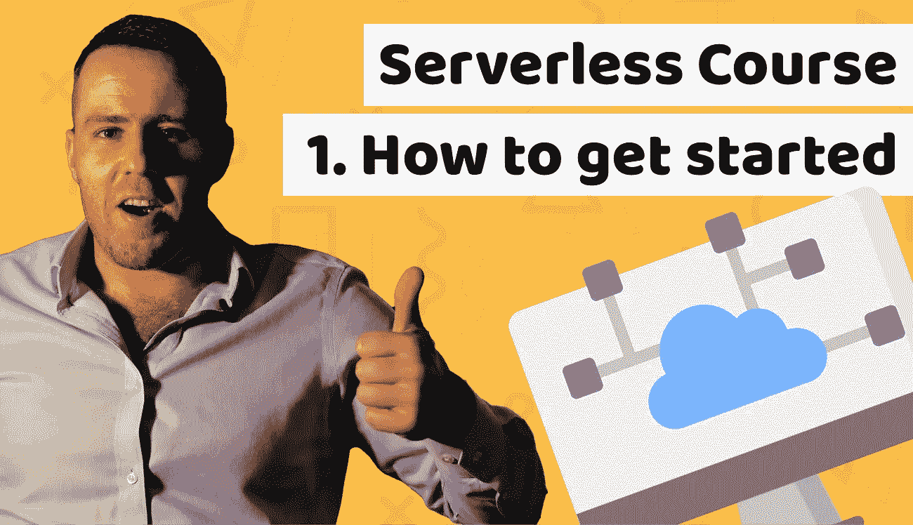

# 无服务器课程—第 1 课:初学者入门教程

> 原文：<https://medium.com/duomly-blockchain-online-courses/serverless-course-lesson-1-how-to-get-started-tutorial-for-beginners-95076d9841e6?source=collection_archive---------1----------------------->

[Serverless Course — How to get started?](https://www.blog.duomly.com//lesson-1-serverless-how-to-get-started-tutorial/)

本文最初发表于[https://www . blog . duomly . com//lesson-1-server less-how-to-started-tutorial/](https://www.blog.duomly.com//lesson-1-serverless-how-to-get-started-tutorial/)

# 无服务器入门教程

今天我们将学习无服务器入门教程。