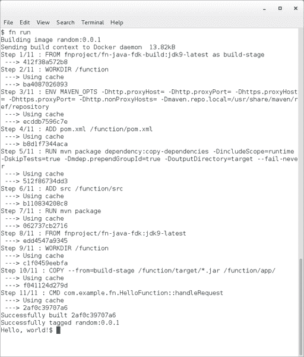
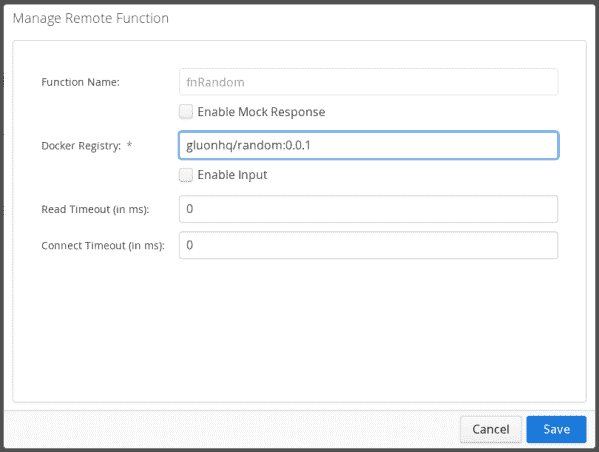
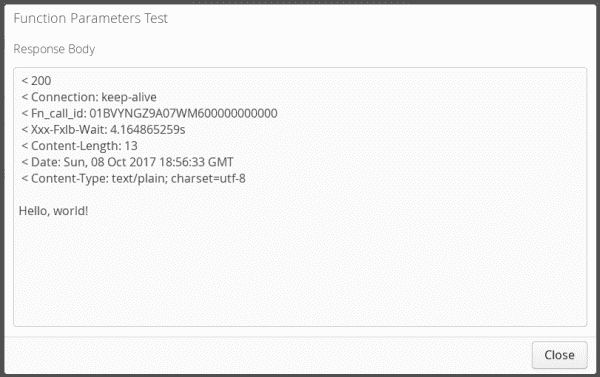

# Gluon CloudLink 和 Fn 项目的无服务器功能

> 原文：<https://medium.com/oracledevs/serverless-functions-with-gluon-cloudlink-and-fn-project-540752904d9b?source=collection_archive---------1----------------------->


[fnproject.io](http://fnproject.io)

在过去一年左右的时间里，围绕“无服务器”功能(也称为“功能即服务”(或 FaaS))的讨论越来越多。这通常简单地归结为能够执行代码，而无需经历设置和管理基础设施的麻烦(并且确实仍然依赖于服务器！

对于移动应用程序，无服务器功能增加了许多好处:

*   客户端上的代码越少，客户端出现问题的可能性就越小——这就减少了向客户和最终用户部署修补程序的需要。
*   说到这里——客户端代码很难更新——它不仅仅是向各种应用程序商店发送新版本。更改需要内部审查和验收测试，然后部署到各种应用商店，这通常需要几天时间。对于热修复，这通常是不可接受的。
*   客户端代码处理简单的对象，而企业代码通常需要更复杂的调用和流程，使用更多的参数和配置。将企业结果转换成简单的客户机对象的代码可以作为远程服务器上的一个函数来执行，而不是增加客户机和网络的开销。

为此， [Gluon CloudLink](https://gluonhq.com/products/cloudlink) 支持[远程功能](http://docs.gluonhq.com/cloudlink/#_remote_functions)。到目前为止，Gluon CloudLink 已经允许客户端应用程序调用它来运行远程功能，然后它可以透明地调用零个或多个 REST 端点和零个或多个 Amazon AWS Lambda 功能。

在 JavaOne 2017 大会上，[甲骨文](https://blogs.oracle.com/developers/announcing-fn)宣布了 [Fn 项目](http://fnproject.io/)，这是一个开源的无服务器函数平台，可以在任何地方运行，支持每种编程语言的运行函数。Fn 项目的主要好处之一是功能可以部署在任何系统上，包括您的本地开发系统。这使得开发人员很容易拥有较短的编写-测试-调试周期。

截至本周，Gluon CloudLink 已经支持 Fn 函数。客户可以编写和构建自己的 Fn 功能，将它们推送到 Docker 存储库，并在移动应用程序请求时，让它们在自托管 Fn 平台上的 Gluon CloudLink 基础架构内运行。

我们将为此创建更多的示例和教程。同时，简而言之，它是这样工作的:

1.  下载/安装 [Fn 项目](http://fnproject.io/)。这允许您在将函数推送到 docker 存储库之前，在本地创建和测试函数。
2.  写你的 Fn 函数。在 [GitHub 库](https://github.com/fnproject/fn)中可以找到一个例子列表。

```
mkdir myfunction 
cd myfunction
fn init — name myfunction — runtime java
fn run
```

1.  构建您的 Fn 函数并将其推送到公共 docker 存储库，即 [Docker Hub](https://hub.docker.com/) :

```
fn build
fn push --registry DOCKER_HUB_USERNAME
```

1.  在 Gluon CloudLink 中创建一个远程函数，引用 docker 存储库中的图像[见下面的截图]
2.  点击“测试”按钮测试远程功能[参见下面的其他截图]
3.  从移动应用程序调用远程功能



【gluonhq.com】原帖[](https://gluonhq.com/serverless-functions-gluon-cloudlink-oracle-fn/)