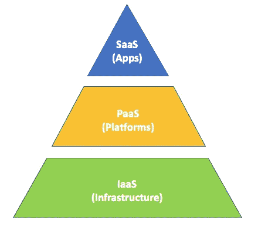
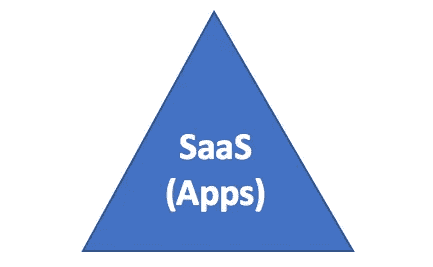
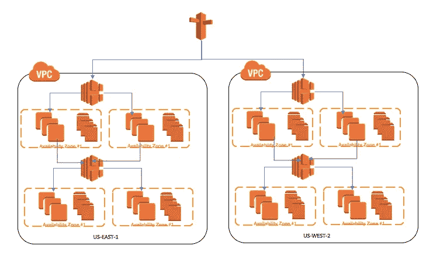
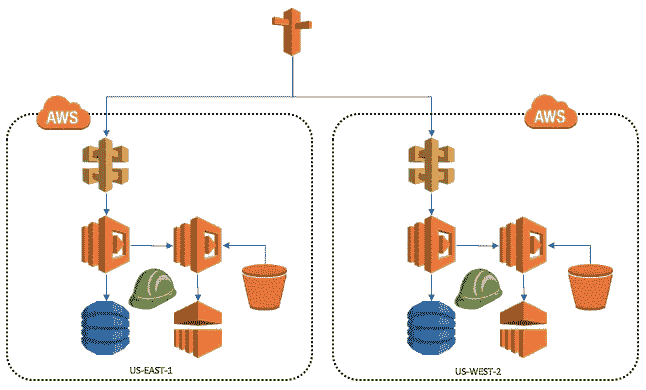
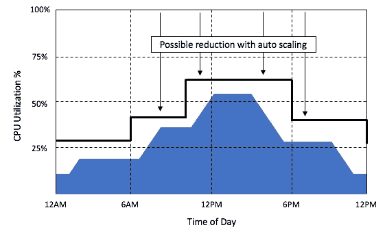
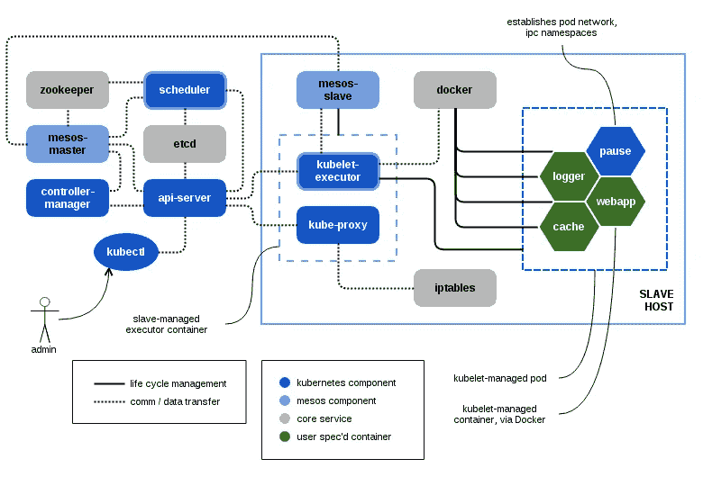
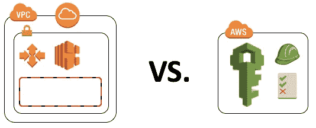

# 无服务器是我一直想要的平台即服务

> 原文：<https://medium.com/capital-one-tech/serverless-is-the-paas-i-always-wanted-9e9c7d925539?source=collection_archive---------2----------------------->

The Service Model

在云计算的早期，我们会分享一个非常简单的图片来解释云服务模型，有时会使用类似上面金字塔的图表。我相信您已经看到了它的一个版本——将不同的服务类型显示为一个堆栈，突出显示每种类型之间的关系。当我对开始使用云的新员工进行培训时，说明会涵盖不同的服务层，并且会详细说明每个服务层的定义。

**基础设施即服务** —新云计算模式的基础。我将阐述使用这种模式与拥有自己的数据中心有何不同，包括不再需要专注于管理设施，以及这些主要提供商在机架商用服务器和架顶式交换机方面的单位成本优势。

**平台即服务**进展顺利，是一项正在进行的工作。有一些真实世界的例子，但大部分仍然是描述什么是可能的，什么是在市场上使用的。优势是显而易见的，因为我们需要的不仅仅是提供计算能力的提供商，我想举一个 NIST 的例子，它很有吸引力。

> 云平台即服务(PaaS)。提供给消费者的功能是将消费者创建或购买的应用程序部署到云基础设施上，这些应用程序是使用提供商支持的编程语言和工具创建的。消费者不管理或控制底层云基础架构，包括网络、服务器、操作系统或存储，但可以控制已部署的应用程序以及可能的应用程序托管环境配置。—资料来源:加州国家标准与技术研究所，2009 年。

**软件即服务** —速度和敏捷性将真正得到释放。有很多很好的例子突出了 [Office365](https://products.office.com/en-US/business/enterprise-productivity-tools) 和 [Workday](https://www.workday.com/) 以及许多行业特定服务的成功和发展。考虑到上市时间的节省，该模型和优势很容易表述，并且它非常适合同时推出的微服务讨论。

考虑到构建定制服务系统和利用标准工程模式的需求，这个概念很棒，但在三种服务类型中，PaaS 市场发展最慢，而且没有成功案例，更难向他人解释价值主张。

# 2017 年的云建设

好了，快进到今天，让我们检查一下在云中构建基础架构的选项。它们与我第一次培训时有什么相似之处，又有什么不同？

假设现在是 2017 年，让我们用一个常见的当代投资项目作为例子——建造一个语音聊天机器人。这个假想的聊天机器人将是一个友好的语音驱动助手，可以在亚马逊 Alexa 平台上运行，帮助个人找到并预订他们理想的度假胜地。营销人员说，这将是今年冬天的一个大热门，因为人们想逃离寒冷的天气。因此，我们应该假设它每秒可以处理数千个请求；当我们开展广告活动时，每天都有可能为数百万潜在客户提供服务。让我们也假设我们正在寻求推动亚马逊 Alexa 开发的信封，这样返回的内容将不仅仅是口语单词，还将包括播放来自异国情调的声音的能力，并使用[卡功能](https://developer.amazon.com/public/solutions/alexa/alexa-skills-kit/docs/providing-home-cards-for-the-amazon-alexa-app)显示可能目的地的图片。

## 选项 1 —使用 IaaS 的解决方案

第一种选择是使用 AWS 等云提供商提供的基础部分，类似于传统的内部数据中心。我们将受益于为我们预配置的所有这些基础架构，但需要自动配置不同的部件和组件。解决方案可能看起来像这样。

Traditional IaaS model of building in the Cloud using AWS

新平台中有一系列堆栈:

1.  API 接口栈将亚马逊 [Alexa 平台](https://developer.amazon.com/alexa)与我们的业务逻辑联系起来，用 Java 编写。典型的 Web/App 层使用单独的 [EC2](https://aws.amazon.com/ec2/) 实例托管，可能会使用内存优化的[实例类型](https://aws.amazon.com/ec2/instance-types/)。
2.  提供图像和音频剪辑的内容管理。这些可能是通用实例类型。
3.  像 [MongoDB](https://www.mongodb.com/) 这样的 noSQL 解决方案，用于为分析持久化数据。这里可能需要一些存储优化类型，并获得额外的 IOPS。
4.  一个 ELK (Elasticsearch，Logstash & Kibana)堆栈，用于实时数据收集和仪表板。同样，通用实例类型也可以。
5.  一个独立的计算集群，用于对捕获的事务数据运行分析处理。同样，存储优化和额外的 IOPS。

每个堆栈在每个区域都有一个 ELB，它自己的 EC2 实例集群(包括自动扩展组)，以及必需的 EBS 卷、子网和安全组。我们将通过[云形成](https://aws.amazon.com/cloudformation/)实现这一切的自动化。

需要多少基础设施？这取决于我们的非功能性需求，但假设广泛使用自动扩展，跨区域和地区运行工作负载以提供高可用性解决方案，针对代码推广和非生产环境的蓝绿色部署，大约 60–80 个 EC2 实例。假设其中一半是按需的，其他的我们可以转换成保留的实例。加入十几本 ELB 的，120-150 EBS 的书，其中一些有很高的 IOPS 用于分析。规模很重要，虽然 web 层我们可能能够缩小到小型通用实例，但分析和内容管理组件可能是具有大容量的专业类型。

## 选项 2 —无服务器(PaaS？)设计

第一个选项有许多部分，需要多名熟悉领域的工程师去配置每个堆栈。我们转向云的愿望之一是摆脱管理基础架构的复杂性，那么我们还能如何实现这一点呢？让我们尝试使用新的无服务器方法，并看看它如何比较。

Serverless Architecture Design using AWS

我们没有像第一个选项那样构建“堆栈”，而是在 AWS 目录中使用不同的服务(编号与上面选项#1 的堆栈相匹配)。

1.  API 网关和[λ](https://aws.amazon.com/lambda)—我们可以在没有服务器/负载平衡器的情况下构建业务规则，并且仍然能够处理峰值流量。大小由分配给 Lambda 函数的内存量决定，并且可以动态调整。
2.  内容(MP3，JPG)将被存储在 [S3](https://aws.amazon.com/s3) 中，并且由于它是弹性的，不需要调整大小。成本取决于我们存储了多少内容，以及这些内容被访问的频率。
3.  事务性数据存储我们将流出到 [DynamoDB](https://aws.amazon.com/dynamodb) 。我们不需要根据行数来确定容量大小，尽管我们需要设置读/写 IO 使用率，因为这是产品的定价方式。
4.  监控是一个棘手的领域，因为没有一个产品能够提供相同的功能。我们可以在 [CloudWatch](https://aws.amazon.com/cloudwatch) 中做一些工作，但那更多是围绕系统级的细节。事务级可以用[elastic cache](https://aws.amazon.com/elasticache)、 [Lambda](https://aws.amazon.com/lambda) 和 [QuickSight](https://quicksight.aws/) 来完成。
5.  几个不同的分析选项包括[红移](https://aws.amazon.com/redshift)。管理是通过服务提供的控制台或使用 API 来完成的。定价更符合传统的基于主机的处理，其中成本由使用的主机数量决定。

现在让我们进一步比较这两个选项。

## 基础设施成本—选项 1 与选项 2

选项之间需要理解的一个关键概念是定价模式，以及我们是为*容量(选项 1)* 还是*消耗(选项 2)* 付费。例如，下图描述了在一天中达到峰值的服务应用程序的典型利用率。在选项#1 中，我们为盒子里的所有东西付费，但在选项#2 中，我们只为消费的东西付费——即“蓝色区域”。IaaS 提供了自动扩展等功能，在非工作时间可以降低容量(见黑线)，但即使这方面做得很好，仍然会有一些额外的未使用容量被支付。如果做得不好，或者工作负载不太适合自动扩展，这两个领域之间的差异会很大，可能是 3 到 5 倍。

## 劳动力成本——选项 1 与选项 2

只要我们有 AWS 专家，在选项#2 中配置基础设施会快得多。它让我们摆脱了管理低级组件的工作，而编排这些组件可能会很耗时，而且每个服务都公开了关键部分供我们进行调整。此外，当我们关注配置和测试自动缩放规则的周期时，选项#1 会对劳动力产生影响。虽然这可能是值得花的时间，但它增加了劳动力(因此不是免费的)。在选项#2 中，这种复杂性由云提供商承担，并包含在服务价格中。

## 选项# 3——拯救集装箱！

现在读完这篇文章，你可能倾向于使用容器和 swarm/kubernetes/mesos 等来改进这些设计选项。指挥。它们非常适合堆栈#1，中等适合堆栈#4 和#5，不适合堆栈#2 和#3。容器是一项伟大的技术，因为它们可以简化应用程序供应和部署，并提高我们基础架构的利用率，从而缩小上图中供应和消耗之间的差距。

首先，让我们澄清我们的假设，如果我们使用 [ECS](https://aws.amazon.com/ecs/) ，它只是选项#2 的一个变体，因为云提供商正在承担基础设施和工具。作为一个客户，如果我在基础设施之上构建容器，这是一个新的方法，比选项#1 更有优势，但是让我们问自己一个澄清的问题，作为一个组织，我们更广泛的目标是什么。

> 你希望你的工程天赋花在哪里？您希望他们成为构建基础设施抽象层的专家，还是希望他们创建产品功能？

[https://mesosphere.com/blog/2015/09/25/kubernetes-and-the-dcos/](https://mesosphere.com/blog/2015/09/25/kubernetes-and-the-dcos/)

对我来说，我不为云托管公司工作，构建工具和基础设施抽象层不是我们的核心能力。我确实希望我的工程师花时间关注客户，并构建功能来改善他们的财务状况。虽然我的团队可能正在构建管理容器的工具，但是这种努力会占用专用于产品开发的功能/周期。从我的角度来看，基础设施之上的抽象是伟大的工程作品，但这难道不是云提供商应该为我做的吗？

# 选项#1 和#2 之间的其他权衡？

无服务器模式仍在不断成熟，尽管产品在快速发展，但它们仍有局限性，这可能需要变通办法来模仿那些可以在 IaaS 基础上从头开始构建框架的功能。随着时间的推移，我假设随着这些服务变得更加成熟，这些限制将会消失。为了使这种新模式取得成功，各集团还必须在基础设施方法方面进行一些重大转变。其中包括:

## 网络和访问管理

在部署无服务器模式时，最大的思维转变之一是如何管理网络，以及不同组件如何通信。大多数当前的安全模型假定私有网络命名空间模仿传统的数据中心。根据对应用程序大小的估计，将小块地址空间预先分配给子网。用于管理软件定义网络的建模工具非常强大，简化了传统防火墙中构建的复杂性，但仍然假设为 IP 地址范围占主导地位的应用进行本地网络设计。

Network (IP address) based access vs. Role based access

无服务器模型采用基于角色的访问作为组件之间的身份验证模型，网络空间在很大程度上对应用程序是隐藏的。无论是谁提供基础设施，都需要了解组件之间的关系(即哪些组件可以与其他组件通信)，并能够制定支持这种通信的策略。例如，在选项#2 中，Lambda 函数的执行角色将需要一个策略，使其能够对相关的 S3 存储桶和 DDB 表进行读写操作。这就是我们如何达到信息安全中“最小特权”原则的。

## 跨数据中心和区域复制模式

在构建能够跨区域部署应用程序的高度冗余平台时，我们需要设计如何复制持久数据以支持任何 RTO/RPO 服务级别。虽然 S3 可以轻松配置为[跨区域传输数据](http://docs.aws.amazon.com/AmazonS3/latest/dev/crr.html)，但 DynamoDB & RDS 等产品旨在提供跨区域(数据中心)的能力，需要额外的工具和模式来跨区域复制。当使用 IaaS 构建应用程序时，假设您自己完成了所有工作，在某些情况下，需要安装一些框架或工具来实现这一点。从长远来看，我相信这些功能将作为云提供商的功能内置到服务中，并且每天都有新功能发布。

Cross Region Data Replication

## 技能组合变化

使用云提供商构建高效的基础设施需要良好的工程技能，以及为员工制定的[培训计划](/p/how-to-migrate-your-talent-to-the-cloud-bdfaf33784e4)。仅使用 IaaS 服务构建健壮的平台确实变得复杂，需要深入了解正确的 EC2 实例类型、安全组、EBS 选项、自动伸缩和 ELB 的配置。考虑到许多模式是相同的(尽管我遇到的大多数人在所需的网络技能方面存在差距)，将遗留系统管理员转换到 IaaS 可能更容易。

在无服务器模型中，启动单个服务所需的详细程度较低，因为供应工具提供了如何启动的框架，并且提供了默认值来简化模型。只有当我们开始组合许多服务时，才能赶上学习 IaaS 模型所需的复杂程度，IaaS 模型假设在如何组装一组非常可替换的工具以支持特定模式方面有很大的深度。

# 结论

如果我要更新我的云计算课程的培训对话，以反映 2017 年云服务模型的状态，我会在 PaaS 部分引用 AWS 提供的示例，包括 Lambda、DynamoDB 和 RedShift。它们是一个优秀的模型 ***“使用提供商支持的编程语言和工具”*** ，而不要求我***“管理或控制底层云基础设施，包括网络、服务器、操作系统或存储”*** ，这是 NIST 定义多年前为定义 PaaS 而制定的。摆脱对底层基础架构的管理，使工程师能够专注于解决方案构建中最重要的部分，即响应客户的需求。

要了解更多关于 Capital One 的 API、开源、社区活动和开发人员文化的信息，请访问我们的一站式开发人员门户网站 DevExchange。