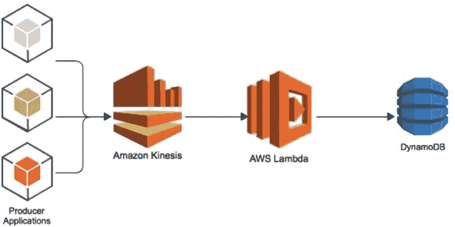
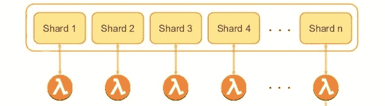
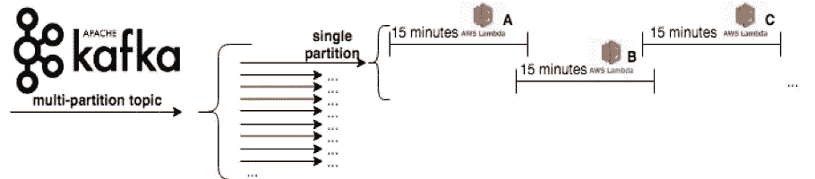

# 无服务器流消费者——常见陷阱和最佳实践

> 原文：<https://medium.com/capital-one-tech/serverless-stream-consumers-common-pitfalls-and-best-practices-8fd431a892f?source=collection_archive---------2----------------------->

乍一看，总是可用的基于 AWS Lambda 的流消费者的想法看起来像是一种反模式。您希望如何(或者为什么)在一个短暂的容器中运行一个永久的、高容量的流消费者？从运营效率的角度来看，好处是易于基础架构管理。有了无服务器的流消费者，同一公司的不同团队可以利用、贡献和采用代码库，而不需要管理基础设施。

像网飞这样的公司已经证明了流处理即服务(SpaaS)模式的好处，例如他们的 [Keystone](/netflix-techblog/keystone-real-time-stream-processing-platform-a3ee651812a) 和 [Mantis](/netflix-techblog/stream-processing-with-mantis-78af913f51a6) 平台等项目。在这种模式中，您希望您的工程团队专注于交付提供业务价值的解决方案，而不是在同一组织内的团队之间复制现有的基础架构。

## 为什么选择 AWS Lambda？

将流消费者作为 AWS Lambda 函数运行的好处通常与无服务器计算的好处密切相关。亚马逊提供了一项名为 AWS Kinesis 的服务，允许开发人员经济高效地处理流媒体数据。通过[几行代码](https://docs.aws.amazon.com/lambda/latest/dg/with-kinesis-example.html)，你可以建立一个简单的、事件驱动的应用程序，当新事件出现时执行动作。

如果您预计事件发生的频率较低，那么与基于服务器的基础架构相比，当事件未被处理时，让您的无服务器应用程序处于“停机”状态具有显著的成本效益优势。

## 事件驱动的消费者架构

虽然 Kinesis 和 Lambda 的结合可以方便地集成到您的 VPC 中，但当试图消耗大量数据时，事件驱动范式并不总是最有效的。为了保证顺序处理，每个 Lambda 消费者被分配到一个单独的 Kinesis 分片，这意味着当你扩展时，[你可能需要重新分片](https://docs.aws.amazon.com/streams/latest/dev/kinesis-using-sdk-java-resharding.html)。因为你是按片收费的，分割会增加你的成本。

事件驱动的设计也可能遇到延迟问题。在这个场景中，每批记录触发一个 Lambda 函数，该函数必须读取记录，有条件地对这些记录执行一个操作，然后*将它们写入一个新的流*。此外，您还必须确保在函数超时之前正确处理数据接收器连接。如果您正在处理流中出现的零星事件，您就不得不[保持 Lambda 函数温暖](https://read.acloud.guru/how-to-keep-your-lambda-functions-warm-9d7e1aa6e2f0)以保持可用性，这又增加了一层基础设施管理开销。

## 持续轮询消费者架构

出于这些原因，我想探索一个特定的用例，它使用一组不断轮询的 Lambda 函数来利用 Apache Kafka，每个 Lambda 函数都被分配给一个 Kafka 主题分区。为每个主题分区分配一个 Lambda 函数的好处是简化了设计和性能。

想象一下这样一种情况，每个 Lambda 函数都没有明确地分配给一个主题分区；当部署 Lambdas 组时，它们不会同时出现，这意味着 Kafka 集群的代理(充当组协调器)会在每次出现新消费者时尝试重新平衡消费者。消费者再平衡延迟很大程度上取决于集群的大小和消费者的数量；等待可能需要几分钟，而不是几秒钟。这种长时间的不可用是不可接受的，尤其是当每个 Lambda 函数每次仅可用 15 分钟时。

相反，每个 Lambda 函数应该充当一个专用的分区消费者，不断地轮询记录，近乎实时地应用条件动作，然后接收数据。该函数始终可用，由 CloudWatch 事件按照固定的时间表调用。在这种情况下，需要权衡集成的便利性和性能。也就是说，绕过 AWS Kinesis 和事件驱动的 AWS Lambda 消费者架构，选择更细致的 Kafka 和恒定轮询 Lambda 设计并不容易。

## 陷阱

AWS Lambda 服务作为一个整体有一些限制，需要一些工程来允许我们将它们作为健壮的、持久的数据流消费者使用。这是遇到的四个最紧迫的技术问题:

1.  消费者群体必须持续运行，才能捕获数据流中的所有数据，然而 AWS Lambda 将每个功能的寿命限制在**15 分钟**。
2.  AWS Lambda 函数在第一次被 Amazon CloudWatch 事件调用时会经历**冷启动**，这意味着在它们开始运行之前可能会存在**微小的延迟**，尤其是如果它们存在于虚拟私有云内。
3.  Amazon CloudWatch 事件保证**至少调用**一次，这意味着完全有可能在短时间内多次调用同一个 Lambda 函数。由于 Kafka 通过唯一的消费者 ID 跟踪补偿，这可能是一个主要问题。当具有相同使用者组 ID 的多个使用者试图从同一个 Kafka 分区读取消息时，偏移量不会被正确跟踪，从而导致数据丢失。
4.  对于同一个 Lambda 函数的每一次调用， [AWS 有时会重用一个回收的 ECS 容器来运行您的流程](https://aws.amazon.com/blogs/compute/container-reuse-in-lambda/)。如果您不在函数终止时**关闭所有线程**，线程将继续运行，并可能在将来 Lambda 函数被重新调用时导致意外行为。此外，如果您的调用计划确保 Lambda 函数始终可用(背靠背调用)，那么连续的函数将不会重用同一个容器。相反，所有其他函数都将使用回收容器，这意味着在未处理线程上运行的进程可能会比预期执行得晚。

## 最佳实践

值得注意的是，这些“最佳实践”是针对基于 AWS Lambda 的流消费者在 Kafka 主题上进行操作的通用指南。一个高性能、高容量的无服务器流消费者可能会被调整到特定的用例以及特定于实现的约束。希望这些建议有助于激发更强大的架构设计和实施决策:

*   为了解决每个 Lambda 函数 15 分钟生命周期的最紧迫问题，**使用一个外部存储来跟踪状态。每个 Lambda 函数都应该包含某种状态管理器，它不断地轮询像 DynamoDB 这样的服务。您可以利用每个 Lambda 容器的上下文对象来获取调用时间、AWS 请求 ID(一个惟一的标识符)和函数本身的名称。状态管理器可以轮询外部存储器的状态(开始、停止等)。)，以及前面提到的字段，以允许函数之间的运行时切换每 14 分钟左右成功一次。换句话说，*当旧的 Lambda 停止执行时，一个新的 Lambda 已经被调用，并准备好从旧的 Lambda 停止的地方开始使用数据，几乎是立即开始。***
*   Amazon CloudWatch Events 允许您设置一个 cron 作业来定期触发 Lambda 函数。**为了最小化启动 Lambda 函数的延迟影响，您应该将调用调度设置为每隔 *n — 1* 分钟运行一次，**其中 *n* 是您为每个函数指定的执行超时长度(Lambda 目前最多支持 15 分钟)**。**如果需要始终可用的基础设施，那么您将需要一个 Lambda 函数来随时准备使用记录；等待大约 1 分钟让新的开始运转是不可接受的。通过利用外部状态存储，您可以编写逻辑来允许同一 Lambda 函数的连续调用之间的无缝切换:通过在 14 分钟的时间表中重叠调用同一函数(旧函数失效时，15 分钟的时间不足以让新函数可用)，您可以确保消费者始终准备好消费数据，并最大限度地减少冷启动延迟；*Lambda*继续消耗数据，同时 AWS 启动 *Lambda B 的*容器预热。在这个例子中，*λA*不断地轮询状态表。一旦 *Lambda B* 被调用，它会立即覆盖状态存储中的唯一 ID 和调用时间，通知现在已经过时的 *Lambda A* 停止执行并减速。*Lambda*公布它消耗的最后一条记录的偏移量，而 *Lambda B* **从该点继续消耗，停机时间最短。**

*   如前所述，**AWS****cloud watch Events 保证至少调用一次**，这意味着您必须考虑到 **AWS 在任何给定时间同时调用同一函数的多个实例**。Kafka 消费者不是线程安全的，这意味着这可能是一个大问题。这是利用外部存储作为状态管理器的另一个原因:如果您正确地编写了逻辑，复制实例将发现它的(假定的)惟一容器 ID 已经存在于表中，并在 Kafka 将其注册为消费者之前立即关闭该函数。灾难避免了。
*   这个建议不言而喻，但是当 Lambda 准备降速并被替换时，请确保关闭您的消费者的 Kafka 连接和辅助执行线程。多线程问题调试起来并不有趣，尤其是当它们是 AWS Lambda 特有的，并且每次需要更改代码时都必须重新部署基础设施时。

## 结论

虽然无服务器技术仍处于相对早期的发展阶段，但它可以用来创建强大而灵活的数据流消费者。虽然并非在所有情况下都是理想的，但组织可以构建无服务器的流消费者来降低云提供商的成本，并消除工程团队之间的重复工作。与任何新兴领域一样，最佳实践也在不断发展。我希望这些建议能帮助你避免陷阱，构建更健壮的系统。

披露声明:2019 首创一。观点是作者个人的观点。除非本帖中另有说明，否则 Capital One 不隶属于所提及的任何公司，也不被这些公司认可。使用或展示的所有商标和其他知识产权是其各自所有者的财产。