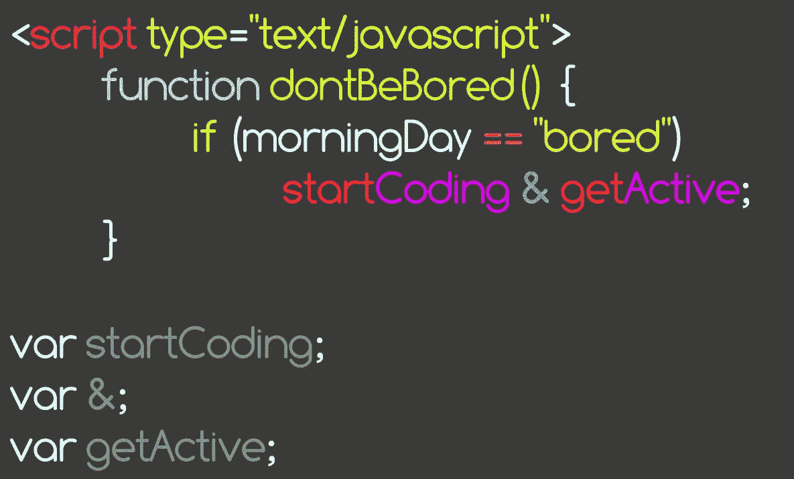
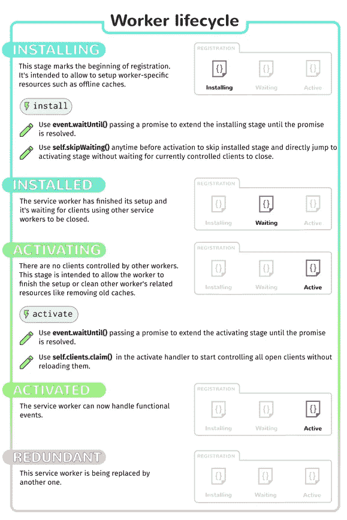

# JS 和线下阅读的服务人员

> 原文：<https://medium.com/quick-code/service-workers-in-js-and-offline-reading-7bac9d4980ea?source=collection_archive---------2----------------------->



嗨！首先:新年快乐！我希望 2018 年是个好年，不会因为一个金发总统而导致第三次世界大战。

现在，让我们开始更有趣的话题。让我们想象一下，你是一个谈论政治新闻的网站的所有者，有非常长的文章，非常棒。作为一个用户，如果我从我的智能手机上下载一些我想在你的网站上阅读的文章，关闭我的智能手机，几天后当我在纽约地铁上没有任何连接的情况下回到那里，仍然可以打开 Firefox 阅读你的文章，这不是很酷吗？

多亏了服务人员，这才成为可能，而且很容易实现。

从前，有一个 API 叫做 [AppCache](https://developer.mozilla.org/en-US/docs/Web/HTML/Using_the_application_cache) 。这个 API 允许人们将页面存储在缓存中，以便在离线时在客户端浏览器中进一步使用。但是它有一个[几个问题](https://alistapart.com/article/application-cache-is-a-douchebag<Paste>)。而 W3C 让这个 API [弃用了](https://html.spec.whatwg.org/multipage/offline.html#offline)。“但是现在我们该怎么办”Devs 问道？嗯，我们有了一个新的强大的 API，允许我们离线存储资产:服务工作者。

这个 Web 世界上的新家伙是一个闪亮的 API，表面上很自豪，因为它的功能允许每个人做他/她想做的任何事情，即使在 AppCache 不高兴和做自己的事情的情况下。

# 服务人员

服务工作者基本上是一个 JavaScript 文件，它将由浏览器在不同于 web 页面的普通脚本的上下文中运行。它:

*   正在独立的执行线程上运行
*   没有访问 DOM 的权限
*   “安装”在用户的电脑/智能手机上。
*   只在 HTTPS 域上运行(对于火狐浏览器，Chrome 不在乎它是否在不安全的页面上)

然后你可以说:“耶，太酷了。但是现在呢？我们可以用这个 JavaScript 做什么？如果它不能访问 DOM……”

嗯，这是因为服务工作者的目的不是处理 DOM，而是处理对服务器的**请求。它有几个步骤，为了说明这一点，我将向您展示一张来自 [MDN](https://developer.mozilla.org/en-US/docs/Web/API/Service_Worker_API/Using_Service_Workers#Browser_compatibility) 的精美图片:**



# 注册服务人员

在安装服务工作者之前，您需要从您的主 JavaScript 文件中注册一个。这可以通过下面的方法`navigator.serviceWorker.register`实现:

```
if ('serviceWorker' in navigator) {
navigator.serviceWorker.register('/serviceWorkerArticles.js', { scope: '/' }):
}
```

这个方法有两个参数:

*   javascript 文件的**名**，相对于你的域的根
*   (可选)范围**范围**给出服务人员有权工作的特定范围。基本上，它是控制资产的文件夹，默认值是域的根。

**注意**:该函数返回一个[承诺](https://developer.mozilla.org/en-US/docs/Web/JavaScript/Reference/Global_Objects/Promise)。

> 找到关于各种编程语言的[快速代码](http://www.quickcode.co/)的免费课程。获取 [Messenger](https://www.messenger.com/t/1493528657352302) 的新更新。

# 安装和使用维修工人

现在，我们从“serviceWorker.js”注册了一个服务工作者，让我们填写这个文件，这样，如果您的用户以前已经访问过所需的文章，您的关于政治文章的网站就可以脱机阅读它的文章。

对于大多数操作，你只需要做一些`addEventListener`，因为服务人员已经有很多有用的事件要听了！

```
self.addEventListener('install', cach => {
    event.waitUntil(
        caches.open('v1').then(cache => {
            return cache.addAll([
              '/',
              '/style.css',
              '/app.js',
              '/favicon.ico',
              '/frontPageCover.jpg',
            ]);
          })
        );
    });
```

我们这里有 3 个有趣的方法！让我们快速浏览一下所有这些内容:

*   `event.waitUntil`:这个方法用于一个事件中，让它等待一个承诺被解决，在我们的例子中，我们必须在服务工作者被认为*已安装*之前从缓存中计算东西
*   `caches.open`:这个方法来自于 [CacheStorage API](https://developer.mozilla.org/en-US/docs/Web/API/CacheStorage) ，它返回一个包含你在给定参数中请求的缓存的承诺。
*   `cache.addAll`:该方法来自[缓存 API](https://developer.mozilla.org/en-US/docs/Web/API/Cache) (不要和 CacheStorage 混淆，缓存 API 是由`caches.open`返回的对象)。该方法接受一个 URL 数组，并尝试对每个 URL 进行检索，然后将其存储在 Cache 对象中。

所以有了这个代码，你的服务人员现在是**注册的**、**安装的**，以及**活动的**。如果你进入你网站的主页，并在离线模式下重新加载，你应该能像以前一样看到你的页面！

# 更进一步

在本文中，我们只讨论了服务工作者 API 的一些部分，但是您可以做许多其他事情，例如删除旧的缓存，动态添加新的 URL 以加载到您的服务工作者中，等等…

如果你想深入了解这一点，我建议你看看这个关于服务人员的 [MDN 页面，这是我今天这篇文章的大部分灵感。](https://developer.mozilla.org/en-US/docs/Web/API/Service_Worker_API/Using_Service_Workers#Browser_compatibility)

请点击👏按钮下面几下，以示支持！⬇⬇

谢谢！别忘了**关注下面的**快速码。