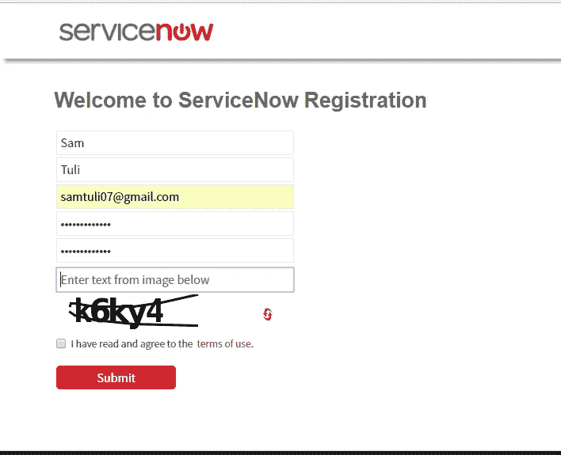

# 如何获取 ServiceNow 开发者实例？

> 原文：<https://medium.com/edureka/servicenow-developer-instance-5cb073e4949c?source=collection_archive---------5----------------------->

ServiceNow Developer Instance — Edureka

ServiceNow 是市场上最受欢迎的 **ITSM** 工具，它自动化了各种业务流程。ServiceNow 如此受欢迎的原因之一是您可以轻松使用 ServiceNow，这可以使用 ServiceNow 开发人员实例来完成。本文专门讨论 ServiceNow 开发人员实例。

# 什么是 ServiceNow 开发人员实例？

ServiceNow 开发人员实例可被视为一个**沙箱**，供开发人员扩展知识，并通过 ServiceNow 平台进行试验，以创建有价值的资产。

ServiceNow Developer Instance 允许您学习、探索和试验该平台。它还允许您在不妨碍客户或非生产实例的情况下测试 ServiceNow 应用程序。

## 第一步:—注册

打开 https://developer.servicenow.com/app.do#!/home[的注册链接，点击注册](https://developer.servicenow.com/app.do#!/home)

## 第二步:—登记表

在注册表中填写您的姓名、用户名和密码

## 步骤 3: —帐户验证

通过单击您注册的电子邮件 id 上收到的链接来验证您的帐户。点击下图所示的链接后。

## 步骤 4: —登录您的 ServiceNow 开发人员平台

将出现以下登录窗口。也可以打开 [**链接**](https://developer.servicenow.com/app.do#!/home) ，点击**签到**进行签到。输入您在注册表中填写的登录凭据

选中“单击此处接受 ServiceNow 开发人员协议”复选框，然后单击提交。填写表格并点击**提交。**

完成以下表格后，将显示屏幕。

## **步骤 5: —此外，您必须请求/创建实例**

现在点击**管理->实例->**点击“**请求实例**”，填写“**请注意**表格，点击“**我理解**”

## 步骤 6: —选择 ServiceNow 开发人员实例的版本

选择您想要使用的**版本**。最新版本是**金斯顿**。

## 步骤 7: —实例凭据信息

将为您的实例提供 **URL** 和登录**凭证**。

## 步骤 8: —登录到您的 ServiceNow 开发人员实例

打开 **URL** ，使用给定的凭证登录，您将进入 ServiceNow 平台。

# 实例活动

如果希望 ServiceNow 开发人员实例处于活动状态，请注意以下几点:-

*   如果实例保持**不活动**达 **10 天**，则实例被**释放**
*   已释放的实例及其数据**无法**恢复
*   您必须定期使用它来保持实例活动

如果您的实例保持非活动状态超过 24 小时，您的实例可能会进入休眠状态。要唤醒实例，请在 [ServiceNow 开发人员站点](https://developer.servicenow.com/)上导航到**管理**–>实例。几分钟后，您的开发人员实例将被唤醒。

注意:—所有的工作/数据都保存在休眠实例上。

***所以，这是关于如何创建 ServiceNow 实例以及需要记住的一些事情。***

***让我们看看关于 ServiceNow Instance 最热门的问题。***

Q1。一个注册帐户可以有多少个 ServiceNow developer 实例？

ServiceNow 只允许每个注册开发者账户有一个实例。

Q2。如何重置我的 ServiceNow Developer 实例密码？

**第一步:** —进入我的实例页面，选择**动作**按钮。

**第二步:——**选择**动作**选项下的**重置管理员密码**。

**第三步:——**点击**是**按钮。

**步骤 4: —** 确认后，开发人员站点重置管理员密码，并以绿色**文本为您提供一个临时密码。**

**第五步:—** 点击**绿色**框中的**文本或在浏览器中键入 URL。您将被提示到您的个人开发人员实例来设置新密码。使用临时密码作为当前密码，并提供新密码。**

**Q3。升级 ServiceNow 开发人员实例后，我可以恢复/返回到以前的版本吗？**

ServiceNow 没有任何恢复/返回到先前版本的选项。我可以请求一个我选择的版本的新实例，并且在我的实例发布后需要等待 15 分钟才能请求一个新实例。

**Q4。如何才能传输/保存我的 ServiceNow 开发人员实例上的数据/工作？**

我可以将我的工作导出为一个**更新** **集**，它以 **XML** 文件的形式保存到我的本地机器上。更新集可以上载到另一个实例。例如:可以将我的应用程序作为更新集导出到另一个实例。

**Q5。有没有选项可以将我的实例重置为初始状态？**

可以，进入 [**我的实例**](https://developer.servicenow.com/app.do#!/instance) 页面。在**动作**选项下选择“**重置并擦除实例**”。

**注意:** — *重置后，所有定制和配置都将丢失。*

**Q6。ServiceNow 开发人员实例有哪些不同的可用版本？**

阿斯彭，2011 年

2012 年柏林奥运会

卡尔加里 2013

(2014 年都柏林奥运会

2014 年尤里卡

富士 2015

(2015 年日内瓦奥运会

2016 年赫尔辛基奥运会

2016 年伊斯坦布尔奥运会

(J)雅加达 2017 年奥运会

(K)金士顿 2017 **(当前)**

所有版本的名称都基于**城市**名称。

这就把我们带到了 ServiceNow 开发人员实例文章的结尾。希望这是信息和帮助你。如果你想查看更多关于人工智能、DevOps、道德黑客等市场最热门技术的文章，你可以参考 Edureka 的官方网站。

请留意本系列中的其他文章，它们将解释 ServiceNow 的各个其他方面。

> 1.什么是 ServiceNow？
> 
> 2. [ServiceNow 教程](/edureka/servicenow-tutorial-55a3ce369e01)
> 
> 3. [ServiceNow ITSM 工具](/edureka/servicenow-tutorial-55a3ce369e01)
> 
> 4. [ServiceNow 脚本](/edureka/servicenow-developer-training-3861b03cc7c0)

*原载于 2018 年 1 月 11 日*[*www.edureka.co*](https://www.edureka.co/blog/servicenow-developer-instance/)*。*