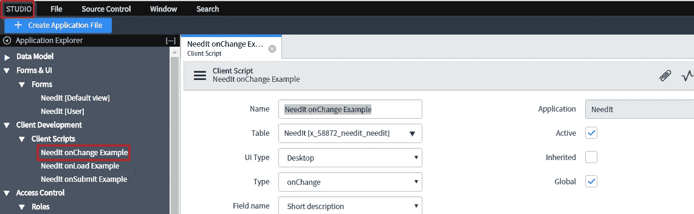
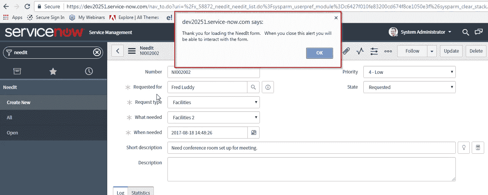

# ServiceNow 脚本初学者指南

> 原文：<https://medium.com/edureka/servicenow-developer-training-3861b03cc7c0?source=collection_archive---------3----------------------->

ServiceNow Developer Training — Edureka

ServiceNow 是最受欢迎的 ITSM 工具之一，它将各种业务流程自动化。在本文中，我将从开发人员的角度讨论 ServiceNow。因此，让我们不要浪费任何时间，开始这篇文章。

本文将带您了解以下几点:

1.  什么是 ServiceNow
2.  脚本简介
3.  演示

所以让我们从本文讨论的第一个话题开始。

# 什么是 ServiceNow？

ServiceNow 是一个软件平台，支持 IT 服务管理并自动化常见业务流程。它包含许多模块化应用程序，这些应用程序会因实例和用户而异。 [ServiceNow](https://www.edureka.co/blog/what-is-servicenow/?utm_source=medium&utm_medium=content-link&utm_campaign=servicenow-developer-training) 是一个集成的**云**解决方案，它将主要的云和业务服务整合到一个单一的记录系统中。

ServiceNow 的旅程始于提供服务目录管理的 IT 服务管理应用程序，如今支持 IT 服务管理流程和 IT 企业，如人力资源管理、安全管理和 PPM 等。

以下特性使 ServiceNow 优于其竞争对手:

*   基于实例的实现
*   易于定制
*   更好的支持和更低的维护成本
*   实时分析和报告

这是对 ServiceNow 的简短介绍。接下来，在本文中，我们将了解什么是 ServiceNow 中的脚本:

# 脚本简介

一个**脚本**只不过是一种计算机编程语言，带有一系列无需编译就能执行的命令。简而言之，脚本就是配置您的系统来执行由特定事件触发的特定任务。

您可以将脚本分为两种类型:**服务器端脚本**和**客户端脚本**

## 服务器端脚本

它是一个运行在 web 服务器上的脚本，为每个用户对网站的请求生成定制的响应。服务器端脚本在**服务器**或**数据库**上执行

服务器端脚本通常用于为用户提供定制的界面。这些脚本可以基于这些特征、用户的要求、访问权限等来汇集用于定制响应的客户端特征。服务器端脚本还使网站所有者能够隐藏生成界面的源代码。

## 客户端脚本

客户端脚本在客户端(web 浏览器)上运行。您可以使用客户端脚本来定义当事件发生时运行的自定义行为，例如，当加载或提交表单或单元格值发生更改时。正确的客户端处理首先依赖于表单的完全加载。在表单加载之前更新记录可能会产生绕过客户端处理的意外结果。客户端 Glide APIs(应用程序编程接口)提供了可以在脚本中用来执行客户端任务的类和方法。

具备 JavaScript 基础知识的用户可以定义在客户端浏览器中运行的脚本。ServiceNow 支持多种类型的客户端脚本。让我们来看看这些:

*   onLoad()
*   onChange()
*   onSubmit()
*   onCellEdit()

**onLoad()**

当表单在用户看到之前加载时，onLoad()脚本就会运行。表单上的值直接来自数据库。这种类型的脚本允许您控制表单首次向用户显示的方式。

**onChange()**

当用户更改任何字段中的值时，onChange 脚本就会运行。这个脚本可以方便地设置一个字段的值，或者根据用户在其他字段中输入的值显示值。

**onSubmit()**

当用户提交表单时，onSubmit 脚本运行。这种类型的脚本对于验证用户输入的值非常有用。

**onCellEdit()**

onCellEdit()脚本与 onChange()脚本非常相似。然而，两者之间有一个主要的区别。onCellEdit()脚本在用户更改列表中字段的值时运行。

# 演示

在这个演示中，我们首先创建一个 GitHub 帐户。

## 创建 Github 帐户:

**第一步:**进入下面的[*链接*](https://github.com/) 创建一个 Github 账号。将出现以下页面。**登录，**如果您已经有一个帐户，请按照步骤进行**注册**。

**第二步:**填写上述详细信息，点击**报名。**将出现以下窗口，在下面显示的字段中填写所需的详细信息。

**第三步:** GitHub 将要求您填写以下详细信息，并点击继续。

第四步:一旦你完成了这些，一个正式的信息页面就会出现，填写这些信息，你就可以开始了。

第五步:完成后，你的账户就创建好了。接下来，**点击**链接**验证**您的帐户，GitHub 会将该链接发送到您注册的电子邮件 ID。

## 在 ServiceNow 中派生 needit 知识库

**步骤 1:** 接下来打开你的浏览器，进入这个“【https://github.com/ServiceNow/devtraining-needit-jakarta】T2 的链接。该链接会将您重定向到以下页面。现在，让我们通过点击 **fork，用我们的 ServiceNow 实例**fork**dev training—need it—Jakarta】存储库。**

**第 2 步:**在您分叉了存储库之后。GitHub 将会给你一个克隆库的选项。点击**克隆**标签， **Github** 会为你生成如下链接，**复制**该链接。您可以下载 zip 文件或直接在桌面上打开它。

我们已经成功地**分叉了**GitHub 库。现在让我们继续使用我们的存储库创建一个客户端脚本。

## 创建客户端脚本

**步骤 1:** 转到**应用程序导航到 ServiceNow 实例中的** r。键入**工作室**和**打开**它。

**步骤 2:** 将打开以下标签。点击**导入源代码控制**导入存储库。

**第三步:**将出现以下窗口。输入我们在克隆存储库时复制的链接，还输入我们用来创建帐户的 GitHub 凭证。点击**导入。**

**第四步:**将出现以下页面。点击 **NeedIT** 仓库。

**第五步:**在**工作室**中，打开**源代码控制**菜单，点击**创建分支**选项。

**步骤 6:** 用以下凭证配置分支:

分支名称: **ClientScriptsModule。**从标签中创建:**loadforclientscriptsdumule。**

点击**创建分支**按钮。点击**关闭对话框**按钮。

**第七步:**点击**创建应用文件**按钮。选择新的文件类型，在本例中，**客户端脚本。**配置新文件。

**步骤 8:** 转到**工作室**，点击**客户端脚本**，最后点击 **NeedITonChangeExample。填写详细信息并向下滚动。**

**步骤 9:** 以下脚本将帮助您实现对表单所做的更改。点击**提交**或**更新。**

**Step10:** 同样更新记录 **NeedIT onChange 示例**和 **NeedIT onSubmit 示例**

首先，让我们以 **NeedIT onLoad 为例。**

最后，我们更新了 **NeedIT onSubmit 示例**客户端脚本。

我们已经成功地更新了三个示例客户端脚本。现在是考验他们的时候了。

## 测试客户端脚本

**步骤 1:** 在主 ServiceNow 浏览器窗口(非 Studio)中使用应用导航器打开 **NeedIt > All** 。选择您选择的记录并打开它。如果您的客户端脚本是活动的。它将显示如下图所示的警报。

**第二步:**按确定。现在对记录进行更改。将优先级更改为**中等**并点击**更新。**将弹出**提交**警报。

**第三步:**最后让我们测试一下 **onChange** 客户端脚本。为此，对**简短描述**进行更改并更新。警报将弹出，如下图所示。

这验证了所有的客户端脚本都在工作，因此我们已经成功地创建了客户端脚本并相应地实现了它们。这就把我们带到了本文的结尾。

如果你想查看更多关于人工智能、DevOps、道德黑客等市场最热门技术的文章，你可以参考 Edureka 的官方网站。

请留意本系列中的其他文章，它们将解释 ServiceNow 的各个其他方面。

> 1.什么是 ServiceNow？
> 
> 2. [ServiceNow 教程](/edureka/servicenow-tutorial-55a3ce369e01)
> 
> 3. [ServiceNow ITSM 工具](/edureka/servicenow-itsm-tools-61ef084d3f09)
> 
> 4.[如何获取 ServiceNow 开发者实例？](/edureka/servicenow-developer-instance-5cb073e4949c)

*原载于 2018 年 1 月 11 日*[*www.edureka.co*](https://www.edureka.co/blog/servicenow-developer-training/)*。*