# ServiceNow ITSM 工具- ServiceNow IT 服务演示

> 原文：<https://medium.com/edureka/servicenow-itsm-tools-61ef084d3f09?source=collection_archive---------6----------------------->

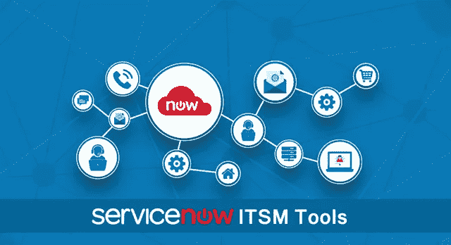

ServiceNow ITSM Tools — Edureka

您是否发现处理您所有的服务请求变得越来越困难？还停留在手工处理？如果我告诉你，ServiceNow 在云上提供了一个单一的记录系统来解决您所有的内部瓶颈，会怎么样？如果您不熟悉 ServiceNow，请随意阅读我之前的文章。在今天的文章中，我们将通过深入探索信息技术服务管理(ITSM)领域来关注 ServiceNow ITSM 工具。我们将研究 ITSM 的理论概念，以及如何在 ServiceNow 平台上实现这些概念。

让我们大致了解一下这篇 ServiceNow ITSM 工具文章涉及的主题。

*   事故管理
*   问题管理
*   变更管理
*   知识管理
*   ServiceNow 工具演示

在这篇 ServiceNow ITSM 工具文章中，我们将分别介绍 ITSM 的每一项服务。让我们从事故管理开始。

# 事故管理

首先，让我们看看什么是 ServiceNow 中的事件。当用户面临一个问题并希望与支持团队取得联系时，首先需要在用户表单中记录详细信息。简而言之，事件是指由用户或用户组报告的任何问题，并使用唯一的记录 ID 进行记录。

为了更清楚地了解事件，让我们看一下事件管理中涉及的步骤:

## 第一步:分类

问题可能与硬件、软件、网络或它们的任何可能组合有关。

**例子:**

1.  笔记本电脑停止工作了。这可能是由于底层硬件或软件问题。
2.  Wi-Fi 有性能问题。这可能是由网络问题或软件问题引起的。

## 第二步:优先事项

报告的事件根据其优先级进行处理。优先级是事件对组织的**影响**及其**紧急程度**的组合。

事件根据其各自的优先级分为 P1、P2、P3 和 P4:

*   P1- **危急**
*   P2- **高**
*   P3- **温和**
*   P4- **低**
*   P5- **规划**

**例如:**

在组织级别具有高影响且时间紧迫的事件被视为 P1 级别或关键级别事件，而在用户级别具有低影响且时间正常的事件被分类为 P5 级别或计划级别事件。

除了解决事故，避免相关事故并减少总体事故量也很重要。这只能在发现潜在问题时进行。这就把我们带到了下一个话题问题管理。

# 问题管理

问题管理处理识别事故的根本原因。我们分析如何减轻或减少事故。假设有许多与电子邮件相关的事件。我们可以执行根本原因分析来确定根本原因。

## 步骤 1:识别并记录问题

IT 人员可以手动创建记录来记录“问题”,或者我们可以关联到事件记录。

## 步骤 2:更新和调查问题

更新可以通过电子邮件进行交流。我们选择入站电子邮件配置来实现这一点。

**服务水平协议(SLA):** 用于分配任务的优先级以及监控团队的进展。

**不活动跟踪器**:我们可以创建事件，当问题在一定的时间间隔内没有被关注时触发。该事件可能是脚本或电子邮件通知。

## 第三步:解决问题

问题解决后，与该问题相关的事件将自动关闭。如果我们找不到给定问题的解决方案，我们可以称之为一个已知的错误，为我们将来节省时间。

对于那些不熟悉配置项的人来说，配置项(CI)是(配置管理数据库)CMDB 中的基本资产。

示例:工作站、服务器或商业服务

静态资产列表和 CMDB 的最大区别是我们映射配置项之间的**关系**。这就把我们带到了下一个话题**依赖视图**。依赖关系视图描述了不同配置项之间的关系。下图是依赖关系视图的一个示例。

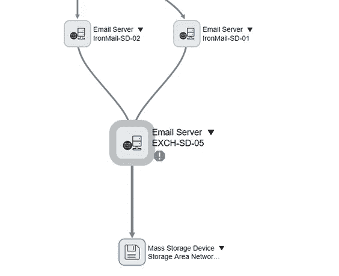

现在我们可以看到电子邮件交换服务器和各种电子邮件服务器之间的关系。此外，还可以检查 San 存储设备。

接下来，我们创建问题任务来识别受影响的区域。我们可以指定两个团队，分别负责网络和服务器领域。由于事故非常严重，在修复特定服务器之前，我们需要一个临时解决方案，如备用服务器。要永久解决这个问题，可能需要服务器团队提供软件补丁来修复电子邮件服务器。

一旦确定了问题，我们需要解决导致问题的问题。这就把我们带到了下一个话题，即变革管理。

# 变更管理

变更管理是提议的变更和反映的变更的生命周期。报告事故后，我们会创建问题并进行根本原因分析。我们根据给定的情况进一步创建变更请求。然后计划变更任务，并在完成后关闭/解决与其相关的事件和问题。

变更请求可以分为标准变更和紧急变更。标准变更需要书面批准，并有一套适当的程序，而对于紧急变更，口头沟通就足够了。

工作流用于描述变更请求生命周期中从启动到批准的各个阶段。下图对此进行了描述。

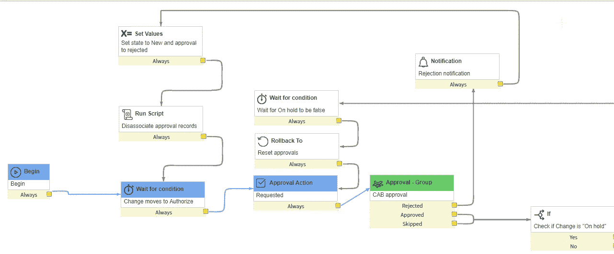

拥有一个涵盖以前的支持查询和与平台相关的文章的文件库是非常有益的。这就引出了我们的下一个主题“知识管理”。在本文的后面，让我们来看看知识管理。

# 知识管理

ServiceNow 附带了一个知识库，其中包含文章、常见问题和故障诊断。这是跨越几个类别的大量信息。谁可以向知识库中添加文章？所有者或经理能够添加知识文章以及有权向知识库添加信息的贡献者。管理员也可以为知识库做出贡献。

在本文中，让我们现在了解 ServiceNow 平台中的知识文章生命周期。

# 发表文章

当一个作者发表他的文章时，两种截然不同的场景是可能的:

如果配置了**批准发布工作流**，则文章进入**草稿**状态，该状态被转发给审阅者，审阅者可以批准或拒绝文章。

如果配置了**即时发布工作流**，则文章会立即发布并出现在知识库中。

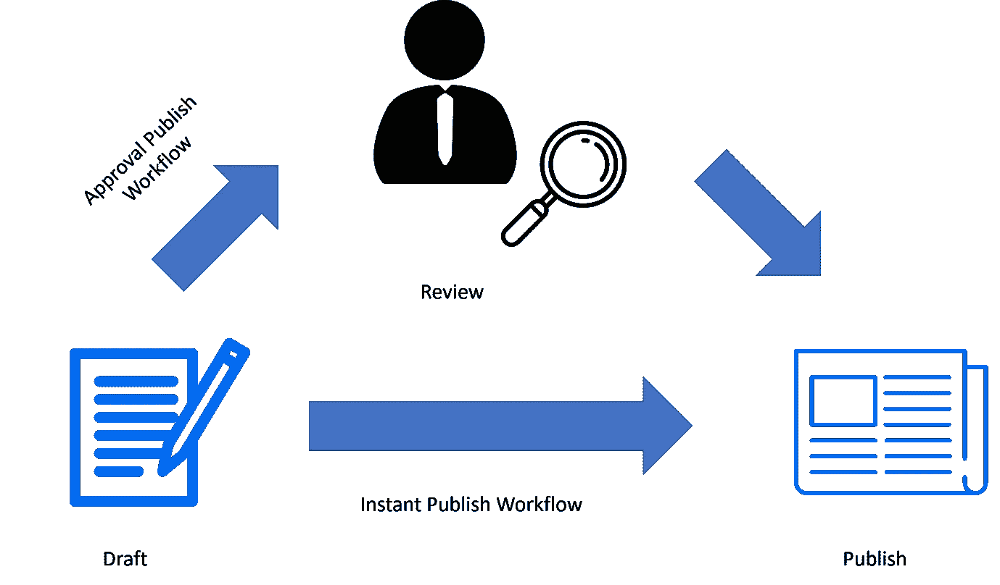

# 物品报废

如果不再有用，可以从知识库中删除该文章。这个过程被称为退休。

如果**批准退出工作流**被实施，那么文章移动到等待退出状态，知识库的所有者需要批准其退出。

如果**即时退出工作流**被实现，那么文章跳过审查，直接进入退出阶段。文章过期后，将不会显示在知识库中。但是，文章仍保留在系统中，并可以在需要时恢复到草稿状态。

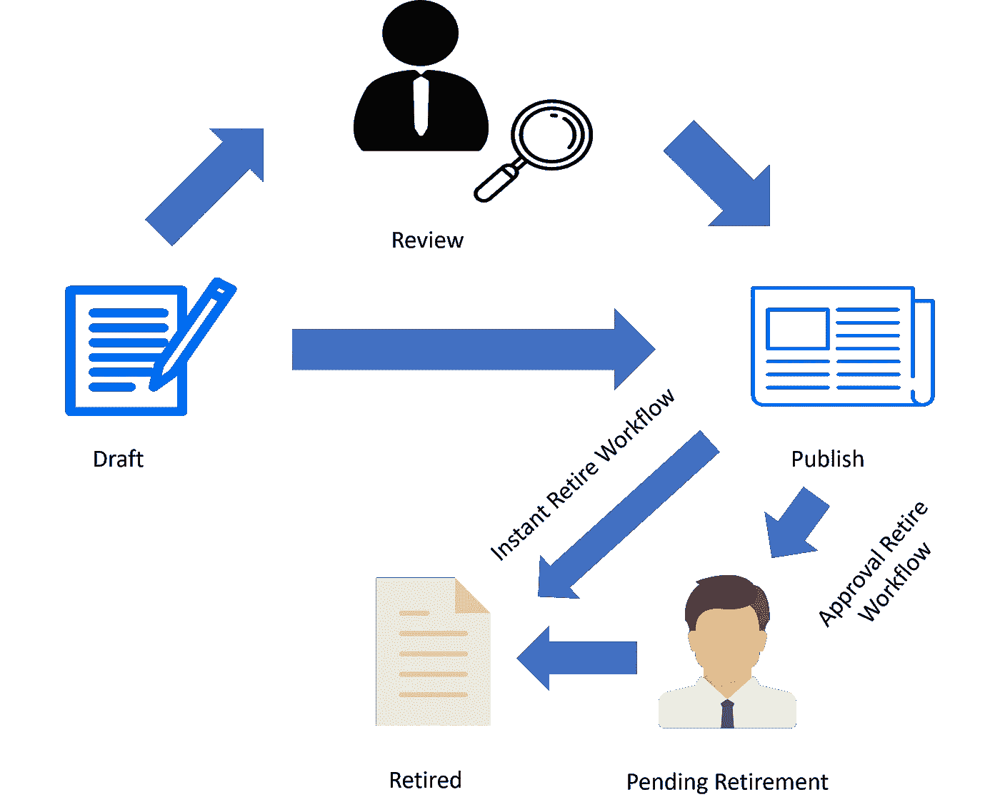

现在您已经熟悉了 ITSM 的概念，让我们继续探索 ServiceNow 提供的不同 ITSM 工具。

# ServiceNow ITSM 工具演示

我们现在将深入了解 ServiceNow ITSM 工具。我将指导您完成整个生命周期，从创建事件开始，然后执行根本原因分析，以避免将来发生此类事件。我们还将了解解决问题和解决事故所需的变更请求流程。我还将向您展示如何将问题作为一篇文章导出到知识库。

## 第 1 步:创建事件

按照以下说明在 ServiceNow 平台中创建事件。

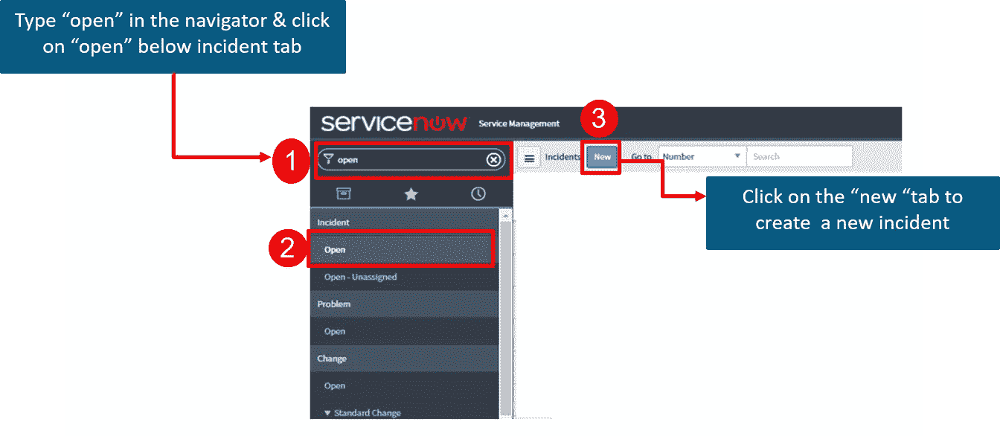

我们创建事件记录来报告问题**电子邮件服务**不起作用。该记录包含任务分配人、对组织的影响、受影响的业务服务和配置项目、紧迫性以及问题描述。下图描述了同样的情况。

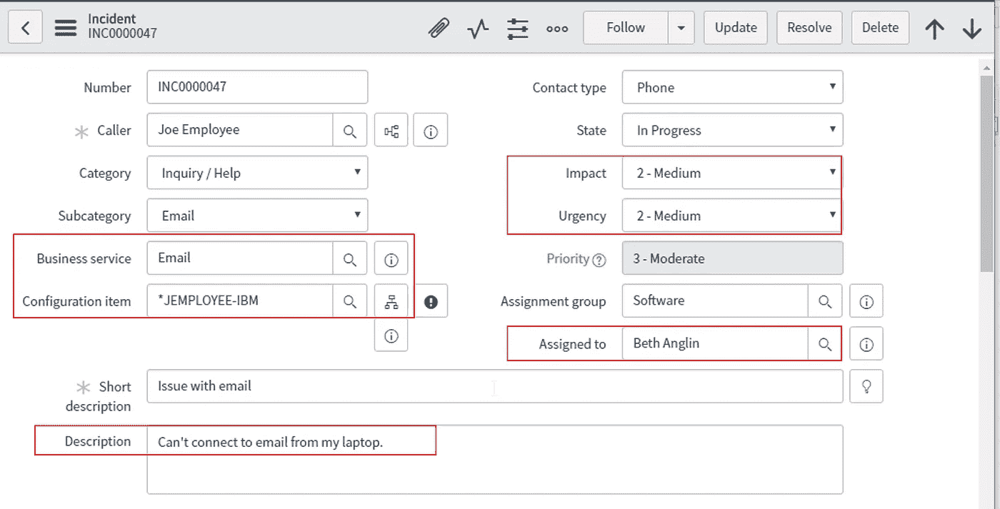

## 第 2 步:制造问题

为了执行根本原因分析，我们通过单击事件属性选项卡来创建一个问题，如下所示。

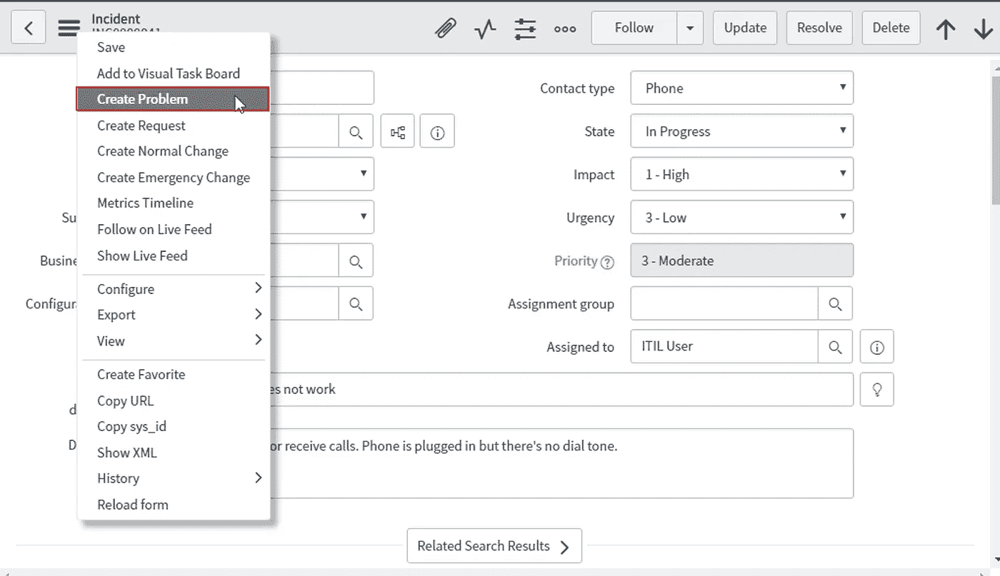

在查看了 dependency 视图之后，我们可以继续创建问题任务，并将其分配给特定的组或用户。

在我们的例子中，在根本原因分析后确定的问题发现了一个受损的网络适配器，因此我们将问题任务分配给网络组，并将弗雷德·乐迪分配为关联用户。

## 步骤 3:变更请求

一旦确定了问题，任务受派者就要询问是否需要变更请求来解决问题。一旦变更请求启动，问题状态就会变更为“待定”。

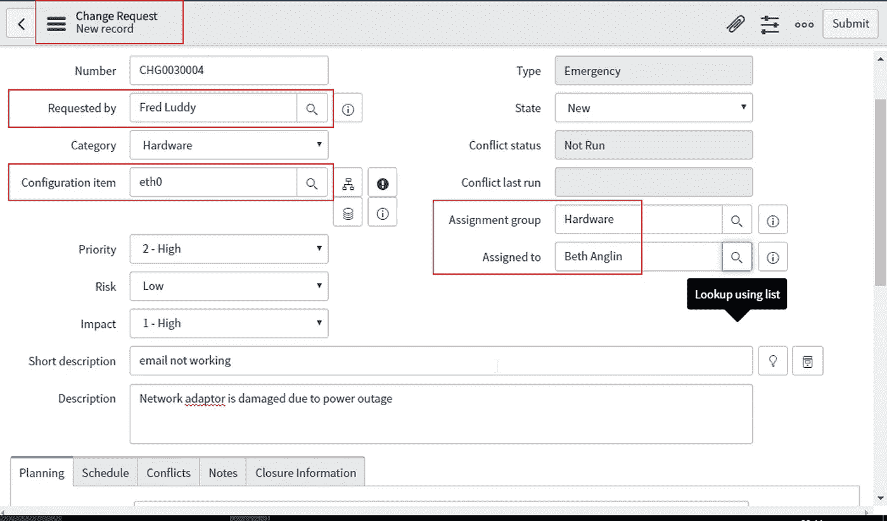

在我们的示例中，受让人弗雷德·乐迪负责更换已识别的网络适配器的变更请求。

## 步骤 4:解决问题和事件

一旦变更请求完成/关闭，所有相关的问题都会自动解决。

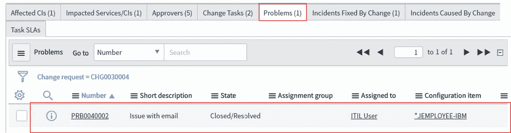

所有相关事件会在一天后自动关闭。我们也可以通过将**状态**参数设置为已关闭/已解决来手动关闭它们。

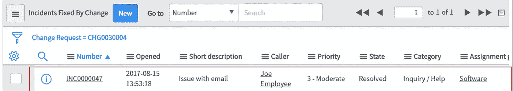

## 步骤 5:将问题导入知识库

我们可以直接从问题记录的填写表格中提取信息。这可以作为一篇文章添加到知识库中，为将来可能遇到相同问题的用户提供支持。

为了实现这一点，我们打开相关的问题记录并悬停到**帖子知识**选项。

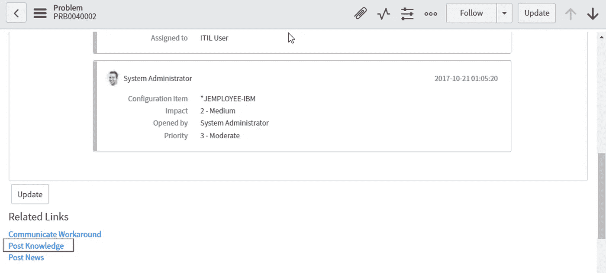

在下图中，我们可以看到已经添加了知识文章，并且还列出了相关的问题。

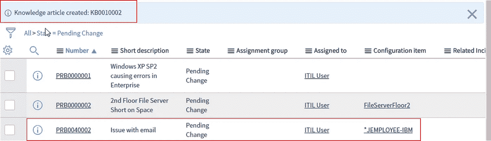

它目前处于草稿状态，将在批准后发布到知识库。

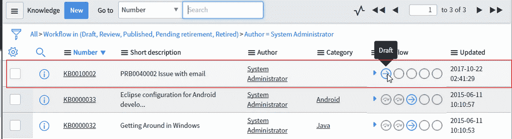

就这样，我们结束了这篇文章。我相信您已经了解了 ServiceNow ITSM 工具是如何带有消费主义色彩的。这在社交媒体应用中很普遍，然而，在 **ITSM** 部门却由来已久。ServiceNow 旨在将我们在日常任务中体验到的易用性复制到组织内部的支持任务中。

如果你想查看更多关于人工智能、DevOps、道德黑客等市场最热门技术的文章，你可以参考 Edureka 的官方网站。

请留意本系列中的其他文章，它们将解释 ServiceNow 的各个其他方面。

> 1.[什么是 ServiceNow？](/edureka/what-is-servicenow-60546b93bf27)
> 
> 2. [ServiceNow 教程](/edureka/servicenow-tutorial-55a3ce369e01)
> 
> 3. [ServiceNow 脚本](/edureka/servicenow-developer-training-3861b03cc7c0)
> 
> 4.[如何获取 ServiceNow 开发者实例？](/edureka/servicenow-developer-instance-5cb073e4949c)

*原载于 2017 年 11 月 21 日*[*【www.edureka.co*](https://www.edureka.co/blog/servicenow-itsm-tools/)*。*