# ServiceNow 测试管理 2.0

> 原文：<https://medium.com/globant/servicenow-test-management-2-0-150da41da856?source=collection_archive---------0----------------------->

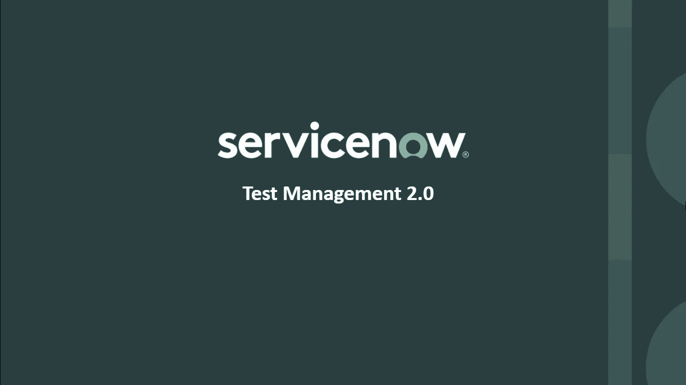

# 介绍

ServiceNow 的根基是票务工具(在 ITSM 地区)。随着时间的推移，ServiceNow 已经成为一个跨部门的平台，为企业组织中的所有关键功能提供便利。

如今，ServiceNow 不仅仅局限于 ITSM (IT 服务管理)，还提供广泛的应用程序，如 ITBM (IT 业务管理)、ITOM (IT 运营管理)、GRC(治理、风险和合规)、HRSD(人力资源服务交付)、CSM(客户服务管理)、ITAM (IT 资产管理)等等。所有这些应用程序都可以作为一个单击式插件安装在一个实例上。它是一个 PaaS(平台即服务),帮助组织使用不同的产品，并允许根据他们的要求开发和定制这些 ServiceNow 产品。

随着产品及其定制/开发范围的扩大，testing ServiceNow 的实现变得相当重要，为了实现质量，测试管理扮演着不可或缺的角色。ServiceNow 有自己的产品，测试管理 2.0，可以在平台内使用。

ServiceNow 测试管理 2.0 通过有效地交付高质量的软件产品，使组织能够简化他们的测试管理过程。它为 QA 团队和其他利益相关者提供基于角色的访问。与其他测试管理工具不同，它不仅链接到 Epics、Features 和 story，为 Leads 和 PM 提供见解，而且它在层次结构上更上一层楼，通过将 ServiceNow PPM(项目组合管理)与测试管理互连，为组合和项目负责人/领导者提供可见性。

我是如何开始写这篇博客的？

虽然 ServiceNow 提供了测试管理，是一个小众的技术平台，但是 ServiceNow 中的测试管理还是闻所未闻。从事 ServiceNow 实现的组织很少利用 ServiceNow 中的测试管理。其余的人使用其他工具来管理他们的测试活动，最终使用两个或者更多不同的系统，或者根本不使用任何测试管理。

**这是否意味着只有从事 ServiceNow 实施的组织才应该使用它？**

答案是**否**。即使这些组织不使用 ServiceNow 技术，他们仍然可以将测试管理与其他两个 ServiceNow 应用程序结合使用——敏捷管理和 PPM(项目组合管理),以获得其他测试管理工具目前无法提供的组合级别的优势。

这促使我从我作为 ServiceNow QA 的经历中收集了几个关于测试管理 2.0 的用例，解释了它如何为我工作以及如何适合我的敏捷/安全项目。我以一种务实的方式写这篇博客，让你们都能够遵循那些用例的过程/步骤。希望你会喜欢阅读它！

# 让我们从特性开始:

1.  它提供了与项目组合管理(PPM)、敏捷开发 2.0 和 ServiceNow 中的扩展敏捷框架(SAFe)应用程序的集成。
2.  创建和维护多个测试用例版本。
3.  将测试链接到多个测试集、测试周期和测试计划。
4.  测试计划运行的时间限制能力。
5.  测试计划可以很容易地划分为多个测试周期，这些测试周期可以进一步划分为测试执行集。指定执行的时间范围。
6.  测试板提供了测试计划的综合视图，使我们能够更有效地管理测试活动。
7.  测试板通过描述测试计划时间表的甘特图提供可视化表示。
8.  测试经理将测试执行轻松分配给团队。此外，还为测试人员/QA 提供了一个专用模块，用于查找分配执行的测试。
9.  测试运行的详细测试结果和历史记录，以排除测试故障。

# 激活测试管理 2.0:

注意:您需要有 ServiceNow 个人开发人员实例(PDI)来安装该插件。按照 [ServiceNow 开发者网站](https://developer.servicenow.com/dev.do#!/guides/rome/developer-program/pdi-guide/obtaining-a-pdi)上的步骤获取您的 PDI。

1.  导航至系统应用程序>所有可用应用程序>全部。
2.  找到**测试管理 2.0**(com . SNC . Test _ Management . 2 . 0)插件。
3.  点击**安装**，然后在弹出的对话框中点击**激活。**

对于插件安装，将安装两个角色，负责管理测试活动。角色如下:

1.  **测试管理器(sn _ Test _ management . Test _ Manager):**

*   启动测试过程，分配测试人员，并监控进度
*   创建和管理测试和测试集
*   创建测试计划、测试周期和测试执行套件
*   评估测试人员/QA 创建的测试、测试步骤和测试集
*   评估测试结果并关闭测试计划

2.**测试人员(sn _ test _ management . Tester):**

*   创建测试和测试集
*   执行测试并访问测试结果
*   更新测试的状态
*   报告缺陷并重新测试

现在我们已经安装了插件，让我们进入用例。人们可以通过两种方式利用测试管理 2.0 来实现测试过程。首先是一般测试——如测试产品的准备情况，市场发布前的回归测试，以及升级测试等。另一种方法是敏捷方法，即 sprint 测试——有了 ServiceNow 敏捷开发 2.0，人们可以使用测试管理 2.0 来逐个 Sprint 地测试他们 scrum 团队的用户故事。

让我们详细浏览一下**一般测试**用例。

# 创建测试:

**测试**是一组步骤/条件，用于执行和评估功能是否按预期工作。测试还可以包括预期的结果，以确定测试结果是通过还是失败。

测试经理[sn _ Test _ Management . Test _ Manager]或测试员/QA [sn_test_management.tester]可以从测试管理 2.0 创建测试。

1.  导航到**测试管理 2.0** > **测试**。
2.  点击**新建**创建一个测试。

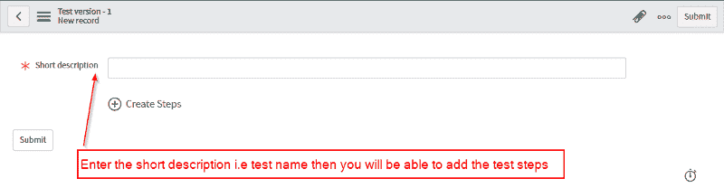

输入测试的简短描述并单击创建步骤选项后，您将看到下面的表单

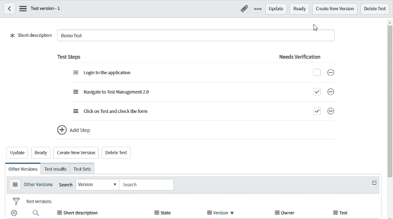

在这里你可以添加/更新/删除或者重新安排你的测试步骤。此外，如果某个步骤需要验证，您可以设置一个标志。当您运行测试时，这将显示诸如通过/失败/阻止等选项。

为了能够执行/运行测试，您需要点击**就绪**按钮将其设置为就绪状态。一旦测试处于就绪状态，您将看到**运行**按钮，点击它执行您的测试。

此外，一个测试可以有多个版本。您可以通过点击**创建新版本**按钮来创建当前测试的新版本。这将创建当前测试的副本，它将出现在**其他版本**相关列表中。也可以根据需要进行修改。

通过这种方式，您可以创建和维护测试。但是当你在这个项目中工作的时候，你会有很多测试。**测试集**提供了一种轻松搜索它们的方法。

# 创建测试集:

**测试集**就是一组相关的测试。它有助于通过类别/标签找到测试。测试可以放在多个测试集中。

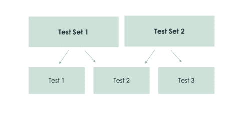

Image Source: ServiceNow®

测试经理[sn _ Test _ Management . Test _ Manager]或测试员/QA [sn_test_management.tester]可以从测试管理 2.0 创建测试集。

1.  导航到**测试管理 2.0** > **测试集**。
2.  点击**新建**按钮。
3.  输入姓名，点击**提交**。

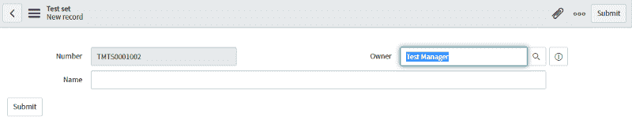

4.导航到**测试管理 2.0** > **测试**。(将显示测试列表)

5.选择测试并点击**添加至测试集。**

6.搜索所需的测试集，点击**添加。**

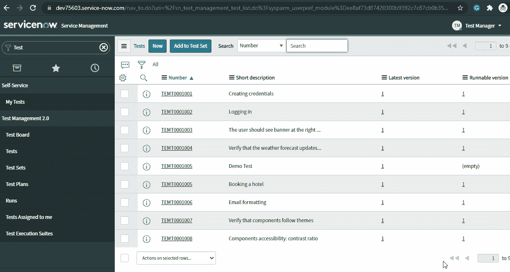

酷！我们创建了测试和测试集，但我们缺少一个主要部分，即按照项目时间表计划我们的测试。我们可以通过**测试计划**来实现。

# 创建测试计划:

测试计划是一个详细的文档，它描述了测试策略、目标、时间表、评估、可交付成果以及执行软件产品测试所需的资源。

TM 2.0 中的测试计划提供了跟踪测试活动的持续时间、整体状态和进度的选项。

测试经理[sn _ test _ management . test _ Manager]将创建测试计划供 QA 团队遵循。

1.  导航到**测试管理 2.0**T48**测试板**。
2.  点击**创建测试计划**。

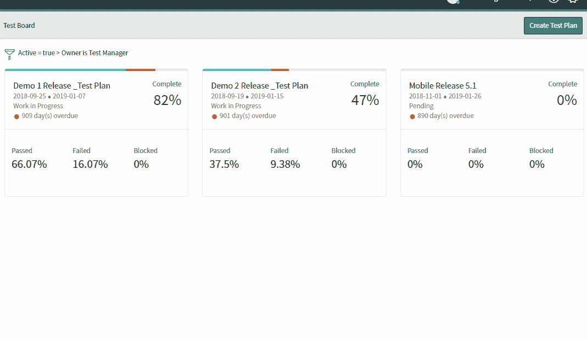

3.您还可以提供测试计划的其他细节，比如计划的结束日期、持续时间、所有者、状态等等。

我们可以将我们的测试计划分解成更小的计划窗口，称为**测试周期**，以获得更精确的计划。此外，测试周期可以被分解成**测试执行套件**，一个测试执行套件定义了测试必须何时运行以及由谁来运行。

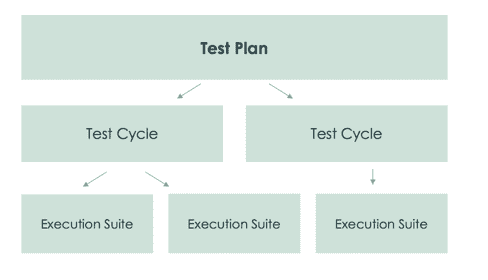

Image Source: ServiceNow®

# 在测试计划下添加/创建测试周期和测试执行套件:

测试管理器[sn _ test _ management . test _ Manager]将创建测试周期和执行套件。

1.  导航到**测试管理 2.0**T49**测试板**。
2.  打开**测试计划**(您希望在其中创建测试周期和测试执行套件)。
3.  点击**计划**选项卡(您将会看到测试计划工作项层次视图)。
4.  右键点击**测试计划**，选择**添加测试周期**创建一个新的测试周期(提供测试周期的名称、计划开始和结束日期)。
5.  右键点击**测试周期**，选择**添加测试执行套件**创建一个新的执行套件(提供测试执行套件的名称、计划开始和结束日期)。

*注意:一旦您向测试计划中添加了多个测试周期和测试执行套件，它将会看起来像下面这样。*

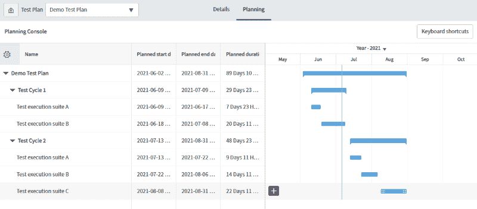

在定义了测试计划之后，测试经理会将测试或者测试集添加到测试执行套件中，并将执行任务分配给测试人员/QA。

1.  右击**测试循环**，然后选择**添加测试/测试组**。
2.  选择**测试/测试集**，然后点击**添加到执行套件**按钮(这将把测试/测试集添加到测试执行套件)。
3.  点击测试计划上的 **Details** 选项卡，并向下钻取到**测试执行套件**(在上面的步骤中您已经添加了测试)。
4.  打开相关列表中显示的**测试**并将其分配给测试员/QA 执行。

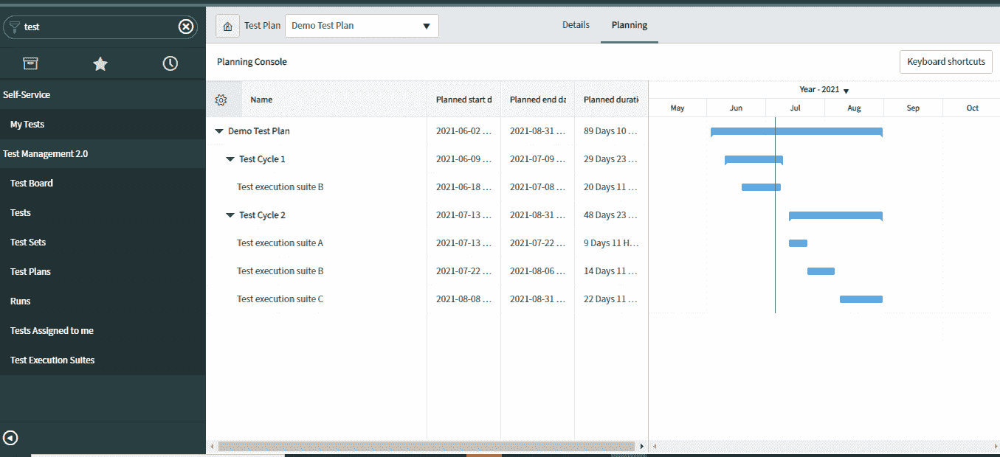

# 执行指定的测试任务:

测试员/QA [sn_test_management.tester]将执行测试经理分配的测试，并记录测试结果。

1.  导航到**测试管理 2.0** > **分配给我的测试**。
2.  选择需要的测试，点击**运行**。
3.  输入**运行名**，点击**运行**按钮(也可以选择执行环境)。
4.  在 Test Execution 弹出窗口中，将该步骤标记为通过或失败(输入注释并附上屏幕截图)，或者被阻止。
5.  一旦测试执行完成，点击**完成。**

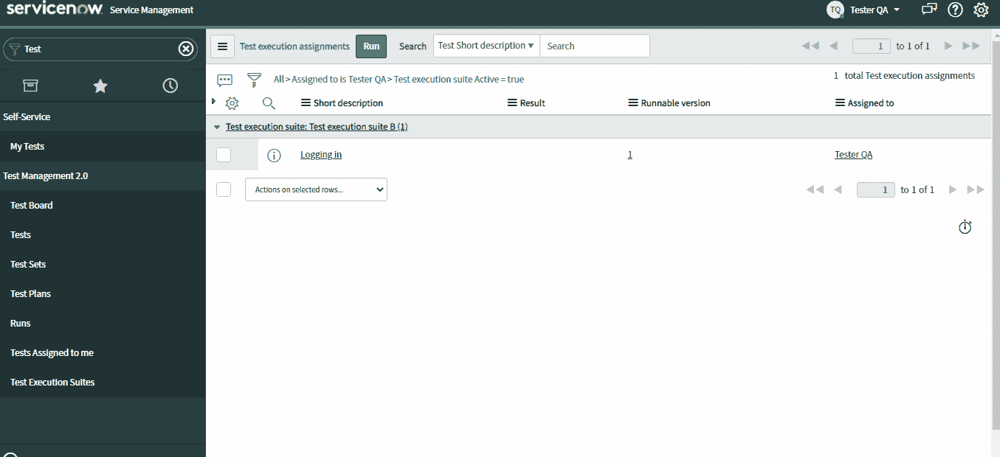

# 查看所有测试结果:

所有的测试运行结果都存储在测试管理 2.0 中的**运行**下。

测试经理[sn _ test _ management . test _ Manager]或测试员/QA [sn_test_management.tester]可以查看所有的测试运行结果。

1.  导航到**测试管理 2.0** > **测试运行**。
2.  打开运行以深入查看详细的测试执行结果，如环境、持续时间、状态、运行者和详细的分步结果。

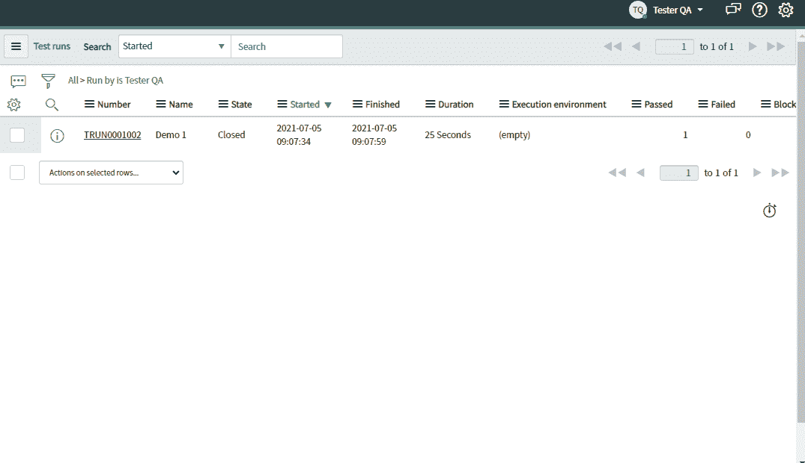

这完成了我们的第一个用例。

现在是我们的第二个用例，即**冲刺测试的时候了。**这需要将测试管理 2.0 模块与 ServiceNow 敏捷开发 2.0 模块结合使用，以确保 sprint 可交付成果与质量保持一致。

我们都知道，在敏捷中，我们根据接受标准测试用户故事。我们将会看到如何为一个用户故事创建一个测试。

# 为用户情景创建一个测试:

sprint 测试中的 create test 表单与上面通用测试方法中解释的完全相同。但是不同之处在于，它不是从测试管理 2.0 应用程序中创建的，而是在敏捷开发 2.0 应用程序的用户故事中创建的。

此外，像多测试版本、添加/更新/删除/重新安排步骤这样的其他特性，也以类似的方式在 sprint 测试方法中可用。

Scrum 用户[scrum_user]角色需要访问敏捷故事并为故事创建测试。

*注意:角色【sn_test_management.tester】包含在* scrum_user 角色*中。用户必须是 agile 组的成员。*

1.  导航到**敏捷开发** > **敏捷委员会**。
2.  点击**冲刺跟踪**选项卡，选择**列表**视图。
3.  从右上角的**显示**列表中，选择**测试**。
4.  点击**添加测试**。
5.  输入**简短描述**，然后点击**创建步骤。**在这里我们可以添加/更新/删除或重新安排测试步骤。创建测试的多个版本。
6.  点击**就绪**按钮，将测试设置为可运行。

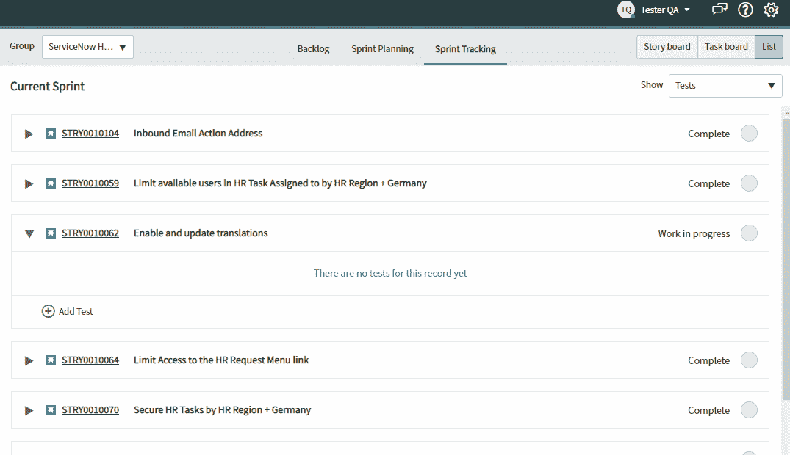

故事已经准备好了，我们也准备好了测试来验证它。现在是执行的时候了。

# 运行故事测试:

执行故事的所有测试，以确保功能按照验收标准运行。我们可以一次执行一个故事的所有测试，也可以一个接一个地执行测试。

访问敏捷故事和执行测试需要一个 Scrum 用户角色。

1.  导航到**敏捷开发** > **敏捷委员会**。
2.  点击**冲刺跟踪**选项卡，选择**列表**视图。
3.  找到您已经为其创建测试的故事，并点击为该故事显示的 **Run** 按钮。
4.  输入**运行名称**，点击**运行**按钮(也可以选择执行环境)。
5.  在 Test Execution 弹出窗口中，将该步骤标记为通过或失败(输入注释并附上屏幕截图)，或者被阻止。
6.  一旦测试执行完成，点击**完成。**

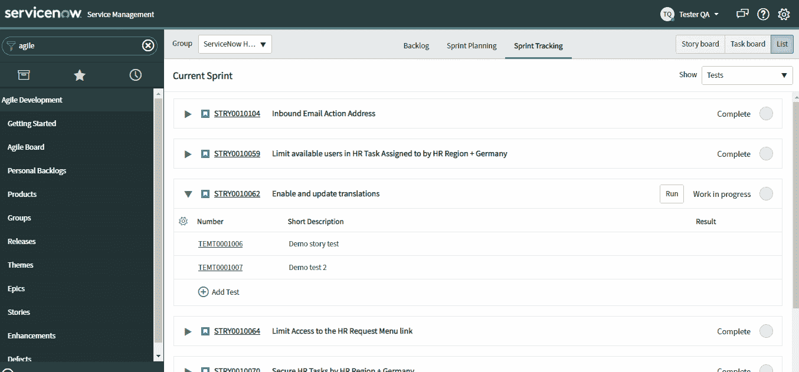

您可以在**敏捷板>冲刺跟踪标签**的故事下查看每个测试的测试结果。有了测试结果，我们也完成了第二个用例。

*注意:测试管理 2.0 中也记录了敏捷董事会下的测试和测试运行。*

# 局限性:

*   没有与 ServiceNow 中的缺陷模块/应用程序集成。它没有提供测试和缺陷之间的联系。
*   没有直接从失败的测试用例中创建缺陷的选项。
*   不在测试运行中捕获浏览器详细信息和操作系统详细信息。
*   没有参数化的测试运行，即不允许从 QA/测试人员那里获取运行时输入。
*   没有添加逐步预期结果的选项。

# **参考文献:**

1.  [ServiceNow 文档](https://docs.servicenow.com/bundle/paris-it-business-management/page/product/test-management2/reference/test-management2-landing-page.html)
2.  [ServiceNow 微认证培训](https://nowlearning.service-now.com/lxp?id=overview&sys_id=bf8398b6136f77002ff55eff3244b054&type=path)