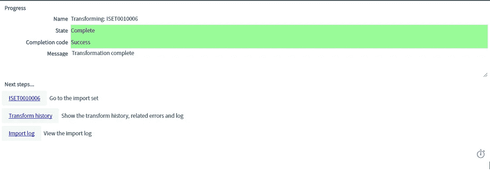

# ServiceNow 综合指南

> 原文：<https://medium.com/edureka/servicenow-tutorial-55a3ce369e01?source=collection_archive---------7----------------------->

ServiceNow Tutorial — Edureka

自动化、直观的消费者体验、[机器学习](https://www.edureka.co/blog/what-is-machine-learning?utm_source=medium&utm_medium=content-link&utm_campaign=servicenow-tutorial)以及互联设备的爆炸式增长正在颠覆和改变着每一个行业。现在，为了跟上步伐，企业需要更快地前进，但是过时的模式会减慢它的速度。其他因素，如 IT 事故、客户请求、人力资源案例都遵循其路径，并增加了流程的速度。那么企业如何克服这些问题呢？有没有一种方法来构建和自动化这些流程，以加快工作速度？有了 ServiceNow，是的，企业一定可以实现这个目标。在本文中，我将带您了解这个云平台的细节，所以请继续阅读以了解更多信息。

在这篇文章中，我将涉及以下主题:

1.  为什么选择 ServiceNow 及其需求
2.  什么是 ServiceNow？
3.  ServiceNow 功能
4.  ServiceNow 演示

因此，让我们不要浪费任何时间，开始这篇文章。

# 为什么选择 ServiceNow 及其需求

ServiceNow 行动系统可让您用未来的智能工作流程取代过去的非结构化工作模式。企业中或与 it 相关的每个员工、客户和机器都可以在单个云平台上发出请求。处理这些请求的所有部门都可以分配任务并确定优先级、协作、着手解决根本原因问题、获得实时见解并采取行动。这将有助于员工更好地工作，最终提高服务水平。ServiceNow 将帮助您以光速工作，使您的工作流程更智能、更快速。

ServiceNow 为整个企业提供云服务。让我们看看为什么 ServiceNow 对企业如此重要的几个原因:

## **它:**

ServiceNow 通过将传统工具整合到一个现代化、易于使用的云中服务管理解决方案，帮助提高灵活性和降低成本。

## **安全选项:**

安全部门可以与 IT 部门合作，更快地解决真正的威胁。为此，它使用结构化响应引擎来根据服务影响确定事件的优先级并解决事件。

## **客服:**

客户服务可以通过实时评估产品服务状况和跨部门合作快速解决服务问题来减少案例数量和提高客户忠诚度。

## **HR:**

人力资源可以通过自助服务门户将员工服务体验消费化，并获得持续改进服务交付所需的洞察力。

## **构建业务应用:**

ServiceNow 可帮助任何部门快速构建业务应用程序并实现流程自动化，其可重复使用的组件有助于加速创新。

## **现在平台:**

Now 平台为企业提供了一个行动系统。使用单一数据模型，可以轻松创建上下文相关的工作流并自动化任何业务流程。从商业用户到专业开发人员，任何人都可以轻而易举地构建应用程序。Now 平台上的任何应用用户都可以通过服务目录提出请求，在常用知识库中查找信息，并被通知他们最关心的动作和信息。部门、工作组甚至设备都可以分配、区分优先级、协作、找出问题根源，并智能地协调行动。现在，您的业务发展更快了。

## **不停的云:**

ServiceNow Nonstop Cloud 始终开启。没有客户实例会因为任何原因而离线或关闭。独特的多实例架构确保每个客户都可以完全定制云服务，并按照自己的计划执行升级。Nonstop Cloud 高度安全，符合最高级别的合规性和全球法规。行业领先的高级高可用性基础架构确保了每个地理位置的两个数据中心集群之间的实例冗余，可扩展以满足最大的全球企业的需求。

现在我们已经了解了为什么需要 ServiceNow，让我们继续阅读本文，了解什么是 ServiceNow:

# 什么是 ServiceNow？

[ServiceNow](https://www.edureka.co/blog/what-is-servicenow?utm_source=medium&utm_medium=content-link&utm_campaign=servicenow-tutorial) 是一个支持 IT 服务管理和自动化常见业务流程的软件平台。它包含许多模块化应用程序，这些应用程序会因实例和用户而异。它是由软件公司如百富勤系统公司和补救公司的前首席技术官弗雷德·乐迪于 2004 年创立的。ServiceNow 是一个集成的**云**解决方案，它在一个单一的记录系统中结合了五个主要的服务。

ServiceNow 从提供服务目录管理的 IT 服务管理应用程序开始了它的旅程。后来，当事件、问题或变更的规模更大时，其他项目管理应用程序随之出现，帮助管理整个项目。它并没有就此停止，很快，配置管理数据库(CMDB)就进入了应用程序列表。如今，ServiceNow 拥有面向 IT 服务管理流程和 IT 企业的应用，如人力资源管理、安全管理和 PPM 等。

以下特性使 ServiceNow 优于其竞争对手:

*   基于实例的实现
*   易于定制
*   更好的支持和更低的维护成本
*   实时分析和报告

接下来，在本文中，我们将深入了解 ServiceNow 功能的本质:

# ServiceNow 功能

## 证明

单点登录(SSO)功能是任何工具的本质，ServiceNow 也不例外。该工具具有多种提供者 SSO 功能。组织可以使用多个 SSO IDPs(身份提供者)来管理身份认证。 *SSO* 使用户无需提供任何用户 ID 或密码即可登录应用程序。它使用 Windows ID 和密码。

## 轻量级目录访问协议

公司可以出于各种目的使用活动目录。无论是提供对应用程序的访问还是维护 Outlook 通讯组列表；有很多。LDAP 集成对于 ServiceNow 工具来说是小菜一碟，最棒的是您不必编写任何代码。一切都是简单的配置！

## 管弦乐编曲

ServiceNow 提供了在远程服务器上编排或自动化简单或复杂任务的能力。一旦在任何 IT 公司中实现了编排，整个工作就需要更少的技能和劳动力。它可以自动化 VMware、Microsoft Exchange 邮件服务器等系统。

## 网络服务

该平台提供了同时发布或消费 API 的能力。SOAP、WSDL 或 REST API 是支持的协议。您可以创建无代码 API，也可以创建脚本 API。

## 企业门户

对于任何组织来说，最重要的要求之一就是拥有一个门户网站，用户可以在其中请求访问、服务或支持。服务门户正在为不同的组织插上翅膀。如今，企业正在开发他们的 ServicePortal 来展示他们的 ServiceNow 功能。ServicePortal 还取代了过时的 CMS 网站，这是旧版本的门户网站，但功能不如 ServicePortal。

## 移动就绪

如今，大多数人都希望企业应用/服务/解决方案支持移动。他们需要随时随地做出改变的能力。ServiceNow 使之成为可能。ServiceNow 表单和应用程序是移动友好的，可以直接发布到移动设备上，无需为移动设备进行专门开发。ServiceNow 为移动设备提供基于网络的应用程序，并为 iOS 和 Android 提供移动原生应用程序。

这是关于 ServiceNow 及其功能的。接下来，在本 ServiceNow 教程中，让我们看看这将有助于我们的另一个重要概念。

# 导入器械包演示

**进口套**是另一个重要概念。虽然很简单，但它对于 ServiceNow 的顺利运行非常重要，不可或缺。

**导入集**允许管理员从各种数据源导入数据，然后将这些数据映射到 ServiceNow 表中。导入集完成后，您可以查看已完成的导入并清理导入集表格。在导入日志中，您可以找到有关导入过程中发生的内部处理的信息。

让我们试着实际地做这件事。我将导入一个“sample.xlsx”数据集，然后将该数据集映射到 ServiceNow 表。你可以在这里下载数据集 [***。***](https://goo.gl/iec4Te) 您将需要一个 ServiceNow 实例来在您的系统上执行此演示。我想你们现在都有一个 ServiceNow 实例了。因此，让我们继续本 ServiceNow 教程的最后一部分。

搜索**导入集合**，选择系统导入集合模块下的**加载数据**。选择您想要导入的文件(在这种情况下是上面链接中共享的“sample.xlsx ”),然后点击**提交。**

点击**加载数据**查看导入的数据。

这是导入的数据集的样子。您可以继续并点击设置符号，根据您的需要个性化您的表格列。

下一步是创建导入集表。

让我们为导入集创建一个目标表，为此转到**过滤导航器**并键入系统定义，单击**表**，然后单击**新建。**

我已经将该标签表命名为**样本表。**接下来点击**列**字段，将列名添加到表格中。

我已经将列名添加到我想要映射的表中。完成后，点击**提交。**

您的表已创建。然而，它仍然没有记录。这就是记录字段现在的样子。如果在**滤镜导航器中搜索。**

接下来，让我们加载导入的数据集。遵循下图中提到的步骤。

一旦数据被加载，状态字段显示**完成**。您可以点击**加载的数据**标签进行查看。

这是数据的样子。

为了简单起见，让我们个性化列列表。

下图显示了我们导入的数据的个性化视图。

# 转换地图

回到上一页，点击创建变换图。

提供**名称**，选择**源表**和**目标表**进行映射。点击**映射助手**映射字段。您也可以通过点击**自动映射匹配字段来自动映射字段。**

单击映射助手后，源表和目标表都可以手动映射您想要的字段。

让我们继续绘制如下图所示的字段，并点击**保存。**

一旦你保存了进度，在下面两个步骤中点击 Transform。

再次单击“转换”进行确认。

状态字段具有值**完成，**指示转换完成。

您可以在**过滤器导航器**中输入表的名称(在本例中为“样本表”)，以查看所需的字段和记录。下图显示了同样的情况。因此，我们成功地导入了数据集，并将其映射到 ServiceNow 中的一个表。

这就把我们带到了文章的结尾。希望这是信息和帮助你。

如果你想查看更多关于人工智能、DevOps、道德黑客等市场最热门技术的文章，那么你可以参考 [Edureka 的官方网站。](https://www.edureka.co/blog/?utm_source=medium&utm_medium=content-link&utm_campaign=servicenow-tutorial)

请留意本系列中的其他文章，它们将解释 ServiceNow 的各个其他方面。

> 1.什么是 ServiceNow？
> 
> 2. [ServiceNow ITSM 工具](/edureka/servicenow-itsm-tools-61ef084d3f09)
> 
> 3. [ServiceNow 脚本](/edureka/servicenow-developer-training-3861b03cc7c0)
> 
> 4.[如何获取 ServiceNow 开发者实例？](/edureka/servicenow-developer-instance-5cb073e4949c)

*原载于 2017 年 11 月 3 日*[*www.edureka.co*](https://www.edureka.co/blog/servicenow-tutorial)*。*