# 服务。有/没有的生活。和工作管理器。

> 原文：<https://medium.com/google-developer-experts/services-the-life-with-without-and-worker-6933111d62a6?source=collection_archive---------0----------------------->

随着最近 Android 版本处理后台，它变得比以往任何时候都更加复杂。就像《星球大战》的情节一样，它变得越来越复杂，因此，谷歌发布了[工作管理器](https://developer.android.com/topic/libraries/architecture/workmanager)作为 [JetPack](https://developer.android.com/jetpack/) 的一部分——以帮助我们处理这样的背景。

在了解什么是 WorkManager 之前，有必要了解我们为什么需要它，以及构建它的原因是什么。*那些知道组件/库背后发生了什么，并且理解他们为什么使用它的开发人员是一个更好的开发人员。*


Better developer

这将是一篇很长的文章，所以准备一杯好咖啡&几块饼干。
它由 3 部分组成:
第 1 部分—内存基础知识
第 2 部分—现有后台解决方案
第 3 部分—工作管理器

首先，在开始所有后台工作之前，我们需要了解 Android 处理内存管理的一些基础知识。
这将是我们的第一部分:

# 第 1 部分:安卓内存 101


很久很久以前，在一个遥远的星系——Android 内核第一次被开发出来，它是基于 Linux 内核的。Android 和所有其他基于 Linux 内核的系统的主要区别在于，Android 没有一个叫做“交换空间”的东西。

*Linux 中的交换空间*在物理内存(RAM)满的时候使用。如果系统需要更多的内存资源并且 RAM 已满，内存中的非活动页面将被移动到交换空间。虽然交换空间可以帮助具有少量 RAM 的机器，但是它不应该被认为是更多 RAM 的替代品。交换空间位于硬盘上，硬盘的访问时间比物理内存慢

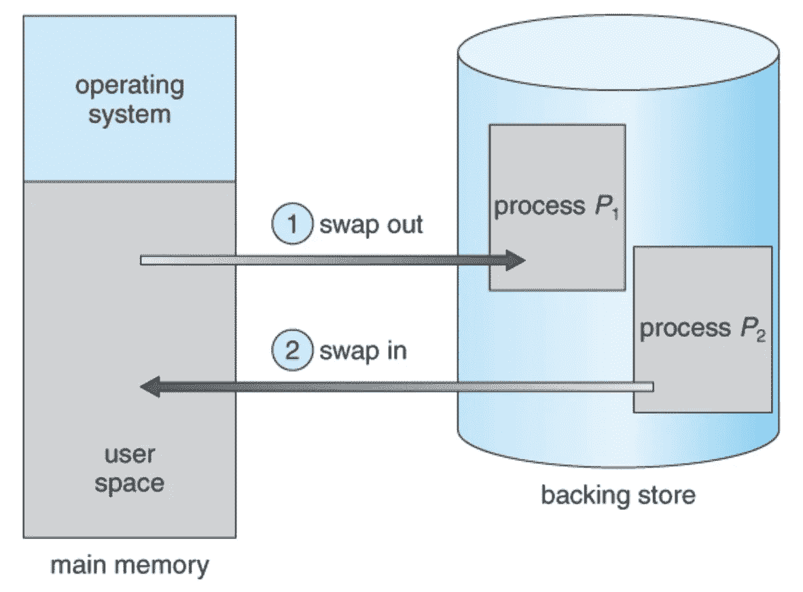

在 Android 中，没有“交换空间”这种东西。当系统内存不足时，它使用 OOM 黑仔来拯救一个星系。


Out Of Memory Killer

这个人的目标是根据进程的“可见性状态”和消耗的内存量来杀死进程，从而释放内存。

每个流程由活动管理器给出其`oom_adj`分数。它是应用程序状态的组合(例如，前台、后台、带有服务的后台等)。).以下是所有`oom_adj`值的简短示例:

```
# Define the oom_adj values for the classes of processes that can be
# killed by the kernel.  These are used in ActivityManagerService.
    setprop ro.FOREGROUND_APP_ADJ 0
    setprop ro.VISIBLE_APP_ADJ 1
    setprop ro.SECONDARY_SERVER_ADJ 2
    setprop ro.BACKUP_APP_ADJ 2
    setprop ro.HOME_APP_ADJ 4
    setprop ro.HIDDEN_APP_MIN_ADJ 7
    setprop ro.CONTENT_PROVIDER_ADJ 14
    setprop ro.EMPTY_APP_ADJ 15
```

更高的`omm_adj`值更容易被内核的 oom 杀手杀死。当前前台应用的`omm_adj`为 0。

OOM killer 使用基于空闲内存和`omm_adj`阈值的可配置规则。即，规则声明“如果释放内存< X1，用`omm_adj`Y1 杀死进程>

所以基本上流程会是这样的:

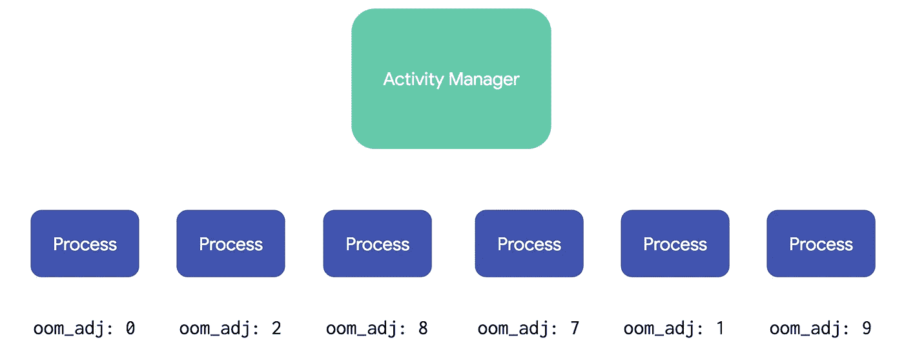

Every process assigned a score

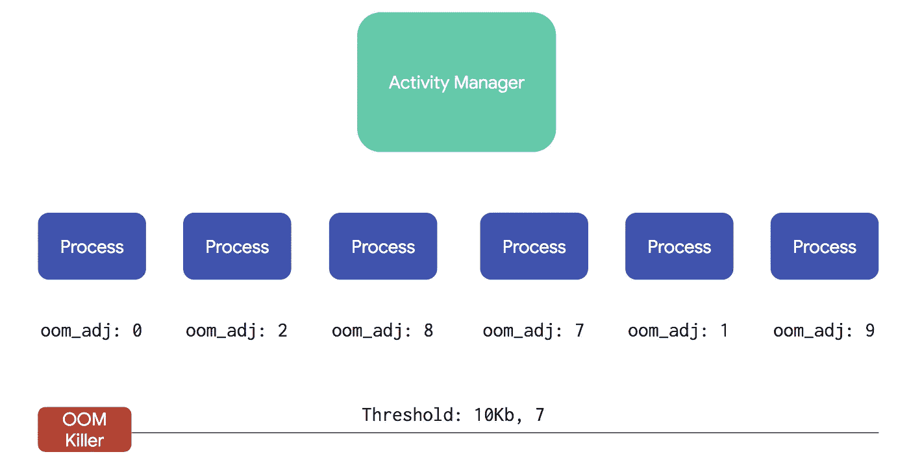

Kill all process with adj_oom > 7 and memory consumption > 10kb

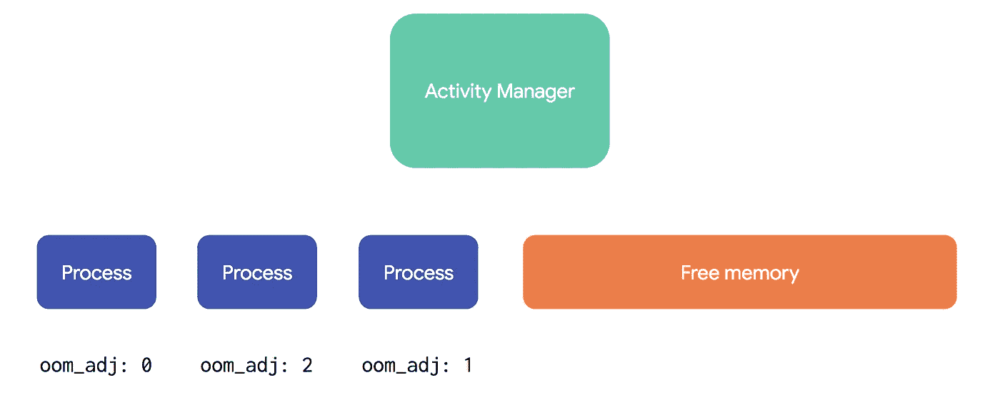

The memory is freed. The galaxy in good hands now.

到目前为止，我希望你有这样的想法，你消耗的内存越少，你就有更好的机会去完成重要的事情。

第二个重要的想法是理解应用程序的状态是至关重要的。因此，当你的应用程序进入后台，而你仍然想把卢克送入太空时，你必须使用“服务”

> 服务是可以在**后台**执行**长时间运行操作**的应用组件，它不提供用户界面。

您应该使用服务有几个原因:

1.告诉系统您有一个长时间运行的操作，并相应地获得您的流程`oom_adj`分数

2.Android 应用程序的 4 个入口点之一(`BroadcastReceiver`、`Activity`、`ContentProvider`是其余 3 个)。

3.在单独的进程上运行`Service`

但是使用服务也有不好的一面:

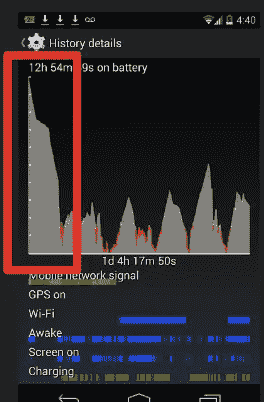

当我编写第一个应用程序时，我成功地在不到 3 小时内将电池从 100%耗尽到 0%。怎么会？让服务每 3 分钟从服务器获取数据:)

我是一个年轻的没有经验的学徒。

但不知何故，6 年后，有一些其他未知的应用程序不知何故成功地做了同样的事情:

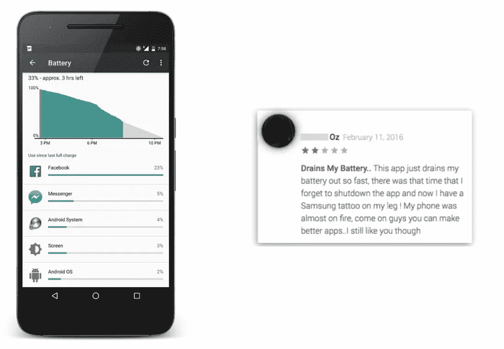

每个开发人员都在后台做他们想做的事情，没有任何限制。那只是蛮荒的西部，西斯统治着银河系，只有少数绝地反击。

但是谷歌有一些好的反叛者可以反击

从棉花糖开始，然后是牛轧糖，接着引入了瞌睡模式:

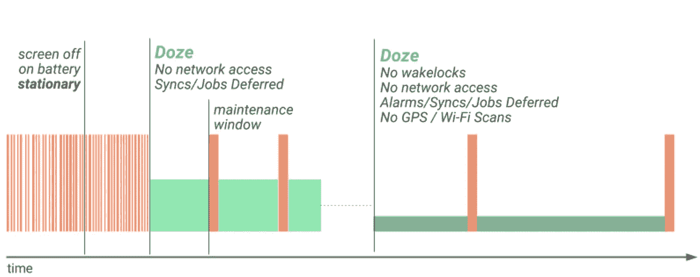

如果你不熟悉瞌睡模式，你真的应该熟悉。:)简而言之——用户关闭设备屏幕后，瞌睡模式就会启动，并禁用网络、同步、GPS、警报和 wifi 扫描。它会一直亮着，直到用户打开屏幕或连接到充电器。这个想法——减少做不重要工作的应用程序的数量，这样做——可以节省用户的电池:)

但这感觉就像大海中的一滴水，所以谷歌走得更远——从 Android Oreo (API 26)开始

如果针对 Android 8.0 的应用程序试图在不允许创建后台服务的情况下使用该方法，则`startService()`方法现在会抛出 [](https://developer.android.com/reference/java/lang/IllegalStateException.html) `[IllegalStateException](https://developer.android.com/reference/java/lang/IllegalStateException.html)`。

不针对 SDK 26 很容易解决这个问题。一些“知名”应用程序决定以 API 22 为目标，因为不想处理运行时权限。

但是更多的还在后面:

*   【2018 年 8 月:要求针对 API 等级 26 (Android 8.0)或更高的新应用。
*   【2018 年 11 月:针对 API 等级 26 或更高要求对现有应用进行更新。
*   **2019 年起**:targetSdkVersion 要求每年都会提高。在每次 Android 甜点发布后的一年内，新的应用程序和应用程序更新将需要针对相应的 API 级别或更高的级别。

说了这么多——(我相信你会得出同样的结论):

> 我们今天所知道的服务已经过时了。
> 
> 它不再被允许实现其主要目的，即在后台执行长期运行的任务。因此它不再可用。


除非你没有使用服务作为前台服务，否则没有任何理由使用服务。如果你需要依赖它，你需要一份工作。

# 第 2 部分:我有一个网络呼叫。外面是什么:

让我们以一个简单的网络调用为例，它可以下载几千字节的数据。

首先，最直接的方法(也是不正确的方法)是用一个单独的线程来执行您的存储库/活动。

考虑登录场景。你的用户填写电子邮件，密码，并点击登录按钮。用户网络 3G 差，用户走电梯。

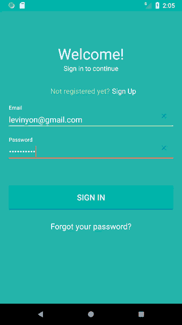

当网络通话进行时，用户会接到一个电话。

*OkHttp* 默认超时蛮大
`connectTimeout = 10_000;
readTimeout = 10_000;
writeTimeout = 10_000;`

通常，我们将默认设置为三次网络重试。

因此，在最坏的情况下:3 * 30 = 90 秒。

现在试着回答一个问题—

# 登录成功了吗？

好吧，虽然你的应用程序在后台，但问题是——你不知道。正如我们所了解的，您不能依赖您的进程将保持活动来完成网络调用、处理响应和保存用户登录信息。更不用说用户的手机可以离线，失去互联网连接。

从用户的角度来看——“我已经输入了我的电子邮件、密码，并点击了登录按钮。因此我已经登录了”。如果没有，相信我——用户会对你的 UX 有一些不好的看法。但这不是 UX 的问题，这是技术问题。
下一步你可能会想——好吧，所以一旦我收到应用程序将转到后台的回调，我将切换到服务。但是……等等。不可以！！！:(

所以这里`JobScheduler`来救援了。

预定了一场`Job`开始。当合适的时候——系统将启动你的`MyJobService`并执行`onStartJob()`方法中的任何东西。
这个想法在理论上是好的，但是`JobScheduler`只能从 min API 21 获得。但是，API 21 & 22 中的…
`JobScheduler`有一个非常容易出错的组件。

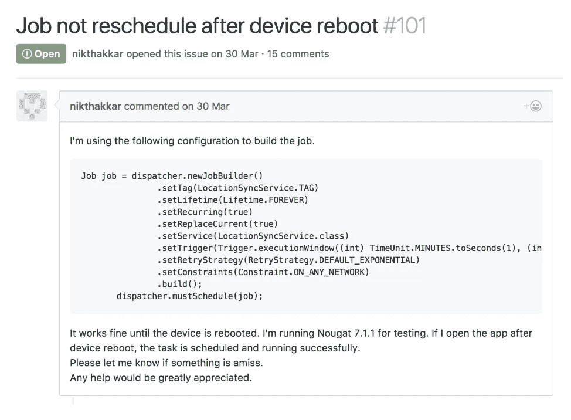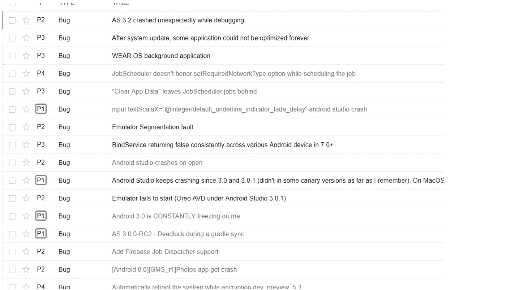

这意味着你可以使用的真正的明斯克`JobScheduler`是从 23 开始的。

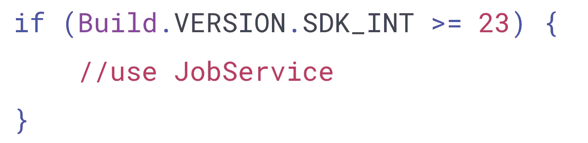

在你的 minSDK < 23.. Then you have a 【 option

Wait. It’s requires Google Play Services!!

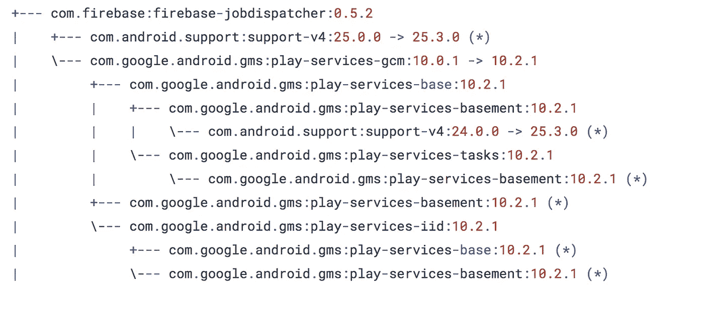

Therefore If you are going to use it, you will leave tens of millions users out — all Amazon Fire, Amazon TV and hundreds of Chinese manufacturers:


Therefore… 【 probably isn’t a good option… So 【 ? To schedule recurring alarms to fire and check if network call succeeds and then try to execute it again?…

And what if you still want to benefit from old services on pre-O devices and run services to have zero-time latency to execute calls.

Than 【 might help Jedis to save a galaxy:

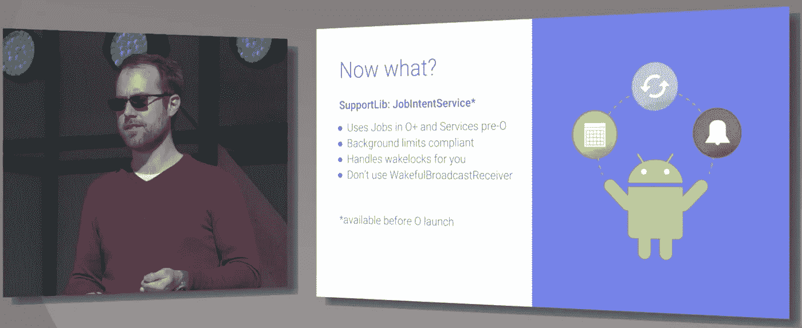

JobIntentService

It will give you the ability to execute jobs with regular IntentService on SDK lower than 26 and 【 on SDK ≥ 26, and it’s part of the Support Library.

Aaaaand… It does not help to execute calls ASAP on Android Oreo devices… So we are back to where we started: , manage with an Android version we are running on, execute calls in the background and reschedule them when the app goes background with a proper scheduler, based on the device state.

Gosh… It’s so hard to be a good Jedi who is willing to save the users battery life and provide amazing UX to our users…


# Part 3: WorkManager. Just because work should be easy to do.

So there are different solutions for different device states; Android versions and with/without Google Play Services devices. You probably will start to think that you need to implement all this hard work by yourself and combine different solutions based on “what and how.” The good thing is that the folks at the Android framework hear all our complaints — and they decided to rescue us and the whole galaxy from those Sith’s refactoring :)

On the last Google I/O Android framework, the team announced WorkManager:

> WorkManager aims to simplify the developer experience by providing a first-class API for system-driven background processing. It is intended for background jobs that should run even if the app is no longer in the foreground. Where possible, it uses [JobScheduler](https://developer.android.com/reference/android/app/job/JobScheduler.html) 或 [Firebase JobDispatcher](https://github.com/firebase/firebase-jobdispatcher-android) 中做工作；如果你的应用程序在前台，它甚至会尝试直接在你的进程中工作。

哇！这正是我们所需要的——所有这些疯狂的后台执行选项的简单包装。

工作管理器库有几个组件:

`WorkManager` —接收带有参数&约束的工作，并将其排入队列。

`Worker` —只有一个方法来实现在后台线程上执行的 doWork()。它是你所有后台任务应该完成的地方。尽量保持简单。

`WorkRequest` —工作请求指定哪个工人以什么参数排队，以及对它有什么约束(例如，互联网、收费)。

`WorkResult` —成功，失败，重试。

`Data` —一组持久的键/值对，传递给工作人员或从工作人员处接收。

首先，创建新的类扩展`Worker`并实现`doWork()`方法:

第二次调用`WorkManager`来执行这项工作:

`WorkManager`会负责休息。它会选择最佳的时间表来排列您的工作；它将存储所有的参数，工作细节，并更新您的工作状态。您甚至可以使用`LiveData`订阅来观察工作状态:

在下面，工作管理器库的架构将如下所示:

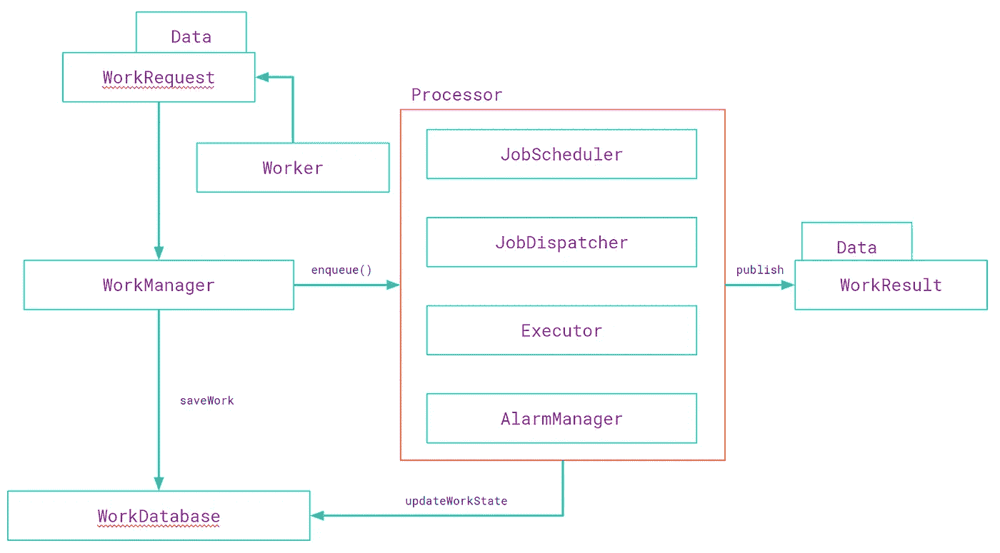

您创建新的`Work`并指定哪个`Worker`应该在哪个`Constraints`下与哪个`Arguments`一起工作。`WorkManager`将工作保存在 DB 使用空间中，并立即入队`Work`。它选择可能的最佳调度程序(`Jobscheduler`、`JobDispatcher`、`Executor aka GreedyScheduler`、`AlarmManager`)并调用`doWork()`方法。结果通过`LiveData`发布，使用`Arguments`可获得输出

就这么简单。

当然，还有更多。

您可以安排一项周期性工作:

您可以按顺序链接两个或多个作业:

并行:

并混合在它们之间。

> 注意:不能将周期性工作和一次性工作一起排入队列。

你还可以用`WorkManager`做很多其他的事情:取消`Work`，合并`Work`，链接工作，合并一个`Work`到另一个`Work`的参数。我鼓励您研究这些文档。它有很多很好的例子。

## **现实生活场景**

我们需要建立一个应用程序，每 15 分钟跟踪用户的位置。

首先，我们创建一个作业来获取位置。没有内置的异步方式来完成任务，因为 `doWork()`应该返回`Result.SUCCESS`，所以如果你需要一种异步方式来执行`doWork()`(例如，查询 GPS 位置)，你可以使用`Latch`和另一种机制来阻止执行:

计划它:

15 minutes is a minimum period for Periodic work

当我们完成位置获取操作时，我们将释放闩锁，当然还要清理所有的垃圾:

获得 LocationTracker 后，我们需要将其上传到我们的服务器，因此我们将安排另一项一次性工作来将其上传到服务器:

上传作品本身:

看起来简单？事实上——的确如此。
不再有复杂的 job schedulers/job dispatcher/Greed Executors 样板代码。你创作一件作品，安排好时间，它就完成了。就这么简单。


# **总结**

在过去/未来的 Android 版本中，遵循节省用户电池的意愿，在后台运行变得更加复杂。感谢 Android 团队，我们有了一个工作管理器，使得处理背景变得更加自然和简单。

最后一件事。

手机没电池了看起来怎么样？

.

.

.

.

.


****

*感谢阅读。如果你喜欢它，请给我你的*👏*👏*和大家分享一下这个。我也很乐意听到你的意见和建议:)谢谢**