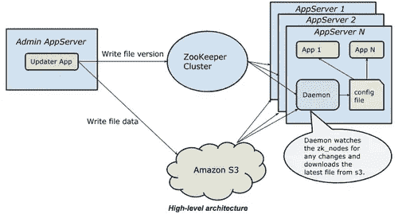

# 以高可用性提供大规模配置数据

> 原文：<https://medium.com/pinterest-engineering/serving-configuration-data-at-scale-with-high-availability-8612521c1108?source=collection_archive---------2----------------------->

Pavan Chitumalla 和 Jiacheng Hong | Pinterest 工程师，基础设施

我们有许多重要和常见的数据，这些数据不经常修改，但访问频率非常高。一个例子是我们的垃圾邮件域黑名单。因为我们不想向 Pinners 显示垃圾 Pin，所以在呈现 Pin 时，我们的 app/API 服务器需要对照域黑名单检查 Pin 的域。这只是一个例子，但是每秒钟有几十万个 Pin 请求，这就产生了对这个列表的巨大访问需求。

## 存在的问题

以前，我们将这种列表存储在一个 [Redis](http://redis.io/) 排序的集合中，这个集合为我们提供了一个简单的访问来保持列表结构的时间排序顺序。我们还有一个本地内存和基于文件的缓存，通过轮询 Redis 主机的任何更新来保持同步。一开始一切都很顺利，但是随着服务器数量和列表大小的增长，我们开始看到网络饱和的问题。在列表更新后的五分钟内，所有服务器都试图从单个 Redis 主服务器下载最新的数据副本，导致 Redis 主服务器上的网络饱和，并导致大量 Redis 连接错误。

我们确定了几个潜在的解决方案:

1.  将此数据的下载分散到更长的时间段。但是对于我们的用例，我们希望更新最多在几分钟内收敛。
2.  分割数据。不幸的是，由于这个数据是一个单一的列表，分割它会增加更多的复杂性。
3.  复制这些数据。使用一个 Redis 主服务器和多个 Redis 从服务器来存储这些数据，并随机选择一个从服务器进行读取。然而，我们对 Redis 复制没有信心(我们运行的是 2.6 版)。此外，由于客户端缓存，这些 Redis 框在大部分时间(当数据没有更新时)都是空闲的，因此成本效益不高。

## 解决办法

由于上述每个解决方案都有自己的缺点，我们问自己，如果我们从头开始构建，我们将如何设计解决方案？

形式化问题的要求:

*   频繁的读访问(> 100k/秒)和很少的更新(最多一天几次)。
*   快速(在一分钟内，或最多几分钟内)将更新集中到所有机器上。理想情况下，是基于推送的模型，而不是客户端轮询更新。

我们通过组合较小问题的解决方案设计了一个解决方案:

*   将数据缓存在内存中，这样高读取访问就不会成为问题。
*   使用[阿帕奇动物园管理员](http://zookeeper.apache.org/)作为更新时的通知。

这在概念上类似于 [ZooKeeper resiliency，](https://engineering.pinterest.com/post/77933733851/zookeeper-resilience-at-pinterest)的设计，但是如果我们将全部数据存储在一个 ZooKeeper 节点中，它仍然会在更新期间导致 ZooKeeper 节点上的网络流量出现巨大的峰值。由于 ZooKeeper 是分布式的，负载将分布在多个 ZooKeeper 节点上。然而，我们不想给动物园管理员增加不必要的负担，因为这是我们基础设施的重要组成部分。

我们最终达成了一个解决方案，使用 ZooKeeper 作为通知程序，S3 作为存储程序。由于 S3 提供了非常高的可用性和吞吐量，它似乎非常适合我们吸收突发负载峰值的用例。我们称这个解决方案为管理列表，也就是 config v2。

## 工作中的配置 v2

Config v2 充分利用了我们已经完成的工作，只是真实的来源在 S3。此外，我们添加了逻辑来避免并发更新和处理 S3 最终一致性。我们在 ZooKeeper 节点中存储了一个版本号(实际上是一个时间戳),它也是 S3 路径的后缀，用于标识当前数据。



如果需要修改托管列表的数据，开发人员可以选择通过管理 web UI 或控制台应用程序来更改它。以下步骤由更新程序应用程序在保存时执行:

*   首先，获取一个 Zk 锁来防止对同一个托管列表的并发写入。
*   然后，将旧数据与 S3 的数据进行比较，如果匹配，只将新数据上传到 S3——比较并交换更新。这可以防止前一次更新收敛时出现脏写。
*   最后，将版本写入 Zk 节点，释放 Zk 锁。

Zk 节点的值一更新，ZooKeeper 就通知它所有的观察者。在这种情况下，触发所有服务器上的守护进程从 S3 下载数据。

## 我们如何应对 S3 的一致性模型

亚马逊的 S3 即使在重负载下也能提供很好的可用性和耐用性保证，但它最终是一致的。我们需要的是“写后读”的一致性。幸运的是，它确实在某些区域提供了“创建后读取”的一致性*。我们为每次写入创建一个新文件，而不是更新同一个 S3 文件。然而，这带来了在所有节点上同步新的 S3 文件名的新问题。我们通过使用 ZooKeeper 在所有节点上保持文件名同步来解决这个问题。

## 介绍决定者

当一个新的特性或服务准备好发布时，我们会逐渐增加新代码路径中的流量，并在全部投入之前检查以确保一切正常。这导致需要构建一个交换机，允许开发人员决定应该向新功能发送多少流量。此外，这种流量提升工具(又名“决策器”)应该足够灵活，以便开发人员可以添加新的实验和更改现有实验的值，而无需重新部署到整个车队。此外，任何变更都应该在整个车队中快速可靠地聚合。

## 早期解决方案

每个实验都是一个 ZooKeeper 节点，并且有一个值[0–100 ],可以从 web UI 控制。当值在 web UI 中被更改时，它在相应的节点中被更新，ZooKeeper 负责更新所有的观察器。虽然这种解决方案有效，但它受到了我们之前遇到的[相同的扩展问题](https://engineering.pinterest.com/post/77933733851/zookeeper-resilience-at-pinterest)的困扰，因为整个车队都直接连接到 ZooKeeper。

我们的 Decider 框架由两个组件组成:一个基于 web 的管理 UI 来控制实验，一个库(Python 和 Java 版本)可以插入到需要分支控制的地方。

## 当前解决方案

一旦我们意识到*托管列表*的好处，我们就构建*托管散列表*，并迁移包含实验的所有 Zk 节点的值。本质上，底层托管 hashmap 文件内容是哈希表的 json 转储，其中包含作为键的实验名称和作为值的整数[0–100]。

## 应用程序接口

```
def decide_expermiment(experiment_name):
    return random.randrange(0, 100, 1)
```

如何在代码中使用它:

```
if decide_experiment("my_rocking_experiment"):
    // new code
else
    // existing code
```

## Decider 的另一个用例:暗读和暗写

当我们复制生产读或写请求并将其发送给新服务时，我们使用术语“暗读”和“暗写”。我们称之为黑暗，因为无论成功还是失败，来自新服务的响应都不会影响原始代码路径。如果需要异步行为，那么我们在 gevent.spawn()中包装新的代码路径。

下面是黑暗阅读的代码片段:

尝试:

```
if decider.decide_experiment("dark_read_for_new_service"):
        new_service.foo()
except Exception as e:
    log.info("new_service.foo exception: %s" % e)
```

**在 S3 因最终一致性而返回“文件未找到”的罕见情况下，守护程序被设计为每 30 分钟刷新一次所有内容，这些节点最终会跟上。到目前为止，我们还没有看到任何节点不同步超过几分钟的情况。*

如果你对这样的工程挑战感兴趣，[加入我们的团队](https://about.pinterest.com/en/careers/engineering-product)！

*Pavan Chitumalla 和 Jiacheng Hong 是基础设施团队的软件工程师。*

*获取 Pinterest 工程新闻和更新，关注我们的工程*[*Pinterest*](https://www.pinterest.com/malorie/pinterest-engineering-news/)*，* [*脸书*](https://www.facebook.com/pinterestengineering) *和*[*Twitter*](https://twitter.com/PinterestEng)*。有兴趣加入团队吗？查看我们的* [*招聘网站*](https://about.pinterest.com/en/careers/engineering-product) *。*