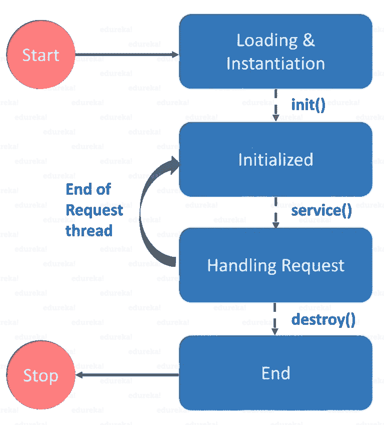
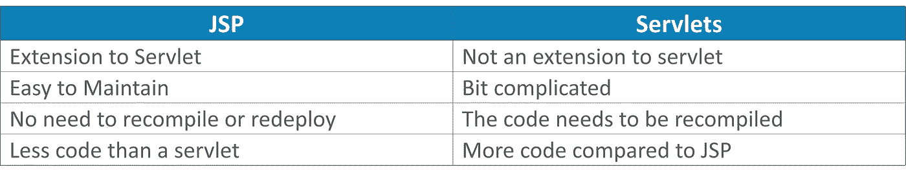

# 如何用 Servlet 和 JSP 用 Java 构建 Web 应用？

> 原文：<https://medium.com/edureka/servlet-and-jsp-tutorial-ef2e2ab9ee2a?source=collection_archive---------1----------------------->


Servlet and JSP Tutorial — Edureka

在最近的趋势中，每天都会产生 10 亿字节的数据。我们大多数人都相信这样一种误解，即所有的 web 应用程序都是在 HTML、PHP、JavaScript 等 web 框架上创建的。但是，您知道吗，web 应用程序可以基于 Java，使用 Servlets 和 JSP 之类的服务。在本文中，让我们深入研究这项技术，并理解它对于创建 web 应用程序是如何有用的。

下面是我将在这个 Servlet 和 JSP 教程中涉及的主题列表

**Servlet**

*   Web 和 HTTP
*   Servlets 简介
*   Servlet 生命周期
*   创建 Servlets 的步骤
*   会话跟踪
*   饼干

**JSP**

*   JSP 简介
*   JSP 与 Servlets
*   JSP 脚本元素
*   JSP 请求和响应

# Web 和 HTTP

Web 是一个由支持格式化文档的*互联网*服务器组成的系统。这些文档使用一种叫做 HTML ( *超文本标记语言*)的标记语言进行格式化，这种标记语言支持链接到其他文档，如图形、音频和视频文件等。


现在我们知道了什么是 web，让我们进一步了解什么是网站。因此，网站是静态文件的集合，即网页，如 HTML 页面、图像、图形等。并且，*网络应用*是在服务器上具有动态功能的网站。***谷歌*** *，* ***脸书*** *，* ***推特*** 都是 web 应用的例子。

那么，Web 和 HTTP 之间的联系是什么呢？现在让我们来找出答案。

## 超文本传输协议

客户端和服务器使用 HTTP 在 web 上进行通信。它被认为是无状态协议，因为它只支持每个连接一个请求。通过 HTTP，客户端连接到服务器发送一个请求，然后断开连接。这种机制允许更多的用户在一段时间内连接到给定的服务器。在这里，客户机发送一个 HTTP 请求，服务器使用 HTTP 用一个 HTML 页面回答客户机。

那都是关于 HTTP 和 Web 的。现在让我们深入研究 Servlets，了解它的工作机制。

# Servlets 简介

Servlet 是一个服务器端 Java 程序模块，它处理客户端请求并实现 *servlet* 接口。Servlets 可以响应任何类型的请求，它们通常用于扩展 web 服务器托管的应用程序。


在这张图中，您可以看到，客户端向服务器发送请求，服务器生成响应，对其进行分析，然后将响应发送回客户端。

现在，让我们进入下一个概念，理解 Servlet 生命周期。

# Servlet 生命周期

一个 [servlet](https://www.edureka.co/blog/java-servlets?utm_source=medium&utm_medium=content-link&utm_campaign=servlet-and-jsp-tutorial) 的整个生命周期由 *servlet 容器*管理，该容器使用 *javax.servlet.Servlet* 接口来理解 Servlet 对象并管理它。

Servlet 生命周期:Servlet 生命周期主要经历四个阶段:



## 加载 Servlet

当服务器启动时，servlet 容器部署并加载所有的 servlet。

## 初始化 Servlet

接下来，通过调用 init *()* 方法初始化 servlet。 *Servlet.init()* 方法由 Servlet 容器调用，通知该 Servlet 实例已成功实例化，即将投入使用。

## 请求处理

然后，servlet 调用 *service()* 方法来处理客户端的请求，并被调用来通知 Servlet 关于客户端请求的信息。

## 销毁 servlet

最后，通过调用 *destroy()来终止 servlet。**destroy()*方法在 Servlet 的生命周期中只运行一次，并发出 Servlet 实例结束的信号。

init()和 destroy()方法只被调用一次。最后，一个 servlet 由 JVM 的垃圾收集器进行垃圾收集。这就结束了 servlet 的生命周期。现在，让我指导您创建 Java servlets 的步骤。

# 创建 Servlet 的步骤

为了创建一个 servlet，我们需要依次遵循几个步骤。它们如下:

1.  创建目录结构
2.  创建一个 Servlet
3.  编译 Servlet
4.  向 web.xml 文件添加映射
5.  启动服务器并部署项目
6.  访问 servlet

现在，基于以上步骤，让我们创建一个程序来更好地理解 servlet 是如何工作的。

要运行 servlet 程序，我们应该安装并配置 Apache Tomcat 服务器。 *Eclipse for Java EE 提供了内置的 Apache Tomcat。*一旦配置好服务器，您就可以开始运行您的程序了。需要注意的重要一点是——对于任何 servlet 程序，您需要 3 个文件——*index.html 文件、Java 类文件和 web.xml 文件*。第一步是创建一个动态 Web 项目，然后继续下一步。

现在，让我们举一个例子，我将创建一个简单的登录 servlet，并在浏览器中显示输出。

首先，我将创建 index.html 文件

```
<!DOCTYPE html>
<html>
<body>
<form action="Login" method="post">
<table>
<tr>
<td>Name:</td>
<td><input type="text" name="userName"></td>
</tr>
<tr>
<td>Password:</td>
<td><input type="password" name="userPassword"></td>
</tr>
</table>
<input type="submit" value="Login">
</form>
</body>
</html>
```

接下来，让我们编写 Java 类文件。

```
package Edureka;
import java.io.IOException;
import java.io.PrintWriter;
import javax.servlet.ServletException;
import javax.servlet.http.HttpServlet;
import javax.servlet.http.HttpServletRequest
import javax.servlet.http.HttpServletResponse;
public class Login extends HttpServlet
{
protected void doPost(HttpServletRequest req,HttpServletResponse res)throws ServletException,IOException
PrintWriter pw=res.getWriter();
res.setContentType("text/html");
String user=req.getParameter("userName");
String pass=req.getParameter("userPassword");
pw.println("Login Success...!")
if(user.equals("edureka") && pass.equals("edureka"))
pw.println("Login Success...!");
else
pw.println("Login Failed...!");
pw.close();
}
}
```

在上面的代码中，我设置了一个条件——如果用户名和密码等于 ***edureka，*** 才会显示成功登录，否则会拒绝登录。编写完 Java 类文件后，最后一步是向 web.xml 文件添加映射。让我们看看如何做到这一点。

*web.xml* 文件将出现在您的 web 内容的 WEB-INF 文件夹中。如果它不存在，那么您可以点击部署描述符并点击*生成部署描述符存根。*准备好 web.xml 文件后，您需要向其中添加映射。让我们用下面的例子来看看映射是如何完成的:

```
<?xml version="1.0"encoding="UTF-8"?>
<web-app xmlns:xsi="<a href="[http://www.w3.org/2001/XMLSchema-instance](http://www.w3.org/2001/XMLSchema-instance)">[http://www.w3.org/2001/XMLSchema-instance](http://www.w3.org/2001/XMLSchema-instance)</a>" [http://xmlns.jcp.org/xml/ns/javaee](http://xmlns.jcp.org/xml/ns/javaee)">[http://xmlns.jcp.org/xml/ns/javaee](http://xmlns.jcp.org/xml/ns/javaee)</a>"xsi:schemaLocation="<a href="[http://xmlns.jcp.org/xml/ns/javaee](http://xmlns.jcp.org/xml/ns/javaee)">[http://xmlns.jcp.org/xml/ns/javaee](http://xmlns.jcp.org/xml/ns/javaee)</a> <a href="[http://xmlns.jcp.org/xml/ns/javaee/web-app_3_1.xsd](http://xmlns.jcp.org/xml/ns/javaee/web-app_3_1.xsd)">[http://xmlns.jcp.org/xml/ns/javaee/web-app_3_1.xsd](http://xmlns.jcp.org/xml/ns/javaee/web-app_3_1.xsd)</a>"version="3.1">
<display-name>LoginServlet</display-name>
<servlet>
<servlet-name>Login</servlet-name>
<servlet-class>Edureka.Login</servlet-class>
</servlet>
<servlet-mapping>
<servlet-name>Login</servlet-name>
<url-pattern>/Login</url-pattern>
</servlet-mapping>
<welcome-file-list>
<welcome-file>index.html</welcome-file>
</welcome-file-list>
</web-app>
```

这就是 servlet 的创建和配置方式。现在让我们看看什么是通用 servlet，以及它是如何创建的。

## 通用 Servlets

它是一个独立于协议的 servlet，应该覆盖 service()方法来处理客户端请求。service()方法接受两个参数， *ServletRequest 对象和 ServletResponse 对象。*请求对象的工作是通知 servlet 客户端的请求，而响应对象返回一个响应给客户端。GenericServlet 是一个*抽象类*，它只有一个抽象方法，就是 *service()* 。这就是整个概念当我们通过扩展 Generic Servlet 类来创建通用 Servlet 时，我们必须覆盖 service()方法。

现在，让我们看看如何创建和调用通用 servlet。我将再次编写如下所示的 3 个文件:

## **HTML 文件**

我们正在创建一个 HTML 文件，当我们单击网页上的链接时，它将调用 servlet。在 WebContent 文件夹中创建此文件。该文件的路径应该如下所示:WebContent/index.html

```
<html>
<title>Generic Servlet Demo</title>
</head>
<body>
<a href="welcome">Click here to call Generic Servlet</a>
</body>
</html>
```

## **Java 类文件**

这里我们将通过扩展 Generic Servlet 类来创建一个通用 Servlet。创建 GenericServlet 时，必须重写 service()方法。右击 *src* 文件夹，创建一个新的类文件，并将该文件命名为 generic。文件路径应该如下所示:Java resources/src/default package/generic . Java

```
package EdurekaGeneric;
import java.io.*;
importjavax.servlet.*;
public class generic extends GenericServlet{
public void service(ServletRequest req,ServletResponse res) throws IOException,ServletException{
res.setContentType("text/html");
PrintWriter pwriter=res.getWriter();
pwriter.print("<html>");
pwriter.print("<body>");
pwriter.print("<h2>Generic Servlet Example</h2>");
pwriter.print("Welcome to Edureka YouTube Channel");
pwriter.print("</body>");
pwriter.print("</html>");
}
}
```

## **web.xml**

这个文件可以在以下路径找到:WebContent/WEB-INF/web.xml。因为我们在点击*index.html*上的链接时调用欢迎页面，它将把欢迎页面映射到我们上面已经创建的 Servlet 类。

```
<servlet>
<servlet-name>MyGenericServlet</servlet-name>
<servlet-class>EdurekaGeneric.generic</servlet-class>
</servlet>
<servlet-mapping>
<servlet-name>MyGenericServlet</servlet-name>
<url-pattern>/welcome</url-pattern>
</servlet-mapping>
```

之后，启动 Tomcat 服务器并运行 servlet。您将获得期望的输出。所以这都是关于通用 Servlets 的。现在让我们进一步了解会话跟踪的概念。

# 会话跟踪

***时段*** 简单来说就是特定的时间间隔。 **S *会话跟踪*** 是一种维护用户状态(数据)的技术，在 servlet 中也称为*会话管理*。因此，每次用户向服务器发出请求时，服务器都会将该请求视为新请求。

下图描述了如何将来自客户端的每个请求视为一个新请求。


为了识别特定的用户，我们需要会话跟踪。现在，让我们进一步了解会话跟踪技术之一，即 Cookies。

# 饼干

一个 **cookie** 是在多个客户端请求之间保存的一小段信息。cookie 有一个名称、一个值和可选属性，如注释、路径和域限定符、最长期限和版本号。

## Cookie 是如何工作的？

由于这是一种会话跟踪技术，因此默认情况下，每个请求都被视为一个新请求。


在这里，我们添加了一个带有 servlet 响应的 cookie。所以 cookie 存储在浏览器的缓存中。之后，如果用户发送请求，默认情况下，cookie 会随请求一起添加。

现在您已经了解了 cookie 的工作原理，让我们来看一个演示 cookie 使用的小例子。

让我们看一个创建 cookie、添加响应和检索结果的例子。在这里，我将编写两个 java 类文件，即 MyServlet1 和 MyServlet2。

*文件:MyServlet1*

```
package Edureka;
import java.io.*;
import javax.servlet.*;
import javax.servlet.annotation.WebServlet;
import javax.servlet.http.*;
[@WebServlet](http://twitter.com/WebServlet)("/login")
public class MyServlet1 extends HttpServlet{
public void doGet(HttpServletRequest request,  HttpServletResponse response) {
try{
response.setContentType("text/html");
PrintWriter pwriter = response.getWriter();
String name = request.getParameter("userName");
String password = request.getParameter("userPassword");
pwriter.print("Hello here:"+name);
pwriter.print(" Your Password is: "+password);
//Creating two cookies
Cookie c1=new Cookie("userName",name);
Cookie c2=new Cookie("userPassword",password);
//Adding the cookies to response header
response.addCookie(c1);
response.addCookie(c2);
pwriter.print("
<a href='welcomehere'>View Details</a>");
pwriter.close();
}catch(Exception exp){
System.out.println(exp);
}
}
}
```

*文件:MyServlet2*

```
package Edureka;
import java.io.*;
import javax.servlet.*;
import javax.servlet.annotation.WebServlet;
import javax.servlet.http.*;
[@WebServlet](http://twitter.com/WebServlet)("/welcomehere")
public class MyServlet2 extends HttpServlet {
public void doGet(HttpServletRequest request, HttpServletResponse response){
try{
response.setContentType("text/html");
PrintWriter pwriter = response.getWriter();
//Reading cookies
Cookie[] c=request.getCookies();
//Displaying User name value from cookie
pwriter.print("Name here: "+c[0].getValue());
pwriter.print("Password: "+c[1].getValue());
//pwriter.print("
<a href='welcome'>View Details</a>");
pwriter.close();
}catch(Exception exp){
System.out.println(exp);
}
}
}
```

现在，让我们为 cookies 创建一个简单的 HTML 表单。

```
<!DOCTYPE html>
<html>
<body>
<body>
<form action="login">
User Name:<input type="text" name="userName"/>
Password:<input type="password" name="userPassword"/>
<input type="submit" value="submit"/>
</form>
</body>
</html>
```

现在，最后一步是创建 XML 文件并将所有映射添加到其中。

```
<servlet>
<servlet-name>Servlet1</servlet-name>
<servlet-class>Edureka.MyServlet1</servlet-class>
</servlet>
<servlet-mapping>
<servlet-name>Servlet1</servlet-name>
<url-pattern>/login</url-pattern>
</servlet-mapping>
<servlet>
<servlet-name>Servlet2</servlet-name>
<servlet-class>Edureka.MyServlet2</servlet-class>
</servlet>
<servlet-mapping>
<servlet-name>Servlet2</servlet-name>
<url-pattern>/welcomehere</url-pattern>
</servlet-mapping>
```

现在你已经准备好执行了。您可以运行代码并获得想要的输出。这就是饼干的工作原理。这就是关于 Servlets 的全部内容。现在您已经对 Servlets 有了一些了解，让我们继续了解什么是 Java 服务器页面。

# Java 服务器页面

JSP 或 Java Server Pages 是一种用于创建 web 应用程序的技术，就像 Servlet 技术一样。它是 servlet 的扩展——因为它提供了比 Servlet 更多的功能，如表达式语言、JSTL 等。JSP 页面由 HTML 标记和 JSP 标记组成。JSP 页面比 Servlet 更容易维护，因为我们可以将设计和开发分开。

现在，我们知道了 JSP 是什么，让我们比较 JSP 和 Servlets，了解哪一个最适合 web。

# JSP 相对于 Servlets 的优势



我希望您理解 JSP 和 Servlets 之间的区别。现在，让我们进一步了解脚本元素。

# JSP 脚本元素

脚本元素提供了在 JSP 中插入 java 代码的能力。有三种类型的脚本元素:

*   **scriptlet 标签**—script let 标签用于在 JSP 中执行 Java 源代码。

```
Syntax : <%  java source code %>
```

在本例中，我们创建了两个文件 index.html 和 welcome.jsp。index.html 文件从用户那里获取用户名，welcome.jsp 文件打印用户名和欢迎消息。现在，让我们看看代码。

*文件:index.html*

```
<html>
<body>
<form action="welcome.jsp">
<input type="text" name="uname">
<input type="submit" value="go">
</form>
</body>
</html>
```

*文件:welcome.jsp*

```
<html>
<body>
<% String name=request.getParameter("uname"); print("welcome "+name); %>
</form>
</body>
</html>
```

*   **表达式标签** —放置在 *JSP 表达式标签*内的代码是*写入响应*的输出流。所以不需要写 *out.print()* 来写数据。它主要用于打印变量或方法的值。

```
Syntax : <%=  statement %>
```

现在让我们举一个显示当前时间的小例子。为了显示当前时间，我们使用了 Calendar 类的 getTime()方法。getTime()是 Calendar 类的一个实例方法，所以我们在通过 getInstance()方法得到 Calendar 类的实例后调用了它。

*文件:index.jsp*

```
<html>
<body>
Current Time: <%= java.util.Calendar.getInstance().getTime() %>
</body>
</html>
```

*   **声明标签**—JSP 声明标签用于*声明字段和方法*。JSP 声明标记内编写的代码被放在自动生成的 servlet 的 service()方法之外。所以它不会在每次请求时都获得内存。

```
Syntax: <%!  field or method declaration %>
```

在下面的 JSP 声明标签的例子中，我们定义了返回给定数字的立方体的方法，并从 JSP 表达式标签中调用这个方法。但是我们也可以使用 JSP scriptlet 标记来调用声明的方法。让我们看看怎么做。
*文件:index.jsp*

```
<html>
<body>
<%! int cube(int n){ return n*n*n*; } %>
<%= "Cube of 3 is:"+cube(3) %>
</body>
</html>
```

所以，这都是关于 JSP 脚本元素的。现在让我们继续看 JSP 的请求和响应对象。

# JSP 请求和响应对象

**JSP 请求**是 HttpServletRequest 类型的隐式对象，由 web 容器为每个 JSP 请求创建。它可以用来获取请求信息，如参数、头信息、远程地址、服务器名、服务器端口、内容类型、字符编码等。它还可以用来设置、获取和删除 JSP 请求范围内的属性。

让我们看一下请求隐式对象的简单示例，其中我们打印了带有欢迎消息的用户名。让我们看看怎么做。

## **JSP 请求隐式对象的示例**

【index.html 档案:】

```
<form action="welcome.jsp">
<input type="text" name="uname">
<input type="submit" value="go">
</form>
```

*文件:welcome.jsp*

```
<% String name=request.getParameter("uname"); 
print("welcome "+name); %>
```

# JSP 响应隐式对象

在 JSP 中，响应是 HttpServletResponse 类型的隐式对象。web 容器为每个 JSP 请求创建 HttpServletResponse 的实例。它可用于添加或操作响应，例如将响应重定向到另一个资源、发送错误等。

让我们看看响应隐式对象的例子，其中我们将响应重定向到 Google。

## **响应隐式对象的示例**

*文件:index.html*

```
<form action="welcome.jsp">
<input type="text" name="uname">
<input type="submit" value="go">
</form>
```

*文件:welcome.jsp*

```
<% sendRedirect("http://www.google.com"); %>
```

这就是请求和响应对象的工作方式。Servlet 和 JSP 教程文章到此结束。

如果你想查看更多关于人工智能、DevOps、道德黑客等市场最热门技术的文章，你可以参考 Edureka 的官方网站。

请留意本系列中的其他文章，它们将解释 Java 的各个方面。

> 1.[面向对象编程](/edureka/object-oriented-programming-b29cfd50eca0)
> 
> 2.[Java 中的继承](/edureka/inheritance-in-java-f638d3ed559e)
> 
> 3.[Java 中的多态性](/edureka/polymorphism-in-java-9559e3641b9b)
> 
> 4.[Java 中的抽象](/edureka/java-abstraction-d2d790c09037)
> 
> 5. [Java 字符串](/edureka/java-string-68e5d0ca331f)
> 
> 6. [Java 数组](/edureka/java-array-tutorial-50299ef85e5)
> 
> 7. [Java 集合](/edureka/java-collections-6d50b013aef8)
> 
> 8. [Java 线程](/edureka/java-thread-bfb08e4eb691)
> 
> 9.[Java servlet 简介](/edureka/java-servlets-62f583d69c7e)
> 
> 10. [Java 教程](/edureka/java-tutorial-bbdd28a2acd7)
> 
> 11.[Java 中的异常处理](/edureka/java-exception-handling-7bd07435508c)
> 
> 12.[高级 Java 教程](/edureka/advanced-java-tutorial-f6ebac5175ec)
> 
> 13. [Java 面试问题](/edureka/java-interview-questions-1d59b9c53973)
> 
> 14. [Java 程序](/edureka/java-programs-1e3220df2e76)
> 
> 15. [Kotlin vs Java](/edureka/kotlin-vs-java-4f8653f38c04)
> 
> 16.[依赖注入使用 Spring Boot](/edureka/what-is-dependency-injection-5006b53af782)
> 
> 17.[Java 中的可比](/edureka/comparable-in-java-e9cfa7be7ff7)
> 
> 18.[十大 Java 框架](/edureka/java-frameworks-5d52f3211f39)
> 
> 19. [Java 反射 API](/edureka/java-reflection-api-d38f3f5513fc)
> 
> 20.[Java 中的前 30 个模式](/edureka/pattern-programs-in-java-f33186c711c8)
> 
> 21.[核心 Java 备忘单](/edureka/java-cheat-sheet-3ad4d174012c)
> 
> 22.[Java 中的套接字编程](/edureka/socket-programming-in-java-f09b82facd0)
> 
> 23. [Java OOP 备忘单](/edureka/java-oop-cheat-sheet-9c6ebb5e1175)
> 
> 24.[Java 中的注释](/edureka/annotations-in-java-9847d531d2bb)
> 
> 25.[Java 中的图书馆管理系统项目](/edureka/library-management-system-project-in-java-b003acba7f17)
> 
> 26.[爪哇的树木](/edureka/java-binary-tree-caede8dfada5)
> 
> 27.[Java 中的机器学习](/edureka/machine-learning-in-java-db872998f368)
> 
> 28.[Java 中的顶级数据结构&算法](/edureka/data-structures-algorithms-in-java-d27e915db1c5)
> 
> 29. [Java 开发人员技能](/edureka/java-developer-skills-83983e3d3b92)
> 
> 30.[前 55 个 Servlet 面试问题](/edureka/servlet-interview-questions-266b8fbb4b2d)
> 
> 31. [](/edureka/java-exception-handling-7bd07435508c) [顶级 Java 项目](/edureka/java-projects-db51097281e3)
> 
> 32. [Java 字符串备忘单](/edureka/java-string-cheat-sheet-9a91a6b46540)
> 
> 33.[Java 中的嵌套类](/edureka/nested-classes-java-f1987805e7e3)
> 
> 34. [Java 集合面试问答](/edureka/java-collections-interview-questions-162c5d7ef078)
> 
> 35.[Java 中如何处理死锁？](/edureka/deadlock-in-java-5d1e4f0338d5)
> 
> 36.[你需要知道的 50 大 Java 集合面试问题](/edureka/java-collections-interview-questions-6d20f552773e)
> 
> 37.[Java 中的字符串池是什么概念？](/edureka/java-string-pool-5b5b3b327bdf)
> 
> 38.[C、C++和 Java 有什么区别？](/edureka/difference-between-c-cpp-and-java-625c4e91fb95)
> 
> 39.[Java 中的回文——如何检查一个数字或字符串？](/edureka/palindrome-in-java-5d116eb8755a)
> 
> 40.[你需要知道的顶级 MVC 面试问答](/edureka/mvc-interview-questions-cd568f6d7c2e)
> 
> 41.[Java 编程语言的十大应用](/edureka/applications-of-java-11e64f9588b0)
> 
> 42.[Java 中的死锁](/edureka/deadlock-in-java-5d1e4f0338d5)
> 
> 43.[Java 中的平方和平方根](/edureka/java-sqrt-method-59354a700571)
> 
> 44.[Java 中的类型转换](/edureka/type-casting-in-java-ac4cd7e0bbe1)
> 
> 45.[Java 中的运算符及其类型](/edureka/operators-in-java-fd05a7445c0a)
> 
> 46.[Java 中的析构函数](/edureka/destructor-in-java-21cc46ed48fc)
> 
> 47.[爪哇的二分搜索法](/edureka/binary-search-in-java-cf40e927a8d3)
> 
> 48.[Java 中的 MVC 架构](/edureka/mvc-architecture-in-java-a85952ae2684)
> 
> 49.[冬眠面试问答](/edureka/hibernate-interview-questions-78b45ec5cce8)

*原载于 2019 年 1 月 17 日*[*www.edureka.co*](https://www.edureka.co/blog/servlet-and-jsp-tutorial/)*。*