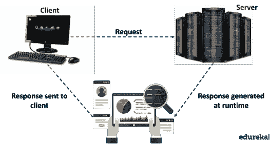
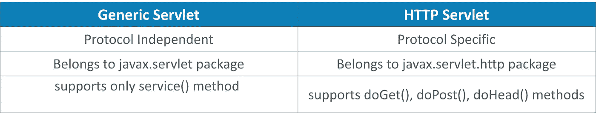
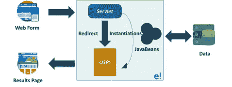
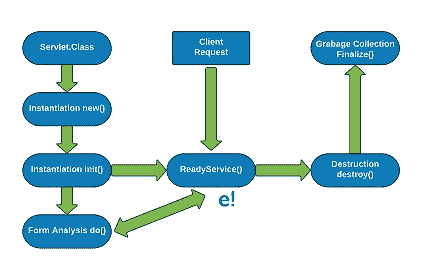
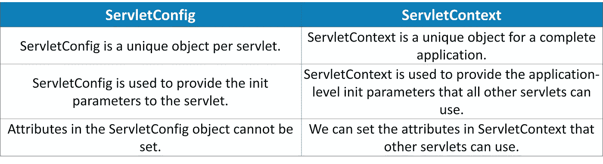
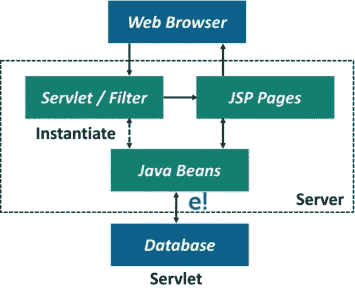
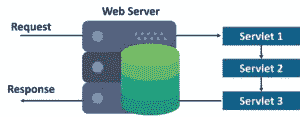
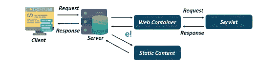
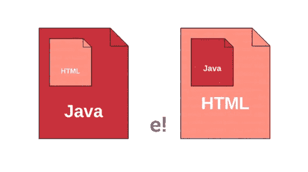

# 2021 年你必须准备的 55 个 Servlet 面试问题

> 原文：<https://medium.com/edureka/servlet-interview-questions-266b8fbb4b2d?source=collection_archive---------4----------------------->


Servlet Interview Questions — Edureka

**Java Servlets** 是将**高端** Web 应用开发为网页的简单性背后的主要原因，由于这个原因，Java Web 应用技术是当今最需要的。在本文中，我们将基于**Java servlet 讨论最常见的面试问题。**

*   初级面试问题
*   中级面试问题
*   高级面试问题

# 初级面试问题


## **Q1。什么是 Servlet？**

**Ans** :一个 **Servlet** 是一个运行在 Web 服务器上的 Java 程序。它类似于 applet，但在服务器上处理，而不是在客户机上处理。**servlet**通常在用户点击链接、提交表单或在网站上执行其他类型的操作时运行



## **Q2。什么是饼干？**

**Ans:****cookie**是存在于多个客户端请求之间的一条信息。一个 cookie 有一个名称、一个值和可选的属性(T21 ),比如注释、路径和域限定符、最长期限和版本号。

## **Q3。PrintWriter 与 ServletOutputStream 有何不同？**

**Ans:****PrintWriter**基本上是一个字符流类。另一方面， **ServletOutputStream** 是一个字节流类。PrintWriter 类可用于仅写入基于字符的信息，而 ServletOutputStream 类可用于写入原始值以及基于字符的信息。

## **Q4。解释是 servlet 映射？**

**Ans:** Servlet 映射是定义 URL 模式和 Servlet 之间的关联的过程。映射用于将请求映射到 Servlets。

## **Q5。Servlet 3 中使用了哪些注释？**

**Ans:**servlet 中使用的 3 个重要注释是。

*   **@WebServlet:** 用于 Servlet 类。
*   **@WebListener:** 用于监听器类。
*   **@WebFilter:** 为滤镜类。

## **Q6。通用 Servlet 和 HTTP Servlet 有什么区别？**

**Ans:** 一个**通用 Servlet 和 HTTP Servlet 之间的共同特征**是这两个类都是**抽象类。但是，它们之间确实有差异，讨论如下**



## **Q7。RequestDispatcher 接口有什么用？**

**Ans:****request dispatcher**接口定义了从客户端接收请求的对象，并将其分派给 servlet、JSP、HTML 文件等资源。RequestDispatcher 接口有以下两种方法:

```
public void forward(ServletRequest request, ServletResponse response)
```

**将请求从一个 servlet 转发到另一个资源，如 servlet、JSP、HTML 等。**

```
public void include(ServletRequest request, ServletResponse response)
```

在响应中包含资源的**内容**，比如 servlet、JSP 和 HTML。

## **Q8。JSP 可以用 Servlet 调用吗？**

**Ans:** 是的，Servlet 可以使用 **RequestDispatcher** 接口调用一个 **JSP** 。

**例如:**

```
RequestDispatcher reqdis=request.getRequestDispatcher("log.jsp");
reqdis.forward(request,response);
```

## **Q9。解释 Servlet 过滤器。**

**答:****过滤器**被定义为一个**可插拔**对象，在**请求的预处理或后处理时被调用。**

## **Q10。为什么我们需要 Servlet 过滤器？**

**答:**我们需要 **Servlet 过滤器**，原因如下:

*   **日志记录**请求参数到日志文件。
*   **认证**和**授权**对所需资源的请求。
*   **在将请求发送到 servlet 之前格式化请求体/头的**。
*   **压缩**发送给客户端的响应数据。
*   通过添加一些 **cookies** 和 **header** 信息来更改响应。

## **Q11。为什么在 Servlets 中使用 init()方法？**

**Ans:****init()**方法用于创建或加载一些将在 servlet 的整个生命周期中使用的数据。

## **Q12。Servlet 中什么是启动时加载？**

**Ans:****web . XML**中 servlet 的 **load-on-startup** 元素用于在部署**项目**或**服务器**启动时加载 servlet。这为第一个请求的**响应**节省了时间。

## **Q13。什么是战争文件？**

**Ans:****WAR(Web 应用资源)文件**指定了 Web 元素。一个 **Servlet** 或 **JSP** 项目可以被转换成一个 war 文件。将一个 Servlet 项目从一个地方移动到另一个地方会很快，因为它被合并到一个文件中。

## **Q14。XML 文件中的以下代码片段是什么意思？**

```
<load-on-startup>1</load-on-startup>
```

**Ans:** 每当发出对 **servlet** 的请求时， **servlet 容器**就会初始化 servlet 并加载它。这个过程在名为 **web.xml.** 的配置文件中定义，但是默认情况下，当加载上下文时，容器不会初始化 servlet。这可以通过在**预初始化**过程语法 **<启动时加载>1</启动时加载>中定义 servlet 来实现。**然后，我们在这个标签中定义的 servlet 将在开始时**被初始化**，此时上下文甚至在得到**请求之前就被加载。**

## **Q15。如何获取 servlet 中的服务器信息？**

**Ans:** 是的，我们可以在 servlet 中检索服务器的信息。我们可以使用下面的代码片段通过 servlet 上下文对象获取 servlet 中的 servlet 信息。

```
getServletContext().getServerInfo()
```

## **Q16。解释 MVC 模式。**

**Ans:模型-视图-控制器(MVC)** 是一种设计模式，它将一个软件应用分成三个部分，即**模型、**视图、和**控制器。**

*   一个**模型**处理应用的行为。它包含应用程序的数据和业务逻辑。当它的状态发生变化时，它会通知视图和控制器。
*   **视图**将信息呈现给用户，使其看起来有吸引力。它从生成输出的模型中获取信息。
*   一个**控制器**接受用户的输入，并向模型或视图发送命令。它控制应用程序的流程。

# 中级面试问题

## **Q17。servlet 的工作流程是什么？**

**Ans: Servlet** 是一个 Java 工具，用来创建 **Java Web 应用。**它位于服务器端，帮助生成动态网页，充当来自浏览器的传入 **HTTP 请求**和数据库之间的中介。Servlet 是健壮的，被称为服务器端编程语言。

**下图解释了 Servlet 的工作流程。**



servlet 从网页接收到一个**请求**。servlet 将请求重定向到适当的 **JSP** 页面，JSP 页面发送**响应**作为对客户端可见的结果页面。

## **Q18。使用 Servlets 编写一个 Hello World 程序。**

**Ans:** 使用 Servlets 编写 Hello World 程序的代码如下:

```
import java.io.*;
import javax.servlet.*;
import javax.servlet.http.*;

public class HelloWorld extends HttpServlet {
      private String message;
      public void init() throws ServletException {
             message = "Hello World";
      }
      public void doGet(HttpServletRequest request, HttpServletResponse response)
      throws ServletException, IOException {
             response.setContentType("text/html");
             PrintWriter out = response.getWriter();
             out.println("<h1>" + message + "</h1>"); 
      } 
      public void destroy() { 
      } 
}
```

## **Q19。servlet 的生命周期方法有哪些？**

**Ans:**Servlet 生命周期由三种方法组成:

*   **public void init(servlet config config)**:这个方法被容器用来初始化 servlet，这个方法在 servlet 的生命周期中只被调用一次。
*   **public void service(servlet request 请求，ServletResponse 响应):**这个方法对每个请求调用一次，除非执行 init()方法，否则容器不能调用 service()方法。
*   **public void destroy():** 当一个 servlet 从内存中卸载时，这个方法被调用一次。



## **Q20。可以在 servlet 上创建死锁条件吗？**

**Ans:** 是的，通过调用 **doGet()** 方法内的 **doPost()** 方法，可以在 servlet 上创建一个**死锁**情况，或者通过调用 **doPost()** 方法内的 **doGet()** 方法，可以成功为 servlet 创建一个**死锁**情况。

## **Q21。我们可以在不同的 servlet 上获取与 servlet 相关的属性吗？**

**Ans:** 我们正在寻找的另一个 servlet 的**属性**可以通过使用它的**名称来访问。**语法描述如下:

```
Context.setAttribute (“name”,” value”)
Context.getAttribute (“name”)
```

## **Q22。你说的哑剧类型是什么意思？**

**答:****“内容类型”**响应头被称为 **MIME** (多用途互联网邮件扩展)类型。服务器向客户机发送 MIME 类型，让客户机知道它正在发送的数据类型。它帮助客户端为用户呈现数据。一些最常用的 mime 类型有 **text/HTML、text/XML、application/XML。**

## **Q23。什么是 ServletConfig 对象？**

**Ans:javax . servlet . Servlet config**用于将配置信息传递给 Servlet。每个 servlet 都有自己的 **ServletConfig** 对象，servlet 容器负责实例化这个对象。我们可以在 **web.xml** 文件中或者通过使用 **WebInitParam** 注释来提供 servlet **init** 参数。

## **Q24。ServletConfig 和 ServletContext 有什么区别？**

**答:****servlet config**和 **ServletContext** 之间的一些主要区别是:



ServletConfig 的语法 **:**

```
**public** ServletConfig getServletConfig();
```

ServletConfig 的示例:

```
ServletConfig config=getServletConfig();
```

ServletContext 的语法 **:**

```
**public** ServletContext getServletContext();
```

ServletContext **的例子:**

```
ServletContext application=getServletContext();
```

## **Q25。HttpServletRequestWrapper 和 HttpServletResponseWrapper 有什么用？**

**Ans:** 两个**http servlet requestwrapper**和**http servlet response wrapper**类都用于帮助开发人员定制实现 servlet **请求**和**响应**类型。程序员可以扩展这些类，只覆盖他们需要为定制的**请求**和**响应**对象实现的特定方法。

## **Q26。编写一个简单的 Servlet 程序来打印 HTML 的内容。**

**答:**我们可以使用以下步骤打印 HTML 的内容:

**第一步:**获取 **PrintWriter** 使用请求的对象。

```
PrintWriter out = response.getWriter();
```

**第二步:**现在打印 **HTML。**

```
out.println("Hello World");
```

## **Q27。你说的服务器间通信是什么意思？**

**Ans:****Servlet 间通信**是使用**request dispatcher forward()**和 **include()** 方法调用另一个 servlet 的方法，并在请求中提供附加属性供其他 servlet 使用。

## **Q28。当新数据输入数据库时，我们如何自动刷新？**

**Ans:** 下面的代码段可以用来**自动更新**数据库。

```
response.setHeader("Refresh",5);
```

这将在每隔 **5 秒**后更新浏览器

```
response.setHeader("Refresh","5", URL="[http://localhost:8080/myServlet/Request.do0](http://localhost:8080/myServlet/Request.do0));
```

这将在 **5 秒**后刷新 Request.do



## **Q29。servlets 中会话管理的过程涉及到哪些不同的方法？**

**答:**servlet 中会话管理涉及的不同方法如下:

*   **用户认证**

一个**用户**试图访问一个受保护的资源，比如一个 JSP 页面。如果**用户**已经被**认证**，那么 **servlet** 容器使资源可用；否则，**用户**被要求输入用户名和密码

*   **HTML 隐藏字段**

<**输入**类型=" **隐藏** " >定义了一个**隐藏输入字段**。一个**隐藏字段**让 web 开发人员在提交**表单**时包含用户无法看到或修改的数据。一个**隐藏字段**通常存储当**表单**提交时需要更新的数据库记录

*   **饼干**

由网站创建的小文本文件，临时存储在用户的计算机中(仅用于该会话),或者永久存储在硬盘上。**cookie**为网站提供了一种识别您并跟踪您的偏好的方式

*   **URL 重写**

**URL 重写**是一个自动修改程序的过程，该程序是为操作 **URL** (统一资源定位符)中的参数而编写的。URL 操作被网络服务器管理员作为一种便利手段，或者被黑客用于邪恶的目的。

*   **会话管理 API**

**会话管理 API** 构建在**请求-响应**方法之上，用于会话跟踪。会话跟踪是维护用户状态/数据的一种方式。在 servlet 中也称为会话管理。

## **Q30。如何在 servlet 中获取客户端的 IP 地址？**

**Ans:** 我们可以使用下面的代码来获取 servlet 中的**客户端 IP 地址**。

```
request.getRemoteAddr()
```

## **Q31。如何使用 Servlet 处理应用程序异常？**

**Ans:****doGet()**方法和 **doPost()** 方法抛出 **ServletException** 和 **IOException。**浏览器只理解 HTML。因此，当应用程序抛出异常操作系统时，servlet 容器会处理该异常并生成一个 **HTML 响应。其他错误也会发生同样的情况，例如错误 404。**

Servlet API 支持**定制的**异常和错误处理程序 Servlet，可以在部署描述符中配置，这些 servlet 的目的是处理应用程序抛出的异常，并发送对用户有用的 HTML 响应。我们可以提供一个到应用程序主页的链接或者让用户知道哪里出错的细节。

**网。XML** 配置如下:

```
<error-page>
    <error-code>404</error-code>
    <location>/AppExceptionHandler</location>
</error-page>
<error-page>
    <exception-type>javax.servlet.ServletException</exception-type>
    <location>/AppExceptionHandler</location>
</error-page>
```

## **Q32。什么是 Servlet 接口？**

**Ans:**Servlet API 中的核心抽象被称为 **Servlet 接口。**Web 应用程序中的所有 servlets 都实现了这个接口，或者直接实现，或者最常见的是通过扩展实现它的类来实现。

## **Q33。如何获取 servlet 在服务器中的路径？**

**Ans:** 我们可以使用下面的代码片段来获取**文件系统中 servlet 的实际**路径**。**

```
getServletContext().getServerInfo()
```

## **Q34。你说的 CGI 是什么意思，它的弊端是什么？**

**Ans:** CGI 是 **Common Gate Interface 的缩写。**它由**服务器端**的一组代码段组成，服务器使用这些代码段与运行在 web 上的客户端进行交互。CGI 的缺点如下:

*   如果有多个传入请求，那么生成的响应会非常慢，导致**效率低下。**
*   CGI 是依赖于平台的。

## **Q35。解释 Web 容器。**

**答:**web 容器或 Servlet 容器用于与 Servlet 交互，并包含其中所有的 **Servlet、JSP、XML** 文件。Web 容器的职责是管理 servlet 的生命周期，并帮助映射特定 servlet 的 URL。web 容器也用于创建 servlet 的对象。

## **Q36。Servlet 链接是什么意思？**

**答:** servlet 循环或链接是一个过程，其中一个 servlet 的输出作为另一个 Servlet 的输入，最后一个 Servlet 输出被认为是提供给客户端的**实际输出**。



## **Q37。我们为什么要使用 sendredirect()方法？**

**Ans:****send redirect()**方法基本上在客户端工作。它用于将响应重定向到另一个资源，比如 Servlet、JSP、HTM

**sendredirect()** 方法的语法如下:

```
void send Redirect(URL);
```

示例:

```
response.sendredirect(“http://www.google.com”);
```

## **Q38。为什么 Servlet 不包含 main()？它是如何工作的？**

**Ans:**servlet 没有 **main()方法。**因为 servlets 是使用 **web 容器执行的。**当客户端发出对 servlet 的请求时，服务器将请求传递给部署 servlet 的 web 容器。



**Q39。Servlet 上下文是什么意思？**

**Ans:****Servlet Context**指的是一个拥有应用程序和 Web 容器信息的对象。使用 Servlet 上下文，我们可以**记录事件**，获取特定资源的 **URL** ，并存储属性供其他 Servlet 使用。

**servlet context 的重要方法如下:**

*   **getInitParameter ():** 返回参数的值。
*   **getInitParameterNames():**返回参数的名称。
*   **void setAttribute ():** 用于设置属性的值。
*   **void getAttribute ():** 用于获取属性的值。
*   **void removeAttribute ():** 用于删除属性。

# 高级面试问题


## **Q40。上下文参数和上下文属性有什么区别？**

**Ans:** 主要区别在于，**上下文参数**是存储在部署描述符中的一个值，部署描述符是 **web.xml** ，在部署过程中加载。另一方面，**上下文属性**是动态设置的值，并且可以在整个应用中使用。

## **Q41。可以自动刷新客户端和服务器端的 servlet 吗？**

**答:**是的，有几种主要的方法可以自动**刷新 servlet。一种方法是添加一个**“Refresh”**响应头，其中包含刷新发生之前的秒数。下面的 **TestServlet** 类展示了一个这样的例子。**

```
import java.io.IOException;
import java.io.PrintWriter;
import java.util.Date;
import javax.servlet.ServletException;
import javax.servlet.http.HttpServletRequest;
import javax.servlet.http.HttpServletResponse;

public class TestServlet extends javax.servlet.http.HttpServlet implements javax.servlet.Servlet {
      private static final long serialVersionUID = 1L;
      protected void doGet(HttpServletRequest request, HttpServletResponse response) throws ServletException, IOException {
            performTask(request, response);
      }
      protected void doPost(HttpServletRequest request, HttpServletResponse response) throws ServletException,
      IOException {
            performTask(request, response);
      }
      private void performTask(HttpServletRequest request, HttpServletResponse response) throws ServletException,
      IOException {
            response.setContentType("text/html");
            response.addHeader("Refresh", "5");
            PrintWriter out = response.getWriter();
            out.println("TestServlet says hi at " + new Date());
      }
}
```

## **Q42。什么是纯 Servlet？**

**答:Pure servlet** 被认为是一个用于创建 java 对象的 servlet，这些对象可以从 **javax.servlet.Servlet** 接口实现。

## **Q43。什么叫 HttpServlet，和 GenericServlet 有什么不同？**

**Ans:****http servlet**基本上是由 GenericServlet 扩展而来，也继承了 **Genericservlet 的属性。** HttpServlet 定义了一个 **HTTP 协议** servlet，而 GenericServlet 定义了一个**通用的、与协议无关的** servlet。

## **Q44。如果 servlet 没有正确初始化，会抛出哪个异常？**

**答:**如果 Servlet 没有正确初始化，抛出 **Servlet 异常**或**不可用异常**。

## **Q45。我们如何翻译 JSP？**

**答:**在 servlet 中，Java 代码是用 HTML 编写的，但是 **JSP** ( **Java 服务器页面)**允许我们用 HTML 编写 Java 代码。JSP 允许网页的简单开发，并且允许网页设计者和网页开发者独立工作。所有 JSP 页面都被翻译成 servlet，web 容器负责将 JSP 翻译成 servlet。



## **Q46。如何在 servlet 中创建会话？**

**Ans:** 我们可以通过调用 **HttpServletRequest 的**公共方法 getSession()** 得到 **HttpSession** 对象。**下面的代码段将帮助我们。

```
HttpSession session = request.getSession();
```

## **Q47。解释 JSESSIONID，它是什么时候创建的？**

Ans : **JSESSIONID** 基本上是一个 cookie，用于管理 Java Web 应用程序中的会话。当创建新会话时，它由 **Web 容器**创建。

## **Q48。Servlet 中的 sendRedirect()和 Forward()有什么区别？**

**Ans:****send redirect()**和 Forward()的区别可以解释如下:

**发送重定向():**

*   **sendRedirect()** 方法在 HttpServletResponse 接口中声明。
*   该函数的**语法**如下:

```
**void** sendRedirect(String URL)
```

*   该方法重定向客户端请求以进行进一步处理，新位置在不同的服务器或不同的上下文中可用。web 容器对此进行处理，并使用浏览器传输请求，该请求在浏览器中以新请求的形式可见。它也称为客户端重定向。

**前进():**

*   **Forward()** 方法在 **RequestDispatcher** 接口中声明。
*   该函数的语法如下:

```
forward(ServletRequest request, ServletResponse response)
```

*   这将请求传递给同一个服务器中的另一个资源进行处理，另一个资源可以是任何 servlet、JSP 页面。Web 容器处理 **Forward()** 方法。当我们调用 **Forward()** 方法时，一个请求被发送到另一个资源，而没有通知客户端关于将处理该请求的资源。它将在 **requestDispatcher** 对象上被提及，我们可以通过两种方式得到它。使用 **ServletContext** 或**请求。**

## **Q49。解释 servlet 的 service()方法的工作原理。**

**Ans:****service()**方法实际上是执行实际任务的主要方法。servlet 容器调用**服务()**方法来处理来自**客户端/浏览器**的请求，并将响应返回给客户端。

每次服务器接收到对一个 **servlet 的请求时，**服务器创建一个新的线程并调用服务。 **service()** 方法检查 **HTTP** 请求类型，并根据需要调用各自的方法。

相同的示例代码如下:

```
public void service(ServletRequest request, ServletResponse response)throws ServletException, IOException{}
```

**容器**调用 **service()** 方法，服务方法根据需要调用 *doGet()、doPost()、doPut()、doDelete()、*方法。因此，您与 **service()** 方法没有任何关系，但是您可以根据从客户端收到的请求覆盖 doGet()或 doPost()。

## **Q50。可以从 Servlet 发送认证错误吗？**

**Ans:** 可以，我们可以使用 **HttpServletResponse** 的 **setStatus(statuscode)** 方法发送认证错误。我们所要做的就是设置一个错误代码和一个有效的原因。

```
response.sendError(404, "Page not Found!!!" );
```

## **Q51。如何在 servlets 中配置集中式错误处理程序？**

**答:**如果我们希望为所有异常包含一个**中央错误处理器**，那么我们可以定义下面的错误页，而不是为单独的异常定义单独的错误页元素

```
<error-page>
<exception-type>java.lang.Throwable</exception-type >
<location>/ErrorHandler</location>
</error-page>
```

## **Q52。如何使用 servlet 创建 cookie？**

**答:**使用 servlet 创建和设置 cookies 包括以下步骤:

**步骤 1:** 创建一个 Cookie 对象

用 cookie **名**和 cookie **值**调用 Cookie 构造函数，两者都是字符串数据类型。应该注意这些特殊的符号( **[ ] ( ) =，"/？@ : ;**)在声明名称和值时被排除。

```
Cookie cookie = new Cookie("key","value");
```

**第二步:**设定最大年龄

我们将使用 **setMaxAge** 来指定 cookie 的有效期。下面的代码段将建立一个 24 小时的 cookie。

```
cookie.setMaxAge(60*60*24);
```

**步骤 3** :将 Cookie 发送到 HTTP 响应头中

我们可以使用 **response.addCookie** 在 **HTTP 响应头**中添加 Cookie，如下所示:

```
response.addCookie(cookie);
```

## **Q53。如何使用 servlet 生成纯文本而不是 HTML？**

**Ans:** 一个 servlet 基本上生成 HTML。我们可以通过任何方法设置内容类型的响应头。使用 servlets 中的 HTML 代码生成文本消息 EDUREKA 的示例。

```
import java.io.*;
import javax.servlet.*;
import javax.servlet.http.*;
public class EDUREKA extends HttpServlet{
       public void doGet(HttpServletRequest request, HttpServletResponse response)
       throws ServletException, IOException{
              response.setContentType("text/html");
              PrintWriter out = response.getWriter();
              out.println("<!DOCTYPE HTML PUBLIC \"-//W3C//DTD HTML 4.0 " +"Transitional//EN\">n" +"<HTML>n" +"<HEAD><TITLE>EDUREKA</TITLE></HEAD>n" + "<BODY>n" + " <H1>HAPPY LEARNING</H1>  n" + "</BODY></HTML>");
       }
}
```

## **Q54。解释将 servlet 放入包中的步骤？**

Ans:这些包用于将一个目录下的 servlet 分开，以消除在同一台服务器上同时创建 servlet 的程序员之间的混淆。这可以通过以下步骤完成:

*   通过匹配包名和子目录名来组织包，将文件分类到不同的子目录中。
*   将包分类到子目录后，在类文件中插入 package 语句。

让我们通过这个例子来理解如下:

```
import java.io.*;
import javax.servlet.*;
import javax.servlet.http.*;
public class servlet1 extends HttpServlet{
      public void doGet(HttpServletRequest request, HttpServletResponse response)
      throws ServletException, IOException {
             response.setContentType("text/html");
             PrintWriter out = response.getWriter();
             String docType = "<!DOCTYPE HTML PUBLIC \"-//W3C//DTD HTML 4.0 " + "Transitional//EN\">n";
             out.println(docType + "<HTML>n" + "<HEAD><TITLE>Edureka</TITLE></HEAD>n" + "<BODY BGCOLOR=\"#FDF5E6\">n" + "</BODY></HTML>");
      }
}
```

## **55。解释建立 JDBC 连接的步骤。**

**答:**建立 **JDBC 连接**的步骤如下:

*   **导入 JDBC 包:**将 **import** 语句添加到您的 **Java 程序**中，以导入您的 Java 代码中所需的类。
*   **注册 JDBC 驱动程序:**在这一步中， **JVM** 将所需的驱动程序实现加载到内存中，以便它能够满足 JDBC 请求。注册驾驶员有两种方法。
*   注册驱动程序最合适的方法是使用 Java 的 **forName()** 方法将驱动程序的类文件动态加载到内存*中，内存会自动注册它。*这种方法很合适，因为它允许您使驱动程序注册可配置和可移植。

```
try {
       Class.forName("oracle.jdbc.driver.OracleDriver");
}
catch(ClassNotFoundException ex)
       System.out.println("Error: unable to load driver class!");
       System.exit(1);
}
```

*   注册驱动程序的第二种方法是使用静态的 **registerDriver()** 方法。

```
try {
      Driver myDriver = new oracle.jdbc.driver.OracleDriver();
      DriverManager.registerDriver( myDriver );
}
catch(ClassNotFoundException ex){
      System.out.println("Error: unable to load driver class!");
      System.exit(1);
}
```

*   如果您使用的是不符合 JDK 标准的 JVM，比如微软提供的 JVM，那么您应该使用 *registerDriver()* 方法。这里每个表单都需要一个数据库 URL。
*   **数据库 URL 格式:** URL 格式是创建指向您要连接的数据库的正确格式化地址所必需的。一旦加载了驱动程序，就可以使用**driver manager . getconnection()**方法建立连接。DriverManager.getConnection()方法是
*   getConnection(字符串 url)
*   getConnection(字符串 url，属性属性)
*   getConnection(字符串 url，字符串用户，字符串密码)

**创建一个连接对象**

您可以使用数据库 URL、用户名和密码以及 properties 对象来创建连接。

**关闭**

最后，要结束数据库会话，您需要关闭所有数据库连接。但是，如果您忘记了，Java 的垃圾收集器会在清理过时对象时关闭连接。

```
conn.close();
```

所以这就把我们带到了文章的结尾。我希望您发现它提供了很多信息，并帮助您理解了一些重要问题。如果你想查看更多关于人工智能、DevOps、道德黑客等市场最热门技术的文章，你可以参考 [Edureka 的官方网站。](https://www.edureka.co/blog/?utm_source=medium&utm_medium=content-link&utm_campaign=servlet-interview-questions)

请留意本系列中的其他文章，它们将解释 Java 的各个方面。

> 1.[面向对象编程](/edureka/object-oriented-programming-b29cfd50eca0)
> 
> 2.[Java 中的继承](/edureka/inheritance-in-java-f638d3ed559e)
> 
> 3.[Java 中的多态性](/edureka/polymorphism-in-java-9559e3641b9b)
> 
> 4.[Java 中的抽象](/edureka/java-abstraction-d2d790c09037)
> 
> 5. [Java 字符串](/edureka/java-string-68e5d0ca331f)
> 
> 6. [Java 数组](/edureka/java-array-tutorial-50299ef85e5)
> 
> 7. [Java 集合](/edureka/java-collections-6d50b013aef8)
> 
> 8. [Java 线程](/edureka/java-thread-bfb08e4eb691)
> 
> 9.Java Servlets 简介
> 
> 10. [Servlet 和 JSP 教程](/edureka/servlet-and-jsp-tutorial-ef2e2ab9ee2a)
> 
> 11.[Java 中的异常处理](/edureka/java-exception-handling-7bd07435508c)
> 
> 12.[高级 Java 教程](/edureka/advanced-java-tutorial-f6ebac5175ec)
> 
> 13. [Java 面试问题](/edureka/java-interview-questions-1d59b9c53973)
> 
> 14. [Java 程序](/edureka/java-programs-1e3220df2e76)
> 
> 15. [Kotlin vs Java](/edureka/kotlin-vs-java-4f8653f38c04)
> 
> 16.[依赖注入使用 Spring Boot](/edureka/what-is-dependency-injection-5006b53af782)
> 
> 17.[Java 中的可比](/edureka/comparable-in-java-e9cfa7be7ff7)
> 
> 18.[十大 Java 框架](/edureka/java-frameworks-5d52f3211f39)
> 
> 19. [Java 反射 API](/edureka/java-reflection-api-d38f3f5513fc)
> 
> 20.[Java 中的 30 大模式](/edureka/pattern-programs-in-java-f33186c711c8)
> 
> 21.[核心 Java 备忘单](/edureka/java-cheat-sheet-3ad4d174012c)
> 
> 22.[Java 中的套接字编程](/edureka/socket-programming-in-java-f09b82facd0)
> 
> 23. [Java OOP 备忘单](/edureka/java-oop-cheat-sheet-9c6ebb5e1175)
> 
> 24.[Java 中的注释](/edureka/annotations-in-java-9847d531d2bb)
> 
> 25.[Java 中的图书管理系统项目](/edureka/library-management-system-project-in-java-b003acba7f17)
> 
> 26.[Java 中的树](/edureka/java-binary-tree-caede8dfada5)
> 
> 27.[Java 中的机器学习](/edureka/machine-learning-in-java-db872998f368)
> 
> 28.[Java 中的顶级数据结构&算法](/edureka/data-structures-algorithms-in-java-d27e915db1c5)
> 
> 29. [Java 开发者技能](/edureka/java-developer-skills-83983e3d3b92)
> 
> 30. [Java 教程](/edureka/java-tutorial-bbdd28a2acd7)
> 
> 31. [](/edureka/java-exception-handling-7bd07435508c) [顶级 Java 项目](/edureka/java-projects-db51097281e3)
> 
> 32. [Java 字符串备忘单](/edureka/java-string-cheat-sheet-9a91a6b46540)
> 
> 33.[Java 中的嵌套类](/edureka/nested-classes-java-f1987805e7e3)
> 
> 34. [Java 集合面试问答](/edureka/java-collections-interview-questions-162c5d7ef078)
> 
> 35.[Java 中如何处理死锁？](/edureka/deadlock-in-java-5d1e4f0338d5)
> 
> 36.[你需要知道的 50 大 Java 集合面试问题](/edureka/java-collections-interview-questions-6d20f552773e)
> 
> 37.[Java 中的字符串池是什么概念？](/edureka/java-string-pool-5b5b3b327bdf)
> 
> 38.[C、C++和 Java 有什么区别？](/edureka/difference-between-c-cpp-and-java-625c4e91fb95)
> 
> 39.[Java 中的回文——如何检查一个数字或字符串？](/edureka/palindrome-in-java-5d116eb8755a)
> 
> 40.[你需要知道的顶级 MVC 面试问答](/edureka/mvc-interview-questions-cd568f6d7c2e)
> 
> 41.[Java 编程语言十大应用](/edureka/applications-of-java-11e64f9588b0)
> 
> 42.[Java 中的死锁](/edureka/deadlock-in-java-5d1e4f0338d5)
> 
> 43.[Java 中的平方和平方根](/edureka/java-sqrt-method-59354a700571)
> 
> 44.[Java 中的类型转换](/edureka/type-casting-in-java-ac4cd7e0bbe1)
> 
> 45.[Java 中的运算符及其类型](/edureka/operators-in-java-fd05a7445c0a)
> 
> 46.[Java 中的析构函数](/edureka/destructor-in-java-21cc46ed48fc)
> 
> 47.[爪哇的二分搜索法](/edureka/binary-search-in-java-cf40e927a8d3)
> 
> 48.[Java 中的 MVC 架构](/edureka/mvc-architecture-in-java-a85952ae2684)
> 
> 49. [Hibernate 面试问答](/edureka/hibernate-interview-questions-78b45ec5cce8)

*原载于*[*www.edureka.co*](https://www.edureka.co/blog/interview-questions/servlet-interview-questions/)*。*