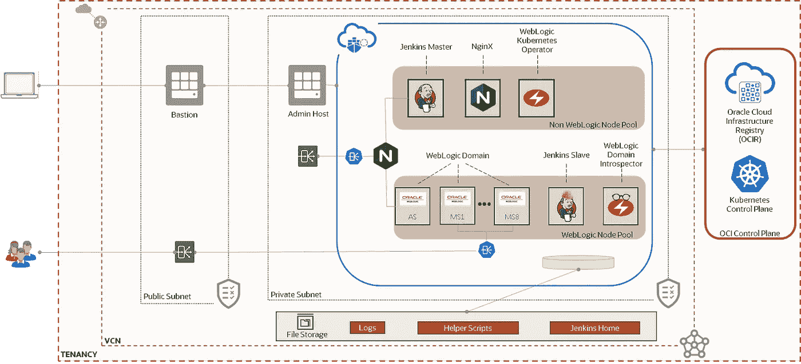
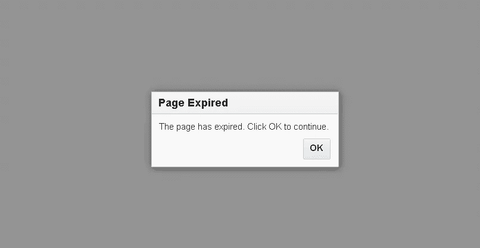
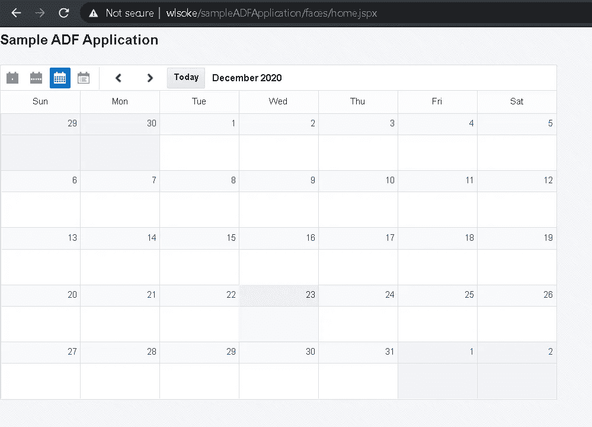
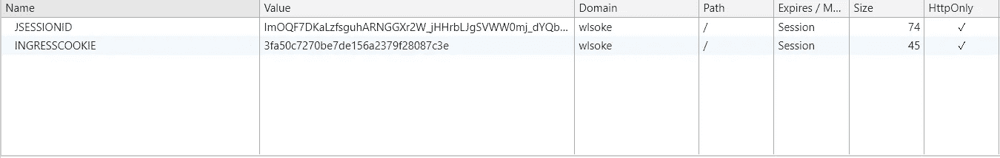

# 在 WebLogic for OKE 上运行的应用程序的会话持久性

> 原文：<https://medium.com/oracledevs/session-persistence-for-applications-running-on-weblogic-for-oke-5a3629c89900?source=collection_archive---------2----------------------->


Photo from [**Pexels**](https://www.pexels.com/photo/art-background-brick-brick-texture-272254/)

我最近越来越多地使用 Oracle 的云市场解决方案来部署运行在 OCI 的 Kubernetes 容器引擎(简称 OKE)上的 WebLogic 域。如果您还没有听说过这个解决方案，它让您不必在 Kubernetes 上手动安装 WebLogic 以及更多！，查看这篇博客文章，了解很好的介绍和起点:[Oracle WebLogic Server for OKE](https://blogs.oracle.com/weblogicserver/oracle-weblogic-server-for-oke-now-available-on-oracle-cloud-marketplace)。



WebLogic for OKE components reference architecture

很自然地，在我测试的某个时候，我部署了一个示例 ADF 应用程序，并在与应用程序交互时收到了这个熟悉的警告消息:



ADF warning message linked with expired an session

我记得这个恼人的弹出窗口通常是由于一个过期的会话。从技术上讲，浏览器发送的 JSESSIONID cookie 不再与 WebLogic Server 上的有效会话相关联，或者是未知的，单击“确定”按钮将强制重新加载页面。这将导致重定向到登录或 SSO 页面，或者在公共页面的情况下，使用新的 JSESSIONID 立即重新生成新的会话。但是在我的场景中却不是这样。

一点上下文:在我的 Weblogic for OKE 拓扑中，我有一个 Kubernetes 集群，它有两个与 *Weblogic 节点池*(用于运行 WebLogic 相关 pods 的专用节点池)相关联的工作节点和四个运行 WebLogic 托管服务器 pods。从 WebLogic Server 的角度来看，这是一个具有四个受管服务器的 WebLogic 群集。在前面，一个公共 OCI 负载平衡器将流量分发到我的 Kubernetes 集群，随后，一个预配置的 NGINX 入口控制器将应用程序流量路由到 WebLogic 托管服务器 pod。因此，在我的例子中，最有可能的情况是，每次调用都是由不同的 pod 服务的，它不能识别由对等 pod 创建的会话 cookie。这很有意义，因为我的示例 ADF 应用程序没有针对会话复制进行配置。

如何快速修复此问题？配置相关的 Kubernetes 入口资源以支持 pod 关联！我登录到*管理主机*(查看上面的参考组件架构)，因为它已经安装了所有 CLI 工具，并配置了 Kubernetes 集群。列出所有入口资源，我们可以看到三种不同的资源:

```
$ kubectl get ingress -A
NAMESPACE NAME HOSTS ADDRESS PORTS AGE
jenkins-ns jenkins-dashboard-ingress * 10.0.3.4 80 20d
wlsoke07-domain-ns wls-admin-ingress * 10.0.3.4 80 20d
wlsoke07-domain-ns wls-cluster-ingress * 193.133.3.17 80 20d
```

`wls-cluster-ingress`处理外部流量，我们可以看到它使用了不同的 NGINX 入口控制器实例:

```
$ kubectl get ingress -A -o custom-columns=NAME:.metadata.name,CLASS:.metadata.annotations."kubernetes\.io/ingress\.class"
NAME                        CLASS
jenkins-dashboard-ingress   nginx
wls-admin-ingress           nginx
wls-cluster-ingress         nginx-applications
```

要设置会话持久性，我们需要向`wls-cluster-ingress`入口添加至少两个注释:

```
nginx.ingress.kubernetes.io/affinity: cookie
nginx.ingress.kubernetes.io/affinity-mode: persistent
```

此外，我们还需要为默认路由映射一个主机名。在我的例子中，我正在设置主机`wlsoke.com`(我还需要编辑我的本地`/etc/hosts`文件，以将它映射到公共负载平衡器 IP 地址)。要编辑入口:

```
$ kubectl edit ingress wls-cluster-ingress -n wlsoke07-domain-ns
```

添加上述内容后。yaml 文件应该如下所示:

像在`vi`或`vim`等其他编辑器中一样保存文件会自动触发入口配置重新加载:

```
$ kubectl edit ingress wls-cluster-ingress -n wlsoke07-domain-ns
ingress.extensions/wls-cluster-ingress edited
```

现在列出入口资源，我们看到映射的主机:

```
$ kubectl get ingress -A
NAMESPACE NAME HOSTS ADDRESS PORTS AGE
jenkins-ns jenkins-dashboard-ingress * 10.0.3.4 80 20d
wlsoke07-domain-ns wls-admin-ingress * 10.0.3.4 80 20d
wlsoke07-domain-ns wls-cluster-ingress wlsoke 193.133.3.17 80 20d
```

现在，示例 ADF 应用程序按预期运行:



ADF Calendar Component

如果我们检查应用程序 COOKIE，我们会看到一个名为 INGRESSCOOKIE 的新 cookie。这是由 NGINX 入口控制器生成的，它确保会话与特定的 WebLogic 托管服务器 pod 保持一致。



我要改变的另一件事是:通过增加外部入口控制器的副本数量，使架构真正实现高可用性:

```
$ kubectl get deployments -A
NAMESPACE NAME READY UP-TO-DATE AVAILABLE AGE
ingress-nginx nginx-ingress-controller 1/1 1 1 20d
ingress-nginx nginx-ingress-controller-external 1/1 1 1 20d
jenkins-ns jenkins-deployment 1/1 1 1 20d
kube-system coredns 4/4 4 4 20d
kube-system kube-dns-autoscaler 1/1 1 1 20d
wlsoke07-operator-ns weblogic-operator 1/1 1 1 20d
```

当然，在运行唯一的`nginx-ingress-controller-external` pod 的 Kubernetes worker 节点崩溃的情况下，另一个实例将在另一个 worker 节点上自动启动，但这可能意味着几秒钟的停机时间。如果我们将副本数量增加到始终有两个实例运行&,就不会出现这种情况:

```
$ kubectl scale --replicas=2 deployment/ninx-ingress-controller-external -n ingress-nginx
deployment.apps/nginx-ingress-controller-external scaled$ kubectl get deployments -A
NAMESPACE              NAME                                READY   UP-TO-DATE   AVAILABLE   AGE
ingress-nginx          nginx-ingress-controller            1/1     1            1           20d
ingress-nginx          nginx-ingress-controller-external   2/2     2            2           20d
jenkins-ns             jenkins-deployment                  1/1     1            1           20d
kube-system            coredns                             4/4     4            4           20d
kube-system            kube-dns-autoscaler                 1/1     1            1           20d
wlsoke07-operator-ns   weblogic-operator                   1/1     1            1           20d
```

检查在不同工作节点上运行的两个实例(节点列):

```
$ kubectl get pods -o wide -n ingress-nginx
NAME                                                 READY   STATUS    RESTARTS   AGE     IP             NODE       NOMINATED NODE   READINESS GATES
nginx-ingress-controller-84dbddc6dd-tzck6            1/1     Running   0          20d     10.244.0.131   10.0.4.3   <none>           <none>
nginx-ingress-controller-external-85c7889d47-5hxm5   1/1     Running   0          25h     10.244.0.161   10.0.4.3   <none>           <none>
nginx-ingress-controller-external-85c7889d47-gfvk6   1/1     Running   0          2m32s   10.244.2.12    10.0.4.8   <none>           <none>
```

如果只是为了好玩，我们取消任何 NGINX 外部入口控制器 pods，ADF 应用程序仍然可以访问，因此真正的高可用性:

```
$ kubectl delete pods nginx-ingress-controller-external-85c7889d47-gfvk6 — grace-period=0 — force -n ingress-nginx
warning: Immediate deletion does not wait for confirmation that the running resource has been terminated. The resource may continue to run on the cluster indefinitely.
pod “nginx-ingress-controller-external-85c7889d47-gfvk6” force deleted
```