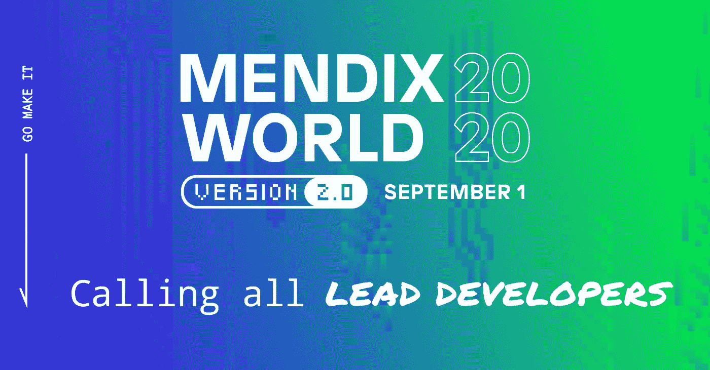

# 作为 Mendix 首席开发人员，您应该参加的 Mendix World 2.0 会议

> 原文：<https://medium.com/mendix/sessions-you-should-attend-at-mendix-world-2-0-as-mendix-lead-developer-623c7b05f5?source=collection_archive---------2----------------------->

10 年前，我作为 Mendix 顾问/培训师加入了 Mendix 社区。用 Mendix 创建应用程序的乐趣开始了。那时，我们只有 Mendix Modeler，从 2010 年的角度来看，它非常棒。你只需点击几下鼠标就能构建所有的应用程序。尽管经常有开发人员参加培训课程，但他们有时会持怀疑态度。对一个应用程序建模无法达到他们的编码技巧和能力。这在他们第一次接触 Mendix 时有所改观。看到他们可以使用他们现有的知识和技能来建模和扩展应用程序，甚至更加令人惊叹。

快进到 2020 年，只是为了好玩，我安装了 2010 年的 Mendix Modeler 2.5.0 版本。我试着为一个应用程序建模，就像我现在经常做的那样。好吧，我可以告诉你，在过去的 10 年里，观点已经改变了。这并不奇怪，因为知道门迪克斯·R&D 的巫师们每天都在挑战极限。在 Mendix 培训课程中，怀疑模式被“告诉我更多”和“我们如何在我们的应用程序环境中采用低代码？”。

作为 Mendix 首席开发人员，这与您有什么关系？作为 Mendix 培训师和教练，我与许多 Mendix 首席开发人员一起工作。作为首席开发人员，您面临两大挑战；拥有一个一流的团队，并通过掌握最新技术来领导他们。

由于门迪克斯每个月都在生产令人惊叹的东西，这是一份不错的工作。

2019 年的 Mendix World 最后一版是一次很棒的体验。出席者的数量，挤满了主舞台，等待所有新的 Mendix 的东西来了。你可以感觉到空气中的紧张气氛。Johan den Haan 的主题演讲非常吸引人，他分享了 Mendix 关于人工智能将如何从协助发展到促进应用开发的观点。这真的改变了我的想法，让我看到了未来。不是会不会的问题，而是什么时候，怎么来的问题。Mendix 引领着低代码开发的潮流。

此外，native mobile 上的介绍和演示给我留下了深刻的印象，并打开了另一扇机会之窗。Mendix 将本地应用程序开发与他们现有的基于 web 的应用程序开发相集成的方式简直太棒了。

现在 [Mendix World 2.0](https://www.mendix.com/mendix-world/?utm_medium=referral&utm_source=CommunityBlog&utm_campaign=GL-CE-2020-09-01-Mendix-World) 即将到来，我很期待看到 Mendix 今年会推出什么。特别是在线格式将为其增添新的内容。让我们能够参加所有你想参加的会议，而不用站在后面。

让我分享一下今年我将参加哪些会议来提升我的首席开发人员游戏。

## [**招聘并指导顶尖的 Mendix App 开发团队**](https://www.mendix.com/mendix-world/?utm_medium=referral&utm_source=CommunityBlog&utm_campaign=GL-CE-2020-09-01-Mendix-World)

这就是一切的开始，拥有一个顶尖的团队。拥有合适的团队可以决定你(低代码)项目的成败。期待更多地了解 Mendix 对 Mendix 团队的看法。如何为你的团队雇佣合适的人？以及如何指导新的团队成员。你如何鼓励团队自我成长？当然，看到 Simone & Eric 火起来会像往常一样棒。

## [**管理 Mendix 开发团队的技术:协作、源代码控制**](https://www.mendix.com/mendix-world/?utm_medium=referral&utm_source=CommunityBlog&utm_campaign=GL-CE-2020-09-01-Mendix-World)

接下来是这个环节。拥有一个顶尖的团队是一个好的开始，但是你如何让他们合作呢？在我看来，合作是成功的关键。团队处理用户故事、讨论、发布管理的协作工具是成功不可或缺的。我很想知道 Mendix 将在未来几个月提供什么来增强 Mendix 项目中的协作！

## [**实施 App 效率 QA 流程**](https://www.mendix.com/mendix-world/?utm_medium=referral&utm_source=CommunityBlog&utm_campaign=GL-CE-2020-09-01-Mendix-World)

难道我们都不知道“生产中的测试”吗？这是一个很容易实现的概念，它也证明了它不适合交付高质量的软件。我希望在本次会议中更多地了解 Mendix 质量保证套件。这如何保证 Mendix dev 团队产出的质量？在低代码开发过程中交付高质量的软件。并确保 QA 不是事后才想到的或被视为令人讨厌的干扰。

## [**将治理与开发配对，从一个应用程序到全面应用**](https://www.mendix.com/mendix-world/?utm_medium=referral&utm_source=CommunityBlog&utm_campaign=GL-CE-2020-09-01-Mendix-World)

在我为 Mendix 工作的这些年里，我看到很多公司都是从一个 Mendix 应用开始的。在这个应用程序成功之后，又实现了另一个 Mendix 应用程序。这种情况持续下去，最终形成了多种 Mendix 应用的局面。单独所有好的应用程序。以自己的方式为企业做出贡献。但这就是治理之痛的开始。单一应用程序方法不适合多应用程序环境。

例如，维护多个应用程序的全球 UX，以便业务用户在所有应用程序中拥有相同的体验，这需要全面的设计流程和支持技术。另一方面，您将面临所有这些应用程序的交付流程、监控和维护。

我参加本次会议的目的是了解更多关于 Mendix 在从单一应用扩展到真正的 Mendix 应用工厂时在流程和技术方面的工具和建议。运行多个 Mendix 应用程序环境。

我邀请你在这些 Mendix 世界会议期间加入我，并领导你的团队。联系我让我知道你的想法！

你可以在 Slack @Rene van Hofwegen 找到我，但是你得先[注册](https://www.mendix.com/mendix-world/?utm_medium=referral&utm_source=CommunityBlog&utm_campaign=GL-CE-2020-09-01-Mendix-World)。现在注册，我们就可以开始谈论它会有多棒。那里见！