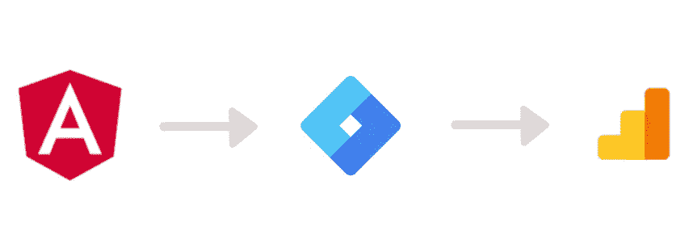

# 通过谷歌标签管理器在 Angular 应用程序上设置分析

> 原文：<https://medium.com/quick-code/set-up-analytics-on-an-angular-app-via-google-tag-manager-5c5b31e6f41?source=collection_archive---------0----------------------->

我最近需要在 Angular 应用程序上安装谷歌标签管理器(GTM)、数据层和通用分析。

*在寻找 Angular 的 GTM 或分析插件时，我发现可用的几个选项中有* ***在触发点击事件*** *，以及* ***无一在设置一组适当的数据层变量*** *以附加到页面视图中。*

*最后，事实证明* ***的设置相当容易*******根本不需要插件*** *。我在这里分享我的经验。**

**

> *GTM = Google Tag Manager = Web 应用程序，用于管理几个不同的“标签”(您在网站中加载的外部脚本)。*
> 
> *数据层=在 GTM 中存储和使用变量的主要工具*
> 
> *通用分析=谷歌分析的最新版本，通常也简称为 UA 或 GA*

*在本文中，我将假设您已经基本掌握了上述概念。*

# ***什么是数据层变量(以及为什么您应该努力设置它们)***

*嗯，从技术上来说，GTM 的**数据层**只不过是一个大罐子，你可以在里面存储标签所需的信息。*

*你必须在调用 GTM 的脚本之前设置它:*

*然后，当您需要与 GTM 共享任何内容时，只需将对象推送到它那里:*

*你将数据层初始化为一个空数组的原因是**当 GTM 脚本仍在加载的时候，你可以继续向它推送东西**:当 GTM 响应时，它会(1)将 window.dataLayer 转换为一个对象，(2)执行你向它推送的东西的堆栈。*

> *数据层在分析中最有用的应用是**将自定义维度推送给它**。使用自定义维度，您可以使用一组变量来定位页面视图，这些变量**描述了页面视图发生的环境***

*例如，假设用户正在查看新闻网站中的页面，并且该页面被标记为属于特定的新闻类别，比如体育。*

*如果，**在触发页面视图**之前，您将包含该页面类别的变量推送到数据层，那么您将能够在 GTM 中读取该变量，并在 Universal Analytics 中将它作为**自定义维度**进行传递。使用这样的自定义维度，您可以过滤用户在该类别的页面中引发的任何事件。*

*你能看出这有什么好处吗？*

> *您触发的每个事件**都会自动绑定到一组附加信息**，您可以使用这些信息在您的报告上应用过滤器*

1.  *您将变量推送到数据层*
2.  *它作为一个**变量被读取并存储在 GTM** 中*
3.  *它作为**自定义维度**附加到页面浏览量中*
4.  *现在，您可以使用来过滤报告，而不是向每个事件附加详细且容易出错的信息*

*当你触发事件时，预先设置**一组适当的数据层变量**可以节省你大量的时间(和代码)*****

# *为什么在 GTM 中设置事件比在代码中设置事件更好*

*简而言之:因为你从代码中移除了不属于那里的复杂性。*

> *GTM 有一个由**变量**、**触发器**和**标签**组成的**完美组织的**系统，为什么要在代码中创建它的副本呢？*

*还有，*

> *非开发人员可以很容易地对 GTM**进行测试和修改，它甚至**拥有自己的版本控制系统**(你可以真正地测试、部署和回滚不同版本的 GTM 代码，而不必麻烦前端开发人员去做)。***

*您所需要做的就是确保需要在 GTM 中以某种方式跟踪的元素(可点击的元素，或者您想要度量可见性的元素，等等)。)用适当的 HTML 类标记，任何附加信息都存储在数据中:*

*一旦你做了这些，你作为前端开发人员的工作就完成了。现在，GTM 管理器负责设置一个在点击该类时触发的触发器，以及一个由该触发器激活的通用分析标签。*

# *GTM +角度实施的优先级*

*   *设置一组适当的自定义维度，将它们存储在数据层中，并确保它们正确地附加到每个页面视图。*
*   *然后，用一组可以被 GTM 触发器拾取的类来标记可跟踪的 HTML 元素。*

*这与我发现的所有 Angular 的 GTM 插件所做的正好相反:他们专注于创建许多跟踪事件的实用程序，并且有一个非常简单的页面视图实现，根本没有自定义维度。*

*您可能会反对 GTM 中定义的一组触发类型无法跟踪的事件:虽然这肯定是可能的，但是如果您做得正确，您想要跟踪的大多数事件都可以跟踪到点击或滚动跟踪(这两种情况都可以通过 GTM 触发器进行管理)。谁知道 GTM 的人会推出什么新的跟踪工具。*

> *您的目标应该是保持事情简单，尽可能将事件跟踪委托给 GTM*

# *定义您的自定义维度集，并将其安全地存储在数据层中*

*让我们定义一个我们希望一致地推送到数据层的自定义维度的示例列表(在现实生活中，它们可能不止三个):*

*我们的目标是在每个页面视图之前将这些变量推送到数据层**(这样 GTM 就能够拾取它们并将其作为自定义维度附加)。***

*为了实现通用分析，这些变量需要*

1.  *在 GTM 中被定义为一个**数据层变量***
2.  *在 GTM 中，**作为自定义维度**附加到所有通用分析页面视图标签*

*这些都是在 GTM 中完成的，这是一件非常标准的事情。*

> *至此，我将把这些变量称为“**数据层自定义维度**”，以区别于其他用于不同目的的常规数据层变量。*

*在谈到这一切的角度实现之前，我还有最后一句话:*

> *每当您想要更新您在数据层中定义的定制维度时，您需要替换所有的维度，甚至是那些空的维度。*

*如果你不这样做，并在数据层推送中留下空的定制尺寸， **GTM 将记住这些变量的先前值**。*

# *数据层自定义维度的角度抽象*

*让我们写下我们需要满足的具体要求:*

1.  *确保我们总是在触发页面浏览量之前将自定义维度推送到数据层*
2.  ***确保每次**都推送整套尺寸**，即使它们是空的***

***TypeScript 可以帮助我们实现(2):让我们定义一个类型，如果我们缺少任何维度，它将引发编译错误。***

***首先，我们需要一个包含白名单的 enum:***

***然后，我们使用这个枚举创建一个类型，迫使我们每次都推每个维度:***

***最后，我们创建一个服务**，它的具体职责是将定制维度推送到数据层**，确保***

1.  ***无论我们需要推送什么尺寸， ***我们集合中缺少的尺寸也被推送(值=未定义)******
2.  ***有一些维度在每次推送时不断发送可能是有用的:例如，如果访问用户登录，则一个布尔值为真，您可以使用它来衡量订阅和未订阅用户之间的行为差异。***

***在第 21 行，向有效载荷添加了一个维度:***

***这里定义的优先级是***

1.  ***如果适用，使用传递给方法的**尺寸*****
2.  ***如果该方法接收的有效载荷中未定义自定义维度，**则使用每次推送时必须发送的预定义维度集*****
3.  ***如果**尺寸在两个有效载荷**中都不存在，则传递值“未定义”。***

***然后，在第 26 行，先前构建的一组数据层定制维度被**推送到 window.dataLayer** :***

***此服务的方法的使用顺序如下:***

# ***普适分析的角度抽象***

***现在，我们有了一个服务，它牢固地包装了我们需要存储在数据层中的自定义维度。让我们在另一个服务中使用它，该服务抽象了与分析相关的操作:***

***该服务不做任何特殊的事情:它使用刚刚定义的*dataLayerCustomDimensionsService*，作为数据层定制维度的抽象。当调用“页面视图”时，它将传递的变量存储在*dataLayerCustomDimensionsService*中，并触发它(这意味着维度实际上被推送到数据层)，然后触发页面视图。***

***不出所料，**页面视图是通过对数据层的另一次推送**实现的:在 GTM 中，您通常会设置一个监听该事件的触发器，并将其附加到一个 Universal Analytics 页面视图标签上(如前所述，传递所有的数据层定制维度)。***

***请注意我是如何添加覆盖发送给 GTM 的页面视图 url 的可能性的:***

***当您希望使用页面视图来跟踪与导航无关的用户操作时，这很有用:在一些有趣的情况下，发送一个“特殊”的页面视图，允许向 Universal Analytics 传递更多的信息，这些信息不会通过常规事件传递(例如，您可以使用这种方法来实现增强的电子商务漏斗)。角度编程初学者可以从[最佳角度教程](https://blog.coursesity.com/best-angular-js-tutorials/)中受益。***

*****我们需要如何以及在哪里调用我们新的分析服务的 action pageView()。*****

***答案很简单:***

> ***您可以在任何时候调用 analytics service . pageview()**，只要您可以获得(1) **用户导航到的 URL**和(2)您需要将作为自定义维度推送到数据层的所有**信息*******

*****要满足第一个条件，在你的 app 中监听“router.events”就够了，组件:*****

******(显然，如果你正在进行一个大型项目，你更希望在一个单独的模块中完成这项工作，而不是用太多的代码让你的应用组件过载)。******

*****第二个条件呢？嗯，这取决于你的应用程序的业务逻辑，以及你想在通用分析中跟踪什么:如果你推的唯一维度依赖于 url，你可以直接使用上面的 router.events 解决方案。*****

*****相反，如果像我一样，**您的维度只有在路由数据被解析器**获取之后才知道，那么您应该从您连接到路由器的组件的 ngOnInit 回调内部发送页面视图:*****

*****为什么在上面的 AnalyticsService 和 DataLayerCustomDimensionService 中，我以如此分散的方式定义方法？我的意思是，先保存一组维度，然后在服务上调用“trigger”来推送这样的维度，等等。我们不能一起一口气做所有的事情吗？*****

*****同样，答案很简单:*****

> *****在实施分析的过程中，你通常会在应用响应的不同阶段获取不同类型的信息:你越是细分为更小的步骤，你就越有可能拥有未来可能需要的灵活性*****

*****实际上，在我们的分析服务中，我们甚至可以将事情分解得更细一些，甚至得到**更多面向未来的东西**:*****

*****在第一次，天真的 GTM +分析实现，它可能足以触发自定义维度的变化和页面视图总是在同一时刻。*****

> *****但是，**随着应用程序的增长**，我们可能希望在不同于实际页面视图的时刻推送数据层维度**。*******

*****或者，我们甚至可能决定进行优化，在不更新数据层维度的情况下触发多次页面查看。这就是为什么在 analyticsService 中分离这两个操作是有用的。*****

*****[VueJS](https://blog.coursesity.com/best-vuejs-tutorials/) 是一个轻量级、干净、数据驱动的反应式前端视图模型，它可以帮助您立即启动并运行您的应用程序。*****

# *****将所有东西捆绑在一起，完成实现*****

*****为了让事情顺利进行，我们遗漏了什么？*****

*****我们需要添加 GTM 初始化脚本，这应该在“index.html”中完成，在你的应用程序的< head > tag 中尽可能向上:正如已经提到的，就在 window.dataLayer 的第一个定义下面。*****

*****理论上，如果你只是想使用 GTM 进行分析，**你也可以在你的 app.component 中从 Angular code** 初始化它，或者在你的 CoreModule 的初始化中初始化它(如果你有一个的话):因为用户在应用加载之前根本不能进行交互，所以之前没有什么可跟踪的。所以，如果你只使用 GTM 进行分析，我实际上建议这样做，因为这是一个更干净、更可控的解决方案。*****

*****但是，如果除了分析之外，您还将 GTM 用于标签，那么从 HTML 中调用它并尽快加载它肯定会更好。*****

*****事件跟踪呢？这似乎是那些开发了少量 GTM-Angular 扩展的人最担心的事情:但是正如我所说的，实际上，**最好和最干净的解决方案**只是用 HTML 类标记你想要跟踪的元素，而**完成 GTM** 的所有繁重工作。*****

*****对了，记得做一个好的前端开发者:在一个锚点上添加 click event + GTM 类(标签)。如果您跟踪非锚点上的点击，或者跟踪包含锚点和其他内容的 div 上的点击，那么您可能会在 GTM 中得到意想不到的副作用(例如，点击不总是触发)*****

*****随着 Angular、typescript 和所有其他花哨的 javascript 框架的出现，我发现许多后端开发人员开始在不知道自己在做什么的情况下将手伸向前端。HTML markdown 仍然有它的重要性，甚至在一个现代的单页应用程序中:尊重 HTML，一切都会更干净。*****