# 使用 Oracle Wercker 建立从 Git 到 Kubernetes 的持续应用构建和交付

> 原文：<https://medium.com/oracledevs/set-up-continuous-application-build-and-delivery-from-git-to-kubernetes-with-oracle-wercker-533df64b0232?source=collection_archive---------0----------------------->

这很好——将代码推送到 Git 存储库中的一个分支，过一会儿就会发现新构建的应用程序已经启动并在实际环境中运行。这正是沃克能为我做的。

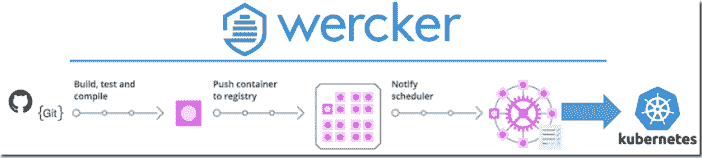

Oracle + Wercker 云服务允许我基于 Git 存储库定义应用程序。对于每个应用程序，可以定义一个或多个由一个或多个管道(步骤)组成的工作流。Git 存储库中特定分支上的提交可以触发工作流。管道可以做各种事情，包括:从源代码构建 Docker 容器作为应用程序的运行时，将 Docker 容器推送到容器注册表，并将容器从该容器注册表部署到 Kubernetes 集群。

在本文中，我将展示我为一个 Node JS 应用程序建立端到端工作流的步骤，这个应用程序是我在本地开发和测试的，然后被推送到 GitHub 上的一个存储库中。对主分支的任何提交都会触发这个端到端的工作流。它构建应用程序运行时容器，存储它并将其部署到运行在 Oracle 云基础设施(容器引擎云)上的 Kubernetes 集群。

起点是位于[https://GitHub . com/lucasjellema/event monitor-microservice-sowing-clouds-sequel 的 GitHub 存储库中的应用程序—event monitor-microservice-sowing-clouds-sequel](https://github.com/lucasjellema/eventmonitor-microservice-soaring-clouds-sequel)。我已经在 wer cker(【http://www.wercker.com/】T2)上有了一个免费账户

步骤:

# 1.向我的 Wercker 帐户添加应用程序

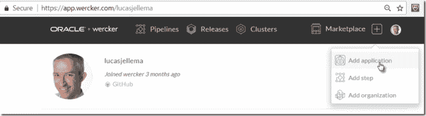

# 2.逐步完成应用程序向导:

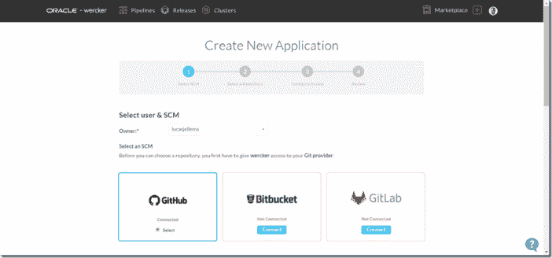

选择 GitHub(在我的例子中)。

因为我使用我的 GitHub 帐户信息登录到 Wercker，所以我得到了一个我所有仓库的列表。我选择保存我添加的应用程序代码的那个:

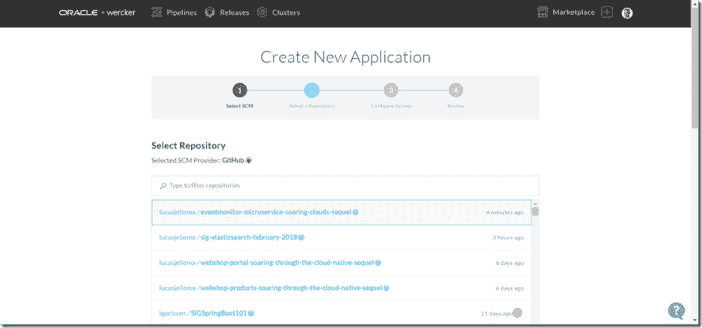

接受在没有 SSH 密钥的情况下签出代码:

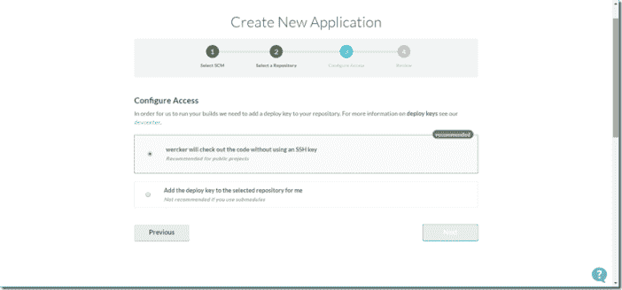

步骤 4 显示了应用程序的配置信息。按“创建”以完成应用程序的定义。

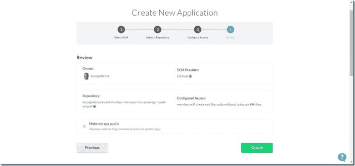

表明应用程序创建成功。

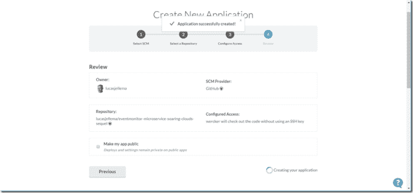

# 3.在 wercker.yml 中定义构建步骤

Wercker 执行的构建步骤由一个 wercker.yml 文件描述。该文件应该位于源存储库的根目录中。

Wercker 为构建文件的创建提供帮助。对于一种特定的语言，它可以生成一个框架 wercker.yml 文件，该文件已经引用了基本盒(一种特定于语言的运行时),并且具有构建和推送容器的步骤大纲。

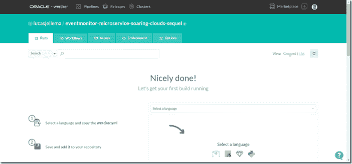

在我的例子中，我已经手动创建了 wercker.yml 文件，并且已经将它包含在我的源 repo 中。

这是文件的一部分。

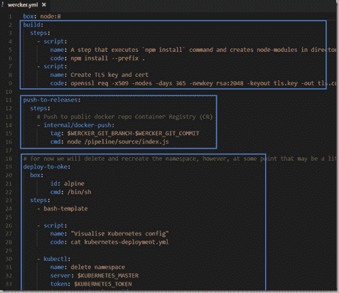

基于 box *node8* (基本容器映像)，它定义了三个构建块:构建、发布和部署。第一个是节点应用程序的标准并构建应用程序(它收集了所有节点模块)。第二个函数获取第一步得到的容器映像，并将其推送到 Wercker 容器注册中心，该注册中心带有一个由分支名称和 git 提交 id 组成的标记。第三个稍微详细一点。它从 Wercker 注册表中获取容器映像，并创建一个 Kubernetes 部署，随后将该部署推送到 Kubernetes 集群，该集群由环境变量 KUBERNETES_MASTER 和 KUBERNETES_TOKEN 指示。

# 4.定义管道和工作流

在 Wercker 控制台中，我可以为我的应用程序定义工作流。这些工作流由按特定顺序组织的管道组成。每个管道都是由前一个管道的完成触发的。第一个管道通常由源存储库中的提交事件触发。

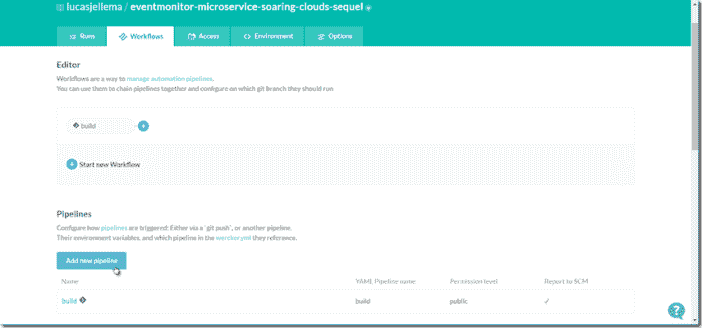

在构建我需要的工作流之前，我首先必须设置管道——对应于应用程序源 repo 中 wercker.yml 文件中的构建步骤。点击添加新管道。

定义新管道的名称(您喜欢的任何名称)和 YML 管道的名称——这个名称必须与 wercker.yml 文件中构建块的名称完全一致。

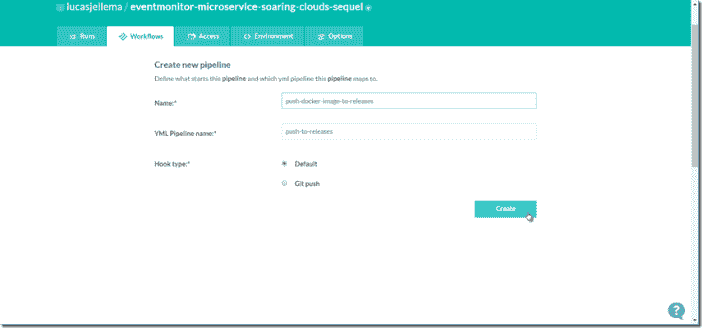

点击创建。

接下来，在 YML 文件中为“部署到 oke”步骤创建一个管道

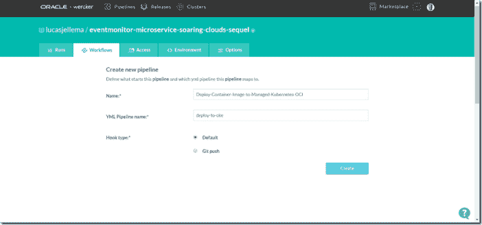

按“创建”也创建此管道。

有了所有三个可用的管道，我们就可以完成工作流了。

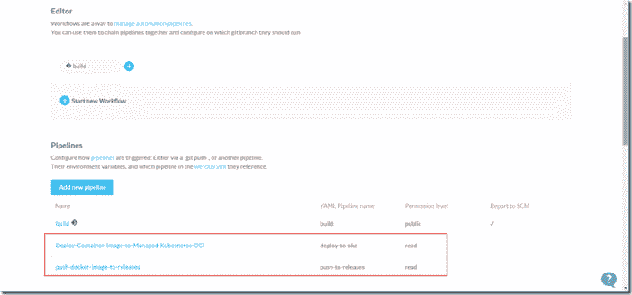

单击加号图标在工作流程中添加步骤。将此步骤与 pipeline push-docker-image-to-releases 相关联:

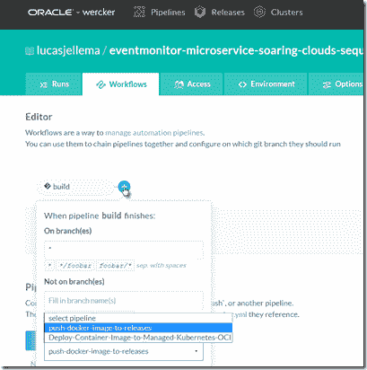

接下来，为最终管道添加一个步骤:

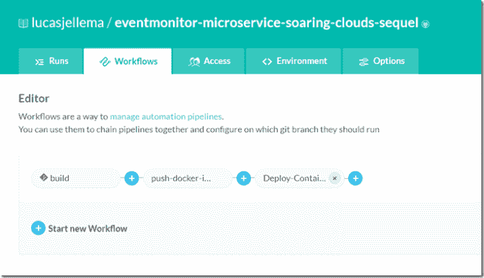

这就完成了工作流程。如果您现在将代码提交到 GitHub repo 的主分支，工作流将被触发并开始执行。然而，执行将会失败:wercker.yml 文件包含对变量的各种引用，这些变量需要在工作流成功之前为应用程序(或工作流，甚至单个管道)定义。

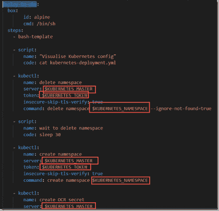

成功部署到 Kubernetes 的关键是文件 Kubernetes-deployment . yml . template 和 ingress.yml.template。这些文件定义了重要的细节，例如:

*   Wercker 容器注册表中要为其创建窗格的容器图像
*   从每个 Pod 暴露的端口
*   要在 Pod 内部发布的环境变量
*   访问应用程序端点的 URL 路径(在 ingress.yml.template 中)

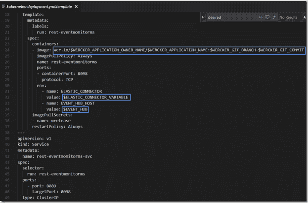

# 5.定义环境变量

单击环境选项卡。为 wercker.yml 文件中使用的所有变量设置值。其中一些定义了应该部署到的 Kubernetes 环境，另一些提供了注入到 Kubernetes Pod 中的值，并在运行时作为环境变量提供给应用程序

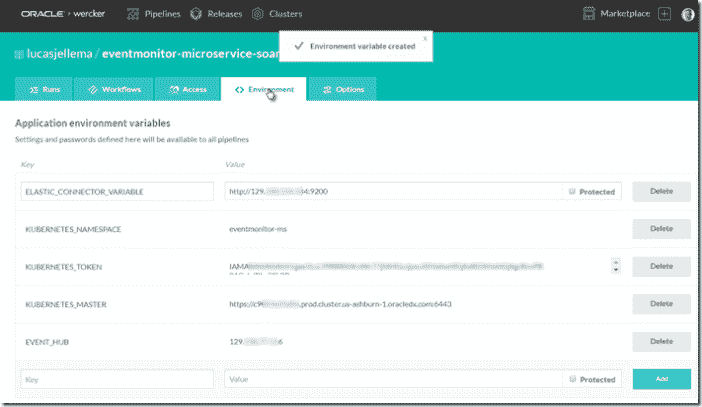

# 6.触发应用程序的构建

此时，应用程序真正做好了构建和部署的准备。触发这种情况的一种方法是向主分支提交一些东西。这里显示了另一个选项:

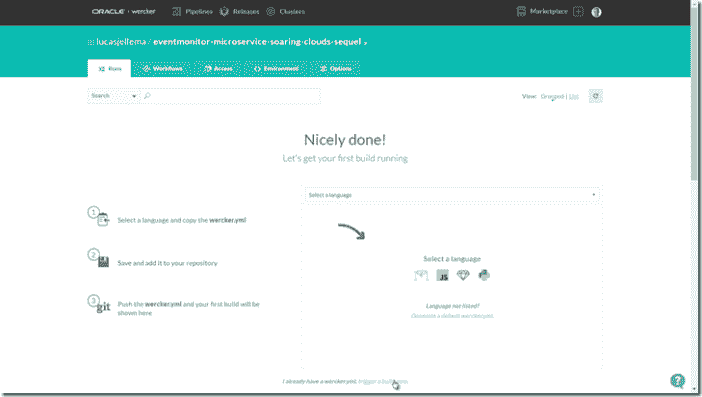

构建被触发。控制台中提供了每个步骤的输出:

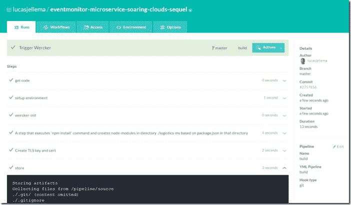

构建完成后，控制台会反映结果。

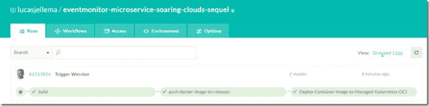

可以单击每个管道来检查所有单个步骤的详细信息，例如部署到 Kubernetes:

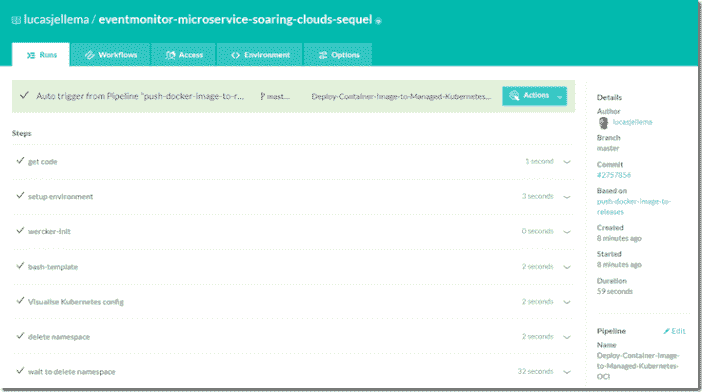

每个步骤都可以扩展到更多细节:

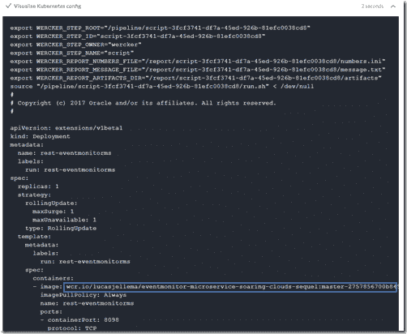

在这些细节中，我们可以找到为环境变量注入的值。

# 7.访问实时应用程序

这最后一步不是 Wercker 特有的。然而，实际使用应用程序是锦上添花。

应用程序的入口定义规定:

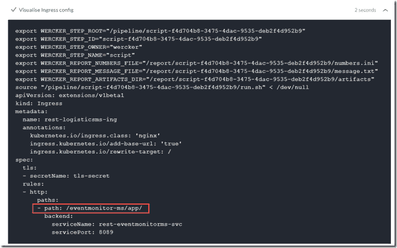

这意味着可以在 K8S 入口的端点上通过路径/eventmonitor-ms/app/访问应用程序。

给定入口服务的外部 IP 地址，我现在可以访问应用程序:

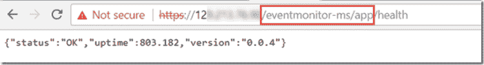

注意:/health 是应用程序支持的操作之一。

# 8.改变应用程序并实施改变——最终证明

这种管道的真正证明是改变应用程序，并通过 Git 提交将这种改变推广出去。

我做了一点小小的改动，将改动提交给 GitHub

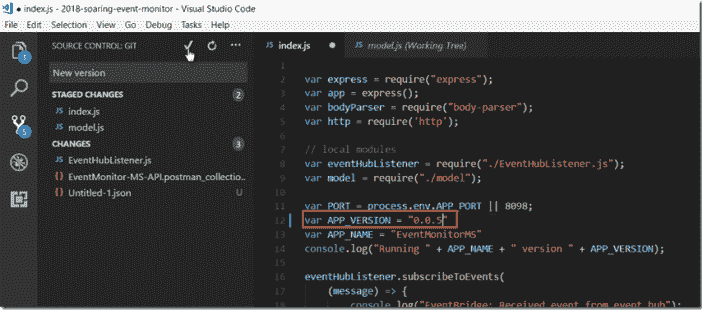

推动变革。几乎立即触发工作流程:

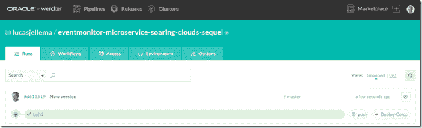

大约一分钟后，工作流程完成:

更新后的应用程序在 Kubernetes 上运行:

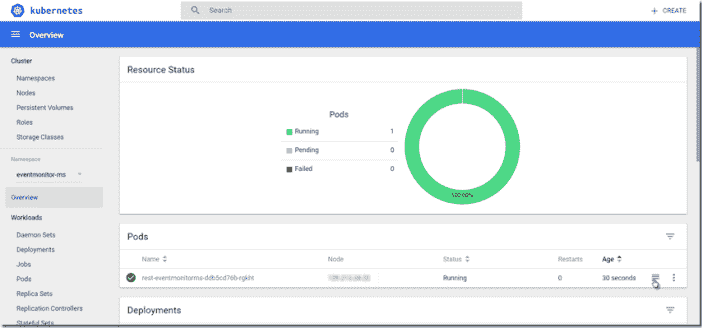

检查 Pod 中的实时日志:

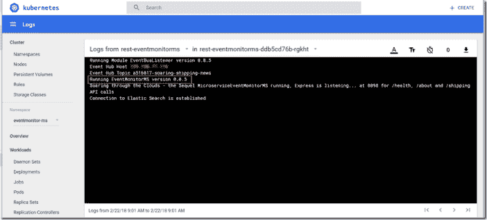

并再次访问应用程序—现在显示更新的版本:

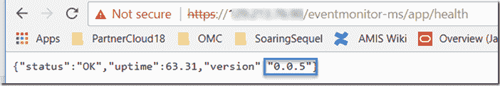

*原载于 2018 年 2 月 22 日*[*technology . amis . nl*](https://technology.amis.nl/2018/02/22/set-up-continuous-application-build-and-delivery-from-git-to-kubernetes-with-oracle-wercker/)*。*