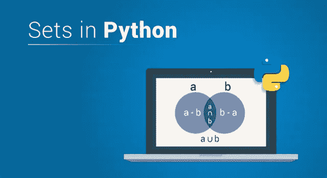

# 通过示例了解如何在 Python 中使用集合

> 原文：<https://medium.com/edureka/sets-in-python-a16b410becf4?source=collection_archive---------1----------------------->



Sets in Python — Edureka

数据存储对于当今世界的每个领域都是必不可少的。Python 提供了不同类型的数据结构来组织数据，这些数据结构是您学习 Python 之旅中必不可少的一部分。在 Python 中所有可用的数据结构中，有些是可变的，有些是不可变的。在本文中，我将讨论其中的一个，即集合。Python 中的集合是可变的、可迭代的和无序的数据结构。这里快速浏览一下所有进一步讨论的内容。

1.  Python 中的 Set 是什么？
2.  Python 中什么时候使用集合？
3.  你如何创建一个集合？
4.  集合操作

*   求集合的长度
*   访问集合元素
*   向集合中添加元素
*   移除集合元素
*   集合的并
*   集合的交集
*   集合的差异

5.什么是冷冻集？

*   如何创建冻结集？
*   访问冻结的集合元素

让我们开始吧。:-)

# Python 中的 Set 是什么？

集合基本上是一种由无序元素集合组成的数据类型。这些元素可以是任何数据类型，因为与数组不同，集合不是特定于类型的。集合是可变的，没有重复的元素副本。集合的值未被索引，因此不能对集合执行索引操作。

**举例:**

```
My_Set={1,'s',7.8} 
print(My_Set)
```

**输出:** {'s '，1，7.8}

输出显示了 My_Set 中的所有元素。

**注意:**集合作为一个整体是可变的，但是集合的元素不是可变的。

现在你已经知道了 Python 中的集合，让我们继续了解什么时候使用集合。

# Python 中什么时候使用集合？

Python 中的集合用于-

*   数据的顺序无关紧要
*   数据元素中不需要任何重复
*   你需要进行数学运算，如并、交等

现在让我们继续，看看如何用 Python 创建集合。

# 如何用 Python 创建集合？

Python 中的集合可以通过两种方式创建

*   用花括号将元素括起来
*   通过使用 set()函数

## **1。使用花括号:**

Python 中的集合是用花括号({})创建的。

***举例:***

```
My_Set={1,'s',7.8}
print(My_Set)
```

**输出:** {'s '，1，7.8}

如您所见，My_Set 已经创建完毕。

## 2.使用 set()函数

Python 中的集合可以使用 set()函数创建。

**示例:**

```
a=set({1,'b',6.9})
print(a)
```

**输出:** {1，' b '，6.9}

您也可以使用相同的函数创建空集。

**示例:**

```
Empty_Set=set() 
print(Empty_Set)
```

**输出:**设定()

上面的输出显示已经创建了一个名为 Empty_Set 的空集。

您可以向这个空集添加元素。我将在下面的主题中讨论这个问题。

# 集合操作

可以对集合执行许多操作，例如添加元素、删除元素、查找集合的长度等。要了解集合上可以使用的所有方法，可以使用 **dir()** 函数。

**举例:**

```
My_Set={1,'s',7.8} 
dir(My_Set)
```

**输出:**

['__and__ '，' __class__ '，' __contains__ '，' __delattr__ '，' __dir__ '，' __doc__ '，' __format__ '，' __ge__ '，' __getattribute__ '，' __gt__ '，' __hash__ '，' __iand__ '，' __init__ '，' __init_subclass__ '，'，' __ior__ '，'，' __isub

输出显示了可以在器械组上使用的所有方法。我将在本文中进一步演示其中的一些。

# 求集合的长度

要在 Python 中找到一个集合的长度，可以使用 len()函数。该函数将集合的名称作为参数，并返回一个等于集合中元素数量的整数值。

**举例:**

```
My_Set={1,'s',7.8} 
len(My_Set)
```

**输出:** 3

正如您在上面的输出中看到的，已经返回了 3，它等于 My_Set 中存在的元素数。现在，也可以访问这些元素，如下所示。

# 访问集合中的元素

不能使用索引号访问集合元素，因为如前所述，集合的元素没有索引。因此，当您想要访问一个集合的元素时，您可以遍历它并访问它的元素。

**举例:**

```
My_Set={1,'s',7.8}
for x in My_Set:
    print(x)
```

**输出:**

```
s
1
7.8
```

正如您在输出中看到的，顺序不同于提供给集合的元素的顺序。这是因为元素没有排序。

# 向集合中添加元素:

可以使用两个函数将元素添加到集合中，即 **add()** 和 **update()** 函数。

add()函数向现有集合添加一个元素，如下所示:

**例如:**

```
My_Set={1,'s',7.8}
My_Set.add(3)
My_Set
```

**输出:** {1，3，7.8，' s'}

当您想要向现有集合中添加多个元素时，可以使用 update()函数。

**例子:**

```
My_Set={1,'s',7.8}
My_Set.update([2,4.6,1,'r'])
My_Set
```

**输出:** {1，2，4.6，7.8，' r '，' s'}

在上面的输出中可以看到，update()函数取 4 个值的列表，除了 1 以外的所有值都添加到 My_Set 中。这是因为集合中已经存在 1，因此不能再次添加。

# 移除集合中的元素

要从集合中删除元素，您可以使用 **remove()、**、 **discard()** 和 **pop()** 函数。

remove()函数接受一个参数，该参数是要从集合中删除的项。

**例如:**

```
My_Set={1, 2, 4.6, 7.8, 'r', 's'}
My_Set.remove(2)
print(My_Set)
```

**输出:** {1，4.6，7.8，' r '，' s'}

正如您所看到的，已经使用 remove()函数从集合中删除了 2。如果您指定某个元素作为参数来移除集合中不存在的()，它将抛出一个错误。

现在，如果您想从集合中删除某个元素，并且不确定该元素是否确实存在于集合中，您可以使用 discard()函数。该函数将以要从集合中删除的元素作为参数，但是如果该元素不存在，它不会抛出错误。

```
My_Set={1, 2, 4.6, 7.8, 'r', 's'}
My_Set.discard(4.6)
My_Set.discard('i')
print(My_Set)
```

**输出:** {1，2，7.8，' r '，' s'}

上面的输出显示 4.6 已经从 My_Set 中删除，但是当我使用 My_Set.discard('i ')时，discard()没有抛出错误，即使' I '不在我的 Set 中。

pop()函数也删除集合元素，但是因为集合是无序的，所以您不知道哪个元素被删除了。

**举例:**

```
My_Set={1, 2, 4.6, 7.8, 'r', 's'}
My_Set.pop()
print(My_Set)
```

**输出:** {2，4.6，7.8，' r '，' s'}

输出显示，使用 pop()删除了一些随机元素，在本例中是 1。

现在，如果您想删除一个集合中的所有元素，您可以使用 **clear()** 方法。

**示例:**

```
My_Set={1, 2, 4.6, 7.8, 'r', 's'}
My_Set.clear()
print(My_Set)
```

**输出:**设定()

正如您在上面的输出中看到的，My_Set 是一个空集。

如果您想完全删除该集合，您可以使用 **del** 关键字。

**例如:**

```
My_Set={1, 2, 4.6, 7.8, 'r', 's'}
del My_Set
print(My_Set)
```

运行上面的代码，会因为 My_Set 被删除而抛出错误。

您还可以对集合执行各种数学运算，如并、交、差等，这将在下面讨论。

# 集合的并

集合的联合是指通过添加两个集合中存在的所有唯一元素，将两个或多个集合连接成一个集合。这可以通过两种方式实现:

*   使用管道
*   使用 union()函数

## **使用管道符号:**

可以使用|符号连接两组，如下所示:

**例子:**

```
a={1, 2, 4.6, 7.8, 'r', 's'}
b={2,5,'d','abc'}
c=a|b
print(a|b)
```

**输出:** {1，2，4.6，5，7.8，' r '，' abc '，' s '，' d'}

如您所见，在上面的输出中，集合 a 和集合 b 的并集存储在一个新的集合 c 中。

**例如:**

```
a={1, 2, 4.6, 7.8, 'r', 's'}
b={2,5,'d','abc'}
c={2,3,4,5}
d=a|b|c
print(d)
```

**输出:**

```
{1, 2, 3, 4, 4.6, 5, 7.8, 'abc', 'd', 'r', 's'}
```

要连接两个或多个集合，可以使用 union()方法，如下所示:

**例如:**

```
a={1, 2, 4.6, 7.8, 'r', 's'}
b={2,5,'d','abc'}
c={'m',23,76,4.7}
print("Set a U b = ",a.union(b))
print("Set a U b U c = ",a.union(b,c))
```

**输出:**

Set a U b = {1，2，4.6，5，7.8，' r '，' abc '，' s '，' d'}

Set a U b U c = {1，2，4.6，5，4.7，7.8，' r '，76，23，' abc '，' m '，' s '，' d'}

上面的输出表明 d 是集合 a，b 和 c 的并集。

## **集合的交集**

两个或多个集合的交集是一个新集合，它只包含那些集合中的公共元素。

这可以通过两种方式实现:

*   使用' & '符号
*   使用交集()函数

**使用'&'符号:**

您可以使用“&”符号确定两个或多个集合的交集，如下所示:

**举例:**

```
a={1, 2,5, 4.6, 7.8, 'r', 's'}
b={2,5,'d','abc'}
c={2,3,4,}
print(a&b)
print(a&b&c)
```

**输出:**

```
{2, 5}
{2}
```

上面的输出显示了集合 a、b 和 c 的并集。

**使用交集()函数:**

您可以使用 intersection()函数确定两个或多个集合的交集，如下所示:

**举例:**

```
a={1, 2,5, 4.6, 7.8, 'r', 's'}
b={2,5,'d','abc'}
c={2,3,4}
print("Set a intersection b = ",a.intersection(b))
print("Set a intersection b intersection c = ",a.intersection(b,c))
```

**输出:**

设一个交集 b = {2，5}

设置 a 交点 b 交点 c = {2}

上面的输出显示了使用交集的集合 a、b 和 c 的交集。

# 集合的差异:

集合的差产生一个新的集合，它由只存在于其中一个集合中的元素组成。这意味着除了那些集合的公共元素之外的所有元素都将被返回。

这可以通过两种方式实现:

*   使用“-”符号
*   使用 difference()函数

## 使用'-'符号:

要使用'-'符号找出两个集合的差异，您可以执行以下操作:

**示例:**

```
a={1, 2,5, 4.6, 7.8, 'r', 's'}
b={2,5,'d','abc'}
c={2,3,4}
print(a-b-c)
```

**输出:** {1，4.6，7.8，' r '，' s'}

输出由集合“a”的所有元素组成，除了那些出现在“b”和“c”中的元素。

# 使用 difference()函数:

集合的差异可以使用内置的 difference()函数来确定，如下所示:

**例如:**

```
a={1, 2,5, 4.6, 7.8, 'r', 's'}
b={2,5,'d','abc'}
c={2,3,4}
print("Set a - b = ",a.difference(b))
print("Set a - b - c = ",a.difference(b,c))
```

**输出:**

集合 a — b = {1，4.6，7.8，' r '，' s'}

集合 a — b — c = {1，4.6，7.8，' r '，' s'}

以上输出是使用 difference()函数进行差分的结果。

现在，如果你不想改变你的集合的元素，你可以使用冻结的集合，这将在下面讨论。

# 什么是冷冻集？

Python 中的冻结集是其值不可修改的集。这意味着它是不可变的，不像我之前讨论过的正常集合。冻结集有助于作为字典键值对中的一个键。

# 如何创建冻结集？

使用 frozenset()方法可以获得冻结集。该函数接受任何可迭代的项，并将其转换为不可变的。

```
a={1, 2,5, 4.6, 7.8, 'r', 's'}
b=frozenset(a)
print(b)
```

**输出:** frozenset({1，2，4.6，5，7.8，' r '，' s'})

上面的输出包含集合 b，它是集合 a 的冻结版本。

# 访问冻结集的元素

可以通过循环访问冻结集的元素，如下所示:

**例如:**

```
b=frozenset([1, 2, 4.6, 5, 7.8, 'r', 's'])
for x in b:
print(x)
```

**输出:**

1
2
4.6
5
7.8
s

上面的输出显示，使用 for 循环，冻结集合 b 的所有元素都被一个接一个地返回。

冻结的集合是不可变的，因此，您不能执行 add()、remove()、update()等操作。

希望你清楚本教程中与你分享的所有内容。这就把我们带到了关于 Python 中的集合的文章的结尾。如果你想查看更多关于人工智能、DevOps、道德黑客等市场最热门技术的文章，你可以参考 Edureka 的官方网站。

请留意本系列中的其他文章，它们将解释 Python 和数据科学的各个方面。

> 1. [Python 教程](/edureka/python-tutorial-be1b3d015745)
> 
> 2. [Python 编程语言](/edureka/python-programming-language-fc1015de7a6f)
> 
> 3. [Python 函数](/edureka/python-functions-f0cabca8c4a)
> 
> 4.[Python 中的文件处理](/edureka/file-handling-in-python-e0a6ff96ede9)
> 
> 5. [Python Numpy 教程](/edureka/python-numpy-tutorial-89fb8b642c7d)
> 
> 6. [Scikit 学习机器学习](/edureka/scikit-learn-machine-learning-7a2d92e4dd07)
> 
> 7. [Python 熊猫教程](/edureka/python-pandas-tutorial-c5055c61d12e)
> 
> 8. [Matplotlib 教程](/edureka/python-matplotlib-tutorial-15d148a7bfee)
> 
> 9. [Tkinter 教程](/edureka/tkinter-tutorial-f655d3f4c818)
> 
> 10.[请求教程](/edureka/python-requests-tutorial-30edabfa6a1c)
> 
> 11. [PyGame 教程](/edureka/pygame-tutorial-9874f7e5c0b4)
> 
> 12. [OpenCV 教程](/edureka/python-opencv-tutorial-5549bd4940e3)
> 
> 13.[用 Python 进行网页抓取](/edureka/web-scraping-with-python-d9e6506007bf)
> 
> 14. [PyCharm 教程](/edureka/pycharm-tutorial-d0ec9ce6fb60)
> 
> 15.[机器学习教程](/edureka/machine-learning-tutorial-f2883412fba1)
> 
> 16.[Python 中从头开始的线性回归算法](/edureka/linear-regression-in-python-e66f869cb6ce)
> 
> 17.[面向数据科学的 Python](/edureka/learn-python-for-data-science-1f9f407943d3)
> 
> 18.[Python 中的循环](/edureka/loops-in-python-fc5b42e2f313)
> 
> 19. [Python 正则表达式](/edureka/python-regex-regular-expression-tutorial-f2d17ffcf17e)
> 
> 20. [Python 项目](/edureka/python-projects-1f401a555ca0)
> 
> 21.[机器学习项目](/edureka/machine-learning-projects-cb0130d0606f)
> 
> 22.[Python 中的数组](/edureka/arrays-in-python-14aecabec16e)
> 
> 23. [Python 面试问题](/edureka/python-interview-questions-a22257bc309f)
> 
> 24.[Python 中的多线程](/edureka/what-is-mutithreading-19b6349dde0f)
> 
> 25. [Java vs Python](/edureka/java-vs-python-31d7433ed9d)
> 
> 26.[如何成为一名 Python 开发者？](/edureka/how-to-become-a-python-developer-462a0093f246)
> 
> 27. [Python Lambda 函数](/edureka/python-lambda-b84d68d449a0)
> 
> 28.[网飞如何使用 Python？](/edureka/how-netflix-uses-python-1e4deb2f8ca5)
> 
> 29.[Python 中的套接字编程是什么](/edureka/socket-programming-python-bbac2d423bf9)
> 
> 30. [Python 数据库连接](/edureka/python-database-connection-b4f9b301947c)
> 
> 31. [Golang vs Python](/edureka/golang-vs-python-5ac32e1ef2)
> 
> 32. [Python Seaborn 教程](/edureka/python-seaborn-tutorial-646fdddff322)
> 
> 33. [Python 职业机会](/edureka/python-career-opportunities-a2500ce158de)

*原载于 2019 年 5 月 8 日*[*https://www.edureka.co*](https://www.edureka.co/blog/sets-in-python/)*。*