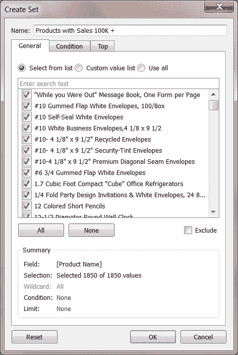
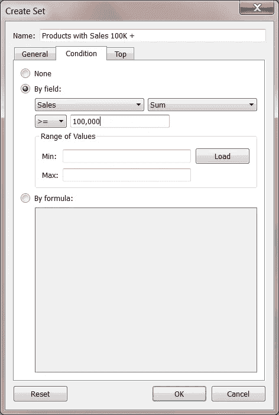
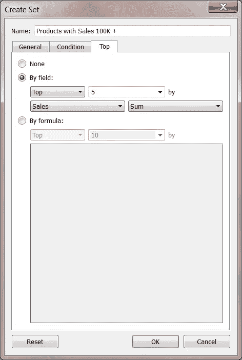
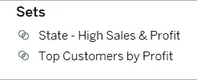
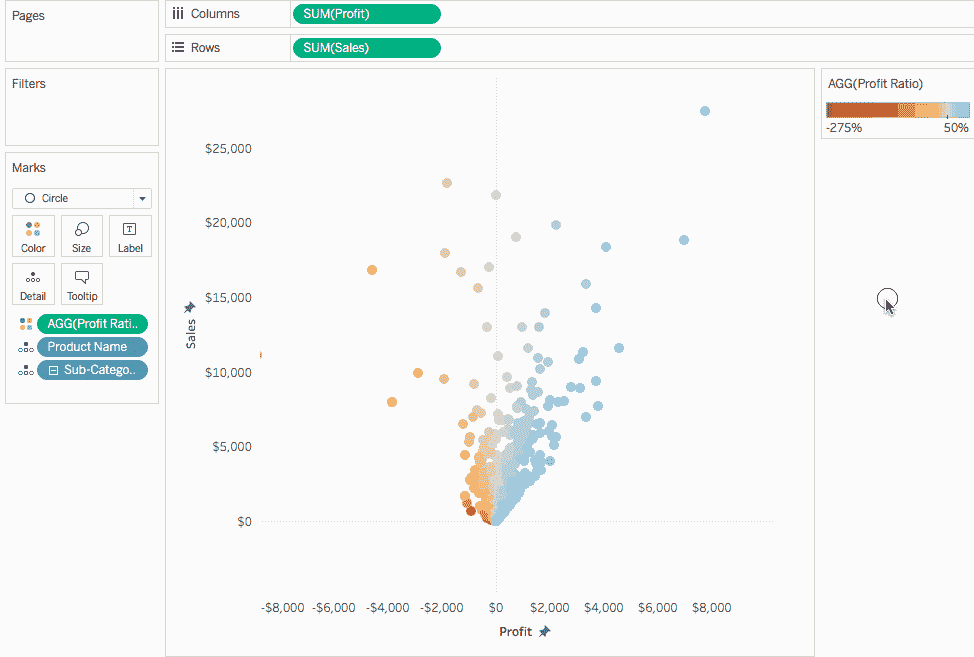
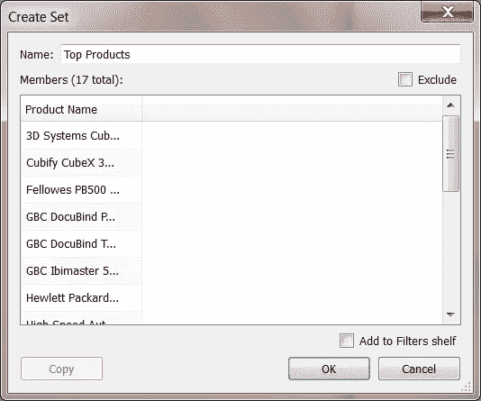

# Tableau 中的集合是什么以及如何创建它们

> 原文：<https://medium.com/edureka/sets-in-tableau-39befe9b7fa1?source=collection_archive---------3----------------------->

如果你能对你的数据进行比较和提问，那不是很好吗？ **Tableau Sets** 让您的观众直接与可视化或仪表板互动，以控制他们分析的各个方面。在视图中选择标记时，集合动作可以更改集合中的值。

写这篇文章的目的是为了给读者提供足够的信息，使他们能够很快开始使用 Tableau 集合。这里有一个大纲；

*   **什么是画面组？**
*   **如何创建画面组？**
*   如何在可视化中使用集合？
*   **设定动作**
*   **如何组合套？**
*   **Tableau 集合的应用**

现在，让我们从知道什么是 Tableau 集合开始。我们走吧。

# 什么是 Tableau 集合？

Tableau 集合是用于根据给定条件保存数据子集的自定义字段。您可以通过从列表或可视化中选择成员来实时创建集合。您也可以通过编写自定义条件或在度量中选择前/后几条记录来完成同样的操作。

# 如何创建 Tableau 集？

## 动态集合

当基础数据发生变化时，动态集的成员也会发生变化。动态集只能基于一个维度。

创建动态集

1.  导航到**数据窗格**，在**维度**下，右键单击一个字段并选择**创建>集合**。
2.  在**创建设置**对话框中，配置您的设置。您可以使用下列选项卡配置您的设置；

*   使用**常规**选项卡选择一个或多个在计算集合时要考虑的值。
*   或者，您甚至可以选择**使用所有**选项，以便即使在添加或删除新成员时也总是考虑所有成员。

*   使用**条件**选项卡定义规则，以确定集合中包含哪些成员。例如，您可以指定一个基于总销售额的条件，该条件只包括销售额超过 100，000 美元的产品。

*   ***注意*** *:设置条件的作用与过滤条件相同。*
*   使用**顶部的**选项卡来定义集合中包含的成员的限制。例如，您可以指定一个基于总销售额的限制，该限制只包括基于销售额的前 5 名产品。

*   **注意**设定限值的工作原理与过滤器限值相同。

1.  完成后，点击**确定**。
2.  新集合被添加到**数据面板**的底部，在**集合**部分下。集合图标(两个相交的气泡)表示该字段是一个集合。

## 固定集合

固定集合的成员不会改变。固定集可以基于一个维度或多个维度。

创建一个固定集合；

1.  在可视化中，选择视图中的一个或多个标记(或标题)。
2.  右击标记并选择**创建集合**。

3.在**创建集合**对话框中，输入集合的名称。

4.选择性地完成以下任一项:

*   默认情况下，该集合包括对话框中列出的成员。您可以选择排除这些成员的选项。当您排除时，该集合将包括您未选择的所有成员。
*   当您将鼠标悬停在列标题上时，单击出现的**红色 x** 图标，删除您不想考虑的任何维度。
*   当您将鼠标悬停在某行上时，单击出现的**红色 x** 图标，移除您不想包含在集合中的任何特定行。
*   如果您选择的标记代表多个尺寸，则集合中的每个成员都将是这些尺寸的组合。您可以指定分隔尺寸值的字符。为此，对于由分隔的**成员，输入您选择的字符。**
*   选择**添加到过滤器**架，以在创建后自动将器械包移动到**过滤器**架。

5.完成后，单击确定。

***注意:*** *如果您使用特定数据点创建了一个集合，您可以使用出现的工具提示向该集合添加更多数据或从中减去数据。你所要做的就是点击设置下拉图标并选择* ***添加/删除*** *选项。*

# 如何在观想中使用集合？

创建集合后，您可以在*集合*部分的*数据窗格*底部看到它。您可以像处理任何其他字段一样，将它拖到任何可视化区域中。

当您将一个集合拖到可视化的 Tableau Desktop 中时，您可以选择显示该集合的成员或将这些成员聚合到 *In/Out* 类别中。

在 ***Tableau 服务器*** 中，只能将集合成员聚合到*入/出类别*中。

您可以使用设定动作，让您的观众更好地控制他们对可视化效果的分析。

# 设置动作

集合动作采用现有集合，并基于用户在可视化中的动作更新该集合中包含的值。作为作者，您可以使用已经创建的一个或多个集合来定义集合操作的范围。

您可以使用 set actions 让您的观众直接与您的可视化效果，甚至是您的仪表板进行交互。这让他们对分析的各个方面有了更多的控制。

现在，您可以定义 set 操作以包括以下内容:

*   它所应用的源工作表。
*   运行操作的用户行为(悬停、选择或菜单)。
*   目标集合(要使用的数据源和集合)。
*   清除选择时会发生什么。

# 如何创建集合动作？

1.  转到工作表，选择**工作表>操作**。在仪表板上，选择**仪表板>动作**。
2.  在**动作**对话框中，点击**添加动作**，然后选择**更改设定值**。
3.  单击“添加操作”按钮并选择“更改设置值操作”以创建设置操作的“操作”对话框。
4.  在**添加/编辑组**动作**对话框中为动作指定一个有意义的名称。**
5.  选择源工作表或数据源。默认情况下，选择当前图纸。如果选择数据源或仪表板，您可以选择其中的单个工作表。
6.  “添加或编辑设置动作”对话框，显示设置动作的不同设置。
7.  选择用户将如何运行操作。

*   **悬停**当用户将鼠标光标悬停在视图中的标记上时运行。
*   **选择**当用户点击视图中的标记时运行。此选项适用于集合动作。
*   **当用户右击视图中的选定标记，然后选择上下文菜单上的选项时，菜单**运行。

8.指定目标集。首先，选择数据源，然后选择集合。**目标集合**列表中可用的集合由您选择的数据源以及您在工作簿中创建的与该数据源相关联的集合决定。

9.显示设置动作设置的“添加或编辑设置动作”对话框。

10.指定在视图中清除选择时发生的情况:

*   **保持设定值**使集合中的当前值保持在集合中。
*   **将所有值添加到集合**将所有可能的值添加到集合。
*   **从集合中删除所有值**从集合中删除之前选择的值。

11.点击**确定**保存更改并返回视图。

12.通过与可视化交互来测试**设置动作**。根据需要调整动作的一些设置以调整选择行为。

以下示例显示了使用集合操作的几种方式。

*   比例刷牙
*   不对称向下钻取
*   颜色缩放
*   相对日期

# 如何组合套？

组合集合允许您回答复杂的问题并比较您的数据群组。您可以合并两个集合来比较成员。组合集合时，您创建的新集合包含所有成员的组合，仅包含两个集合中的成员，或者包含一个集合中的成员，但不包含另一个集合中的成员。

***注意:*** *要合并两个集合，它们必须基于* ***相同的维度*** *(这意味着，您可以将包含顶级客户的集合与包含去年客户的另一个集合合并，但不能将顶级客户集合与顶级产品集合合并)。*

## 合并集合

*   在数据窗格中，在**集合**下，选择要合并的两个集合。
*   右键单击集合并选择**创建组合集合**。
*   在**创建集合对话框**中，输入新组合集合的名称。
*   验证在两个下拉菜单中选择了要合并的两组。
*   选择以下选项之一，了解如何组合集合:
*   **两个集合中的所有成员**启用组合集合将包含两个集合中的所有成员。
*   **两个集合中的共享成员**使组合集合只包含存在于两个集合中的成员。
*   **除共享成员外**使组合集合包含指定集合中不存在于第二个集合中的所有成员。

这些选项相当于从一个集合中减去另一个集合。例如，如果第一组包含红色、橙色和绿色弹球，第二组包含绿色和黄色弹球；除了共享成员之外，合并第一个集合将只包含红色和橙色。绿色弹珠被移除，因为它们存在于第二组中。

*   如果集合表示多个维度，可以选择指定一个字符来分隔成员。
*   完成后，点击**确定**。

# Tableau 集的应用

有许多方法可以使用集合来回答复杂的问题和比较数据组。

# 集合中的成员如何对总数做出贡献？

你可能会有各种各样的问题，关于一个集合中的成员是如何对总数做出贡献的。

例如，总销售额的百分之多少来自回头客？您可以使用器械组的**输入/输出**模式回答这些类型的问题。

# 一个集合中有多少成员存在于另一个集合中？

集合的另一个常见用途是比较数据子集或群组。

例如，您可能想知道有多少去年购买的客户今年也购买了。或者，如果客户购买了特定的产品，他们还购买了其他什么产品？您可以通过创建多个集合并组合它们来回答这些类型的问题。

# 分层集合和后代

层次集将数据过滤到选定的成员及其所有后代。它们对于多维(多维数据集)数据源是唯一的，并且在连接到 Tableau Desktop 之前在数据源中定义。

从多维数据集数据源在 Tableau 中创建集时，后代和任何层次结构都会自动包含在所选成员中。

集合是动态的有用元素，可以为报表增加交互性和灵活性。它是你武器库中的一种多功能武器，可以用于计算和可视化，同样出色！

这些都是 Tableau 中的基本功能，可以让你更好地了解 Tableau 以及与之相关的各种概念。如果你想查看更多关于人工智能、DevOps、道德黑客等市场最热门技术的文章，你可以参考 [Edureka 的官方网站。](https://www.edureka.co/blog/?utm_source=medium&utm_medium=content-link&utm_campaign=tableau-sets)

请留意这个系列中的其他文章和视频，它们会帮助你理解 Tableau 的各种概念。

> 1. [Tableau 教程](/edureka/tableau-tutorial-37d2d6a9684b)
> 
> 2.[什么是 Tableau？](/edureka/what-is-tableau-1d9f4c641601)
> 
> 3. [Tableau 功能](/edureka/tableau-functions-ce794b10e588)
> 
> 4. [Tableau 仪表盘](/edureka/tableau-dashboards-3e19dd713bc7)
> 
> 5.[Tableau 中的 LOD 表达式](/edureka/tableau-lod-2f650ca1503d)
> 
> 6. [Tableau 提示和技巧](/edureka/tableau-tips-and-tricks-a18bf8991afc)
> 
> 7.[循序渐进指导学习 Tableau 公共](/edureka/tableau-public-942228327953)
> 
> 8. [Tableau 桌面 vs Tableau 公共 vs Tableau 阅读器](/edureka/tableau-desktop-vs-tableau-public-vs-tableau-reader-fbb2a3aa0bac)
> 
> 9.[如何在 Tableau 中创建和使用参数？](/edureka/parameters-in-tableau-ac552e6b0cde-ac552e6b0cde)
> 
> 10.[表格图表](/edureka/tableau-charts-111758e2ea97)
> 
> 11.[数据混合](/edureka/tableau-lod-2f650ca1503d)
> 
> 12 .[Tableau 中的圆环图](/edureka/donut-chart-in-tableau-a2e6fadf6534)
> 
> 13.[2020 年你必须准备的 50 大 Tableau 面试问题](/edureka/tableau-interview-questions-and-answers-4f80523527d)
> 
> 14.[如何以及何时使用不同的 Tableau 图表](/edureka/tableau-charts-111758e2ea97)

*原载于 2019 年 8 月 28 日*[*https://www.edureka.co*](https://www.edureka.co/blog/sets-in-tableau/)*。*