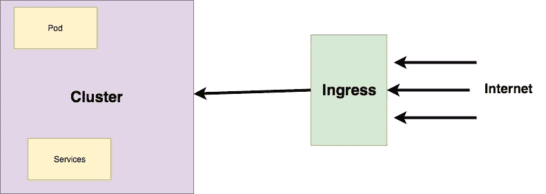
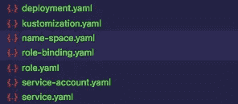
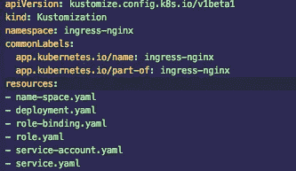
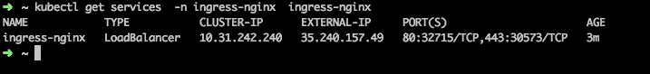
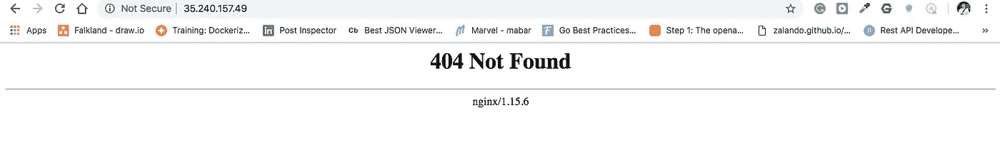

# Setting NGINX Ingress Controller di Kubernetes Google Cloud

> 原文：<https://medium.easyread.co/setting-nginx-ingress-controller-di-kubernetes-google-cloud-10f2c9c0be16?source=collection_archive---------3----------------------->

## Part 3 dari Project [Kube-Xmas Series](https://medium.com/easyread/christmas-tale-of-sofware-engineer-project-kube-xmas-9167ebca70d2)


Photo by [Jackie Tsang](https://unsplash.com/@jickii?utm_source=medium&utm_medium=referral) on [Unsplash](https://unsplash.com?utm_source=medium&utm_medium=referral)

Halooo… Kembali dengan saya di part 3 dari series ini. Series Kube-Xmas, mengisi kegabutan yang haqiqi dengan menulis.

Buat yang penasaran dengan cerita lengkapnya, asal-usul (background) kenapa cerita ini ada, mungkin kamu bisa kembali ke part 1 di artikel ini. Nah saat ini, jika kamu melihat list topiknya, kamu sekarang ada dipart 3 yaitu tentang ***Setting Ingress Controller dengan NGINX* di *Kubernetes*** .

## Apa itu Ingress?

*Ingress* itu seperti proxy. Seperti yang kita ketahui, di dalam *cluster kubernetes* terdapat *internal network* , dan *network* ini tidak dapat diakses dari luar. *Nah, Ingress* berguna untuk membuka akses ke dalam *internal network* di dalam *cluster* .

Setiap *request* dari luar *cluster* akan masuk melalui *ingress* .



Ingress

Ada banyak *Ingress Controller* yang dapat digunakan seperti:

*   [Contour](https://github.com/heptio/contour) yang berbasis [Envoy](https://www.envoyproxy.io/) dibuat oleh Heptio.
*   [Kong](https://konghq.com/) Ingress Controller oleh Kong HQ
*   [Traefik](https://github.com/containous/traefik) oleh [Containous](https://containo.us/services) .
*   Dan NGINX oleh NGINX Inc.
*   Dan masih banyak lagi :D

Namun untuk artikel ini saya akan menggunakan *NGINX* sebagai *ingress controller* di *kubernetes cluster* saya.

# Install Nginx Ingress Controller

Sebelumnya, saya menemukan tutorial *ingress* menggunakan Helm [disini](https://cloud.google.com/community/tutorials/nginx-ingress-gke) namun entah kenapa, saya mengalami kesulitan ketika menggunakan *custom domain* pada pod saya, dalam kasus ini, cara yang dibuat tidak sesuai untuk kasus yang ingin saya buat.

Sehingga, saya men- *deploy* NGINX saya secara manual di cluster saya dengan menggunakan *config* yang telah disediakan kubernetes di repository ini [https://github.com/kubernetes/ingress-nginx](https://github.com/kubernetes/ingress-nginx)

Saya hanya ikuti sesuai perintah documentasi yang dilakukan direpo tersebut.

## **NOTES: Update 14 Juni 2019: Postingan berikut tidak bisa dilanjutkan karena ada perubahan di repository** [github.com/kubernetes/ingress-nginx](https://github.com/kubernetes/ingress-nginx) . Untuk itu, saya melakukan update dan perubahan dihalaman bawah di seksi “ [UPDATE](#76c6) ”

**Steps 1: Apply** [**mandatory.yaml**](https://github.com/kubernetes/ingress-nginx/blob/master/deploy/mandatory.yaml)Step pertama, saya meng- *apply* mandatory.yaml yang ada direpo tersebut di folder deploy.

```
$ kubectl apply -f [https://raw.githubusercontent.com/kubernetes/ingress-nginx/master/deploy/mandatory.yaml](https://raw.githubusercontent.com/kubernetes/ingress-nginx/master/deploy/mandatory.yaml)
```

Namun ketika meng- *apply config deploymentnya* , saya mendapat banyak *error* kira-kira seperti ini.

```
Error from server (Forbidden): error when creating "[https://raw.githubusercontent.com/kubernetes/ingress-nginx/master/deploy/mandatory.yaml](https://raw.githubusercontent.com/kubernetes/ingress-nginx/master/deploy/mandatory.yaml)": clusterroles.rbac.authorization.k8s.io "nginx-ingress-clusterrole" is forbidden: attempt to grant extra privilegesError from server (Forbidden): error when creating "[https://raw.githubusercontent.com/kubernetes/ingress-nginx/master/deploy/mandatory.yaml](https://raw.githubusercontent.com/kubernetes/ingress-nginx/master/deploy/mandatory.yaml)": roles.rbac.authorization.k8s.io "nginx-ingress-role" is forbidden: attempt to grant extra privileges
```

Setelah mencari sana sini, saya menemukan penyebabnya ternyata karena user saya di GCP tidak secara otomatis menjadi *admin* di dalam *cluster kubernetes* tersebut.

Sehingga untuk menyelesaikan masalah ini, saya pun harus membuat *email* saya menjadi admin di cluster tersebut dengan cara:

```
$ kubectl create clusterrolebinding cluster-admin-binding --clusterrole cluster-admin --user [kube.xmas@gmail.com](mailto:kube.xmas@gmail.com)
```

Jalankan sekali lagi, seharusnya sudah beres. *Oh iya* , diharapkan jika mengikuti yang saya lakukan, tahapan ini dilakukan dengan berhati-hati.

Tahapan ini benar-benar memperhatikan *case* atau sangat *case sensitive* . Pernah pengalaman diluar *Project Kube-Xmas* . Dulu saya mencoba membuat email baru, namun ketika mendaftarkan ke gmail, saya memakai email: **KUbecontoh@gmail.** Tetapi oleh Google ketika menggunakannya di gmail dan *service* Google lainnya ini sama saja dengan **kubecontoh@gmail.com**

Namun ketika menambah user admin role binding di cluster Kubernetes, saya harus buat **KUbecontoh@gmail** agar bisa menjadi admin. Jika saya gunakan **kubecontoh@gmail.com** saya tetap mendapat error seperti diatas.

*Nah* , setelah selesai, seharusnya saya sudah membuat deployment dan konfigurasi yang dibutuhkan nginx ingress-controller di cluster saya.

```
namespace "ingress-nginx" configured
configmap "nginx-configuration" unchanged
configmap "tcp-services" unchanged
configmap "udp-services" unchanged
serviceaccount "nginx-ingress-serviceaccount" unchanged
clusterrole.rbac.authorization.k8s.io "nginx-ingress-clusterrole" created
role.rbac.authorization.k8s.io "nginx-ingress-role" created
rolebinding.rbac.authorization.k8s.io "nginx-ingress-role-nisa-binding" unchanged
clusterrolebinding.rbac.authorization.k8s.io "nginx-ingress-clusterrole-nisa-binding" configured
deployment.extensions "nginx-ingress-controller" unchanged
```

Selanjutnya adalah menambah *service nginx* agar bisa digunakan didalam *cluster* oleh siapa saja yang menggunakannya. Untuk *deployment servicenya* , saya gunakan dari repo official kubernetes-nginx ingress.

Saya melakukannya hanya dengan command dibawah ini:

```
$ kubectl apply -f [https://raw.githubusercontent.com/kubernetes/ingress-nginx/master/deploy/provider/cloud-generic.yaml](https://raw.githubusercontent.com/kubernetes/ingress-nginx/master/deploy/provider/cloud-generic.yaml)
```

**Step diatas sudah tidak valid tetapi bisa sebagai bahan referensi jika menemukan error yang sama.**

# Updates: 14 Juni 2019

Berhubungan karena terdapat perubahan pada [github.com/kubernetes/ingress-nginx](https://github.com/kubernetes/ingress-nginx) maka terdapat beberapa perubahan langkah. Sehingga step yang saya sebut diatas tidak berlaku lagi, namun bisa dibaca untuk menambah pengetahuan terkait issue error dsb.

Nah, perubahan yang terjadi pada repo [github.com/kubernetes/ingress-nginx](https://github.com/kubernetes/ingress-nginx) , adalah diperkenalkannya fitur “ [kustomization](https://kustomize.io/) ”. Sehingga, yang sebelumnya semua konfigurasi deployment dimuat dalam satu file, dengan fitur kustomization, konfigurasi tersebut dipisah kedalam beberapa file, dan dibundle kedalam satu file **kustomization.yaml** .

Jadi, untuk membuat Ingress Nginx di Kubernetes dengan menggunakan repo ini [github.com/kubernetes/ingress-nginx](https://github.com/kubernetes/ingress-nginx) , adalah.

**Steps 1: Download semua konfigurasi dan kustomization kedalam satu folder.**

Silahkan download semua file yang ada disini: [https://github.com/kubernetes/ingress-nginx/tree/master/deploy/cloud-generic](https://github.com/kubernetes/ingress-nginx/tree/master/deploy/cloud-generic)

Buat kedalam satu folder di lokal anda.



**Steps 2: Apply Kustomization**

Nah, selanjutnya anda tinggal apply file tersebut.

```
$ kubectl apply -k .
```

Jika sebelumnya kita menggunakan `-f` , maka pada kustomization, kita menggunakan `-k` .

Pada `kubectl` command, `-f` merefer ke `file` , `-k` merefer ke pada `kustomization` . Selain itu, kita juga harus memastikan target folder file kustomization tersebut berada. Pada command diatas, saya buat dot/titik(.) mengacu pada *current directory* .

Namun, saat mencoba ini, saya mendapat error seperti ini:

```
Error from server (NotFound): error when creating ".": namespaces "ingress-nginx" not found
Error from server (NotFound): error when creating ".": namespaces "ingress-nginx" not found
Error from server (NotFound): error when creating ".": namespaces "ingress-nginx" not found
Error from server (NotFound): error when creating ".": namespaces "ingress-nginx" not found
Error from server (NotFound): error when creating ".": namespaces "ingress-nginx" not found
Error from server (NotFound): error when creating ".": namespaces "ingress-nginx" not found
Error from server (NotFound): error when creating ".": namespaces "ingress-nginx" not found
Error from server (NotFound): error when creating ".": namespaces "ingress-nginx" not found
```

Error ini terjadi karena *cluster* kita belum memiliki namespace “ingress-nginx”. Solusinya bisa kamu lakukan dengan command berikut.

```
$ kubectl create namespace ingress-nginx
```

Atau bisa juga dengan menggunakan kustomization. Yakni menambah satu file kustomization.

```
apiVersion: v1
kind: Namespace
metadata:
   name: ingress-nginx
```

Copy konfig diatas kedalam satu file `name-space.yaml` lalu tambahkan file tersebut ke `kustomization.yaml`



tambahi **name-space.yaml** pada file **kustomization.yaml**

Lalu, apply ulang file tersebut:

```
$ kubectl apply -k .
```

Dan log pada commnad akan terlihat seperti ini.

```
namespace/ingress-nginx created
serviceaccount/nginx-ingress-serviceaccount created
role.rbac.authorization.k8s.io/nginx-ingress-role created
rolebinding.rbac.authorization.k8s.io/nginx-ingress-role-nisa-binding created
configmap/nginx-configuration created
configmap/tcp-services created
configmap/udp-services created
service/ingress-nginx created
deployment.apps/nginx-ingress-controller created
```

Nah jika sudah selesai, kita dapat melihat apakah servicenya berjalan atau tidak dengan command:

```
$ kubectl get services  -n ingress-nginx  ingress-nginx
```



Status ingress service

Jika service berhasil dibuat, maka ketika `get services` dieksekusi, akan mengembalikan IP address yang bersifat public. IP ini dapat di-akses, namun seharusnya memberikan return status 404.

Sehingga jika kita ke browser, dan akses external IP nya: `35.240.157.49` akan memunculkan 404 NGINX sperti dibawah



Setelah ingress-controller nginx selesai dideploy

Sampai disini, Ingress controllernya sudah selesai dan aktif. Selanjutnya adalah menambahkan aplikasi yang akan menggunakan ke Ingress ini, namun topik ini akan dibahas dipart selanjutnya.

## Next

*   [**Membuat *Mock Server* dengan *Kubernetes***](https://medium.com/easyread/membuat-mock-server-dengan-openapi-3-di-kubernetes-b9963ed2ac40)

## Prev

*   [**Membuat *Kubernetes Cluster* di Google Cloud**](https://medium.com/easyread/membuat-kubernetes-cluster-di-google-cloud-ae14bee317ba)