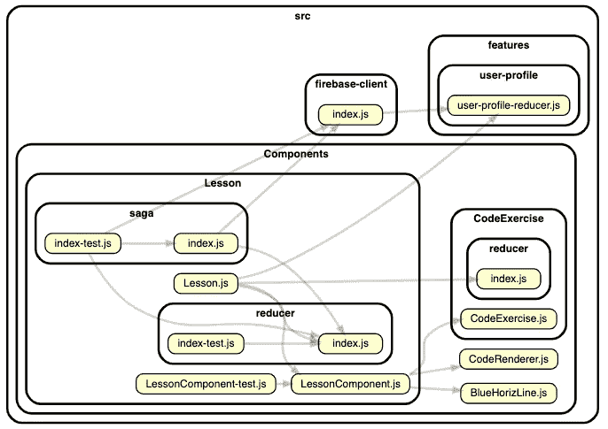

# 为 JavaScript 开发设置新的 MacBook

> 原文：<https://medium.com/javascript-scene/setting-up-a-new-macbook-for-javascript-development-289df3f8f9?source=collection_archive---------1----------------------->


我刚刚得到了一台[新 MacBook Pro 16"](https://www.amazon.com/dp/B081FV1Y57/ref=as_li_ss_tl?ie=UTF8&linkCode=ll1&tag=eejs-20&linkId=55d1da17be5bdb492b47c87fcefbee4c&language=en_US) ，我需要为 JavaScript 软件开发做准备。当你得到一份新工作时，或者当你只是需要为副业升级你的个人机器时，这种情况经常发生。

> **注:**最后更新时间:2020 年 2 月

## **1。安装** [**勇者**](https://brave.com/) **和/或**[**Chrome**](https://www.google.com/chrome/)**。**

Chrome 提供了很好的开发工具，但在保护你的隐私方面不是最好的。Brave 是一个更能保护隐私的选择，它也分享了 Chrome 令人敬畏的开发工具:

> “在默认设置下‘开箱即用’的 Brave 是迄今为止所研究的最私密的浏览器。我们没有发现任何使用标识符来跟踪 IP 地址的情况，也没有共享后端服务器访问的网页的详细信息。”—“网络浏览器隐私:浏览器给家里打电话时会说些什么？”(道格拉斯·j·利斯，2020 年)

## **2。安装 nvm、Node 和 XCode 开发工具**

节点是 JavaScript 开发人员工作流程中不可或缺的一部分。您将需要它和 npm(包含在内)一起安装软件包、运行许多脚本、运行测试套件等。nvm 是节点的版本管理器。Mac OS 上常用的开发者工具(包括 Git)需要 XCode Developer Tools。

Node 有一个官方的 mac 安装程序，但是你希望能够轻松地升级或切换节点版本，所以使用`nvm`来代替。

运行以下命令来设置您的`.zshrc`(如果您跳过这一步，nvm 安装程序将无法完成):

```
touch ~/.zshrc
```

访问 [nvm GitHub 页面](https://github.com/nvm-sh/nvm#install--update-script)并将安装/更新脚本的 curl 版本复制/粘贴到终端。

若要查找“终端”,请点按“启动板”图标，在搜索栏中键入“终端”,然后将“终端”拖到 dock 中。你会经常用到它。默认情况下，运行 Catalina (10.15.x+)的 MacBooks 使用 zsh，但是 zsh 可以很好地处理大多数 Bash 脚本。

**NVM 安装程序脚本**
启动终端并将 curl 脚本粘贴到其中。它应该是这样的(但是使用 GitHub 的版本，因为它可能会更新):

```
curl -o- https://raw.githubusercontent.com/nvm-sh/nvm/v0.35.2/install.sh | bash
```

第一次在新的 MacBook 上运行这个程序时，你会得到这样一个错误:

```
xcode-select: note: no developer tools were found at '/Applications/Xcode.app', requesting install. Choose an option in the dialog to download the command line developer tools.
```

但这很好，因为它应该会自动问你是否要安装 XCode 开发者工具来获取 Git。去做吧，现在。

然后再次运行 curl 命令，然后关闭并重新启动终端。

要安装最新的 LTS 版本(长期稳定):

```
nvm ls-remote
```

这将列出所有可用的版本。你想要标有“最新 LTS: <name>”的那个:</name>


然后:

```
nvm install v12.16.1 # Replace v12.16.1 with your latest LTS
```

> **注意:**你可能很想安装最新版本的 Node，但是很多软件包都不能用它。小心出血的边缘。

Node 自带 npm，但不太可能是最新版本。让我们抓住这个机会:

```
npm install -g npm
```

现在你可以安装 JavaScript 模块了。

## 设置您的 GitHub 密钥

[为 GitHub 访问生成一个新的 SSH 密钥](https://help.github.com/en/enterprise/2.18/user/github/authenticating-to-github/adding-a-new-ssh-key-to-your-github-account)。对于从 GitHub 克隆、推送和拉取数据，SSH 是 HTTPS 访问的更安全、更方便的替代方案。

## 设置您的提示

通常，如果我正在使用终端，那是因为我正在编写代码，所以我喜欢使用命令提示符，它能让我一目了然地了解当前的 git 状态。

可以从安装 [Oh My Zsh](https://github.com/ohmyzsh/ohmyzsh) 开始。这是一个管理 zsh 配置的框架。下一步就靠它了。按照链接网站上的说明进行操作。这将清除您的 nvm 设置，但不要担心。向上滚动并再次运行 nvm 安装程序脚本，您就可以重新开始工作了。

**安装主题。**正好有 179，769，313，486，231，570 个主题乱列。让我为你节省一些时间。 [PowerLevel10k 好像还不错](https://github.com/romkatv/powerlevel10k)。看起来是这样的:


当你安装它的时候，它会问你一些问题。你可能想安装 Power Level 字体，但这对于这个主题是可选的。这次我跳过了，看看吧！没有小狗受到伤害。🐶🎉

## 安装和配置 VS 代码

[**官网下载 VS 代码**](https://code.visualstudio.com/) 。VS Code 是最受欢迎的 JavaScript IDE，这是有充分理由的。它的集成类型推理(由 TypeScript 推理引擎提供支持)是同类中最好的，可以处理标准的 JavaScript 文件。

打开 zip 文件后，将 VS 代码拖到 dock 中，尽管您可能会经常从终端在项目目录中键入`code .`来打开它(至少我是这么做的)。

**启用终端** `**code**` **命令:**打开 VS 代码，键入 CMD+SHIFT+P，键入“shell 命令”，选择“在 PATH 中安装‘代码’命令”。


Extension Icon

**安装 ESLint 扩展:**

ESLint 自动检查您的源代码中常见的错误和风格问题，帮助您减少 bug，并与您的开发团队保持一致。

点击侧边栏中的扩展图标，然后点击 ESLint 旁边的绿色“安装”按钮。

现在，您将希望设置 VS 代码来自动修复它可以在文件保存时自动修复的任何问题。

**导航至设置(首选项- >设置):**

如果你得到一个“友好的”用户界面，有一大堆参数，确保“用户”标签被选中，然后使用屏幕右上角的“打开设置(JSON)”图标切换到代码视图(悬停几秒钟以查看标签)。

将此添加到您的设置 JSON:

```
"editor.codeActionsOnSave": {
       "source.fixAll.eslint": true
}
```

我写了另一篇关于[配置 ESLint 和 Prettier 在你的项目中一起工作](/javascript-scene/streamline-code-reviews-with-eslint-prettier-6fb817a6b51d)的文章。这需要为每个项目进行配置。

## 设置您的标签大小

JavaScript 惯例是使用空格，而不是制表符，并且使用两个空格而不是四个空格来表示制表符的大小。在编辑器设置中设定这些偏好设置:

```
"editor.tabSize": 2
```

## 安装自制软件

安装[自制软件](https://brew.sh/)的时间。家酿是一个通用 Unix 工具的软件包管理器。一旦安装好了，拿一些好的工具:

```
brew install wget
brew install graphviz
```

wget 是 curl 的常见替代。一些安装程序说明要求您使用 wget，并且不提供替代的 curl 命令。一些脚本隐含地假设 wget 可用，如果不可用，就会失败。与 curl 相比，它的主要优点/缺点是，默认情况下，它将请求的文件保存在本地目录中。

那个 graphviz 是什么？当然，它可以让你生成图形！看看这个:

```
npm i -g dependency-cruiser
```

现在你可以这样做:

```
depcruise --exclude "^node_modules" --output-type dot src | dot -T svg > dependencygraph.svg
```

它将使用 graphviz 来构建项目的依赖图。

不过，对于您的项目来说，这可能太详细了。这里有一个命令，它将只为一个视图生成依赖图。我正在为 EricElliottJS.com 的来源运行它:

```
depcruise --max-depth 2 --exclude "^(node_modules)" --output-type dot src/Components | dot -T svg > dependencygraph.svg
```

它产生:



Dependency Graph for the Lesson Module for EricElliottJS.com

暂时就这样了。你应该准备好摇滚了！

# 后续步骤

现在你已经设置好了你的开发环境，前往[EricElliottJS.com](https://ericelliottjs.com)并学习如何使用它来制造一些魔法。

***艾里克·艾略特*** *著有《书籍》、* [*【排版软件】*](https://leanpub.com/composingsoftware)*[*【编程 JavaScript 应用】*](http://pjabook.com/) *。作为*[*【EricElliottJS.com】*](https://ericelliottjs.com/)*和*[*devanywhere . io*](https://devanywhere.io/)*的联合创始人，他教授开发者必备的软件开发技能。他为加密项目组建开发团队并提供建议，为 Adobe Systems、* ***、Zumba Fitness、*** ***【华尔街日报、*******【ESPN、*******BBC、*** *以及包括* ***Usher、弗兰克·奥申、金属乐队在内的顶级录音******

**他和世界上最美丽的女人享受着与世隔绝的生活方式。**