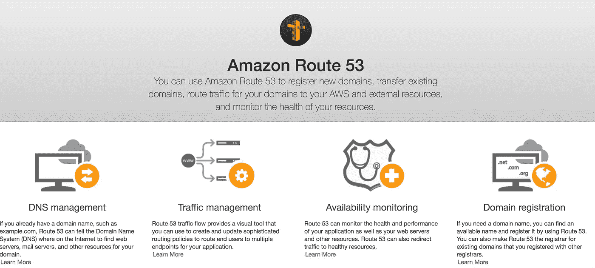
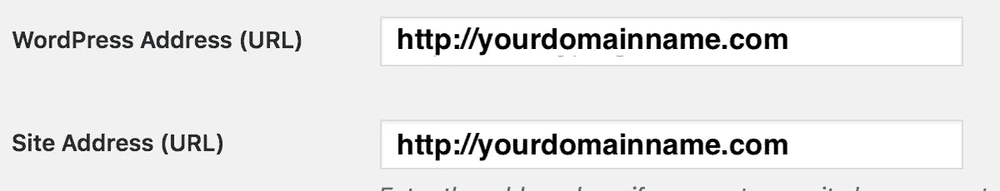

# 使用弹性豆茎在 15 分钟内设置 GoDaddy 域和 AWS Route 53

> 原文：<https://medium.com/quick-code/setting-up-godaddy-domain-and-aws-route-53-with-elastic-beanstalk-within-15-minutes-a0276ff4ea6e?source=collection_archive---------0----------------------->

这个**教程**将教你如何将你的 **GoDaddy 域**转发到你的 **AWS Route 53** 并配置你的 **WordPress** 环境。

The 10 steps in a DNS lookup

# **简介:**

**简介:**

## 什么是 DNS？

> 域名系统是一个分层的、分散的命名系统，用于连接到互联网或专用网络的计算机、服务或其他资源。它将各种信息与分配给每个参与实体的域名相关联。(维基)

## 亚马逊 53 号公路

Amazon Route 53

亚马逊 53 号公路

# 是时候把手弄脏了:)

## 设置 53 号公路

1.**创建托管区域**

Create Hosted Zone

在红色区域输入您的域名。

Create Hosted Zone Domain Name

完成后，您将在页面上看到一些配置。将 NS 值保存在某个地方，我们在设置 GoDaddy 时会用到它。[学习 AWS](https://blog.coursesity.com/best-aws-certifications/) 的最有说服力的理由之一是定价选项。

> ns-1325.awsdns-37.org ns-287.awsdns-35.com。ns-1715.awsdns-22.co.uk。ns-658.awsdns-18.net。

Route 53 Nameservers

**2。创建记录集:**将您的域名与您的弹性 Beanstalk 环境相匹配

例如，我们将有 yourdomainname.com 和 www.yourdomainname.com

2.1 点击**是**附近的**别名**

2.2 从**别名目标**中选择**弹性豆茎环境**

Link Alias Target to Elastic Beanstalk environments

2.3 按照上述步骤创建 WWW 域。

WWW domain

## 正在设置 GoDaddy 域

将默认的 GoDaddy 名称服务器更改为 Route 53 名称服务器。

从 **GoDaddy DNS 管理中查找您的**域名服务器配置**。**

Nameservers Configuration from GoDaddy DNS Management

你记得我们刚刚保存了 53 号公路的 NS 值吗？复制到 GoDaddy 并保存。

Godaddy Nameservers

当名称服务器改变时，您可以预期传播时间少于**5 分钟**。DNS 在互联网上生效需要时间。

精彩！喝完之前先准备一杯完美的咖啡吧:)

## 最后，设置 WordPress 地址 URL

如果你的应用没有使用 WordPress，这是一个可选步骤。

导航:设置->常规

在 WordPress 地址(URL)和网站地址(URL)中输入你的 domainname.com

太棒了，你做得很好！！

**请点击👏按钮下面几下，以示支持！⬇⬇**