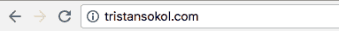
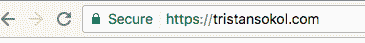

# 使用 Let's Encrypt 和 Google App Engine 为您的电子商务网站设置 HTTPS。

> 原文：<https://medium.com/square-corner-blog/setting-up-https-for-your-e-commerce-website-with-lets-encrypt-and-google-app-engine-465a866790b5?source=collection_archive---------0----------------------->

## *HTTPS 是确保客户网络信息安全的重要组成部分——这里有一个快速教程，教你如何在 App Engine 网站上设置 HTTPS，以使用我们的电子商务 API。*

网络安全非常重要，尤其是当有人信任你并向你提供他们的支付卡信息时。尽管 Square 为您处理 PCI 合规性的复杂部分，但我们确实要求您的电子商务表单从 HTTPS 域提供服务。网上有很多关于为什么你的网站应该使用 HTTPS 的文献(包括谷歌的[这篇很棒的文章)，所以让我们来关注如何为你的网站获得一个证书。我用我的个人网站来演示一下。](https://developers.google.com/web/fundamentals/security/encrypt-in-transit/why-https)



No HTTPS here 😔 …yet

# 步骤 0:做好准备。

本演练假设您具备以下条件:

*   你的电子商务网站的域名
*   您托管网站的网络服务器或托管服务
*   安装在您电脑上的 OpenSSL

我将为我的个人网站[www.tristansokol.com](http://www.tristansokol.com)启用 HTTPS。我使用谷歌应用引擎为我的网站服务，并将使用[让我们加密](https://letsencrypt.org/)——一个免费的、自动化的、开放的认证机构。

如果你使用不同的虚拟主机，最好看看你的虚拟主机是否支持直接加密。如果是这样的话，为你的网站启用它应该是相当容易的。你可以在这里看到支持的虚拟主机提供商列表:[https://community . lets encrypt . org/t/we B- hosting-who-support-lets-encrypt/6920](https://community.letsencrypt.org/t/web-hosting-who-support-lets-encrypt/6920)。

还有各种各样的其他证书颁发机构可以为您付费提供类似或更高级的服务。

# 步骤 1:生成您的私钥和 CSR(证书签名请求)

首先，使用 OpenSSL 生成一个新的私钥和证书签名请求。

```
$ openssl req -newkey rsa:2048 -keyout tristansokol.com.private.key -nodes -sha512 -subj "/CN=tristansokol.com" -reqexts SAN -out tristansokol.com.csr.der -outform der -config <(cat /System/Library/OpenSSL/openssl.cnf <(printf "[SAN]\nsubjectAltName=DNS:tristansokol.com,DNS:www.tristansokol.com"))
```

这个命令相当长，所以让我们把它分解一下:

*   `openssl req`是证书请求生成实用程序的命令。
*   `-newkey`标志告诉 openssl 我们想要创建一个新的请求和一个新的私钥。它需要一个关于使用哪种算法和生成多大的密钥的争论。在本例中，我指定了一个 2048 位的 RSA 密钥。
*   `-keyout`指定新私钥的写入位置。请记住，我建议您更改文件名以匹配您的网站(而不是我的网站)。
*   `-nodes`不是“节点”这个词。它指定“no DES”并表示我不想加密新的私钥。
*   `-sha512`是我选中的消息摘要来签署我们的请求。
*   `-subj`设置新请求的主题名称。在这种情况下，我想签署一个域名，所以我将使用我的网站的通用名称(CN)，因此`“/CN=tristansokol.com”` 。
*   `-reqexts`是使用证书请求扩展的标志。在这种情况下，我将对裸域使用主题别名(SAN ),而 www。我的网站的版本。
*   `-out`指定要写入证书请求的文件名。
*   `-outform`让您选择`der`或`pem`输出格式。
*   `-config`用来指定我们的配置文件。为了使它更简洁，我在这个文件的创建中内嵌了关于我们的网站使用的替代名称的选项。同样，请确保将这些更改为您自己的域。

你可以在官方手册页上阅读更多关于`openssl req`的选项:[https://www.openssl.org/docs/man1.1.0/apps/req.html](https://www.openssl.org/docs/man1.1.0/apps/req.html)

现在，您的工作目录中应该有两个新文件了(同样，您的将使用您的域名，而不是我的):

*   `tristansokol.com.csr.der`
*   `tristansokol.com.private.key`

# 第二步。运行 certbot 命令

Certbot (以前的 Let's Encrypt 客户端)是一个从 Let's Encrypt 获取证书的工具。我在 Mac 上，所以我将使用`brew install certbot`进行安装。https://certbot.eff.org 应该对你的系统有说明。

下次运行:

```
sudo certbot certonly -a manual --server [https://acme-v01.api.letsencrypt.org/directory](https://acme-v01.api.letsencrypt.org/directory) --csr tristansokol.com.csr.der
```

*   `-a`不带参数指定我们将不使用验证器插件。
*   `manual`表示我正在我的 web 服务器之外的机器上生成我的证书，并且我将自己进行域验证。
*   `--server` 指定 ACME 目录资源。
*   并且`--csr`指定应该使用的证书签名请求(CSR)。在这种情况下，我将使用我在步骤 1 中创建的。

Certbot 现在将带您完成一个引导式演练，以设置您的证书。最终，我走到了下面一步:

```
Make sure your web server displays the following content at [http://tristansokol.com/.well-known/acme-challenge/xxx](http://tristansokol.com/.well-known/acme-challenge/xxx) before continuing:
```

这是一个质询(url)和响应对，将用于证明您拥有该域。这意味着我需要向这个站点添加一个额外的请求处理程序来应对这些挑战。幸运的是，使用 App Engine 相当简单。

# 第三步:迎接挑战

为了在我的网站的挑战 URL 上提供挑战响应，我需要做一些事情。首先，我用我应该提供的响应创建了一个新的文本文件，并将其保存为 ACME-response.txt。

```
#app.yaml
#SSL challenge and response
- url: /.well-known/acme-challenge/xxx
  static_files: ACME-response.txt
  upload: ACME-response.txt
```

这告诉 App Engine 在`/.well-known/acme-challenge/x(my challenge URL)`用我的响应内容来响应请求。然后，我使用带有`dev_appserver.py app.yaml`的[本地开发服务器](https://cloud.google.com/appengine/docs/standard/php/tools/using-local-server#PHP_Running_the_development_web_server)，在使用`gcloud app deploy`进行部署之前，再次检查一切是否正常。

对 www 重复这些步骤后。我的领域的版本，我可以继续。

# 第二步。(续)使用 Certbot 结束

随着我的挑战响应准备就绪，Certbot 生成了一个证书和两个证书链。

*   `0000_cert.pem`
*   `0000_chain.pem`
*   `0001_chain.pem`

# 步骤 4:将我的证书添加到应用引擎

现在我已经验证并生成了所有东西，我可以转到我的 app engine 项目的[证书管理页面](https://console.developers.google.com/project/_/appengine/settings/certificates)并点击**上传新证书**。对于 *PEM 编码的 X.509 公钥证书*，我将上传我刚刚生成的`0001_chain.pem`文件。对于*未加密的 PEM 编码的 RSA 私有密钥*，我上传了第 1 步中的`tristansokol.com.private.key`文件。

然后我为我的裸机和 www 启用了它。域。我还编辑了我的 app.yaml 文件，为页面的请求处理程序添加了`secure always`。现在，当我导航到我的个人网站时，用户将被自动重定向到 https 版本，激发访问者对我的网站的信任，并保护我的电子商务客户的安全。



Wow!

要了解更多关于 Square 电子商务平台的信息，请查看[square.com/developer](https://squareup.com/developers)。