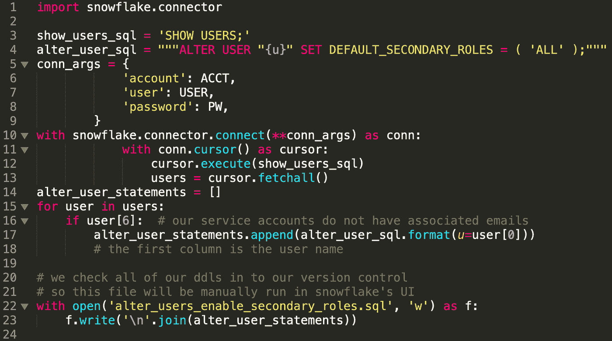

# 使用 Tableau 设置雪花辅助角色

> 原文：<https://medium.com/pinterest-engineering/setting-up-snowflake-secondary-roles-with-tableau-8efda19088b0?source=collection_archive---------0----------------------->

杰西卡拉尔森|数据工程师

在 Pinterest，我们在企业分析中大量使用 Tableau。为了保护敏感数据对相应业务部门的访问，我们将企业数据移动到了雪花数据仓库中。使用雪花作为数据平台，我们可以创建和管理强大的基于角色的访问控制(RBAC)。由于我们希望使用雪花作为 RBAC 的真理之源，因此我们使用 OAuth 通过安全集成将 Tableau 连接到雪花。

为了在每次使用期间检查授权，我们只允许来自 Tableau 的实时连接。实时连接意味着每次用户查看控制面板时，都会使用其凭据来查询雪花。如果该用户有权访问数据集，则可以在控制面板上查看数据；如果它们不存在，仪表板将不会填充，并且创建连接的尝试可能会引发错误。

# 在 Tableau 中提取连接

可以将 Tableau 配置为使用提取连接，即单个用户或服务帐户用户在连接中嵌入其凭据。这将允许用户有意或无意地规避 RBAC 系统。因为我们要强制执行权限，所以我们有不允许的提取连接配置。由于我们花费了时间和资源在雪花中设置权限，因此我们希望利用在那里配置的访问控制，而不是在其他地方重复它，并且必须管理和维护两个或多个系统。

一旦不允许提取连接，有两种方法可以在 Tableau 控制面板中配置到雪花的连接:硬编码角色或使用默认角色。

# 连接 Tableau 和雪花

对角色进行硬编码时，将提示每个查看此控制面板的用户使用该角色向雪花进行身份验证，并且控制面板中只能使用该角色可见的数据。这样做的限制之一是，由于每个控制面板只能硬编码一个角色，因此必须向所有需要访问权限的用户授予相同的角色。这意味着我们可能需要为所有角色组合创建一个角色。

Figure 1: Connecting With Specified Roles

使用默认角色配置连接时，用户可以使用不同的角色查看控制面板，只要该角色能够访问基础数据。但是，这需要仔细设置所有用户的默认角色，这可能意味着支持多个团队的用户将需要创建特殊角色。仅使用这种方法就需要我们的平台团队做大量的工作。

Figure 2: Connecting With Default Roles

为了解决使用不同角色连接到雪花的复杂性，我们开始使用雪花的新功能:辅助角色。辅助角色允许用户访问其任何角色都可以访问的所有数据。这几乎就像同时承担所有的角色。虽然这对于写入数据或执行管理操作并不理想，但它确实是处理读访问的一个很好的方法。要开始使用次要角色，我们需要为我们的安全集成和所有人类用户启用次要角色(下面将对此进行详细介绍)。我们没有考虑上面提到的复杂性，而是简单地使用默认角色创建到雪花的连接，并允许辅助角色处理其余的连接。如果用户有权访问基础数据集，则数据将填充到控制面板上。如果他们无权访问数据，控制面板将保持空白。除此之外，次要角色还为我们带来了其他好处:分析师现在不必担心谁可以访问哪些角色以及哪些数据，而且用户现在只能在他们的用户设置中看到与雪花的一个连接。

Figure 3: Combining Default Roles and Secondary Roles

# 设置辅助角色

**为组织**中的所有*人类*用户启用次要角色。由于我们仅利用辅助角色来实现读访问，因此我们仅将为人类用户而不是服务帐户打开该选项。我们的服务帐户没有关联的电子邮件，因此我们将排除所有没有电子邮件的帐户。下面是一个可用于执行此操作的 python 代码段:

这将生成可以通过 python 连接器运行的 SQL(如果这符合您的业务实践)，或者可以手动运行。若要移除次要角色，您只需将陈述式变更为:

**启用安全集成**中使用的辅助角色，特别是像 Tableau 这样支持最终用户的集成。

# 在 Tableau 中利用次要角色

为了利用 Tableau 中的辅助角色，我们将在所有 Tableau 实时仪表板中使用默认角色。为此，在 Tableau Desktop 中创建到雪花的连接时，只需忽略角色参数。您也可以在没有角色的情况下重新发布现有仪表板。这意味着，系统将提示用户使用其默认角色作为主要角色连接到雪花，如果他们有权访问报告中使用的数据集，他们将在控制面板中看到数据填充。

就是这样！次要角色的妙处在于它的简单性。

*要在 Pinterest 了解更多工程知识，请查看我们的* [*工程博客*](https://medium.com/pinterest-engineering) *，并访问我们的*[*Pinterest Labs*](https://labs.pinterest.com/)*网站。要查看和申请空缺职位，请访问我们的* [*职业*](https://www.pinterestcareers.com/homepage) *页面。*