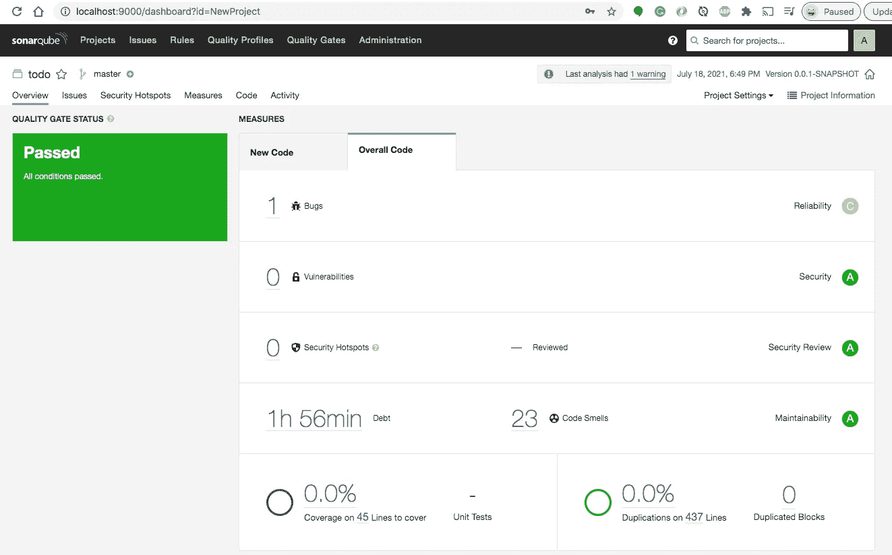

# 在本地机器上为 Java 项目设置 SonarQube

> 原文：<https://medium.com/bb-tutorials-and-thoughts/setting-up-sonarqube-on-your-local-machine-for-java-projects-b8198b3103fb?source=collection_archive---------1----------------------->

## 带有 Maven 项目示例的逐步指南

代码质量是软件工程最重要的方面之一。SonaQube 是一个代码保证工具，它通过收集和分析你的源代码来保证项目的代码质量。您可以配置您的 CI/CD 管道，根据…