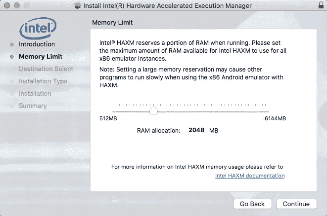
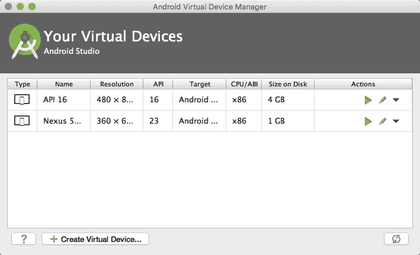
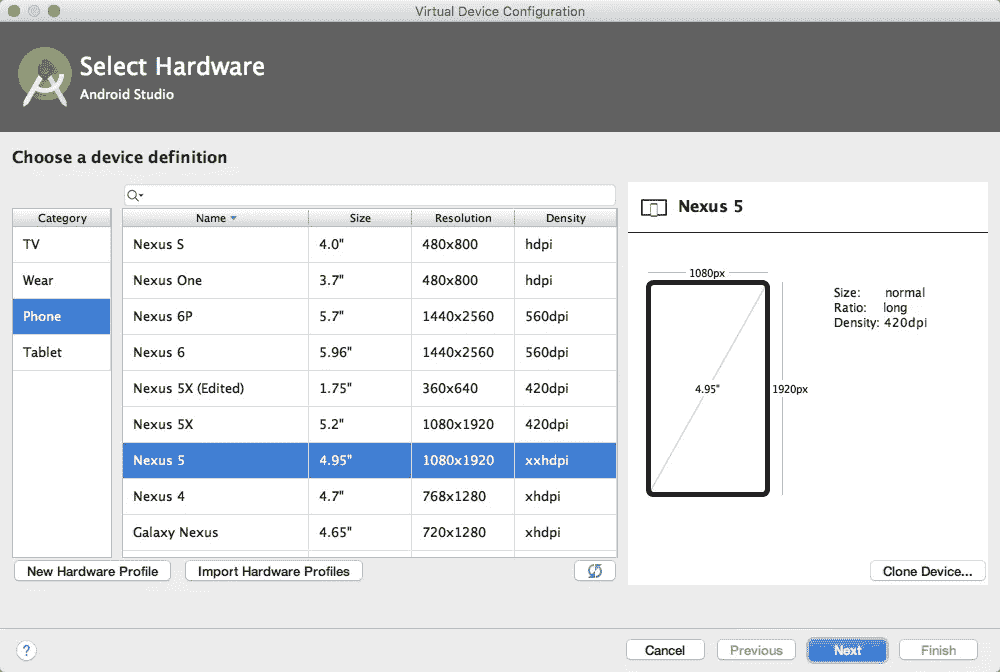
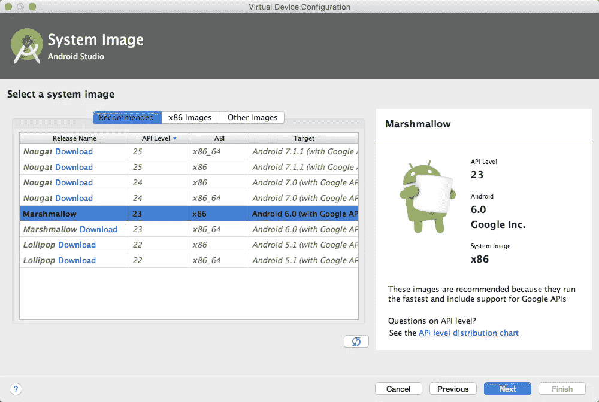
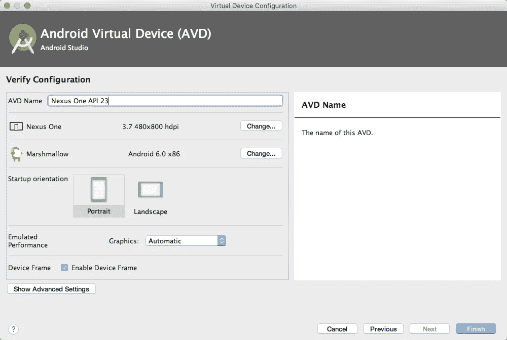
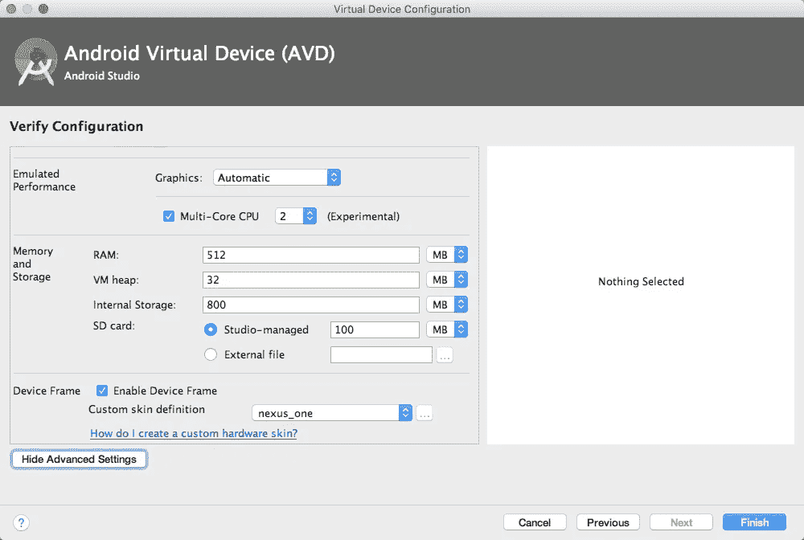

# 设置 Android 模拟器的速度

> 原文：<https://medium.com/androiddevelopers/setting-up-the-android-emulator-for-speed-37ccbc3c3e1c?source=collection_archive---------0----------------------->

# 让 Android 模拟器快速运行！

Android 模拟器已经走过了漫长的道路，现在比以往任何时候都快…只要你有正确的配置。我们通过在设置向导中提供优化的默认设置和推荐的设置来使它变得容易，但是如果您过去已经创建了 AVDs，您可能需要仔细检查您是否有正确的设置。

# 虚拟机加速

HAXM installation is required on Windows / Mac

首先，确保您的操作系统上安装了正确的虚拟化层。作为 Android Studio 安装的一部分，我们在 Windows 和 Mac 上提供英特尔 HAXM 软件。请注意，您需要在计算机的 BIOS 设置中启用虚拟化技术的英特尔 CPU 才能使用 HAXM，因为 HAXM 软件与 AMD 处理器不兼容。

在 Linux 上，你应该使用 KVM 包(它同时支持 Intel 和 AMD 处理器)。您的 CPU 需要支持虚拟化扩展(英特尔 VT-x 或 AMD-V ),并且您需要在您的计算机设置中启用这些扩展。

有关如何安装和验证 HAXM 和 KVM 是否正确启用的更多详细说明，请参考我们新的[文档页面](https://developer.android.com/studio/run/emulator-acceleration.html#accel-vm)(向下滚动以找到针对您的操作系统的说明)。有关 BIOS 的说明，请查阅您的笔记本电脑或主板的说明手册。

# 选择设备定义

如果您在安装 Android Studio 时接受了所有默认设置，那么您应该会看到一个 AVD 已经出现在可用设备列表中，并且配置了最佳设置。

Android Virtual Device Manager with list of created AVDs

对于本教程，我们正在制作一个新的 AVD 来帮助解释如何设置额外的 AVD。首先点击 Android 虚拟设备管理器中的“创建虚拟设备”按钮。

Step 1 of creating an AVD

在这里，你可以选择一些参考 Android 设备的屏幕尺寸和密度，如 Nexus 手机和平板电脑上使用的尺寸和密度。如果您没有使用带有快速 GPU 的高端机器进行开发，您可以通过选择一个较低屏幕分辨率的预设来使您的模拟器更流畅。

您不一定需要仿真 1080 x 1920 设备来进行开发，使用 480 x 800 hdpi 仿真器来进行快速迭代通常是非常好的。请记住，您可以通过在虚拟设备管理器中编辑 AVD 并选择不同的设备定义来随时更改分辨率和屏幕大小。

# 选择正确的系统映像

为 AVD 选择系统映像时，有三条建议非常重要。

Step 2: choosing a system image

首先，选择一个最新的 dessert 版本(API 级别)，因为这些版本通常运行最快，并且包含针对模拟器环境的最新修复和优化。

第二，确保选择 x86 映像，因为在您最确定用于开发的 x86 机器上模拟这些映像会更快。

最后，您通常会希望选择一个标记为“(使用 Google APIs)”的系统映像，这意味着它包含 Google Play 服务和一些内置的核心应用程序(如 Google Maps)，以帮助测试您的集成。

这一步中的 UI 是为支持这些选择而构建的——推荐的选项卡显示最新的 API 级别，包括 x86 映像和 Google APIs，而第二个选项卡显示所有 x86 映像。如果你需要模仿旧的 Android 版本或者在 ARM 二进制上测试你的应用，你可以查看“其他图像”标签。

# GPU 加速

最后一步是确保 GPU 加速工作。理想情况下，有了现代显卡和最新的驱动程序，你不需要做任何事情来启用它。在最后一个 AVD 创建步骤中有一个设置，默认设置为自动检测 GPU 功能并启用正确的加速级别。

Step 3: verify settings and finish.

如果你有问题，首先要做的是确保你的显卡驱动是最新的。您还可以[阅读更多关于各种仿真模式的命令行开关](https://developer.android.com/studio/run/emulator-acceleration.html?hl=ES#accel-graphics)的信息，比如在不同的硬件和软件渲染器之间进行选择。

Advanced settings: amount of RAM and number of CPUs

如果您想尝试微调更多的参数，可以尝试为仿真设备分配更多(或更少，取决于开发机器的能力)的 CPU 内核和 RAM。Android Studio 在创建设备时会尝试选择合理的默认值，但您的结果可能会有所不同。如果您需要更多存储空间，也可以选择模拟更大的 SD 卡。

如果您在模拟器和设置过程中遇到错误，请阅读 [Android Studio 错误归档流程](http://tools.android.com/filing-bugs)，并使用 Android 问题跟踪器让我们了解任何问题。