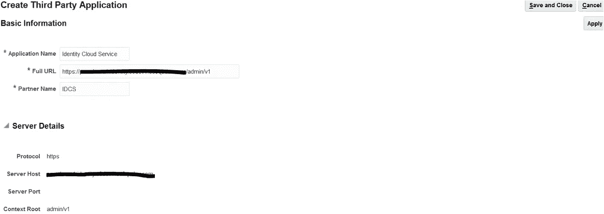
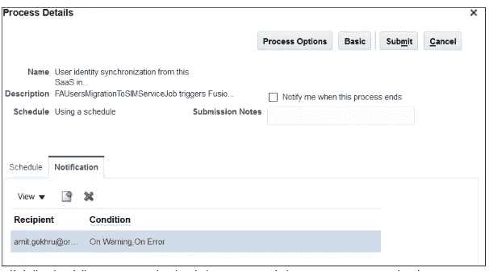

# 在融合应用和身份云服务之间设置用户和角色同步

> 原文：<https://medium.com/oracledevs/setting-up-users-and-roles-synchronization-between-fusion-apps-and-identity-cloud-service-70dcf2144107?source=collection_archive---------0----------------------->

这是我撰写的系列博客中的第四篇，旨在解释 Oracle 融合应用程序与 PaaS 服务的身份集成，使用身份云服务来实现服务之间的单点登录。这是这个系列的博客列表

1.  [了解集成架构——融合应用与平台服务](/@amit.gokhru/understanding-the-integration-architecture-fusion-application-with-platform-services-9b8297594873)
2.  [启用融合应用作为身份提供商的联盟](/@amit.gokhru/enable-federation-with-fusion-apps-as-identity-provider-1ca6d795659c)
3.  [启用身份云服务作为身份提供商的联盟](/@amit.gokhru/enable-federation-with-identity-cloud-service-as-identity-provider-36e80d2bc4ec)
4.  [在融合应用和身份云服务之间设置用户和角色同步](/@amit.gokhru/setting-up-users-and-roles-synchronization-between-fusion-apps-and-identity-cloud-service-70dcf2144107)
5.  [调用 Fusion Apps rest 端点的三脚 OAuth 流。](/@amit.gokhru/3-legged-oauth-flow-to-invoke-fusion-apps-rest-endpoints-5fc6b0b7b059)

在这篇博客中，我将解释当我们在 Fusion Application 和 IDCS 之间建立联盟时，如何在它们之间建立用户、角色和角色分配同步。正如在之前的博客中所解释的，我们可以让融合应用程序或 IDCS 作为身份提供者，但是用户和角色遵循特定的模式

1.  融合应用作为 IdP -

*   用户将始终首先被调配到融合应用程序中，然后同步到 IDCS
*   角色和角色分配将在 Fusion Apps 中定义，并作为 IDCS 组和组成员身份同步到 IDCS

2.IDCS 作为境内流离失所者

*   可以先将用户调配到融合应用程序中，然后同步到 IDCS
*   用户可以先配置到 IDCS，然后同步到 FA
*   角色和角色分配将始终在 Fusion Apps 中定义，并作为 IDCS 组和组成员身份同步到 IDCS

这为我们提供了以下用户和角色同步需求-

1.  作为 IdP 的融合应用程序、在融合应用程序中诞生的用户、在融合应用程序中定义的角色和角色分配—将用户、角色和角色分配从融合应用程序同步到 IDCS。
2.  作为 IdP 的 IDCS、在融合应用程序中诞生的用户、在融合应用程序中定义的角色和角色分配—将用户、角色和角色分配从融合应用程序同步到 IDCS。
3.  作为 IdP 的 IDCS、在 IDCS 出生的用户、在融合应用中定义的角色—将用户从 IDCS 同步到 FA，并将角色和角色分配从 FA 同步到 IDCS。

以下是官方文档— [将 Oracle 销售云、Oracle HCM 云和 Oracle ERP 云用户身份和角色同步到 Oracle 身份云服务](https://cloud.oracle.com/developer/solutions?tab=tasks&solutionguid=OCPSI-GUID-611F888F-8BDE-4240-BBF3-D315DBA68DEF)

让我们看看如何配置这些。

# 将用户、角色和角色分配从 FA 同步到 IDCS

这个场景涵盖了我们的需求#1 和#2。在这种情况下，用户帐户总是首先在融合应用程序中创建，并且需要与 IDCS 同步，以便 SSO 能够工作。类似地，角色和角色分配在融合应用程序中定义，需要与 IDCS 同步，以便其他平台即服务可以使用它们进行授权。

让我们先来理解同步的含义

1.  用户同步—用户同步是指为融合应用中的用户在 IDCS 创建用户足迹。当我们配置同步时，将在 IDCS 为 FA 中的所有活动用户创建一个用户帐户。FA 中用户记录的任何进一步更改(创建、更新)将与 IDCS 同步。需要注意的一点是，当用户在 FA 中变为非活动状态时，其足迹将从 IDCS 中删除，但当用户记录在 FA 中被删除时，不会采取任何措施，用户足迹仍保留在 IDCS。
2.  角色同步—在 IDCS 为 Fusion Application 的每个选定角色创建组。
3.  角色分配同步—根据 Fusion 应用程序中分配的角色，将用户分配到 IDCS 的组中。请注意，在 IDCS 用户可用的条件下，对于在融合应用程序中选择进行同步的角色，将会发生这种情况。

用户凭据(密码)将驻留在 FA 或 IDCS，具体取决于 IdP 的配置。特别是在以下情况下

1.  FA 作为 IdP 当我们从 FA 同步用户到 IDCS 时，我们不希望 IDCS 发送欢迎电子邮件，因此需要通过 IDCS 控制台禁用它。

*   IDCS 管理员登录到 IDCS 管理控制台
*   点击“设置”>“通知”

*   取消选中“欢迎联合 SSO 用户”

2.IDCS 作为 IdP —由于 IDCS 登录页面用于用户身份验证，将不使用 FA 中的用户凭据。当用户同步到 IDCS 时，他们将收到欢迎电子邮件，并重置他们的 IDCS 帐户密码。

以下是设置同步的配置步骤

1.  在 IDCS 创建 Oauth 客户端

*   登录 IDCS 管理控制台>单击“应用程序”选项卡>“添加”
*   在应用程序向导中，选择受信任的应用程序，单击下一步并提供详细信息，然后单击下一步
*   选择“立即将此应用程序配置为客户端”并提供以下详细信息

允许的授权类型—“客户端凭据”

安全性—保持复选框未选中

启用“授予客户端访问 Identity Cloud Service 管理 API 的权限”并输入“用户管理员”

单击完成

记下客户端 ID 和客户端密码

单击激活以激活应用程序

2.将 IDCS 添加为 FA 中的第三方应用程序

*   以管理员权限登录融合应用程序
*   从“导航器”转到“设置和维护”并选择“管理自定义设置内容”

*   在“拓扑定义”下，选择“管理第三方应用程序”

*   单击“+”图标创建新的应用程序并提供详细信息

应用程序名称— `IDCS_REST_ENDPOINTAPP`

完整网址——IDCS 的网址例如[https://IDCS-HOST/admin/v1](https://IDCS-HOST/admin/v1)

合作伙伴名称 Click”，点击应用

点击“保存并关闭”

3.创建用于在融合应用程序中添加客户端 id/密码的任务

*   以管理员权限登录融合应用程序
*   从“导航器”转到“设置和维护”并选择“管理自定义设置内容”
*   点击功能定义下的“管理任务列表和任务”

*   单击“创建任务”并提供如下所列的详细信息，然后单击“保存”

Name =融合应用 IDCS 同步应用凭据

code = FUSION _ APPLICATIONS _ IDCS _ 同步 _ 应用程序 _ 凭据

Description =融合应用 IDCS 同步应用凭据

部署方法=无

程序名=/we b-INF/Oracle/apps/setup/common setup/setup hub/public ui/flow/EndpointPolicyFlow . XML # EndpointPolicyFlow

执行任务=导入后

企业应用程序=设置

模块=设置

parameters = " endpoint key = FA _ USER _ SYNC _ IDCS _ CLIENT _ ID & filtersecuritypolices = Oracle/WSS _ username _ token _ over _ SSL _ CLIENT _ policy "

任务类型=数据录入

使用用户界面=选中

在=标准视图中打开

*   点击“保存”
*   点击“测试转到任务”

*   在“用户名”中输入客户端 id，在“密码”中输入客户端密码
*   点击“保存并关闭”

4.修改配置文件选项

*   可用的配置文件选项

— FND 用户迁移获取批处理大小—控制一个同步过程中执行的最大事务数。事务包括同步的每个用户身份、每个角色和每个角色分配。默认值为 1000。

—FND _ 用户 _ 迁移 _ 最大 _ 重试 _ 尝试—控制在初始同步尝试失败时批处理作业重复尝试同步记录的最大次数。默认值为 20。

— FND 角色同步最大选定角色大小—控制可以添加的角色的最大数量。

— FND 用户身份同步目标—确定融合应用程序是否将用户同步到 Oracle 身份云服务、SIM 或两者。默认值为 SIM。要仅同步到 Oracle Identity Cloud Service，请将该值更改为 IDCS。要同步到 Oracle Identity Cloud Service 和 SIM，请将该值更改为 ALL。将此项设置为“IDCS”

—FND _ 同步 _ 作业 _ 类型—控制要同步的用户和/或角色。允许的值为所有、用户、角色。将此项设置为“全部”

—FND _ 用户 _ 迁移 _ FA _ 联盟—将同步用户标记为 IDCS 的联盟用户。将此项设置为“真”。

*   要修改这些配置文件选项

—导航到设置和维护，并搜索“管理管理员配置文件值”

—单击任务以管理配置文件选项

—搜索特定的配置文件选项，并根据需要更新值，单击“保存”

—完成所有配置文件选项后，单击“保存并关闭”>“完成”

5.设置角色和角色分配同步

*   以管理员权限登录融合应用程序
*   从“导航器”转到“设置和维护”并搜索“将企业角色和分配迁移到 PaaS 身份”

*   点击搜索到的任务，点击“+”图标，添加要迁移到 IDCS 的角色

*   只有那些选定角色的角色分配将被迁移到 IDCS
*   根据“FND _ 角色 _ 同步 _ 最大 _ 选定 _ 角色 _ 大小”配置文件值，您可以在此处选择的最大角色数。
*   如果要删除 IDCS 中已同步的角色，请删除该角色

6.为重复或临时同步设置 Oracle Enterprise Scheduler (ESS)作业

*   以管理员权限登录融合应用程序
*   从“导航器”>“工具”>“计划流程”
*   单击“计划新流程”
*   单击名称字段末尾的向下箭头图标，打开流程名称列表，找到“从该 SaaS 实例到 PaaS 身份存储的用户身份同步”

*   点击“确定”打开“流程详情”页面
*   单击“高级”配置计划频率

*   单击“通知”选项卡配置通知

*   单击“提交”保存并计划您的 ESS 作业，以将用户和角色同步到 IDCS

7.查看和监控同步数据

*   以管理员权限登录融合应用程序
*   从“Navigator”转到“Setup and Maintenance ”,搜索任务“Manage User Identity synchron ization to PaaS Identity Store ”,单击该任务查看同步状态的详细报告

这就完成了用户、角色和角色分配从 Fusion 应用程序到 IDCS 的同步，此时用户首先在 Fusion 应用程序中创建，然后同步到 IDCS，涵盖了我们上面的同步要求#1 和#2。

# 将用户从 IDCS 同步到 FA，将角色和角色分配从 FA 同步到 IDCS

这是我们的需求#3，它出现在 IDCS 是身份提供者且用户首先在 IDCS 创建的场景中。这些用户需要从 IDCS 同步到 FA。角色和角色分配始终在 FA 中定义，并且需要从 FA 同步到 IDCS。另一个需要注意的重要事项是，当我们将用户从 IDCS 同步到 FA 时，只有用户帐户会在融合应用程序中创建，该应用程序需要与 FA 中的 Person 实体相关联，详情请参见此处的[和](https://docs.oracle.com/cloud/latest/globalcs_gs/FAWHR/FAWHR1018388.htm#FAWHR1018351)。

让我们看看怎么做-

1.  从 IDCS 到 FA 的用户同步

*   以管理员身份登录 IDCS 管理控制台
*   单击“应用”选项卡，搜索您的融合应用。单击应用程序名称以打开应用程序详细信息页面

*   如果尚未配置配置端点和属性，请单击“配置”选项卡

—启用资源调配控制

—提供 FA 的管理员用户名和密码

—提供 FA 的 FA 身份集成平台 REST 服务主机名

—端口号—“443”

—选中“启用 SSL”复选框

*   单击“属性映射”按钮查看和配置 FA 和 IDCS 之间的属性

*   在“选择设置操作”中，选中“创建帐户”和“删除帐户”复选框

*   如果启用，则禁用同步。

2.从 IDCS 到 FA 的用户同步

*   点击“用户”选项卡

*   单击“+分配”按钮将用户分配到融合应用程序，搜索并选择要分配的用户，然后单击“确定”

*   类似地，您可以将“Group”分配给 Fusion 应用程序，这将为 FA 中的组成员创建用户帐户。请注意，这不会在 FA 中创建新角色，而只会在 FA 中为 IDCS 组的每个成员创建用户。

*   要从 FA 中删除用户，您可以使用选择用户记录并单击“撤销”按钮。

3.将用户帐户与人员相关联，并将职责角色分配给 FA 中的用户。

4.职能与职能分配从职能到 IDCS 的同步

*   按照上述“将用户、角色和角色分配从 FA 同步到 IDCS”的相同步骤
*   将配置文件选项“FND _ 同步 _ 职务 _ 类型”的值更改为“职责”

5.如果 FA 中的现有用户最初需要引导至 IDCS，您可以按照上面“从 FA 到 IDCS 同步用户、角色和角色分配”中所述配置 FA ESS 作业，以进行一次性同步。

这就完成了从 IDCS 到 FA 的用户同步以及从 FA 到 IDCS 的角色和角色分配同步，其中我们将 IDCS 配置为 IDP，用户首先在 IDCS 创建，并在 Fusion 应用程序中分配角色和角色。

总之，在这篇博客中，我解释了如何根据身份提供者和用户首次创建的位置，在不同的场景中同步 FA 和 IDCS 之间的用户、角色和角色分配。

*本文表达的观点是我个人的观点，不一定代表甲骨文的观点。*