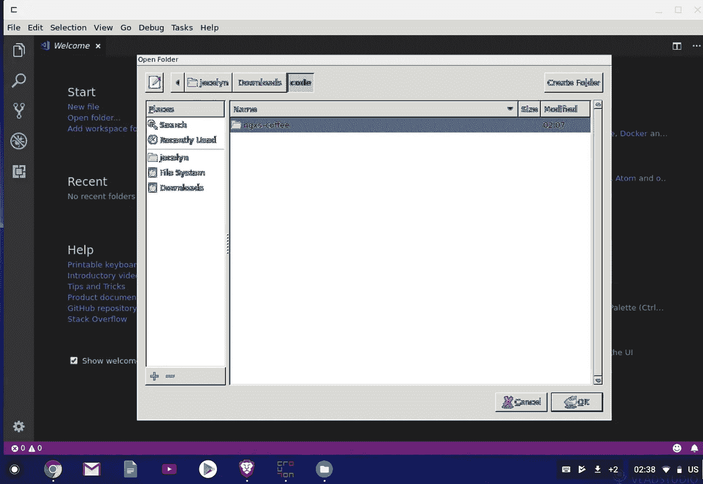
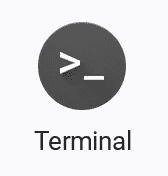
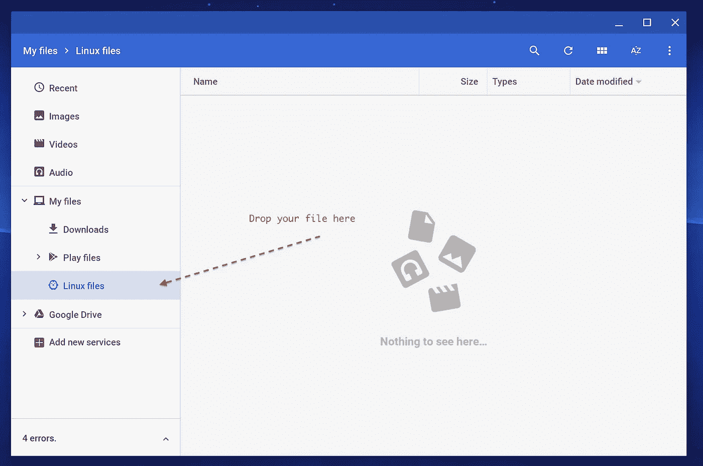
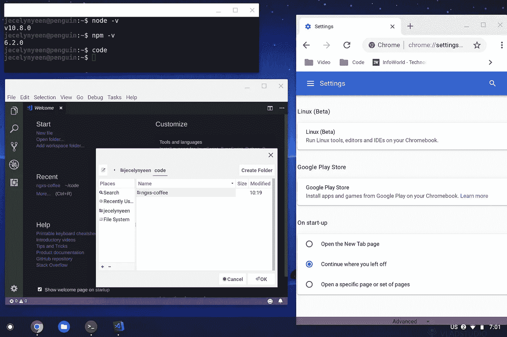
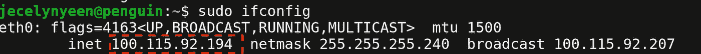
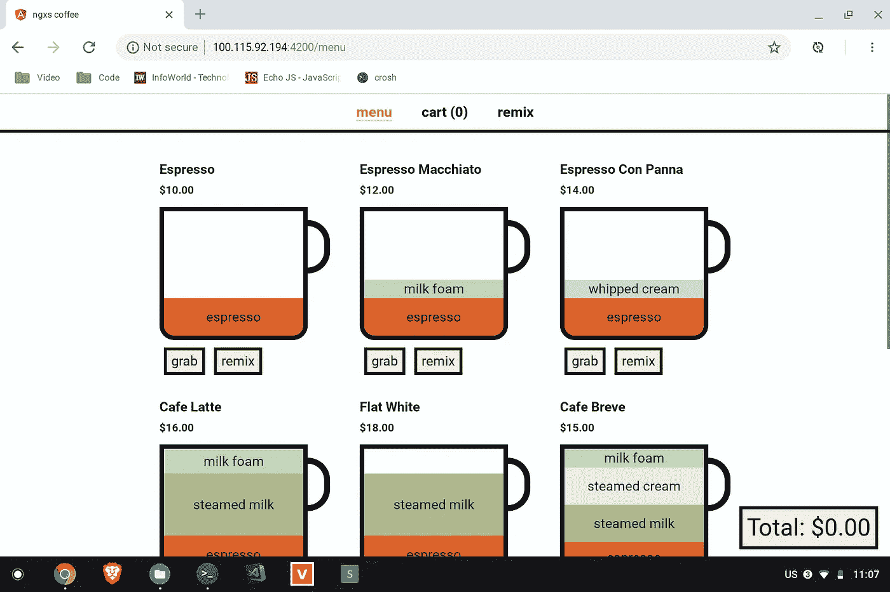

# 在 Pixelbook (Chromebook)中设置 Web 开发环境/角度

> 原文：<https://medium.com/google-developer-experts/setting-up-web-dev-environment-angular-in-pixelbook-chromebook-1bf9a87da066?source=collection_archive---------2----------------------->


太好了，不久前刚拿到我的谷歌 Pixelbook！是时候设置 web 开发环境了。

仅供参考，Pixelbook 运行在 ChromeOS 上。我个人觉得 ChromeOS 更像是“笔记本电脑上的安卓”，而不是典型的操作系统——Windows、MacOS 和 Linux。应用的安装都是通过 Play Store，不像你可以随便下载一个可执行文件( **dmg，exe** )，“运行& bam！您准备好了”类型，因为 Play Store 中没有节点…

以下是我的开发环境所需的软件列表:

*   Git 和 SSH
*   Nodejs & [nvm](https://github.com/creationix/nvm)
*   故事
*   代码编辑器/ IDE — Visual Studio 代码
*   python——对于 web 开发来说不是必需的，但是我需要它

有两种选择:-

1.  用面包丁
2.  使用内置容器 Chromebook 的 Linux(首选)

# 选项 1 —使用油炸面包丁

在网上搜索，我发现最常见的选项是使用[Crouton](https://github.com/dnschneid/crouton)——你可以使用 Crouton 在 ChromeOS 中安装一个 Linux 发行版(Ubuntu，Debian)。在阅读了几篇文章+视频并完成了 4 次以上的安装后(只是为了尝试所有选项)，我想说如果你走这条路，以下资源是最好的:

*   视频(循序渐进，指令清晰，牛逼！):[Stephen Fluin](https://youtu.be/k29JG5nOaps)[为 Web 开发](https://medium.com/u/a1fba6cea10f?source=post_page-----1bf9a87da066--------------------------------)设置 Chromebook
*   文章:[如何用面包丁在 Chromebook 上轻松安装 Ubuntu](https://www.linux.com/learn/how-easily-install-Ubuntu-Chromebook-crouton%20)

下面是 Crouton 中 Visual Studio 代码的截图。用户界面看起来很原始，是吧？



Screenshot after I complete the installation

# 选项 2[首选] —为 Chromebook 使用内置容器 Linux

我发现了另一个新的更好的方法——谷歌宣布了一个完全集成到 Chromebook 的 Linux 桌面。Chromebook Linux 的新特性是 Crostini，这是一项让 Linux 在 Chrome OS 上运行的总括技术。

目前，它仍处于测试阶段，只有在使用 Pixelbook 的情况下才能启用它(目前，对其他 Chromebooks 的支持应该很快就会到来！).

我发现了一篇由 Android 团队写的关于如何在 Chromebooks 上启用 Linux 功能的非常好的[文章](https://developer.android.com/topic/arc/studio)，按照说明操作——直到它要求你安装 android studio 的部分(因为我们不需要 Android Studio！).

启用 Linux 并重启后，您应该会在启动器中看到以下图标。酷，我们准备安装我们的网站开发软件！



# 设置 Web 开发环境

## 安装 git 和 ssh

```
sudo apt install ssh git
```

## 安装节点和 nvm

按照 [nvm](https://github.com/creationix/nvm) 上的说明安装最新版本，以下仅作为示例。

```
wget -qO- https://raw.githubusercontent.com/creationix/nvm/v0.33.11/install.sh | bash nvm install 10
```

## 安装纱线

按照[纱线](https://yarnpkg.com/en/docs/install#debian-stable)上的说明安装最新版本，以下仅作为示例。

```
curl -sS https://dl.yarnpkg.com/debian/pubkey.gpg | sudo apt-key add -
echo "deb https://dl.yarnpkg.com/debian/ stable main" | sudo tee /etc/apt/sources.list.d/yarn.list sudo apt remove cmdtest sudo apt-get update && sudo apt-get install --no-install-recommends yarn
```

## 安装 Visual Studio 代码(VSC)

下载最新版本。deb 64 位来自 [VSC](https://code.visualstudio.com/#alt-downloads) 页面



There is a Linux files “folder” in your directory, drag the deb file in

```
1\. Drag the downloaded .deb file into your Linux folder2\. Install the deb by running the following command:sudo dpkg -i <your_file_name>.deb3\. Install dependencies by running the following command:sudo apt install -f4\. You should see VSC icon show in your launcher, click and open it!
```



up until this point, you should be able to see the VSC, running node, yarn, npm command

## 启动并运行！Angular 项目(或任何 web 开发项目)

让我们测试一下到目前为止是否一切正常——我将通过运行一个 Angular 项目进行测试。



ip address to be use later

```
1\. Before we start, run sudo ifconfig in terminal, remember your inet ip, we need to use it later.2\. Create a folder call **code** in Linux files & navigate to the folder in terminal by running the following command:cd code3\. Clone an Angular project by running the following command:
git clone [https://github.com/chybie/ngxs-coffee](https://github.com/chybie/ngxs-coffee)4\. Navigate to the project folder by running the following command:cd [ngxs-coffee](https://github.com/chybie/ngxs-coffee)5\. Install project dependencies by running the following command:yarn5\. Start the project, set inet ip as host, in my case, it would be:yarn start --host=100.115.92.1946\. Open Chrome, navigate to [http://](http://localhost:)100.115.92.194[:](http://localhost:)4200, you should see coffees!
```

请注意，我们不能运行`yarn start`或`ng serve`，因为我们的代码在 Linux 容器中，而不是我们 chromeOS 的本地主机中。因此，我们需要像上面提到的那样绑定主机 ip。



Navigate to the url, you should see coffees!

# 设置 Python

在 Linux 中安装 Python 不好玩…不如在 mac 中安装流畅。到处都是错误(我不知道它们是什么)。

我使用 [pyenv](https://github.com/pyenv/pyenv) — Python 版本管理来管理不同版本的 Python。

在安装之前，我建议你打开这个页面 [**常见构建问题**](https://github.com/pyenv/pyenv/wiki/common-build-problems) ，读一读(因为你很可能会遇到构建问题，呵呵)。

准备好了吗？深呼吸。

```
1\. Run the following command to install prerequisites libs (refer to [**Common build problems**](https://github.com/pyenv/pyenv/wiki/common-build-problems) **article**):-sudo apt-get install -y make build-essential libssl-dev zlib1g-dev libbz2-dev \
libreadline-dev libsqlite3-dev wget curl llvm libncurses5-dev libncursesw5-dev \
xz-utils tk-dev libffi-dev liblzma-dev2\. Install pyenv by running the command below:-curl -L https://github.com/pyenv/pyenv-installer/raw/master/bin/pyenv-installer | bash3\. If you do hit any problems, refer to [**Common build problems**](https://github.com/pyenv/pyenv/wiki/common-build-problems) **article or internet** to find solution. I ran into a libncursesw6 error, which I need to run the following line to symlink it. You might not need to.sudo ln -s libncursesw.so.5  /lib/x86_64-linux-gnu/libncursesw.so.64\. Close and reopen terminal, check if pyenv install successfullypyenv -v4\. Install a python version buy running the following command. At the moment of writing, I'm using 3.6.1:-pyenv install 3.6.15\. Check if python install successfully.python --version
```

# 摘要

事实上，我在设置过程中遇到了一些错误，尤其是在选项 1 中，有一次我的 Pixelbook 让我蓝屏，需要一个 USB 进行恢复(我真的不知道我做了什么，我发誓我遵循了教程指南……)。

我希望你在安装 Python 或者下到 route 1 之前找到这篇文章或者提到的视频和文章。🤣😘

我对我的 Pixelbook 很满意，唯一的抱怨是要再次熟悉所有快捷键，并习惯使用 Ctrl-C 进行复制…(没有命令按钮了！)

仅此而已。编码快乐！