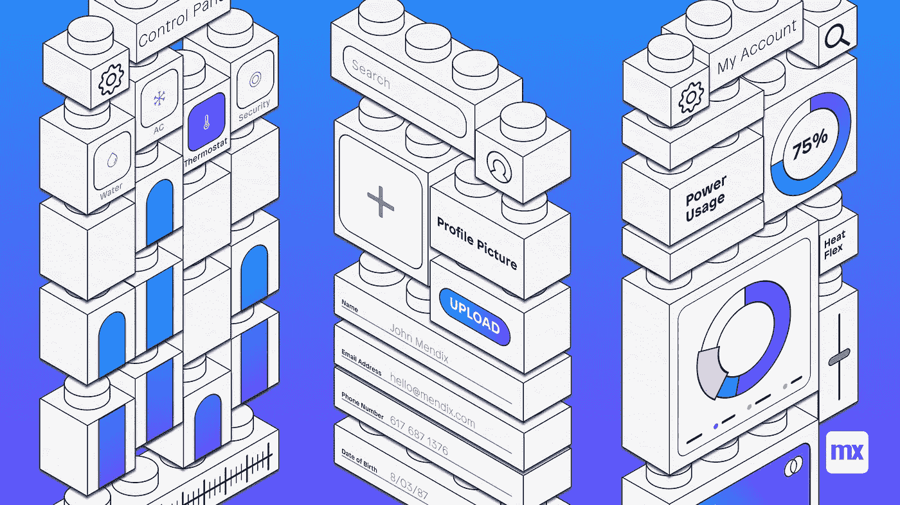

# 在 Mendix 9.6 中设置您的模块化设计系统

> 原文：<https://medium.com/mendix/setting-up-your-modular-design-system-in-mendix-9-6-eed2d0063411?source=collection_archive---------0----------------------->



Setting up your modular design system in Mendix 9.6

## 当 UXers 成为建筑师

Mendix 9 引入了一些关于设计系统模块化的惊人的新特性。尽管这些特性令人难以置信且功能强大，但对于如何将所有部分组合在一起，以及如何最好地利用这些系统，仍然存在一些困惑。幸运的是，你正在阅读回答这些问题的最佳博客。

只是提个醒，但很抱歉这是一个很大的阅读量，我试图让它尽可能完整，所以请确保你已经准备好一些咖啡，甚至可能是一个记事本。

> **prot IP**
> Mendix Studio Pro 9 不需要外接 SASS 编译器！
> 对于 Mendix Pro Studio8，使用 Calypso ( [此处阅读](https://docs.mendix.com/howto8/front-end/calypso) )
> 对于 Mendix Studio Pro 7，使用 Gulp ( [此处阅读](/mendix/how-do-i-start-styling-in-mendix-gulp-sass-6b37ddaf8de6))
> 
> **免责声明**
> 这是我的做法，可能不是最好的。我自己的主要经验是，重要的是后退一步，弄清楚你试图实现什么，以及这如何适应你的设计系统使用的前端方法。
> 我希望本指南有助于启动你自己的设计系统探索，并促进围绕这一主题的更多讨论。
> 
> **博客提示** 如果这个博客里的东西都是大写的，那么这个就是那个单词的占位符。
> 例如。客户端核心，将是我们公司造型的 Valcon 核心。

# TL/DR(看完这篇博客更有意义)

1.  从市场下载您的 CLIENT_core。
2.  下载布局模块(如果您使用自定义布局)。
3.  下载实用程序类模块(如果您使用实用程序类)。
4.  创建特定于应用程序的 UI 模块。
5.  在 Mendix Studio Pro 中按顺序重新路由模块加载。
6.  重新路由主题中的变量和排除。
7.  要惊艳。

# 关键概念

为了充分利用模块化，理解一些关键特性是很重要的，这些特性将在下面解释。

*   UI 模块
*   新文件夹结构
*   SASS 中的路由
*   MendixPro 中的路由
*   每个模块的公共资源
*   关闭 Atlas
*   每个模块的设计属性


## UI 模块简介

Mendix9 创建了将某些模块指定为 UI 模块的功能。这可以通过右击一个模块并选择“标记为 UI 资源模块”来完成。这将使模块变绿，并允许您在 Mendix Studio Pro 中更改“加载顺序”(稍后将详细介绍)。

如果你的模块不是一个 ui 模块，它将和所有其他的非 UI 模块一起首先被加载(赋予它最少的“特异性”)。

> 在 Mendix Studio Pro9 中，无论是 Ui 模块还是默认模块，所有模块都可以有 SASS！如果你的模块有 SASS 但是和样式没有什么关系，就没有必要让它成为 UI 资源。
> 一个很好的例子是新的 datagrid2 模块，它包含 SASS，但不是 UI 模块。


## 文件/文件夹结构

传统上，在 Studio Pro7/8 中，你所有的造型都保存在主题文件夹中。现在情况不同了；每个模块现在都能够拥有 SASS，这些 SASS 文件位于 themesource 中相应命名的文件夹中。

乍一看，这似乎令人困惑，但这正是隐藏大量力量的地方。我目前使用以下 UI 模块:

```
Valcon_Layouts
Valcon_utility_classes
CLIENT_core
App_specific
```

将模块分开，并能够将 SASS 上传到市场中，这允许我们独立地维护和治理每个模块，创建加速器以挂钩到客户项目，并创建更好的培训和治理。

如果处理不当，这确实会造成路由方面的混乱，您可以在下面阅读相关内容。


## 路由基础

SASS 和 CSS 是“级联”的，这意味着具有相同“权重”的声明基于它们被声明的位置而具有优先级。
简而言之，最后载入的声明具有优先权。

理解这一点很重要，因为这对你如何设置模块化有很大的影响。

那么你如何控制你的路线呢？
看下一章。

*要了解更多信息，请查看这个有趣的备忘单:* [*CSS 规范*](http://www.standardista.com/wp-content/uploads/2012/01/specificity3.pdf)


Rerouting your SASS variables

## 工艺路线第 1 部分—变量

在 Studio Pro 9 中，任何市场模块都能够包含 SASS 文件，这意味着它们可以挂钩到默认的 Mendix 变量($brand-primary，$brand-warning 等)。
例如，您可以创建一个下拉小部件，并让悬停状态基于 SASS 变量$brand-primary。
唯一的并发症是:SASS 需要一个“绝对路径”,如果我们想要维护一个可更新的事实点，我们就需要解决这个问题。

变量的默认位置在主题文件夹中，不能导出到市场:

```
@import '../../../theme/web/custom-variables';
```

解决这个问题的简单方法是手动将这个文件移动到您的 CLIENT_core UI 模块，并在主题文件夹中将其重新路由到那个位置。

```
@import '../../themesource/CLIENT_core/web/custom-variables.scss'
```

对于排除变量，我们也这样做。

```
@import '../../themesource/CLIENT_core/web/exclusion-variables.scss'
```

这样，我们可以控制上传到市场的模块中的变量，并且只需要在初始安装期间更新一次主题文件夹。这也意味着所有的市场模块仍然可以指向位于主题中的绝对路径。

如果 Mendix Studio Pro 能够检测出哪个文件夹是你的“唯一真实点”,那就太好了，但现在你需要为每个应用程序检测一次。
投票 [*这个创意*](https://forum.mendixcloud.com/link/ideas/2685) *在创意论坛上如果你觉得我们需要自动路由太:D*

> 另一方面，我们正在慢慢地远离默认的 Mendix 变量，如果你想知道更多关于为什么和如何，请关注我即将发布的下一篇博客。


load order

## 工艺路线第 2 部分，装货顺序。

我们需要设置的第二件事是“加载顺序”。这可以在 Studio Pro 的应用浏览器的“应用>设置>主题”下找到。

如果一个模块不是 UI 模块，它将按字母顺序加载。然后，所有的 UI 模块将根据这里给出的顺序加载。

非常简单，但是像主题文件夹一样，这也需要在初始安装时配置一次。

*投票* [*这个创意*](https://forum.mendixcloud.com/link/ideas/2685) *在创意论坛上如果你觉得我们需要自动路由太:D*


## /public/resources 文件夹

你可能喜欢冒险，想在你的 CLIENT_core 中保留一些字体和一个 logo。

为此，您需要在 web 和本地文件夹旁边添加一个公共文件夹。您在此处放置的任何内容都将被放置在您的部署目录的根目录中。从这里开始，你只需要写下它的绝对路径，相对于你的 CSS 编译的位置。

对于我们的默认徽标，我使用以下路径:

```
.brand-logo{
  background: url(../../../resources/logo.svg);
}.brand-logo-horizontal{
  background: url(../../../resources/logo-horizontal.svg);
}
```

您的文件夹结构可能看起来像这样漂亮:

```
APPNAME
  - themesource
  -  - CLIENTNAME-core
  -  -  - native
  -  -  - web
  -  -  - public
  -  -  -  - **fonts**
  -  -  -  - **resources**
```

*想了解更多相关信息，请阅读这篇令人惊叹的博客:* [***如何在 MX9 中添加自定义字体。***](/mendix/how-to-add-font-icons-in-mendix-9-9307c2634392)

> 您还可以将您的**index.html**和您公司的 SSO 放在您的公共文件夹中。我仍然需要对获得优先级的内容进行故障诊断，但是理论上优先级应该与“加载顺序”相同。
> (我将很快对此做更多的测试)
> (thx [Sophie Bakker](https://www.linkedin.com/in/sophie-bakker-12125547/) 解决此问题)


some of our new variables, so nice

# 创建您的客户端核心

所以你想自己开 CLIENT_core？为了做到这一点，我们需要了解几件事情:

1.  最重要的是，你想用什么样的前端方法论？
2.  你需要额外的模块吗(比如自定义布局，或者工具类模块，图集)？
3.  你不需要什么(Atlas 构建模块，listview 样式？).

如果你不知道这些问题的答案，看看我不久前主持的这个低代码实时构建。

## 自定义变量

这个又好又简单。一旦创建了 CLIENT_core 模块，就可以在 themesource 文件夹中访问它。

将自定义变量复制到您的 CLIENT_core，并在主题中将自定义变量路由到您的 CLIENT_core 中的文件。

## 排除变量

根据您的样式，您可能希望排除某些元素，对我来说，这主要是默认的 listview 和导航样式。

Mendix 添加了一种可扩展的方式来配置它，称为排除变量。

就像自定义变量一样，也将该文件复制到您的 CLIENT_core 目录中，并在主题文件夹中重新路由该文件，以指向 CLIENT_core 中的文件。


## 关闭 Atlas。

治理的一部分是限制开发人员选择错误元素的机会(设计属性、布局、构建块等)。模块现在还带有一个 settings.json 文件。这就允许你这么做。

我在我们的 CLIENT_core 中有一个是这样的:

```
{
  "excludes": {
    "Atlas_Core": {
      "buildingBlocks": true,
      "designProperties": true,
      "layouts": true,
      "pageTemplates": true
    },
    "Atlas_Web_Content": {
      "buildingBlocks": true,
      "designProperties": true,
      "layouts": true,
      "pageTemplates": true
    }
  }
}
```

这几乎关掉了 Atlas 的所有东西(除了 SASS)。
这消除了选择 Atlas 构建模块、设计属性、布局和页面模板的能力。使用上面的设置，样式仍然被载入。

移除 SASS 可以在两个位置完成，这取决于您想要实现的目标。

要么在模块级别上，通过将以下内容添加到您想要排除 sass 的模块中的 **settings.json** (可能不是 Atlas，但可能是一个给您带来一些样式麻烦的小部件)。

```
"styling": true,
```

或者通过 **exclusion-variables.sass** 排除一个 Atlas 特定的 sass 模块。或者我会强烈推荐使用 **exclusion-variables.sass** ，除非你已经 100%重写了每个小部件。

例如，我们只排除列表视图和导航。

*感谢*[*Marius van der Knaap*](https://www.linkedin.com/in/mariusvanderknaap/)*的提示，这应该得到更多的澄清。*

不要害怕检查关于这个的 Mendix 文档:[https://docs . Mendix . com/how to/front-end/module-level-theme-settings](https://docs.mendix.com/howto/front-end/module-level-theme-settings)

> 如果你有多个模块有互相矛盾的排除，事情会变得混乱，因此我建议只在你的 CLIENT_core 中定义。


## 设计属性

甚至设计属性也可以添加到模块中。您可能想要限制 atlas 中的设计属性，并创建一个适合您的新集合。

除了看看 Jelte 创造的这个神奇的工具之外，这里没什么好说的了:【https://jeltemx.github.io/mendix-dpt/


when in doubt F4

> **Pro 提示**
> 如果有些东西好像不行，重新同步你的 app 目录！


## App 专用 UI 模块？

没有一个设计系统是完美的——有时有必要创造一些定制的东西。

这就是特定于应用程序的 UI 模块的用武之地。拥有一个特定于应用程序的模块的好处是，当你更新你的 CLIENT_core UI 模块时，你会删除你的特定于应用程序的工作。

拥有特定于应用程序的模块的另一个额外好处是，这使得开发人员能够并鼓励他们安全地使用 SASS 进行实验。当开发人员的所有更改都在一个地方时，这很容易帮助他们，我们可以给出提示和反馈，大多数时候他们会做出很好的解决方案，这些解决方案可以在以后重构到 CLIENT_core 中。

*有关特定应用模块的更多信息，请查看此* [*低代码实时构建*](https://www.youtube.com/watch?v=tt1n_yBeJrI&t=1522s&ab_channel=MendixCommunity) *:*


My current dependency fix…

# 功能请求

帮助使造型更好！为这些想法投票。

**自动路由**
[https://forum.mendixcloud.com/link/ideas/2685](https://forum.mendixcloud.com/link/ideas/2685)

**依赖关系管理**
[https://forum.mendix.com/link/ideas/1704](https://forum.mendix.com/link/ideas/1704)

**复制/粘贴 Bug**(mxs 9 中无法复制粘贴类)
[https://forum.mendixcloud.com/link/ideas/2713](https://forum.mendixcloud.com/link/ideas/2713)


# 临终遗言

> 「权力越大责任越大」
> MendixPro9 的权力越大，在萨斯的丛林中似乎也相当容易迷路。
> 
> 这使得创建关于前端方法的治理变得更加重要。

*有关实用程序类方法的更多信息，请查看这个实时构建:* [*https://www.youtube.com/watch?v=tt1n_yBeJrI&t = 1522s&ab _ channel = mendix community*](https://www.youtube.com/watch?v=tt1n_yBeJrI&t=1522s&ab_channel=MendixCommunity)

## 成为你想在世界上看到的改变。

设计系统有能力极大地增加用户体验过程的所有方面(如果小心的话)。使开发人员能够快速创建品牌一致的页面，并允许交互设计人员使用已建立的模式。

最重要的是，促进公司各方面的讨论，有助于在你的组织中传播 UX 思维。

*来自发布者-*

如果你喜欢这篇文章，你可以在我们的 [*中页*](https://medium.com/mendix) *找到更多喜欢的。对于精彩的视频和直播会话，您可以前往*[*MxLive*](https://www.mendix.com/live/)*或我们的社区*[*Youtube PAG*](https://www.youtube.com/c/MendixCommunity/community)*e .*

*希望入门的创客，可以注册一个* [*免费账号*](https://signup.mendix.com/link/signup/?source=direct) *，通过我们的* [*学苑*](https://academy.mendix.com/link/home) *即时获取学习。*

有兴趣更多地参与我们的社区吗？你可以加入我们的 [*Slack 社区频道*](https://join.slack.com/t/mendixcommunity/shared_invite/zt-hwhwkcxu-~59ywyjqHlUHXmrw5heqpQ) *或者想更多参与的人，看看加入我们的*[*Meet ups*](https://developers.mendix.com/meetups/#meetupsNearYou)*。*