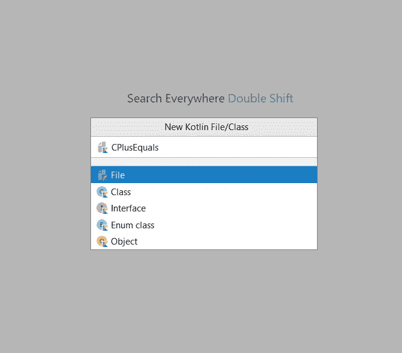

# 在 Kotlin 中设置竞争性编程的工作流程

> 原文：<https://blog.kotlin-academy.com/setting-up-your-workflow-for-competitive-programming-in-kotlin-b1e84e6a6670?source=collection_archive---------1----------------------->

## 几分钟内开始！

A well-designed workflow is very important to get things done fast!

这是我上一篇文章的后续文章，在这篇文章中，我说服您尝试使用 Kotlin 进行竞争性编程。但是如果你已经被说服了，那么这篇文章就是为你准备的！这是设置本地环境的分步指南。

# 我们的目标是什么

您的本地工作流程应该可以帮助您实现一些不同的目标:

1.  启动新竞赛和创建新解决方案文件的一致流程。
2.  快速访问在每个问题中读取输入和写入输出所必需的重复代码
3.  访问智能感知、读取-评估-打印循环(REPL)和调试界面等工具。

下面的设置确保了所有这些事情。

# 设置:逐步指南

## 第一步

在你的系统上下载并安装 [IntelliJ IDEA](https://www.jetbrains.com/idea/download/#section=windows) (社区版也可以)。

## 第二步

从这个 [GitHub 发布页面](https://github.com/RishabhMalviya/intellij-settings-kotlin-competitive/releases/tag/v1.0)下载最新版本的`kotlin-cp.zip`文件。

## 第三步

启动 IDE，进入`File` - > `Import Settings`。

导入您在步骤 2 中下载的设置文件。

单击确定。

重新启动 Intellij IDEA。

# 用法:分步指南

假设你想参加[这个 CodeForces 大赛](http://codeforces.com/contest/1368) (CodeForces 全球第八轮)。

让我们来看看典型的工作流程:

## 步骤 1 —为竞赛创建新项目

首先创建一个适当命名的 Kotlin 项目:

## 步骤 2 —为问题创建新文件

现在，假设你想解决竞赛中的第一个问题:

创建一个新文件来开始编写解决方案。首先在项目导航窗格中选择`src`文件夹:

然后按`alt + N`创建一个新的解决方案文件(这个快捷方式来自你之前从`kotlin-cp.zip`文件导入的设置)。根据问题标题命名新文件:

## 题外话:理解模板(如果你愿意，可以跳过)

在开始编写解决方案之前，您必须理解模板。你可以在这里看到模板[的完整源代码。它基于](https://github.com/RishabhMalviya/intellij-settings-kotlin-competitive/blob/v1.0/Template.kt)[这篇博文](https://codeforces.com/blog/entry/71089)中的模板(由 [Spheniscine](https://codeforces.com/profile/Spheniscine) 在 CodeForces 上提供)。

在顶部，有一组用于解析控制台输入的便利函数:

这些函数都被声明为私有的，因为每个解决方案文件都必须是独立的。当你为下一个问题创建一个新的文件时，它会声明相同的一组函数，但是它们只对那个文件是私有的，就像这些只对这个文件是私有的一样。

这些输入解析函数在`main`中使用:

解决每个测试用例的实际代码写在 solution 类的`solveTestCase()`函数中。请注意，该类名与您之前提供的文件名相同:

这个类被声明为私有的，以防需要使用其中的输入解析函数。

好了，现在回到台阶上。

## 步骤 3:解析控制台输入

注意，`main`函数的第一行负责读取测试用例的数量，并循环遍历它们:

您只需要编写代码来解析单独的测试用例:

并将解析后的输入提供给`solveTestCase()`函数调用:

请注意，一旦您向`solveTestCase()`提供输入，就会出现一个错误。那是因为你还没有写出函数的定义。这是下一步的一部分。

## 步骤 4——编写解决问题的代码

首先，您需要更改函数签名以匹配 main 函数中的调用。这可以从“误差球”下拉列表中完成:

这将为函数`solveTestCase()`添加适当的输入参数:

然后更改函数的输出类型，写出您的解决方案:

## 题外话:有用的工具

如果您想在从控制台提供输入的同时运行代码，请按`Ctrl + Shift + F10`:

如果您想调试代码，在您想开始调试的那一行的左边插入一个断点，然后按`Shift + F9`:

如果你想打开 Kotlin REPL 来快速试验一些代码，你可以按下`Alt + K`(这个快捷键是在`kotlin-cp.zip`文件的设置中添加的):

## 第 5 步—提交您的解决方案

因为文件中的代码是自包含的，所以提交很容易。

在一些网站上，你可以将整个文件内容复制粘贴到编辑器中。在 CodeForces 中，您需要上传文件:

# 结论

就是这样！

这可能看起来很长，因为我已经尽可能清楚地说明了你需要做的所有事情。但是按照这些步骤做一到两次，很快你就能在几秒钟内完成所有的工作。

哦，以后一定要花时间熟悉调试器(`Shift + F9`)和科特林 REPL(`Alt + K`)——它们在实践中*非常*有用。

编码快乐！