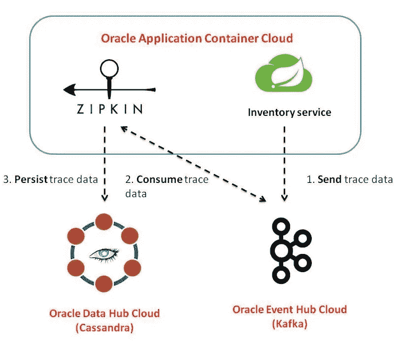
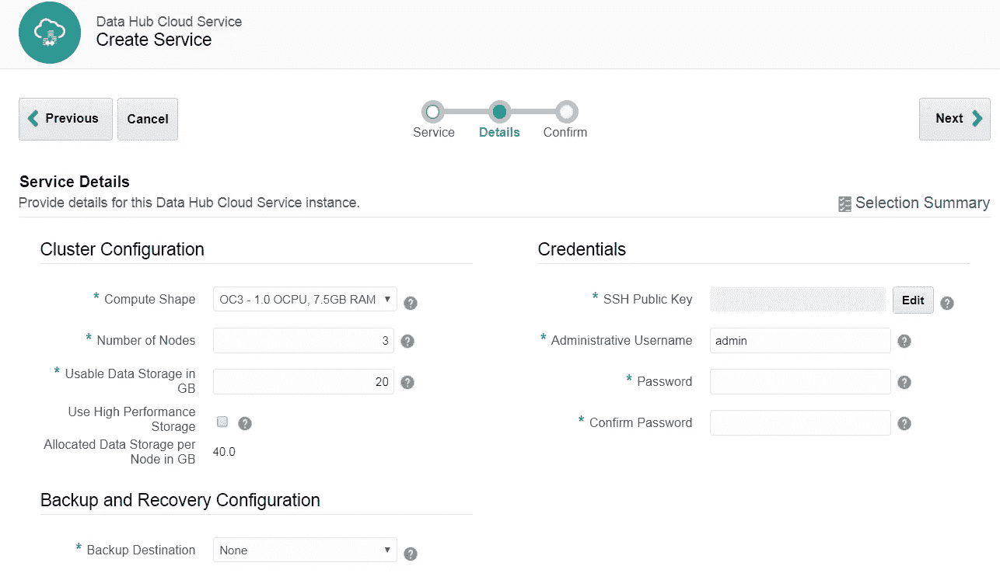
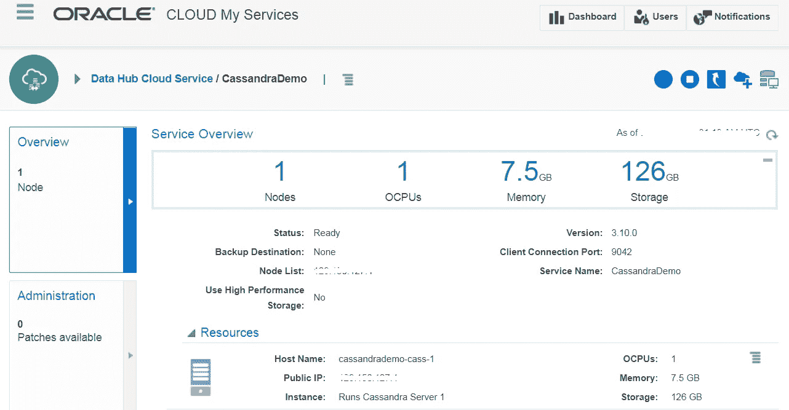
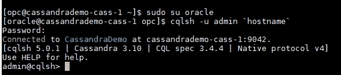
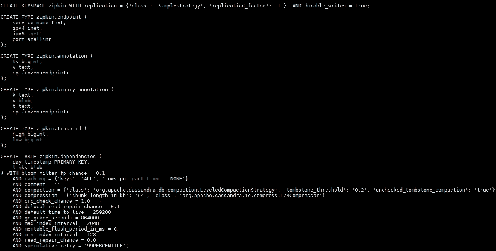
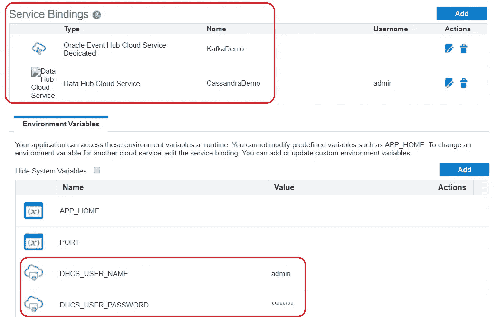
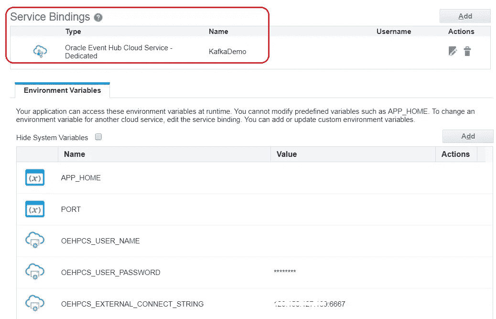
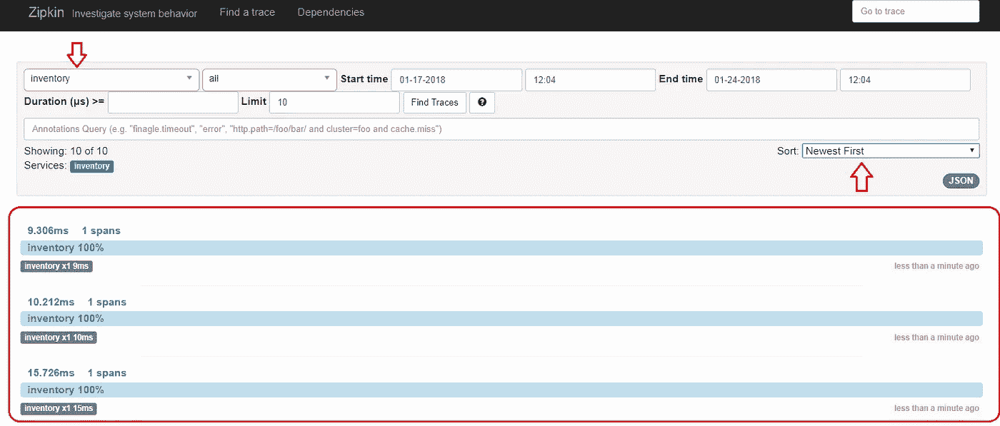
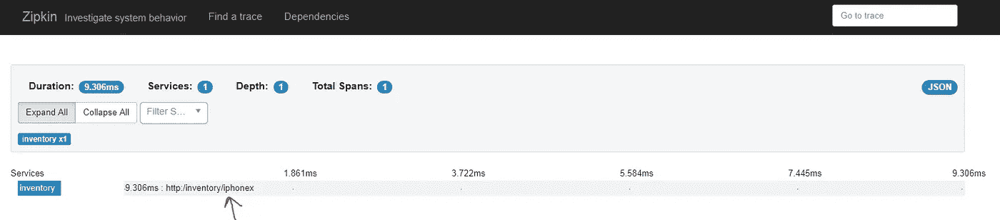
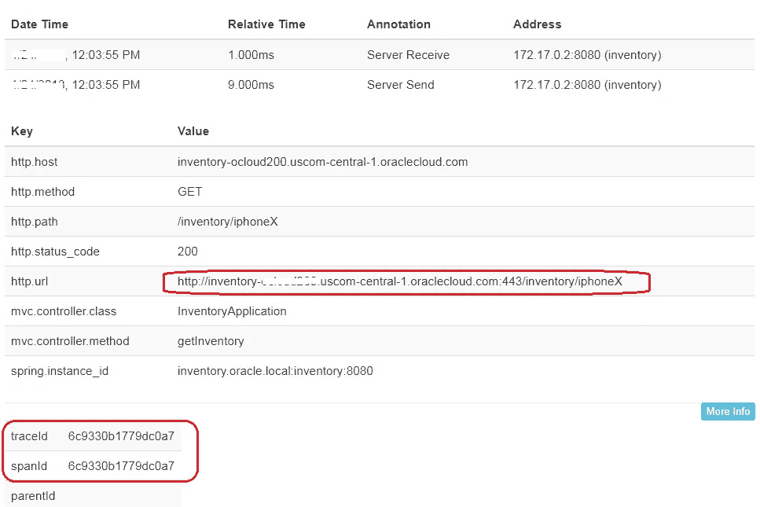

# 用 Zipkin、Kafka 和 Cassandra 建立一个分布式跟踪基础设施

> 原文：<https://medium.com/oracledevs/setup-a-distributed-tracing-infrastructure-with-zipkin-kafka-and-cassandra-d0a68fb3eee6?source=collection_archive---------0----------------------->

> 有关微服务主题的博客帖子的主目录，请参考—[https://medium . com/Oracle devs/bunch-of-microservice-related-blogs-57 b5 f1f 062 e 5](/oracledevs/bunch-of-microservices-related-blogs-57b5f1f062e5)

这篇博客将展示如何在 Oracle Cloud 上建立一个可扩展的分布式跟踪基础设施

我之前的一篇博客展示了一个简单的微服务分布式跟踪的例子(基于 Spring Boot ),使用了一个围绕 [Spring Cloud Sleuth](https://cloud.spring.io/spring-cloud-sleuth/) 和 [Zipkin](https://zipkin.io/) 的例子

 [## 使用 Spring Cloud Sleuth 和 Zipkin 对 Oracle 云上的微服务进行分布式跟踪

medium.com](/oracledevs/distributed-tracing-for-microservices-on-oracle-cloud-with-spring-cloud-sleuth-and-zipkin-b67158ebb34a) 

关于系统的默认行为，有几个关键点需要强调

*   **向 Zipkin** 发送数据— Spring Cloud Sleuth 通过 HTTP 向 Zipkin **发送跨度/跟踪数据**
*   **持久化跟踪数据** — Zipkin 将跨度数据**存储在内存中**

这显然不是防弹解决方案

*   **单点故障** —由于 Zipkin 是我们分布式跟踪解决方案的核心组件，从可用性和性能的角度来看，它也有可能成为瓶颈
*   **短暂存储** —由于 Zipkin 将 span 数据存储在内存中，如果 Zipkin 实例重启或崩溃，这些数据将会丢失

虽然没有什么是完美的，但这种情况是可以改善的。下面是这个博客将展示的解决方案的概述

*   **Zipkin 运行时** —我们将继续使用 [Oracle 应用容器云](https://cloud.oracle.com/application-container-cloud)作为 Zipkin 服务器的运行时
*   **Cassandra for persistent storage**—[Oracle 数据中心云](https://cloud.oracle.com/datahub)是一款托管 Cassandra 产品，我们将把它用作 Zipkin 的 NoSQL 持久性存储
*   **Kafka as the message bus**—[Oracle Event Hub Cloud](https://cloud.oracle.com/event-hub)是一项托管的 Kafka 服务，将利用该服务将 Spring Cloud Sleuth 从 Zipkin 中分离出来

是时候深入探索了！

# 用例概述

用例仍然与之前的博客相同，即分布式跟踪。但是这篇特别的博客关注的是*基础设施*方面的事情，因此示例本身非常简单——所以我们只有一个 Spring Boot 应用程序(名为 **inventory** )来测试(与之前的博文中作为示例来说明概念的几个微服务相反)

这是高级流程

*   库存应用程序向 Kafka 发送跨度数据..
*   …由 Zipkin(异步)使用并保存到 Cassandra

重点是

*   改造 Zipin 服务器以在 Oracle Cloud 上与 Kafka 和 Cassandra 通信
*   更新**库存**服务，与 Kafka 对话，而不是直接与 Zipkin 交互

# 架构组件

这里有一个图表，可以让你对架构有一个高层次的了解..

High level arch diagram

## Kafka(基于 Oracle 事件中心云)

如上所述，由于 Kafka 位于您的应用程序(使用 Spring Cloud Sleuth)和 Zipkin 之间，跟踪数据将被发送到 Kafka，Zipkin 可以异步使用这些数据并持久存储到 Cassandra

虽然这是另一个需要处理的基础设施，但明显的好处是

*   它充当缓冲器并帮助管理背压——想象一下多个微服务抽取跟踪数据
*   它还有助于提高可用性——如果 Zipkin 集群不可用，应用程序仍会继续将数据排入 Kafka，Zipkin 可以在备份时获取这些数据

Zipkin 服务器和单独的应用程序都与 Kafka 对话

Zipkin 服务器组件…

*   …使用`@[EnableZipkinStreamSe](http://twitter.com/EnableZipkinStreamSe)rver`(得益于`spring-cloud-sleuth-zipkin-stream`依赖性)注释来表示它将从 Kafka 接收 span/trace 消息
*   春天的云流卡夫卡装订器是通过`spring-cloud-starter-stream-kafka`拉进来的，这照顾到了卡夫卡的消费者部分
*   `application.properties`用`spring.cloud.stream.kafka.binder.brokers`和`spring.cloud.stream.kafka.binder.zkNodes`分别指定卡夫卡和动物园管理员的坐标

我们的侦探启用了 Spring Boot 微服务..

*   ..还将跟踪/跨度数据推送到 Kafka `spring-cloud-sleuth-stream`和(通常的)`spring-cloud-starter-stream-kafka`模块
*   它还使用与 Zipkin 服务器相同的`application.properties`来指定 Kafka 和 Zookeeper 的坐标

## Cassandra(在 Oracle 数据中心云上)

只有 Zipkin 服务器(而不是应用程序)与 Cassandra 交互，以保存它从 Kafka 接收的跟踪数据/消息。它为 Cassandra 和`zipkin-autoconfigure-storage-cassandra3` 模块使用 Java 驱动程序

重点是`application.properties`中的配置参数

*   `zipkin.storage.type` —使用的值是 cassandra3
*   `zipkin.storage.cassandra3.contact-points` —卡珊德拉星团在哪里
*   `zipkin.storage.cassandra3.username`和`zipkin.storage.cassandra3.password`——相当明显
*   `zipkin.storage.cassandra3.keyspace` —Zipkin 应该在哪个键空间创建对象
*   `zipkin.storage.cassandra3.ensure-schema` —如果设置为 **true** ，Zipkin 会自动为模式植入所需的对象(udt、表等)。)..是不是很甜！

下一节将详细介绍 Cassandra 对象

## Oracle 应用容器云中的服务绑定

重要的是要重申**服务绑定**的重要性，以及它们如何简化应用程序(Zipkin 和其他微服务)与下游基础设施组件(如 Kafka (Eventh Hub)和 Cassandra (Data Hub ))之间的安全、无障碍通信

你真正需要做的是声明一个依赖关系(绑定),你将得到一个为免费的**建立的内部**通信通道**,而不用在各自服务的防火墙/访问规则上打孔**

这一概念将在接下来的章节中重点介绍，您可以随时参考官方文档以获取更多信息

 [## 使用 Oracle 应用容器云服务

### 应用程序的“部署”页面使您能够重新部署应用程序、配置环境变量和…

docs.oracle.com](https://docs.oracle.com/en/cloud/paas/app-container-cloud/csjse/exploring-application-deployments-page.html#GUID-BCD4C8AA-0E1C-490D-92E8-6BAE003F5F5C) 

让我们快速介绍一下基础架构组件的设置

*   卡珊德拉，还有
*   卡夫卡

# 基础设施设置

## Oracle 数据中心云

**提供卡珊德拉集群**

从引导一个新集群开始—详细的[文档在这里](https://docs.oracle.com/en/cloud/paas/data-hub-cloud/user/creating-cluster.html)

Cluster create options

> 使用命令行界面也可以做到这一点

下面的代码片段显示了一个运行 Cassandra **3.10.0** 的基本单节点集群

Oracle Datahub cloud Cassandra Cluster

**检查 Zipkin 相关的模式对象**

如上所述，Zipkin 相关的 Cassandra 模式对象是自动创建的——包括用户定义的类型和表

为了检查这些，

*   **SSH** 进入 Cassandra 集群节点—文档[可在此处获得](https://docs.oracle.com/en/cloud/paas/data-hub-cloud/user/connecting-cluster-node-secure-shell-ssh.html#GUID-16765BDA-5713-43C7-82D4-5EE62E31C481)
*   启动 **cqlsh** —执行`sudo su oracle`(相关[信息在此](https://docs.oracle.com/en/cloud/paas/data-hub-cloud/user/linux-user-accounts.html))，然后执行`cqlsh -u admin `hostname``

Logged into cqlsh

*   获取您的 zipkin 特定密钥空间的详细信息(在 application.properties 中配置)——例如`desc zipkin`..如果不记得了，就用`desc keyspaces`，你应该会在那里看到你的

这是一些物品的截图

Zipkin schema objects in Cassandra

## Oracle 事件中心云(Kafka broker)

在这种情况下使用的 Kafka 集群拓扑相对简单，即单个代理与 Zookeeper 位于同一位置。您可以选择特定于您需求的拓扑结构，例如具有 5 个节点 Kafka 集群和 3 个 Zookeeper 节点的 HA 部署

> 请参考[文档](http://docs.oracle.com/en/cloud/paas/event-hub-cloud/ehcug/creating-cluster.html)了解更多关于拓扑和详细安装过程的细节(提示:这很简单！)

Kafka broker on Event Hub Cloud

**创建自定义访问规则**

您需要在 Oracle Event Hub Cloud 上的 Kafka 服务器虚拟机上创建一个自定义的**访问规则**来打开端口 2181—[详情请见](https://docs.oracle.com/en/cloud/paas/event-hub-cloud/admin-guide/platform-access-rules-page.html)

> Oracle Application Container Cloud 不需要打开端口 6667 (Kafka broker ),因为安全连接由服务绑定负责

# 构建、配置和部署

首先从 Github 获取项目— `git clone [https://github.com/abhirockzz/accs-](https://github.com/abhirockzz/accs-microservices-service-discovery)zipkin-tracing-infra-with-kafka-cassandra.git`

## 建设

**Zipkin 服务器**

*   `cd zipkin`
*   `mvn clean install`

构建过程将在`target` 目录中创建`zipkin-dist.zip`

**库存服务**

*   `cd inventory`
*   `mvn clean install`

构建过程将在`target` 目录中创建`inventory-dist.zip`

## 配置

在将它们发布到云中之前，请根据您的环境调整配置参数

`**deployment.json**` 和`**manifest.json**`为 Zipkin 服务器

`**deployment.json**` 和`**manifest.json**`为*库存*服务

既然您已经配置了您的应用，是时候部署它们了

## 部署也称为向云推进

借助 Oracle Application Container Cloud，您在部署应用程序方面有多种选择。本博客将利用 **PSM CLI** ，这是一个用于管理 Oracle 云服务的强大命令行界面

> 其他部署选项包括 [REST API](https://docs.oracle.com/en/cloud/paas/app-container-cloud/apcsr/index.html) 、 [Oracle 开发者云](https://docs.oracle.com/en/cloud/paas/developer-cloud/csdcs/deploying-application-oracle-developer-cloud-service.html#GUID-6FE6D850-65DC-471D-A249-F7CCA9CAB56F)，当然还有[控制台/UI](https://docs.oracle.com/en/cloud/paas/app-container-cloud/csjse/creating-application.html)

您可以在您的机器上下载并设置 PSM CLI(使用`psm setup` ) — [详情请点击](https://docs.oracle.com/en/cloud/paas/java-cloud/pscli/using-command-line-interface-1.html)

以下是部署应用程序的 CLI 命令

齐普金——`psm accs push -n **zipkin** -r java -s hourly -m manifest.json -d deployment.json -p target/zipkin-dist.zip`

**库存** — `psm accs push -n **inventory** -r java -s hourly -m manifest.json -d deployment.json -p target/inventory-dist.zip`

## 健全性检查

*   检查服务绑定，
*   访问 Zipkin 服务器以确认其功能

成功部署 **Zipkin** **服务器**后，您可以通过导航到详细信息屏幕- > **部署**部分-*来检查服务绑定的详细信息。您将看到数据中心(Cassandra)和事件中心(Kafka)绑定以及它们各自的环境变量(裁剪的图像)*

Zipkin bindings to Kafka, Cassandra

这同样适用于**库存**服务(它只绑定到 Kafka)

Inventory service binding to Kafka

最后，访问 Zipkin 服务器—记下应用程序的 URL，例如`[https://zipkin-<mydomain>.apaas.us2.oraclecloud.com](https://zipkin-ocloud200.uscom-central-1.oraclecloud.com)`

Zipkin on Oracle Application Container Cloud

# 试驾…

好了，一切都准备好了，我们可以测试了

**调用库存服务**

首先，检查**库存**应用程序的 URL，并调用几次

*   `curl [https://inventory-<mydomain>.apaas.us2.oraclecloud.com/inventory/iPhone](https://inventory-ocloud200.uscom-central-1.oraclecloud.com/inventory/iphone)4`
*   `curl [https://inventory-<mydomain>.apaas.us2.oraclecloud.com/inventory/iPhone](https://inventory-ocloud200.uscom-central-1.oraclecloud.com/inventory/iphone)5`
*   `curl [https://inventory-<mydomain>.apaas.us2.oraclecloud.com/inventory/iPhone](https://inventory-ocloud200.uscom-central-1.oraclecloud.com/inventory/iphone)X`

**进入 Zipkin 仪表板查看量程数据**

Zipkin dashboard with span/trace data

如果你进一步挖掘这个跨度，你会看到更多的细节

Span details

以上是我们调用`**iphoneX**` (上面列出的三个调用之一)的跨度。这相对简单，因为您只有一个服务，但是如果您有一个包含不同(微)服务的调用链，这同样适用

如果你进一步挖掘，会发现更多的东西——关注突出显示的信息

More details about a specific trace

**Cassandra 中的跨度数据**

你也可以仔细检查一下卡珊德拉。使用`cqlsh`，执行`select * from zipkin.traces;`(假设`zipkin`是密钥空间名称)

您还可以查询其他相关的表

**卡夫卡呢？**

正如您可能理解的那样，span 数据由 Sleuth 发送到一个 Kafka 主题(毫不奇怪地命名为`sleuth`)，然后由 Zipkin 使用并保存到 Cassandra..也试试这个

使用 kafka CLI 设置消费者— `kafka-console-consumer.bat --bootstrap-server <event_hub_kakfa_IP>:6667 --topic **sleuth**`

再次调用库存应用— `curl [https://inventory-<mydomain>.apaas.us2.oraclecloud.com/inventory/](https://inventory-ocloud200.uscom-central-1.oraclecloud.com/inventory/iphone)AppleWatch`

您将看到一条相当隐晦的消息，其内容粘贴在下面以方便您参考——回想一下您以前在 Zipkin 中看到过相同的跟踪数据

Monitor the **sleuth** topic in Kafka for trace data

`♣♂contentType ♀”text/plain”‼originalContentType “application/json;charset=UTF-8”♠spanId ↕”e7bd0aabba1fa09c”♂spanTraceId ↕”e7bd0aabba1fa09c”♂spanSampled ♥”0"{“host”:{“serviceName”:”inventory”,”address”:”172.17.0.2",”port”:8080},”spans”:[{“begin”:1516776180246,”end”:1516776180258,”name”:”http:/inventory/AppleWatch”,”traceId”:8394174692565835560,”spanId”:8394174692565835560,”exportable”:true,”tags”:{“mvc.controller.class”:”InventoryApplication”,”http.status_code”:”200",”mvc.controller.method”:”getInventory”,”spring.instance_id”:”inventory.oracle.local:inventory:8080",”http.path”:”/inventory/AppleWatch”,”http.url”:”[http://inventory-](http://inventory-)<mydomain>.uscom-central-1.oraclecloud.com:443/inventory/AppleWatch","http.method":"GET","http.host":"inventory-<mydomain>.uscom-central-1.oraclecloud.com"},"logs":[{"timestamp":1516776180246,"event":"sr"},{"timestamp":1516776180258,"event":"ss"}],"durationMicros":12550}]}`

# 摘要

这就是这篇博文的全部内容，它是分布式监控系列的第二部分(也是最后一部分)..

**快速回顾一下不会有坏处！**

*   我们讨论了默认监控设置的缺点，并介绍了 Kafka 和 Cassandra 作为核心基础设施组件来克服一些问题
*   浏览了建筑的细节
*   在 Oracle 云上调配基础架构作为随时可用的托管服务—数据中心云和事件中心云
*   将改进后的应用构建并部署到 Oracle 应用容器云
*   最后，端到端地测试了一切！

# 不要忘记…

*   深入阅读 Oracle 数据中心云文档

 [## Oracle 数据中心云服务—开始使用

### 帮助管理员、开发人员和用户开始使用 Oracle Event Hub Cloud Service 的文档。

docs.oracle.com](https://docs.oracle.com/en/cloud/paas/data-hub-cloud/index.html) 

*   查看 Oracle Application Container Cloud 教程—每个运行时都有适合的内容！

 [## Oracle 应用容器云服务—创建您的第一批应用

### Oracle 应用容器云服务教程。学习创建你的第一个应用程序。

docs.oracle.com](https://docs.oracle.com/en/cloud/paas/app-container-cloud/create-first-applications.html) 

*   关于应用程序容器云的其他博客

 [## 关于应用容器云的最新故事和新闻—中型

### 阅读关于应用容器云的最新文章。每天，成千上万的声音阅读、书写和分享重要的…

medium.com](/tag/app-container-cloud/latest) 

干杯！

> 本文表达的观点是我个人的观点，不一定代表甲骨文的观点。