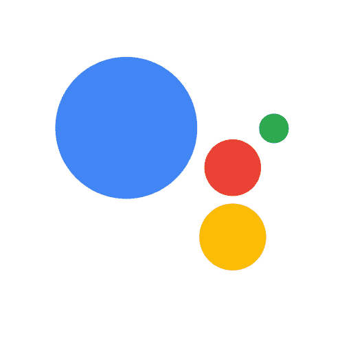

# 设置授权服务器——减少您在 Google 应用程序上的操作

> 原文：<https://medium.com/google-developer-experts/setup-an-authorization-server-less-for-your-actions-on-google-application-ff56f0328cf8?source=collection_archive---------0----------------------->

You Shall Not Pass Until You Link Your Account!

在这篇博客文章中，我们将讨论一个高级话题，即如何为谷歌助手构建动作:[账户链接](https://developers.google.com/actions/identity/)。

> “账户链接是一种很好的方式，可以让用户将他们的谷歌账户连接到你的服务上的现有账户。”

每当你想为你的用户提供丰富的体验:个性化的结果，购物车体验，或访问他们的忠诚卡信息；您的用户需要将他们的帐户链接到您的操作。如果您正在为您的业务构建一个对话应用程序，您肯定希望能够对您的用户进行身份验证。

为了做到这一点，大多数时候，你可能想要使用任何流行的栈，比如 [keycloak](http://www.keycloak.org/) ，来设置你自己的授权服务器——最好是在本地。但是，在这篇文章中，我想向您展示一种简单的方法来拥有一个完全工作的授权服务器，具有范围和用户管理、不同的授权类型、LDAP 集成…等等，最重要的是，由于 [Auth0](https://medium.com/u/9ef9638b3092?source=post_page-----ff56f0328cf8--------------------------------) ，没有任何麻烦。

> 我们不会定义什么是授权服务器，也不会定义显式工作流是如何工作的。你可以从 [Ratros Y.](https://medium.com/u/207f895d67cb?source=post_page-----ff56f0328cf8--------------------------------) 的[这篇文章](/google-cloud/understanding-oauth2-and-building-a-basic-authorization-server-of-your-own-a-beginners-guide-cf7451a16f66)中获得一个伟大而详细的解释

# **配置您的 Auth0 项目**

事不宜迟，让我带您完成启动和运行服务器的所有必要步骤。

1/创建一个**机器对机器**应用程序:

接下来，选择默认的 **Auth0 管理 API** 。并且，对于本文的 sack，我们将使用**启用所有范围**。

> 注意:对于真实世界的应用程序，我建议您只启用必要的作用域！

2/您的应用程序现在已经准备好了。让我们来配置它:

3/写下你的 Auth0 **域**，我们以后会用到。

4/在**允许的回调 URL**配置中，我们将提供以下 URL:

*   OAuth 用户信息 URL: `https://<your-auth0-domain>/userinfo`
*   `https://oauth-redirect.googleusercontent.com/r/<action-project-id>`

在**允许的网络来源**部分，我们将提供以下来源:

*   `https://oauth-redirect.googleusercontent.com`

5/接下来，在**高级设置**中，我们将启用**授权码**和**刷新令牌**授权类型。这两种授权类型是授权显式流(又名。授权代码流)。

6/接下来，我们将使用简单的**用户名-密码数据库**连接来验证我们的用户(如果需要，创建一个):

> 对于更严肃的企业应用程序，我推荐使用企业连接。

7/然后让我们在**社交连接**设置中启用**谷歌连接**。您可能希望启用更多的连接。这将允许我们的用户使用他们最喜欢的提供商登录:

8/在最后一步，我们需要创建一个测试帐户，这样我们就可以在 Google 项目中使用它:

> 请记下这个测试帐户的登录名和密码，我们稍后将在 Google 项目的操作中使用它们

# **在 Google project 上配置您的操作**

现在，让我们确保使用来自授权服务器的凭证正确配置了我们的操作。

1/在**账户链接**设置中，在您对 Google project 的操作中，将**账户创建设置为否**(第二选项)。通过使用此选项，我们将能够将用户重定向到我们的授权服务器，并在注册期间获得他们的同意:

在**链接类型**中，选择 **OAuth 和授权码**选项。

2/接下来，让我们提供客户信息(来自我们的 Auth0 项目):

使用 Auth0 发布的**客户端 ID** 和**客户端机密**(请参见应用程序设置中的 Auth0 项目):

接下来，将授权 URL 和令牌 URL 都设置为:

*   授权网址:`https://<your-auth0-domain>/authorize`
*   令牌网址:`https://<your-auth0-domain>/oauth/token`

这些设置也可以在您的 Auth0 项目设置中找到。

3/最后，由于我们在我们的行动中使用帐户链接，我们必须提供一个测试帐户，当我们提交我们的行动以供发布时，Google 的审查团队将使用该帐户。我们将在上面的 Auth0 部分提供我们在步骤 8 中创建的测试帐户:

# 应用程序的逻辑(实现)

为了测试我们的应用程序并确保授权过程正常工作，我们使用 Dialogflow 设计了一个简单的对话框。以下是我们使用的意图:

**签到**

这是一个特殊意图，将由 **actions_intent_SIGN_IN** 特殊事件触发。此事件由 Google 上的操作调度。

> 确保为此目的启用 webhook 调用。

**默认欢迎意向**

这是默认的欢迎意图，将在您的代理启动时触发:

> 确保为此目的启用 webhook 调用。

接下来，我们添加了一个简单的实现来处理前面的两个意图。该示例代码改编自官方[文档](https://developers.google.com/actions/identity/google-sign-in#start_the_authentication_flow_during_the_conversation):

> 注意:这个示例代码使用的是新的 v2 Dialoflow SDK。

下面，我总结了帐户链接过程(阶段 1)的两个序列，这是实际授权过程发生的地方；第二阶段，Google 运行时上的操作使用存储的令牌来识别用户:

[https://swimlanes.io/d/H11ukiINQ](https://swimlanes.io/d/H11ukiINQ)

帐户链接完成后，用户必须再次启动应用程序才能继续。这一次，Google runtime 上的操作将自动识别用户:

[https://swimlanes.io/d/B1T-1oLVX](https://swimlanes.io/d/B1T-1oLVX)

> 注意:我有意通过关注主要实体并删除所有额外的交互来使这些序列图更容易理解！

## 恭喜你！🎊您刚刚使用 Auth0、Google 上的操作和 Dialogflow 为您的操作设置了第一个帐户链接和授权服务器！

下面是整个过程的短片:

Actions on Google: Account Linking and Authorization CodeFlow

*请给这篇文章一些掌声，让我知道你有多喜欢它，在 Twitter 上*[*@ manekinekko*](https://twitter.com/manekinekko)*并确保关注我以获得更多内容*🎉