# 在 10 分钟或更短时间内在 Mendix 应用程序中设置电子邮件(Mx8 版)

> 原文：<https://medium.com/mendix/setup-email-in-a-mendix-app-in-10-minutes-or-less-mx8-edition-f789dc49f76f?source=collection_archive---------1----------------------->

# 应用程序中的电子邮件功能通常是必不可少的，设置起来可能会很麻烦。无论是为生产应用程序开发该功能，还是为了快速验证概念而推出该功能，下面的设置指南都旨在简化该过程。利用 Mendix 平台的速度及其资源，这一功能可以在几分钟内推出，而不是几个小时。

**初始设置**

设置电子邮件功能的第一步是从市场下载模块。Mendix 通过允许您在 Studio Pro 中直接连接到市场，简化了这个过程。如果你在 Studio Pro 的右上角寻找购物车图标，你可以打开市场并开始搜索模块或部件。

您将要搜索的模块称为“带模板的电子邮件模块”，一旦您找到它，单击下载按钮将其导入到您的项目中。一旦模块被导入，您会注意到控制台中有一些错误。这是因为电子邮件模块依赖于其他市场模块，为了修复这些错误，我们也需要导入它们。您正在寻找的附加模块称为“Mx 模型反射”和“加密”，当它们被导入时，错误将被解决。

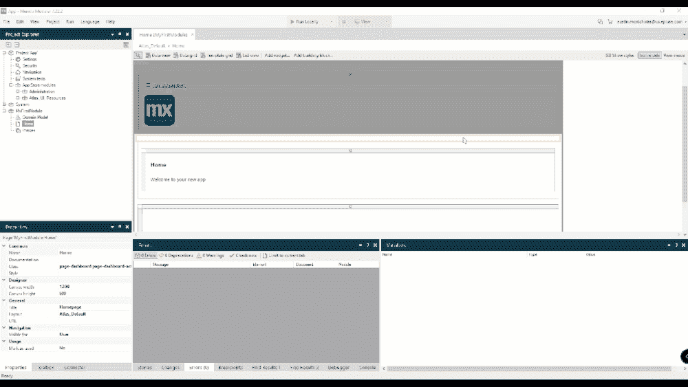

*上图来自 Mx7，但步骤与 Mx 8.18.3* 相同

**模型反射模块**

反射模块用于电子邮件模板模块的模板特征。这允许您创建要包含在模板中的令牌，在发送电子邮件之前，令牌将被数据库中的数据替换。

**加密模块**

加密模块用于加密您的 SMTP 密码。密码只会在您的电子邮件发送之前被解密。

**设置页面和微流程**

我想做的第一件事是创建一个名为“EmailCustom”的模块，它将扩展电子邮件模块。创建 EmailCustom 模块后，您可以创建一个名为“EmailAdministration”的页面，并包含“Administration”片段，然后将其添加到您的导航中。这将使您能够访问电子邮件功能的所有管理屏幕。

我想做的下一件事是在域模型中添加一个实体。将此称为“EmailInfo ”,并向表中添加一个字符串属性。这将在我们创建第一个模板并向其添加令牌时使用。

接下来，您需要创建一个发送电子邮件时使用的微流。电子邮件模板模块“CreateAndSendEmail”中包含了一个很好的例子。复制并包含这个微流，并将其拖到您的电子邮件自定义模块中。然后用实体类型“EmailInfo”替换名为 Order 的参数，用名为“EmailAddress”的字符串替换名为 Customer 的参数。一旦你这样做了，你将会在这个微流程的变更活动中得到一个错误。打开更改活动，将“收件人”属性值更改为您的电子邮件地址参数。

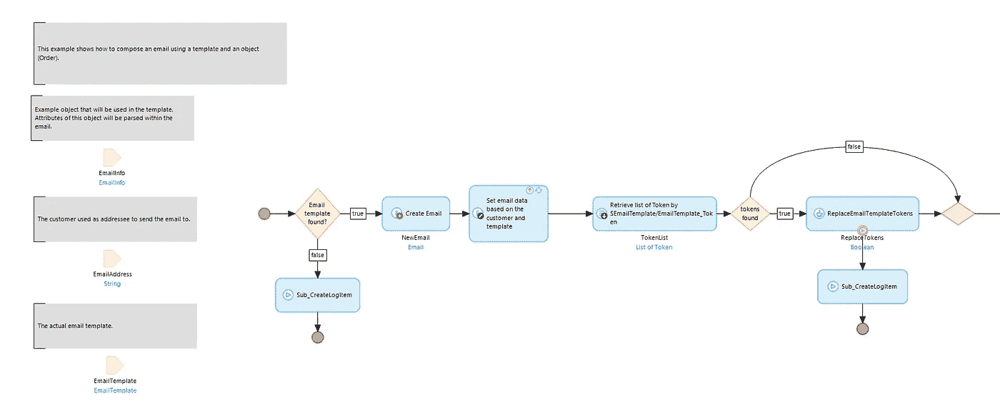

你需要做的最后一件事是创建一个微流来检索电子邮件模板，然后调用创建和发送电子邮件。创建一个名为“RetrieveTemplateAndSendEmail”的新微流向这个微流添加三个参数，一个是 EmailInfo 类型，另外两个是名为“EmailAddress”和“TemplateName”的字符串。您要使用的第一个活动是检索电子邮件模板的检索活动。将它添加到您的微流中，并使用这个约束“[TemplateName = $TemplateName]”从数据库中检索模板(还要确保将范围设置为 first，并将实体设置为 EmailTemplate。“下一个活动将是一个微流调用，您可以调用创建和发送电子邮件。将电子邮件模板、电子邮件地址和电子邮件信息对象传递给这个微流。

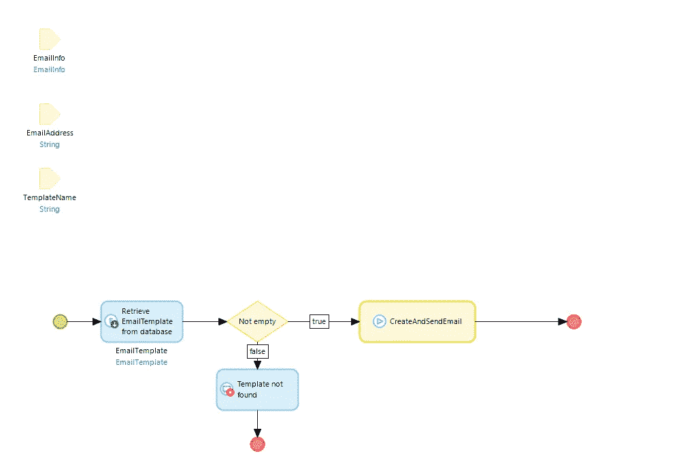

如果您有兴趣下载我上面描述的模块，您可以在这里下载我创建的示例项目**(MX 8 . 12 . 7)，然后将其导入到您的项目中。**

****还没完呢！****

**接下来，您需要设置模型反射模块和加密模块。将模型反射管理页面添加到导航中；该页面名为“MxObjects_Overview”然后展开加密模块，并为名为“EncryptionKey”的常量设置一个值该值必须是 16 个字符的字符串。**

> **有用的提示:按 CTRL + G 搜索页面、微流或资源**

**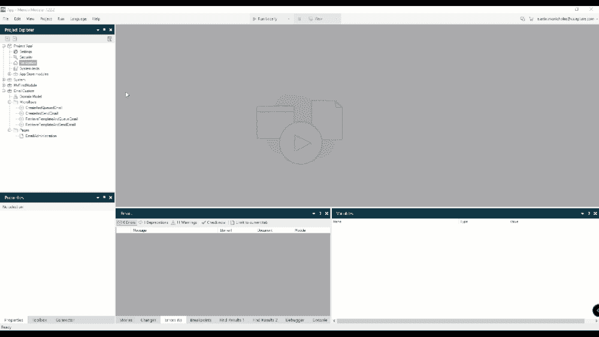**

***上图来自 Mx7，但步骤与 Mx 8.18.3* 相同**

****运行您的项目****

**现在您可以运行您的项目了。您可以选择在本地运行或部署到您的沙箱中。项目编译完成后，单击“查看”在浏览器中打开它。**

**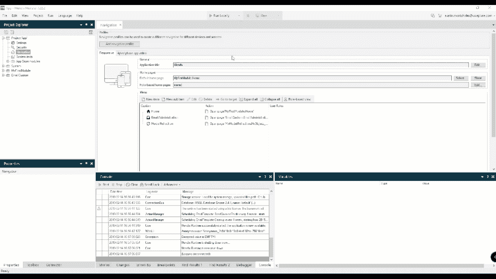**

***上图来自 Mx7，但步骤与 Mx 8.18.3* 相同**

**当你打开你的项目时，你进入的屏幕就是你的主页。您应该做的第一件事是导航到您的模型反射管理页面并按下“点击刷新”按钮，(确保检查 EmailCustom 模块)。**

**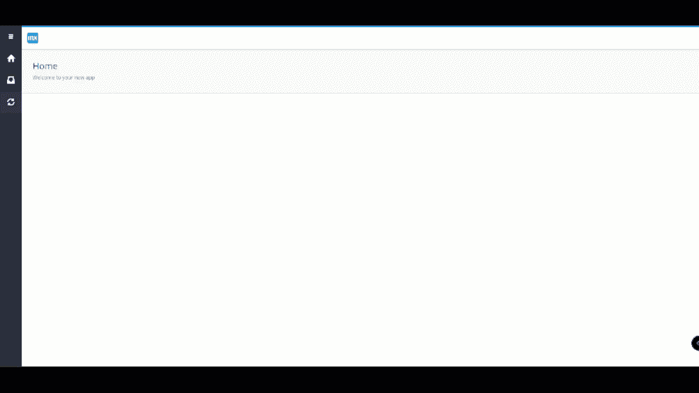**

**接下来，导航到电子邮件管理页面并执行首次设置。我喜欢使用 Gmail 地址发送电子邮件，但你可以使用任何 smtp 设置。**

**gmail 帐户的设置如下:**

**Gmail SMTP 服务器地址:**smtp.gmail.com****

**Gmail SMTP 用户名:**您的完整 Gmail 地址(如 yourusername@gmail.com)****

**Gmail SMTP 密码:**您的 Gmail 密码****

**Gmail SMTP 端口(TLS): **587****

**Gmail SMTP 端口(SSL): **465****

**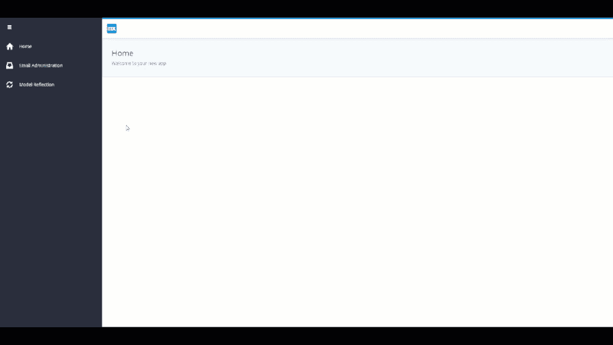**

**输入凭据后，您可以单击“下一步”按钮，继续发送测试电子邮件。**

**大多数时间，在您打开“允许不太安全的应用程序”设置之前，Gmail 会阻止您的 Mendix 应用程序。如果您遇到此问题，将返回的错误是您的密码不正确。为了让不太安全的应用程序登陆 [**这篇**](https://support.google.com/accounts/answer/6010255?p=lsa_blocked&hl=en&visit_id=636858418039852636-3356419578&rd=1) 谷歌文章。**

**如果你的邮件通过了，恭喜！您刚刚在 Mendix 应用程序中设置了电子邮件功能。现在，为了更进一步，让我们用一个令牌设置一个模板，然后从一个微流发送一封电子邮件。**

**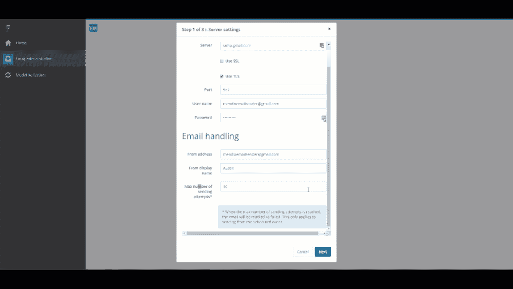**

****模板****

**您应该做的第一件事是打开“我的第一个模板”示例。然后滚动到底部，找到“令牌”部分。在这里，您可以将数据库中的实体及其属性链接到电子邮件模板。对于本例，我们将使用 EmailCustom 模块中的“EmailInfo”表。**

**选择的对象将是“emailinfo ”,然后您可以按“new”为所选对象中的每个属性创建一个标记。在我们的例子中，电子邮件信息表中只有一个属性可以用来创建令牌。**

**“令牌”字段是令牌的名称，“类型”是属性，“属性”字段是您选择“信息”的地方。创建后，您可以将令牌添加到电子邮件正文中。要调用令牌，需要在令牌名称周围使用大括号和百分号。在此示例中，我们的令牌将是“”。**

**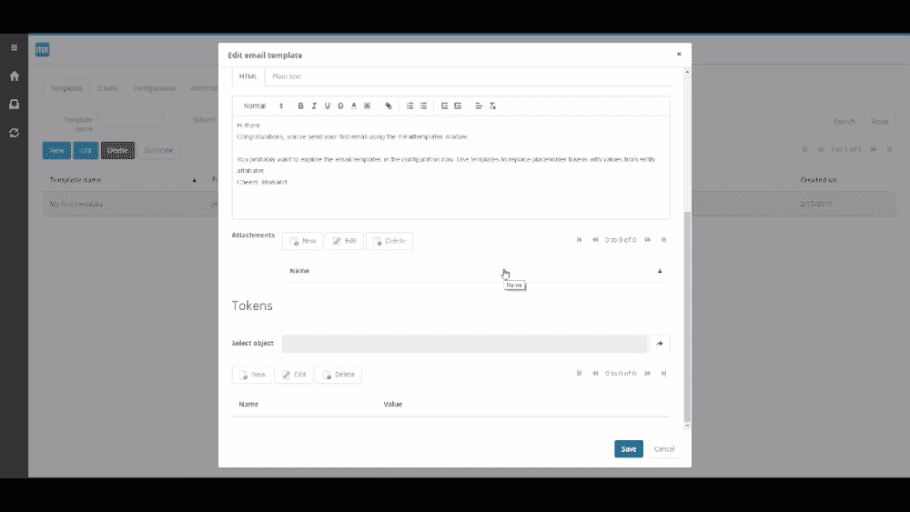**

**现在您的模板已经创建，您可以在微流程中使用它来发送电子邮件。在我创建的电子邮件定制模块中，有一个名为“示例 _ 发送电子邮件”的微流程右键单击此微流以将其包含到您的项目中，然后将电子邮件地址放入电子邮件地址变量中。(以上链接项目中的示例)**

**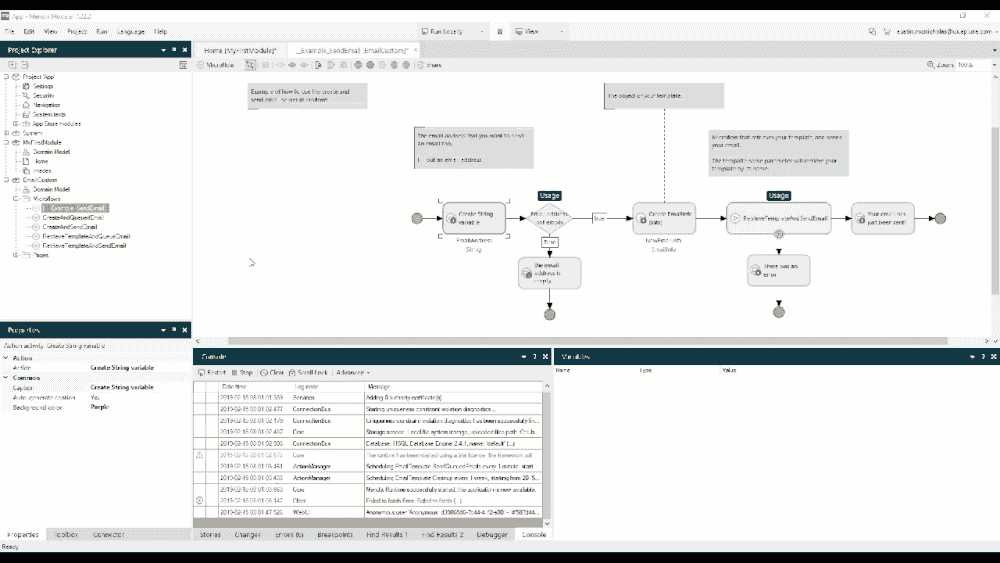**

***上图出自 Mx7，但步骤与 Mx 8.18.3* 相同**

**完成后，您可以将此按钮添加到应用程序中的任何页面，以进行测试。**

**接下来运行您的应用程序，然后按您刚才添加的按钮。如果您的电子邮件成功，将会弹出一条消息，您应该会在收件箱中收到一封电子邮件。**

**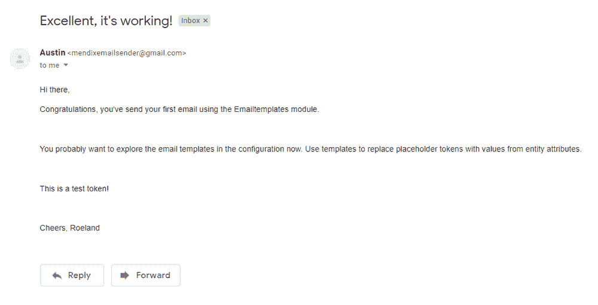**

**如果你收到了电子邮件，那就恭喜了！您刚刚发送了第一封测试电子邮件！**

## **阅读更多**

*   **[https://docs . mendix . com/developer portal/deploy/sending-email](https://docs.mendix.com/developerportal/deploy/sending-email)**
*   **[https://docs . mendix . com/app store/modules/email-with-templates](https://docs.mendix.com/appstore/modules/email-with-templates)**
*   **【https://docs.mendix.com/appstore/modules/model-reflection **
*   **[https://docs.mendix.com/appstore/modules/encryption](https://docs.mendix.com/appstore/modules/encryption)**
*   **[https://docs . mendix . com/developer portal/deploy/sending-email](https://docs.mendix.com/developerportal/deploy/sending-email)**

***来自发布者-***

***如果你喜欢这篇文章，你可以在我们的* [*媒体页面*](https://medium.com/mendix) *或者我们自己的* [*社区博客网站*](https://developers.mendix.com/community-blog/) *找到更多喜欢的。***

***希望入门的创客，可以注册一个* [*免费账号*](https://signup.mendix.com/link/signup/?source=direct) *，通过我们的* [*学苑*](https://academy.mendix.com/link/home) *获得即时学习权限。***

**有兴趣更多地参与我们的社区吗？你可以加入我们的 [*Slack 社区频道*](https://join.slack.com/t/mendixcommunity/shared_invite/zt-hwhwkcxu-~59ywyjqHlUHXmrw5heqpQ) *或者想更多参与的人，看看加入我们的*[*Meet ups*](https://developers.mendix.com/meetups/#meetupsNearYou)*。***