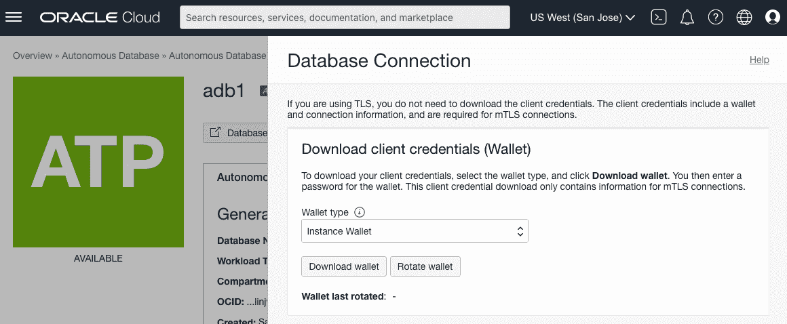
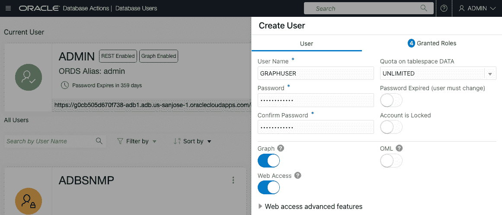

# 在云上设置 Oracle 图形(ADB)

> 原文：<https://medium.com/oracledevs/setup-oracle-graph-on-cloud-adb-9f92aa5b8846?source=collection_archive---------0----------------------->


(2022 年 11 月 24 日更新为 22.4 版)

在本文中，我将分享一个使用自治数据库的 **Oracle Graph** 设置过程的简要概述。这些步骤在[研讨会](https://apexapps.oracle.com/pls/apex/dbpm/r/livelabs/view-workshop?wid=686)中有更全面的解释，所以请查看更多细节。

Oracle Graph 可以与任何版本的 Oracle 数据库一起使用，无论是在本地还是在云中(从 12.2 版开始)。Oracle Cloud Always Free 服务包括两个**自治数据库**实例，这是一个完全托管的数据库服务。我将在另一篇文章[中解释数据库云服务(DBCS)的设置过程。](https://ryotayamanaka.medium.com/setup-oracle-graph-on-cloud-dbcs-84bc198d54a0)

我们将创建一个**图形服务器**，这是一个内存中的图形分析环境，并将它与后端数据库集成。Graph Server 的市场映像可在 Oracle Cloud 上获得，因此易于部署。您可以使用永远免费服务中包含的计算实例来启动映像。

**创建一个 ADB 实例**

我不会详细描述这一步，因为与 Oracle Graph 相关的 ADB 没有特殊设置。您可以为 Oracle Graph 选择 ATP(自主事务处理)或 ADW(自主数据仓库)。

让我们假设亚开行在这里被命名为`adb1`。


**创建网络**

创建一个网络并打开必要的端口。转到网络>虚拟云网络。


使用向导创建新的 VCN。启动 VCN 向导>创建具有互联网连接的 VCN >启动 VCN 向导。

```
VCN Name: vcn1
Other items: (no need to change)
```


在这里，我们创建一个名为`vcn1`的 VCN。


使端口 7007 可访问。转到虚拟云网络> vcn1 >公共子网-VC n1 > VC n1 的默认安全列表>添加入口规则，并创建以下规则。在生产使用中，限制客户端的 IP 地址以获得更好的安全性。

```
Source Type: CIDR
Source CIDR: 0.0.0.0/0
IP Protocol: TCP
Source Port Range: (All)
Destination Port Range: 7007
Description: Graph Server
```


**创建图形服务器**

转到 Marketplace 选项卡，搜索“图形服务器和客户端”。


这里我们选择版本 22.4.0.0，但是如果您选择其他版本，过程是相同的。


不需要改变堆栈信息。


转到“配置变量”屏幕，选择要创建的计算实例的形状。Always-free 有两个选项: **A1。弯曲**(安培臂)和 **E2.1 .微型** (AMD)。A1。Flex 的内存更大，更可取，但 A1。Flex 实例如此受欢迎，以至于在某些地区没有可用的实例。


我的建议是先用正常可用的 E2.1.Micro 确认以下步骤，再用 A1 试试。稍后灵活处理。


上传您的公钥，以便稍后通过 SSH 连接实例，并选择上面创建的 VCN 和公共子网。


最后，指定 JDBC 网址。对于从图形服务器到数据库的连接，我们将使用一种称为数据库钱包的安全方法。根据 ADB 的名称更改`adb1_low`。`/etc/oracle/graph/wallets`是将要创建的计算实例上的目录路径，因此您不需要修改它。在后面的步骤中，我们将在此目录中存储一个 wallet (=用于数据库认证的唯一加密密钥)。

```
jdbc:oracle:thin:@adb1_low?TNS_ADMIN=/etc/oracle/graph/wallets
```


创建堆栈。这通常需要几分钟。


在日志的末尾，显示了计算实例的 IP 地址和图形可视化应用程序的 URL。


如果域中没有可用的计算实例，作业将失败，并在日志中显示“主机容量不足”消息。请转到编辑作业，更改形状或域，然后重试。


**提供亚行钱包**

从 Oracle 云控制台导航到目标 ADB。


单击数据库连接。


选择要下载的实例 Wallet。



输入密码以保护钱包。


将钱包(ZIP 文件)上传到计算实例上的目录`/etc/oracle/graph/wallets`(这个位置在上面的步骤中指定了)。

```
$ scp -i <private_key> <Wallet_database_name>.zip opc@<public_ip_for_compute>:/etc/oracle/graph/wallets

Example:

$ scp -i key.pem ~/Downloads/Wallet_ADB1.zip opc@203.0.113.14:/etc/oracle/graph/wallets
```

要部署 Wallet，请登录到计算实例。

```
$ ssh -i <private_key> opc@<public_ip_for_compute>

Example:

$ ssh -i key.pem opc@203.0.113.14
```

提取 ZIP 文件并更改组权限。

```
$ cd /etc/oracle/graph/wallets/
$ unzip Wallet_ADB1.zip
$ chgrp oraclegraph *
```

**创建用户**

创建一个用户，并赋予其上面创建的角色。

从菜单中选择数据库用户。


单击“创建用户”按钮，输入用户名和密码。此外，启用图形和 Web 访问，并将表空间配额设置为无限制(或任何适当的数量)。



从“授予的角色”选项卡中，选择图形开发人员和 PGX 会话添加已发布图形角色。还应该选择角色 CONNECT 和 RESOURCE，因此保持选中这些角色，因为它们也是必需的。


创建用户后，重新登录数据库操作。


验证您可以作为新用户登录。


**打开图形界面应用**

在网络浏览器中打开`https://<public_ip_for_compute>:7007/ui`。

Marketplace 映像附带一个自签名 SSL 证书，必须将其更改为您自己的证书才能用于生产。如果您继续使用自签名 SSL 证书，您的 web 浏览器将显示警告。

在 Chrome 中，在窗口中键入`thisisunsafe`(没有文本框，只是在窗口上键入)将带你到 Graph Viz 屏幕。


在 Firefox 中，点击高级>接受风险并继续。


以上面创建的数据库用户身份登录。


由于样本图“hr”已经加载，按下执行查询按钮，它将从数据库中提取一个子图。


安装完成。让我们在以后的文章中更多地尝试创建和可视化不同的图形！

请从以下网址了解有关 **Oracle Graph** 的更多信息:

*   [中](/tag/oracle-graph) (=所有带有 Oracle Graph 标签的文章)
*   [堆栈溢出](https://stackoverflow.com/questions/tagged/oracle-graph) (=带 oracle-graph 标签的问题)
*   [Slack AnDOUC](https://join.slack.com/t/andouc/shared_invite/zt-1a2hmiz6f-vLlblcQyv0t9FMraMMP5uQ) (=邀请链接，请访问#graph)
*   [Slack OracleDevRel](https://join.slack.com/t/oracledevrel/shared_invite/zt-uffjmwh3-ksmv2ii9YxSkc6IpbokL1g) (=邀请链接，请访问#oracle-db-graph)