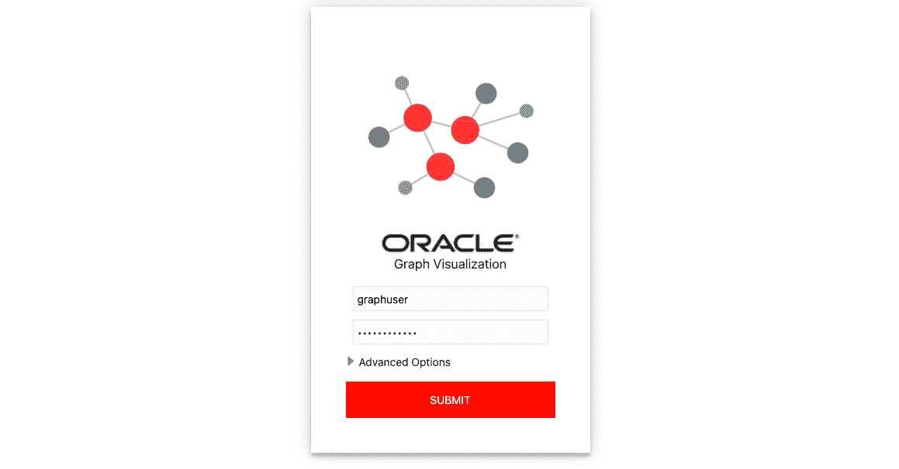
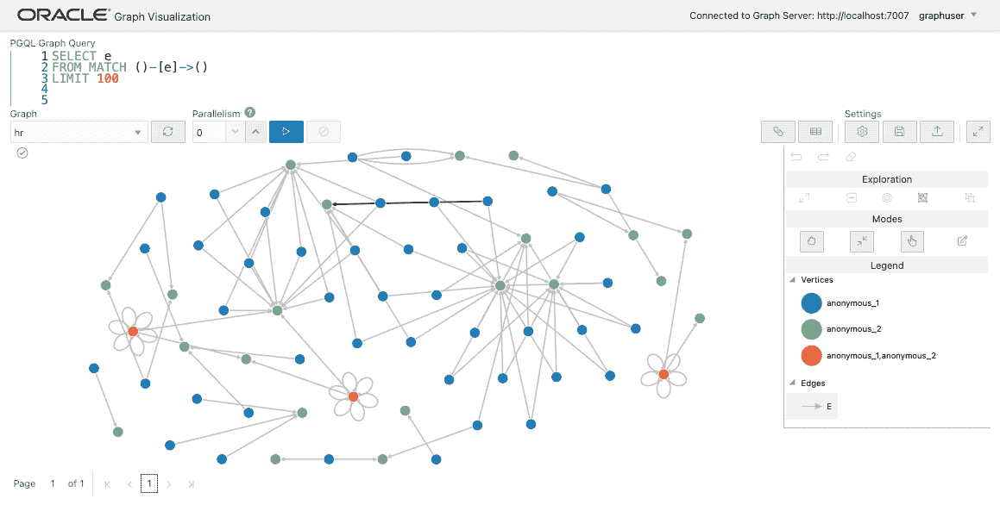

# 在云上设置 Oracle 图形(DBCS)

> 原文：<https://medium.com/oracledevs/setup-oracle-graph-on-cloud-dbcs-84bc198d54a0?source=collection_archive---------0----------------------->


我在之前的文章中描述了使用自治数据库的 Oracle Graph 的设置过程。Oracle Graph 可用于所有 Oracle 数据库版本(12.2 及更高版本除外)，无论是内部部署还是云部署，因此让我在此分享一下使用数据库云服务(DBCS)的设置过程。正如我们在 ADB 文章中所做的，我们将使用图形服务器的市场图像。

自治数据库(ADB)包含在 Oracle Cloud 上永远免费的服务中，如果你想免费使用，请参考 [ADB 文章](https://ryotayamanaka.medium.com/setup-oracle-graph-on-cloud-adb-9f92aa5b8846)。

**创建一个 DBCS 实例**

我不会详细描述这一步，因为与 Oracle Graph 相关的 DBCS 没有特殊的设置。

我们可以检查从 Oracle 云控制台连接到数据库的信息，如下所示。


假设 DB 系统和主机名前缀都设置为`dbcs1`，连接数据库容器的服务名确认如下。

```
$ ssh -i <private_key> opc@<public_ip_address>Example:$ ssh -i key.pem opc@203.0.113.14
```

切换到`oracle`用户。

```
$ sudo su - oracle
```

通过 SQL*Plus 以 SYS 用户的身份连接到数据库中的`PDB1`容器。

```
$ sqlplus sys@<public_ip_address>:1521/<service_name> as sysdba
SQL>Example:$ sqlplus \
  sys@203.0.113.14:1521/dbcs1_pdb1.sub012345.vcn1.oraclevcn.com \
  as sysdba
SQL>
```

您也可以使用操作系统验证进行如下连接。

```
$ sqlplus / as sysdba
SQL> alter session set container = DBCS1_PDB1;
SQL>
```

退出 SQL*Plus。

```
SQL> exit
```

**应用 PL/SQL 补丁**

从[这里](https://www.oracle.com/database/technologies/spatialandgraph/property-graph-features/graph-server-and-client/graph-server-and-client-downloads.html)获取用于 PL/SQL 的 Oracle Graph Client。对于版本 22.3，将下载文件 v 1021725–01 . zip。

将文件复制到 DBCS 实例。

```
$ scp -i <private_key> V1021725-01.zip opc@<public_ip_address>:/tmpExample:$ scp -i key.pem V1021725-01.zip opc@203.0.113.14:/tmp
```

登录到 DBCS 实例。

```
$ ssh -i <private_key> opc@<public_ip_address>
```

由`oracle`用户解压文件。

```
$ sudo su - oracle
$ unzip /tmp/V1021725-01.zip
$ unzip oracle-graph-plsql-22.3.0.zip -d oracle-graph-plsql
```

以 SYS 用户身份连接到数据库容器。

```
$ sqlplus / as sysdbaSQL> show pdbs
    CON_ID CON_NAME           OPEN MODE   RESTRICTED
---------- ------------------ ----------- ---------- ----------     
         2 PDB$SEED           READ ONLY   NO       
         3 DBCS1_PDB1         READ WRITE  NOSQL> alter session set container = DBCS1_PDB1;
```

应用 PL/SQL 补丁程序。

```
SQL> @oracle-graph-plsql/19c_and_above/opgremov.sql
SQL> @oracle-graph-plsql/19c_and_above/catopg.sql
SQL> exit
```

**创建用户**

以 SYS 用户身份再次连接。

```
$ sqlplus / as sysdba
$ alter session set container = DBCS1_PDB1;
```

创建一个新用户 GRAPHUSER，并为其分配必要的角色。

```
CREATE USER graphuser
IDENTIFIED BY WELcome123##
DEFAULT TABLESPACE users
TEMPORARY TABLESPACE temp
QUOTA UNLIMITED ON users;GRANT
  alter session 
, create procedure 
, create sequence 
, create session 
, create table 
, create trigger 
, create type 
, create view
, graph_developer
TO graphuser;exit
```

确保您能够以新用户的身份使用上面确认的 JDBC URL 连接到数据库。

```
$ sqlplus graphuser/WELcome123##@<public_ip_address>:1521/<service_name>Example:$ sqlplus graphuser/WELcome123##@203.0.113.14:1521/dbcs1_pdb1.sub01234567890.vcn1.oraclevcn.com
```

**创建网络**

为图形服务器创建一个网络，并打开一个必要的端口。您也可以使用已经为 DBCS 实例创建的网络。

转到网络>虚拟云网络。


使用向导创建新的 VCN。启动 VCN 向导>创建具有互联网连接的 VCN >启动 VCN 向导。

```
VCN NAME: vcn1
Other items: (No need to change)
```


在这里，我们创建一个名为`vcn1`的 VCN。


使端口 7007 可访问。转到虚拟云网络> vcn1 >公共子网-VC n1 > VC n1 的默认安全列表>添加入口规则，并创建以下规则。在生产使用中，限制客户端的 IP 地址以获得更好的安全性。

```
Source Type: CIDR
Source CIDR: 0.0.0.0/0
IP Protocol: TCP
Source Port Range: (All)
Destination Port Range: 7007
Description: For Graph Server
```


**创建一个图形服务器**

转到 Marketplace 选项卡，搜索“图形服务器和客户端”。


在本例中，我们选择最新版本(22.2.0 ),但是如果您选择其他版本，过程是相同的。


不需要改变堆栈信息。


在配置变量中设置每个项目。


选择之前创建的 VCN 和公共子网作为网络。


对于要连接到数据库的图形服务器，请按以下格式指定之前确定的 JDBC URL。

```
jdbc:oracle:thin:@<public_ip_address>:1521/<service_name>Example:jdbc:oracle:thin:@203.0.113.14:1521/dbcs1_pdb1.sub01234567890.vcn1.oraclevcn.com
```

创建一个堆栈。这通常需要几分钟。


已成功创建堆栈。


在日志的末尾，显示了计算实例的 IP 地址和图形可视化应用程序的 URL。


**打开图形 Viz app**

在网络浏览器中打开`https://<public_ip_for_compute>:7007/ui`。

Marketplace 映像附带一个自签名 SSL 证书，必须将其更改为您自己的证书才能用于生产。如果您继续使用自签名 SSL 证书，您的 web 浏览器将显示警告。

在 Chrome 中，在窗口中键入`thisisunsafe`(没有文本框，只是在窗口上键入)会将你带到 Graph Viz 屏幕。


在 Firefox 中，点击高级>接受风险并继续。



由于样本图“hr”已经加载，按下执行查询按钮，它将从数据库中提取一个子图。



安装完成。让我们在以后的文章中更多地尝试创建和可视化不同的图形！

请从以下网址了解有关 **Oracle Graph** 的更多信息:

*   [中](/tag/oracle-graph) (=所有带有 Oracle Graph 标签的文章)
*   [堆栈溢出](https://stackoverflow.com/questions/tagged/oracle-graph) (=带有 oracle-graph 标记的问题)
*   [Slack AnDOUC](https://join.slack.com/t/andouc/shared_invite/zt-1a2hmiz6f-vLlblcQyv0t9FMraMMP5uQ) (=邀请链接，请访问#graph)
*   [Slack OracleDevRel](https://join.slack.com/t/oracledevrel/shared_invite/zt-uffjmwh3-ksmv2ii9YxSkc6IpbokL1g) (=邀请链接，请访问#oracle-db-graph)