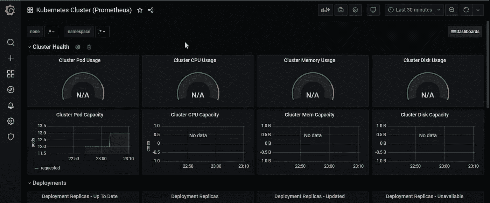

# 使用 Helm 在 Kubernetes 集群上设置 Prometheus 和 Grafana 监控

> 原文：<https://medium.com/globant/setup-prometheus-and-grafana-monitoring-on-kubernetes-cluster-using-helm-3484efd85891?source=collection_archive---------0----------------------->

在本文中，我们将讨论 Prometheus 和 Grafana，以及如何使用 Helm charts 为任何 Kubernetes 集群设置监控。我们还将学习如何将 Prometheus 和 Grafana 连接在一起，并在 Grafana 上设置一个基本的仪表板来监控 Kubernetes 集群上的资源。

该文章包含以下部分:

*   介绍
*   先决条件
*   普罗米修斯建筑
*   舵部署优于手动部署的优势
*   安装舵
*   安装普罗米修斯和格拉夫纳
*   将 prometheus 数据源添加到 Grafana 仪表板中
*   结论
*   参考

**简介**

普罗米修斯和格拉夫纳一起工作，以提供监测。Prometheus 将数据获取作为数据源，并将该数据输入 Grafana，Grafana 可用于可视化具有吸引力的仪表板的数据。

关于普罗米修斯

*   Prometheus 是一个开源系统监控和警报工具包。
*   Prometheus 收集并存储作为时间序列数据的指标。
*   它为 Kubernetes 等容器编排平台提供了开箱即用的监控功能。

关于格拉夫纳

*   Grafana 是一个多平台开源分析和交互式可视化 web 应用程序。
*   当连接到支持的数据服务时，它为 web 提供图表、图形和警报。
*   Grafana 允许我们查询、可视化、提醒和理解我们的指标，无论它们存储在哪里。除了 Prometheus 之外，一些受支持的数据源还有 AWS CloudWatch、AzureMonitor、PostgreSQL、Elasticsearch 等等。
*   我们可以创建自己的仪表板或使用 Grafana 提供的现有仪表板。我们可以根据自己的需求个性化仪表盘。

关于头盔

*   Helm 是 Kubernetes 的包装经理。
*   它允许我们简化 Kubernetes 应用程序的安装和管理。
*   Helms 使用一种叫做 Charts 的打包格式，它基本上是 yaml 清单文件的集合。

**先决条件**

*   用户必须具备 Kubernetes 的基本知识。
*   在我们可以设置的地方应该有一个 Kubernetes 集群。普罗米修斯和格拉夫纳。在本文中，我们使用 minikube 创建了一个新的 Kubernetes 集群。Minikube 可用于在 Windows、macOS 或 Linux 上建立本地 Kubernetes 集群。

**普罗米修斯建筑**

此图展示了普罗米修斯的架构及其生态系统组件:

**普罗米修斯服务器:**存储和抓取时间序列数据的主服务器。

**TSDB(时间序列数据库):**指标是任何系统了解其健康和运行状态的关键方面。任何系统的设计都需要收集、存储和报告指标，以提供系统的脉动。数据存储在一系列时间间隔内，需要一个高效的数据库来存储和检索这些数据。 [OpenTSDB 时间序列数据库](http://opentsdb.net/overview.html)就是这样一个可以满足这种需求的时间序列数据库。

**PromQL:** Prometheus 以 PromQL 的形式定义了一种丰富的查询语言，从时间序列数据库中查询数据。

**Pushgateway:** 可用于支持短期作业。

**导出器:**它们用于将指标数据提升到 prometheus 服务器。

**Alertmanager:** 用于向 slack、email 等各种通信渠道发送通知，通知用户。

**Helm 图表相对于手动 Kubernetes 部署的优势**

*   没有 Helm for Kubernetes，我们依靠 Kubernetes YAML 文件来配置 Kubernetes 工作负载。这些 YAML 文件指定了部署容器所需的一切。从每个 Pod 需要配置的方式到 Kubernetes 集群如何实现负载平衡，一切都必须在这些 YAML 文件中提及。因此，要设置一个新的 Kubernetes 工作负载，我们需要为该工作负载创建一个 YAML 文件。手动执行意味着编写多个 YAML 文件——为我们创建的每个工作负载编写一个。工作负载可以是部署、服务、配置图、机密和配置文件。
*   使用 Helm for Kubernetes，我们可以下载现有的 Helm 图表，这些图表已经提供了清单文件，而不必手动为每个应用程序编写单独的 YAML 文件。以下几点强调了 Helm 相对于手动部署的优势。
*   Helm charts 包含各种 Kubernetes 资源的模板，这些资源组合在一起形成一个应用程序。
*   在不同的 Kubernetes 集群上部署 Helm 图表时，可以对其进行模板化。舵图的创建方式是将特定于环境或部署的配置提取到单独的文件中，以便在部署舵图时指定这些值。例如，在开发、试运行和生产环境中部署应用程序时，我们不需要单独的图表。
*   除此之外，Helm 还提供了存储库支持，其中图表可用于 Prometheus 和 Grafana 等流行工具，这些工具可直接用于设置 pod。

**安装舵**

Helm 项目提供二进制文件和脚本来获取和安装 Helm。这些是官方释放头盔的方法。除此之外，Helm 社区还提供了通过不同的包管理器安装 Helm 的方法。通过这些方法的安装可以在 helm 的官方网站([https://helm.sh/docs/intro/install/](https://helm.sh/docs/intro/install/))找到。我们已经在下面提到的步骤中介绍了二进制安装。

*   基于操作系统从 Helm 的 GitHub 库下载所需版本。在本例中，我们使用了 Windows 操作系统。
*   解压缩下载的文件(helm-v 3 . 9 . 0-RC . 1-windows-amd64 . zip)并将 helm 二进制文件复制到任何文件夹中，然后在环境 path 变量中添加文件夹路径。一旦完成，我们就可以使用头盔了。

**安装普罗米修斯和格拉夫纳**

*   去下面回购，【https://artifacthub.io/】。
*   使用以下命令在 helm repo 中查找 Prometheus 和 Grafana 的官方图表以及存储库:

*掌舵回购添加普罗米修斯社区*[*https://prometheus-community.github.io/helm-charts*](https://prometheus-community.github.io/helm-charts)

*赫尔姆回购加格拉夫纳*[*https://grafana.github.io/helm-charts*](https://grafana.github.io/helm-charts)

*掌舵回购更新*

*   接下来，我们需要使用以下命令安装 Prometheus:

*掌舵安装普罗米修斯-社区普罗米修斯/普罗米修斯*

*   它将通过一个简单的命令安装普罗米修斯系统所有需要的组件。如果没有舵图，我们将不得不自己编写清单文件。

*   我们可以使用 nodeport 将 prometheus-server 服务公开给 internet，但是 prometheus 提供的 GUI 不如 Grafana 提供的好。同样，我们可以使用以下命令:

*kubectl 公开服务 Prometheus-server—type = node port—target-port = 9090—name = Prometheus-server-ext*

*minikube service Prometheus-server-ext*

*   我们可以使用以下命令安装 Grafana:

*舵安装 grafana grafana/grafana*

*   它将在 Grafana 的集群上创建以下组件:

*   我们可以使用以下命令向外界公开 Grafana 服务:

*kubectl 公开服务 grafana—type = node port—target-port = 3000—name = grafana-ext*

*minikube service graf ana-ext*

*   我们可以使用以下命令找到登录 Grafana 所需的用户名和密码。它将以加密格式显示值，我们可以使用 OpenSSL 和 base 64 格式对其进行解码。

*kubectl get secret —名称空间默认 grafana -o yaml*

*echo " password _ value " | OpenSSL base64-d；回声*

*echo“用户名 _ 值”| OpenSSL base64-d；回声*

**将 prometheus 数据源添加到 Grafana 仪表板中**

*   使用上一步生成的管理员用户和密码登录 Grafana 仪表板。
*   在 add data source 部分，提供安装后为 prometheus-server-ext 生成的服务 URL，并保存它。

*   接下来，我们需要创建一个新的仪表板。我们既可以从头开始创建仪表板，也可以导入 grafana.com Prometheus 上可用的仪表板。为了简化本文，我们使用 grafana.com 上编号为“3662”的仪表板。添加仪表板编号并点击加载。

*   在下一个屏幕上，为这个仪表板添加数据源，在我们的例子中是 Prometheus，然后点击 import。

*   我们将有一个漂亮的仪表板为我们准备，我们可以根据我们的要求修改。

**结论**

我们可以看到，与通过 Kubernetes yaml 文件进行的手动部署相比，通过使用 helm charts，可以毫不费力地在 Kubernetes 集群上设置 Prometheus 和 Grafana 监控。

**参考文献**:

*   [https://www.thetips4you.com/](https://www.thetips4you.com/)
*   [https://phoenixnap.com/kb/prometheus-grafana](https://phoenixnap.com/kb/prometheus-grafana)
*   [https://github.com/helm/helm/releases](https://github.com/helm/helm/releases)