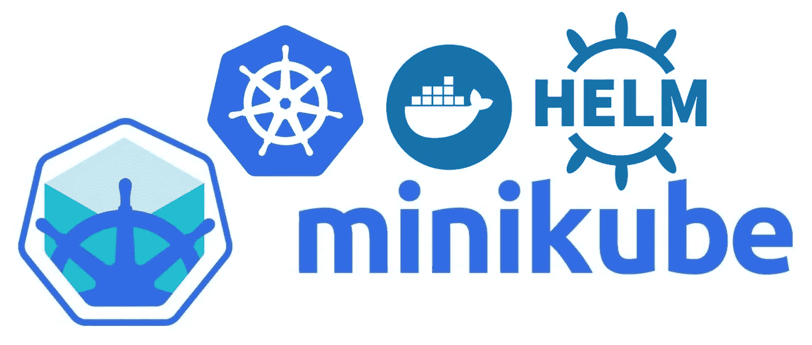
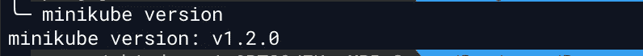
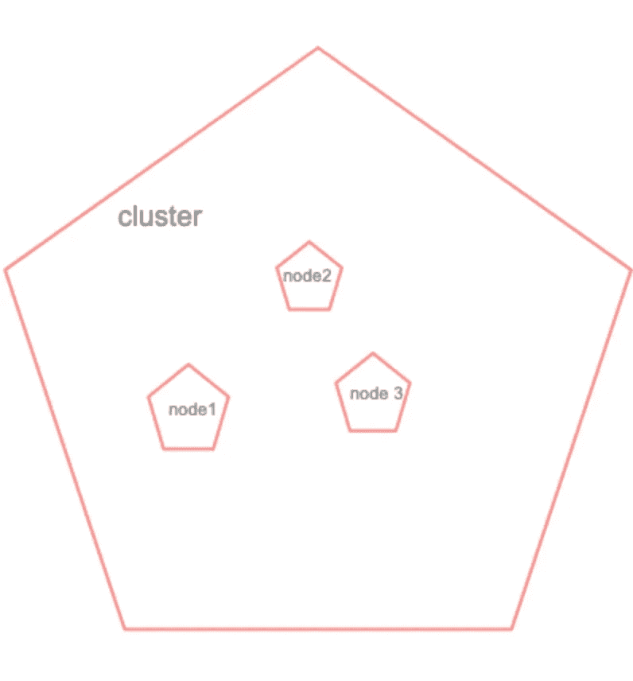
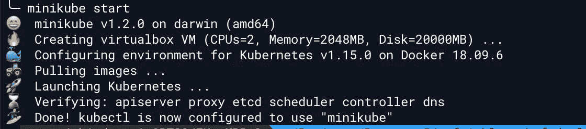
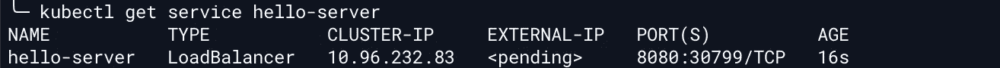
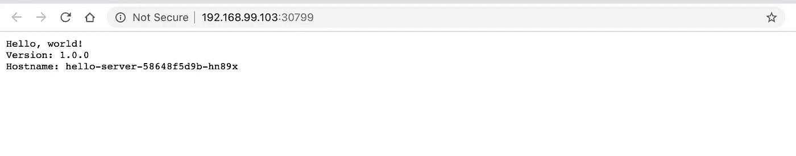
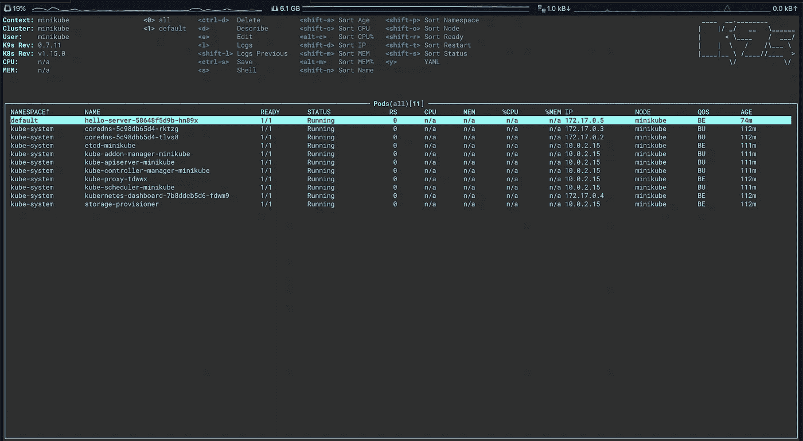
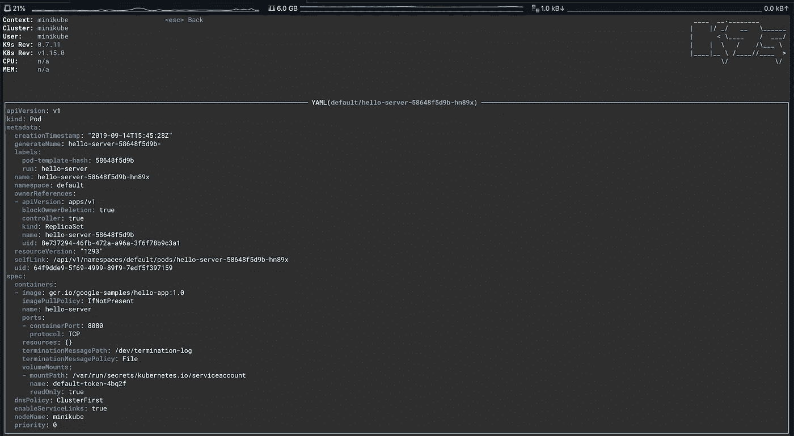

# 设置您的机器以学习 Kubernetes

> 原文：<https://medium.easyread.co/setup-your-machine-to-learn-kubernetes-a1d1b1d3335d?source=collection_archive---------3----------------------->

## 在本地机器上设置 Kube 和关于 Kubernetes 的介绍



Image from google

# 介绍

Kubernetes 是一个开源的容器编排引擎，用于自动化容器化应用程序的部署、伸缩和管理。这个开源项目由云本地计算基金会主办([【CNCF】](https://www.cncf.io/about))*(“来自 Kubernetes 文档”)。* Kubernetes 最初由 google 设计，自 2003 年以来一直由 google 使用，项目名称为“Borg”(Borg 是 Google 的大规模集群管理)，然后在 2013 年 Google 引入了 Omega 作为集群管理，这是一种灵活、可扩展的大型计算集群调度程序。2014 年，谷歌发布了开源的 Kubernetes，现在 Kubernetes 由 CNCF 托管。

# 迷你库贝

也许你知道 GKE 的 Kubernetes(谷歌 Kubernetes 引擎)，如果你想在 GKE 学习 Kubernetes，你应该有一个谷歌云平台账户，你必须为此付费。云服务提供商有很多 Kubernetes 的产品，但是为了学习，可以使用名为 [minikube](https://github.com/kubernetes/minikube) 的工具。当你在 GitHub 打开 minikube 时，你会看到 minikube 的目的是成为本地 Kubernetes 应用程序开发的最佳工具，并支持所有适合的 Kubernetes 特性。您可以在 macOS、Linux 和 windows 中安装 minikube。

# 安装 Minikube

在安装 minikube 之前，您必须安装虚拟盒，要安装虚拟盒，您可以按照这里的[操作。如果你已经完成了虚拟盒子，接下来安装 minikube。](https://www.virtualbox.org/wiki/Downloads)

对于 mac 用户，您可以轻松地键入以下命令

```
$ brew cask install minikube
```

你也可以在 minikube [文档页面看到另一个安装。](https://minikube.sigs.k8s.io/docs/start/linux/)

安装 minikube 后，要检查 minikube 是否已经安装，您可以键入`minikube version`它将打印出您的 minikube 版本



Minikube version

# 部署您的第一个应用程序

让我们部署您的第一个应用程序，在您部署之前，首先您应该创建 Kubernetes 集群(集群类似于您将在此放置节点的地方)，节点是虚拟机或物理计算机，在 Kubernetes 集群中用作工作机，或者简单地说，节点是您集群中单台计算机的代表。



Cluster diagram

让我们键入`minikube start`这个命令将在您的机器上创建您的 Kubernetes 集群。



Create Kubernetes cluster

设置完成后，您的集群将使用 google 的 hello world 部署第一个应用程序，运行以下命令。

```
$ kubectl run hello-server — image=gcr.io/google-samples/hello-app:1.0--port 8080
```

此命令将在群集上运行 hello-app 映像，该映像是从 gcr.io 中提取的，您可以尝试打开 gcr.io，您会在上面看到许多映像。

然后让我们公开您的应用程序，以便您可以从外部访问，运行此命令。

```
$ kubectl expose deployment hello-server --type="LoadBalancer"
```

键入`kubectl get service hello-server`之后，它将显示在您的集群上运行的服务。



Get Kubernetes service

实际上，当你在 GKE 上运行它时，GKE 会分配外部 IP，但在你的本地 minikube 上不会分配，所以你应该键入`minikube hello-server`它会在你的浏览器上打开服务。



hello world minikube

# K9S(提高 Kubernetes 生产力的 CLI 工具)

部署您的第一个应用程序是很容易的，但是您觉得应该记住许多 kubectl 命令。所以有一个叫‘K9S’的工具，K9S 是一个交互式 CLI 应用程序，运行一些 kubectl 命令。

对于 mac 用户，您可以通过 brew `brew install k9s`轻松安装，然后 k9s 将被安装，现在您可以在命令行中键入`k9s`，所以您会看到这一点。



k9s

你可以使用 k9s 作为接口，而不是记住 kubectl 命令，所以你可以通过 k9s 执行一些 kubectl 操作，你可以在这里阅读更多关于 [k9s 的内容。此外，只需输入 y 即可看到服务的 YAML](https://k9ss.io/)



YAML file of hello-server

我认为这是介绍 Kubernetes 和设置您的机器来学习 Kubernetes 的一个简短部分，k9s 中有许多快捷方式，您可以阅读更多内容，Kubernetes 还有更多功能，您应该了解和学习 Kubernetes。