# 用于从 MySQL 迁移到 Oracle 的 SQL Developer

> 原文：<https://medium.com/oracledevs/setup-your-virtual-box-sandpit-for-a-test-migration-from-mysql-to-oracle-e6c502abed41?source=collection_archive---------4----------------------->

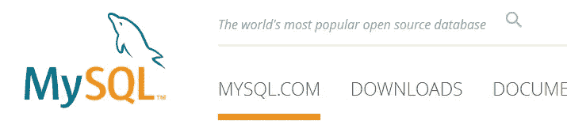

有时，您可能需要将应用程序从 MySQL 迁移到更高级的地方，比如 Oracle 数据库。

关于 MySQL 和 Oracle 数据库之间的区别，请参考文档。

 [## Oracle 和 MySQL 对比

### 本节讨论将 MySQL 数据库转换为 Oracle 数据库时需要考虑的表设计问题。这个…

docs.oracle.com](https://docs.oracle.com/cd/E12151_01/doc.150/e12155/oracle_mysql_compared.htm#CHDIIBJH) 

Oracle SQL Developer 将帮助您完成迁移，官方文档如下。

[](https://docs.oracle.com/cd/E25259_01/appdev.31/e24285/migration.htm#RPTUG40600) [## SQL Developer:迁移第三方数据库

### 迁移是从源第三方(非 Oracle)数据库复制模式对象和数据的过程，例如…

docs.oracle.com](https://docs.oracle.com/cd/E25259_01/appdev.31/e24285/migration.htm#RPTUG40600) 

这也有助于设置浮动虚拟机来进行测试迁移。幸运的是，Oracle 提供了包含 LAMP 栈(以 MySQL 为特色)的 vagger 项目。

很容易像下面这样克隆 Oracle vagger repo，用 LAMP 扩展设置 vagger Oracle Linux 7 项目。

```
$ git clone [https://github.com/oracle/vagrant-projects](https://github.com/oracle/vagrant-projects)
```

同样对于测试迁移，让我们设置 Oracle SQL Developer 同时连接到 MySQL 实例和 Oracle 实例。

以下说明适用于 Windows 10。

**安装带有 LAMP 扩展的 Oracle Linux 7**

设置一个 LAMP 堆栈，将为您提供一个开箱即用的预建 MySQL 实例。

但是，现在不推荐使用 Oracle vagger-projects \ LAMP 目录，而使用带有 LAMP 扩展的 Oracle Linux 7。ie 游民-projects\OracleLinux\7。

由于我们希望通过主机上的 SQL Developer 登录到 Oracle Linux 7 虚拟机，我们还需要添加一个本地端口 forward 3306。

要在虚拟盒子中创建一个灯堆栈，请执行以下操作(Windows 10):

```
$ cd vagrant-projects\OracleLinux\7
$ set EXTEND=lamp && set EXPOSE=8080:80 && set EXPOSE=3306:3306 && vagrant up
```

如果一切顺利，那么您会看到安装的第一个 LAMP 组件将是 Apache。

```
====================================================================
Package            Arch   Version     Repository                Size   ====================================================================
Installing:
httpd24            x86_64 1.1-19.el7  ol7_software_collections 4.5 k
```

接下来是 MySQL 服务器和客户端。

```
====================================================================
Package                 Arch    Version         Repository    Size
====================================================================
Installing:
mysql-community-client  x86_64  8.0.23-1.el7    ol7_MySQL80   48 M
mysql-community-server  x86_64  8.0.23-1.el7    ol7_MySQL80  518 M
```

最后，PHP 组件将紧随其后。

```
====================================================================
Package              Arch   Version      Repository                Size
====================================================================
Installing:
rh-php73             x86_64 1-1.el7      ol7_software_collections 4.3 k
rh-php73-php         x86_64 7.3.20-1.el7 ol7_software_collections 1.4 M
rh-php73-php-fpm     x86_64 7.3.20-1.el7 ol7_software_collections 1.5 M
rh-php73-php-mysqlnd x86_64 7.3.20-1.el7 ol7_software_collections 165 k
```

现在登录以确认虚拟机一切正常。

```
$ vagrant ssh
```

您应该看到以下内容:

```
==> vagrant: Extension lamp using scripts/lamp.sh enabled
==> vagrant: Guest port 3306 exposed to port 3306 on hostWelcome to Oracle Linux Server release 7
LAMP architecture based on Oracle Linux Software Collections:
 - Apache 2.4, MySQL Community 8 and PHP 7.3The Oracle Linux End-User License Agreement can be viewed here:
* /usr/share/eula/eula.en_USFor additional packages, updates, documentation and community help, see:
* [https://yum.oracle.com/](https://yum.oracle.com/)To test your environment is correctly working, just open following URL from your Host OS:
[http://localhost:8080/info.php](http://localhost:8080/info.php)Please use following commands to enable Software Collection environments:
- Apache 2.4: # scl enable httpd24 /bin/bash
- PHP 7.3: # scl enable rh-php73 /bin/bash[vagrant@ol7-vagrant ~]$
```

现在做一个快速测试，在您的主机上打开浏览器，然后打开以下 URL:

```
[http://localhost:8080/info.php](http://localhost:8080/info.php)
```

您应该会看到页面顶部如下所示:

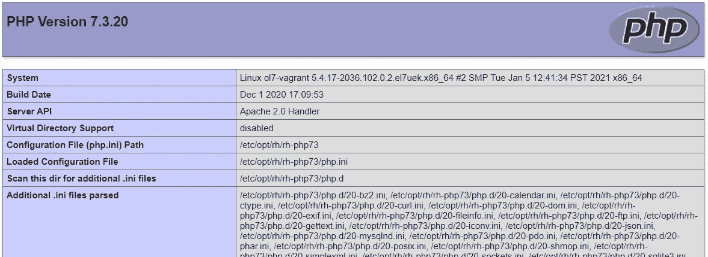

向下滚动，您会看到 MySQL 的一些信息:

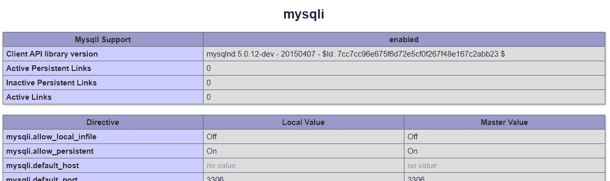

这样基本的设置就安装好了。

**设置从主机登录 MySQL】**

要为 MySQL(包括 SQL Developer)创建远程登录的能力，我们首先需要使用临时 root 密码在本地登录。

显示 MySQL 实例的临时 root 密码(即系统密码)，如下所示:

```
$ sudo grep 'temporary password' /var/log/mysqld.log
```

现在使用显示的临时超级用户密码登录:

```
$ mysql -uroot -p
Enter password:Welcome to the MySQL monitor.  Commands end with ; or \g.
Your MySQL connection id is 8
Server version: 8.0.23Copyright (c) 2000, 2021, Oracle and/or its affiliates.Oracle is a registered trademark of Oracle Corporation and/or its
affiliates. Other names may be trademarks of their respective
owners.Type 'help;' or '\h' for help. Type '\c' to clear the current input statement.mysql>
```

最好更改本地帐户的 root 密码:

```
ALTER USER 'root'@'localhost' IDENTIFIED BY 'Wlrb1234,';
```

当我们在本地登录时，我们需要设置从主机登录的帐户。

```
Welcome to the MySQL monitor.  Commands end with ; or \g.
Your MySQL connection id is 12
Server version: 8.0.23Copyright (c) 2000, 2021, Oracle and/or its affiliates.Oracle is a registered trademark of Oracle Corporation and/or its
affiliates. Other names may be trademarks of their respective
owners.Type 'help;' or '\h' for help. Type '\c' to clear the current input statement.mysql> CREATE USER root IDENTIFIED BY 'Root-passw0rd';
Query OK, 0 rows affected (0.02 sec)mysql>
```

现在我们设置从 MySQL Workbench 登录——相同的登录凭证稍后也将用于 SQL Developer。

在 MySQL 工作台中，使用主机名 127.0.0.1，端口 3306，用户名 root 和密码。

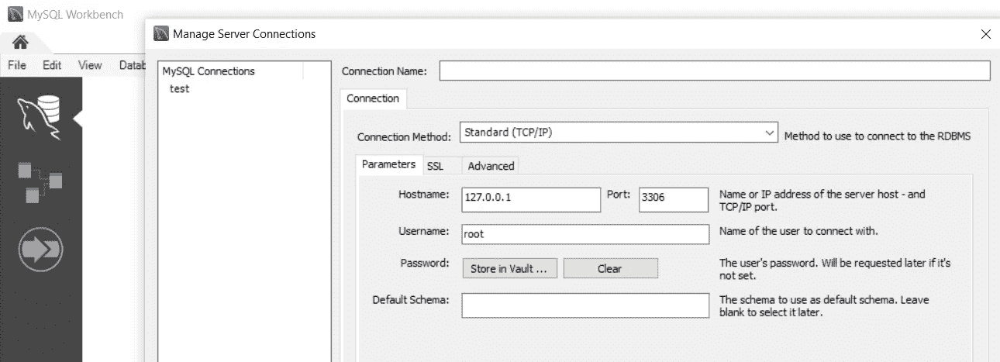

现在我们可以从 MySQL Workbench 中签出数据库。

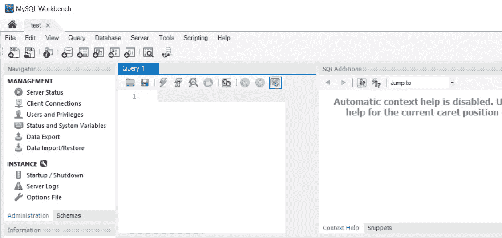

这证实了我们可以从 Windows 10 主机登录。

然而，从 SQL Developer 工具登录 MySQL 对迁移更有帮助。

**下载并安装 J 连接器**

出于迁移目的，我们也可以使用 SQL Developer 登录，然后我们可以从同一个工具访问 MySQL 和 Oracle 数据库。

要从 SQL Developer 登录到 MySQL，我们需要从 MySQL 安装程序安装 J 连接器。

如果您还没有 MySQL 安装程序，请从这里获取:

https://dev.mysql.com/downloads/windows/installer/8.0.html

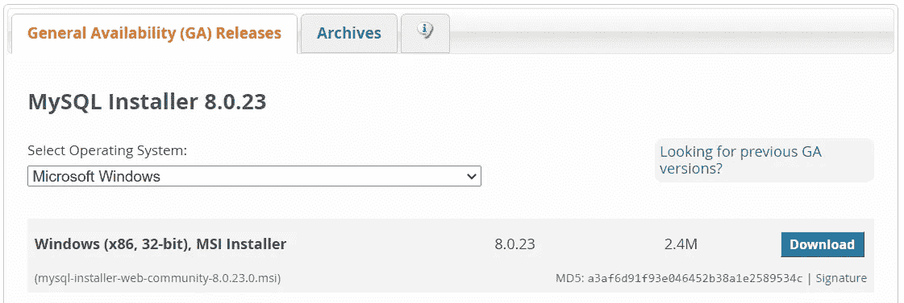

只需下载基本安装程序:MySQL-installer-we b-community-8 . 0 . 23 . 0 . MSI(2.38 MB)

从基本安装程序中，选择安装选定的产品。

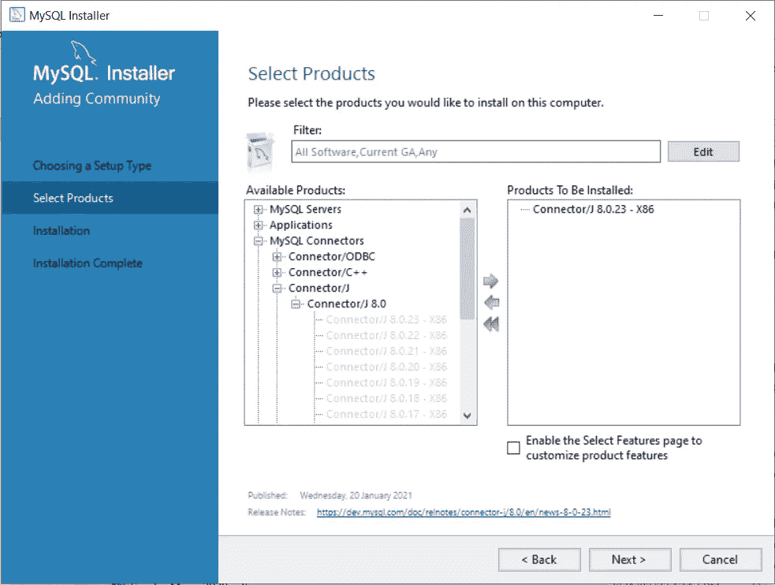

选择最近的 J 连接器，然后选择下一个，然后执行。

您将看到如下安装日志:

```
1: Action 13:28:12: INSTALL. 
1: 1: MySQL Connector J 2: {42EFD60B-24CE-466E-864F-8ED744643ED3} 
1: Action 13:28:12: FindRelatedProducts. Searching for related applications
1: Action 13:28:12: ValidateProductID. 
1: Action 13:28:12: CostInitialize. Computing space requirements
1: Action 13:28:12: FileCost. Computing space requirements
1: Action 13:28:12: CostFinalize. Computing space requirements
1: Action 13:28:12: InstallValidate. Validating install
1: Action 13:28:12: InstallInitialize. 
1: Action 13:28:12: RemoveExistingProducts. Removing applications
1: Action 13:28:12: ProcessComponents. Updating component registration
1: Action 13:28:12: GenerateScript. Generating script operations for action:
1: Updating component registration
1: Action 13:28:12: UnpublishFeatures. Unpublishing Product Features
1: Action 13:28:12: RemoveFiles. Removing files
1: Action 13:28:12: InstallFiles. Copying new files
1: File: Copying new files,  Directory: ,  Size: 
1: Action 13:28:12: RegisterUser. Registering user
1: Action 13:28:12: RegisterProduct. Registering product
1: Registering product
1: Action 13:28:12: PublishFeatures. Publishing Product Features
1: Feature: Publishing Product Features
1: Action 13:28:12: PublishProduct. Publishing product information
1: 
1: Action 13:28:12: InstallFinalize. 
1: Action 13:28:12: ProcessComponents. Updating component registration
1: Action 13:28:12: InstallFiles. Copying new files
1: File: CHANGES,  Directory: C:\Program Files (x86)\MySQL\Connector J 8.0\,  Size: 267994
1: File: INFO_BIN,  Directory: C:\Program Files (x86)\MySQL\Connector J 8.0\,  Size: 186
1: File: INFO_SRC,  Directory: C:\Program Files (x86)\MySQL\Connector J 8.0\,  Size: 136
1: File: LICENSE,  Directory: C:\Program Files (x86)\MySQL\Connector J 8.0\,  Size: 100771
1: File: mysql-connector-java-8.0.23.jar,  Directory: C:\Program Files (x86)\MySQL\Connector J 8.0\,  Size: 2415211
1: File: README,  Directory: C:\Program Files (x86)\MySQL\Connector J 8.0\,  Size: 1245
1: Action 13:28:13: RegisterProduct. Registering product
1: {42EFD60B-24CE-466E-864F-8ED744643ED3}
1: Action 13:28:13: PublishFeatures. Publishing Product Features
1: Feature: ProductFeature
1: Action 13:28:13: PublishProduct. Publishing product information
1: Action 13:28:13: RollbackCleanup. Removing backup files
1: 1: MySQL Connector J 2: {42EFD60B-24CE-466E-864F-8ED744643ED3} 3: 1 
1: The action 'Install' for product 'Connector/J 8.0.23' completed successfully.
```

因此，下次您启动 MySQL 安装程序时，您将会看到所有已安装的组件，如下所示:

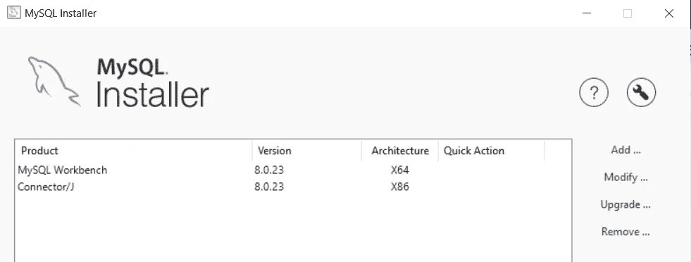

**设置 SQL Developer 使用 J 连接器**

现在我们需要设置 SQL Developer 来使用 J 连接器管理数据库连接。

在 SQL Developer 中，从顶部菜单中选择工具，然后选择首选项，然后在数据库下，您会看到第三方 JDBC 驱动程序。

现在导航到 jar 文件“C:\ Program Files(x86)\ MySQL \ Connector J 8.0 \ MySQL-Connector-Java-8 . 0 . 23 . jar”。

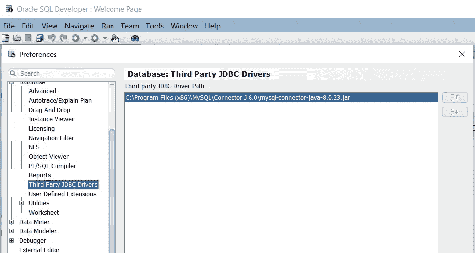

现在在 SQL Developer 中创建一个数据库连接，MySQL 数据库类型将可供选择。

因此，使用之前使用的相同根帐户，以及 127.0.0.1 主机名和转发的本地端口 3306。

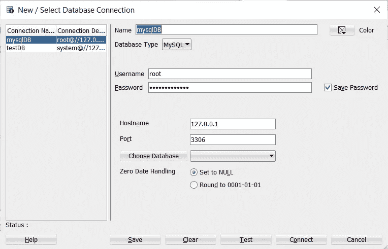

现在，您应该能够访问 MySQL 数据库了。

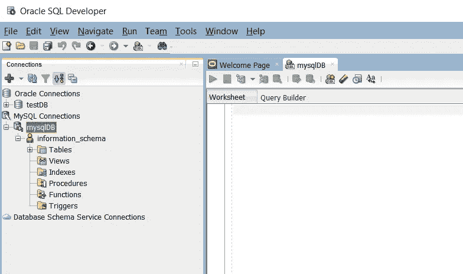

如果您已经登录到 Oracle 数据库，那么您可以同时连接到这两个数据库。

对于运行 Oracle 数据库的流浪虚拟机，您将像以前一样使用 127.0.0.1 和本地转发端口 1521。

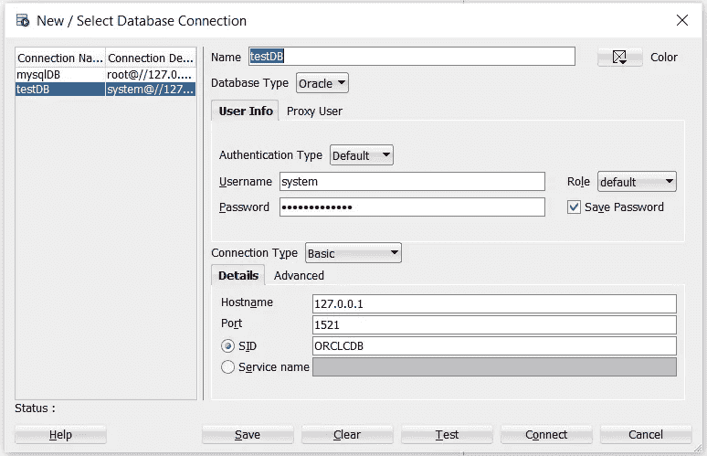

现在您可以访问 Oracle 数据库了。

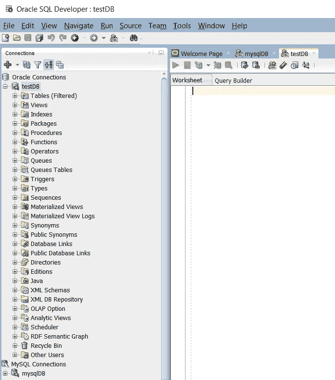

现在，您可以使用一个通用工具访问 MySQL 和 Oracle 实例了。

*Paul Guerin 是一名专注于 Oracle 数据库的国际顾问。Paul 在东南亚的全球交付中心工作，但他的客户来自澳大利亚、欧洲、亚洲和北美。此外，他还出席了一些世界领先的甲骨文会议，包括甲骨文 2013 年世界开放大会。自 2015 年以来，他的工作一直是 IOUG 最佳实践技巧小册子以及 AUSOUG、Oracle Technology Network、Quest 和 Oracle Developers (Medium)出版物的主题。2019 年，他被授予 My Oracle 支持社区最有价值贡献者。他是一名 DBA OCP，并将继续参与 Oracle ACE 计划。*