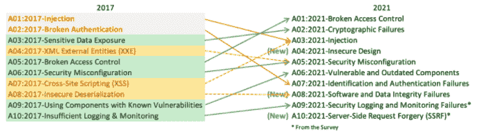

# DevSecOps 时间要考虑的七项活动

> 原文：<https://medium.com/globant/seven-activities-to-consider-at-devsecops-time-c8d6a12b4eb6?source=collection_archive---------2----------------------->

# 介绍

我们都已经看到了敏捷方法的好处，但是这些好处给网络安全专家带来了巨大的挑战。我们不能再在交付项目前花费数年时间。新的商业模式要求更快的交付，不超过几个月。网络安全需要为此做好准备。它需要从一开始就参与项目，并在整个软件开发生命周期中，在每个阶段提供安全性，而不是在项目结束时进行安全审查。

这种新方法伴随着一种新的工作方式:DevSecOps。这是什么意思？安全管理的独特视角，将应用程序开发、安全运营和基础架构作为一个代码(IaaS)结合在一个连续的自动化交付中。

当你试图作为一名开发员工作时，重要的是要明白你的主要目标是加速和促进你同事的工作。你在那里不是作为一个审计员或停止过程，你在那里是作为一个推动者。你的责任是帮助团队按时交付高质量的安全产品。记住这一点，并享受关于如何做的文章！

本文将涵盖以下主题:

1.  开发(DEV):
    将工具自动化到管道中
2.  安全(SEC):
    意识
    根据法规设计产品(合规)
    威胁建模
    静态和动态代码分析以及漏洞管理
3.  运营(OPS):
    监控
    身份管理

# **1-自动化工具进入流水线**

对于 DevSecOps 专业人员来说，最重要的事情之一是能够在持续集成和持续交付(CI/CD)管道中集成任何工具。这种自动化节省了可以用于执行其他任务的时间，同时减少了出错的机会。通过实现这些自动化的解决方案，您可以确保至少满足了安全性方面的最低要求。

如果您是在这个领域迈出第一步，我建议您从静态代码分析开始。之后，你可以添加一个动态应用安全测试(DAST)，或者第三方组件审查。

大多数供应商已经提供了可以轻松实现的按需解决方案。以下是我用过的一些工具:SonarQube、BlackDuck、Fortify、WebInspect 和 Qualys。

# **2-意识**

用户是我们的第一道防线。所有这些都应该为公司或开发增加一层安全保障。为了实现这一目标，他们需要了解基本的安全概念，并能够做出决策，使公司更加强大，而不是扩大攻击面。

考虑到这一点，安全专家需要识别团队和公司的痛点，并提供关于它们的意识。

请记住，必修课并不总是吸引人的最佳方法。有时，道德钓鱼活动、吸引人的演讲者或展示良好实践的消息对安全团队来说都是有用的工具。

# **3-根据法规设计产品(合规)**

当您的团队正在开发一个应用程序，而您正从安全角度为他们提供建议时，考虑最终产品是否在任何法规的范围内是非常重要的，例如 GDPR、PCI、HIPAA 等。如果是这种情况，您需要相应地设计它，由于减少了返工，这将为项目节省时间和金钱。

在许多情况下，一个法规认为是个人身份信息(PII)，另一个法规可能不是。例如，GDPR(第 4 条，第 1 点)认为 IP 是个人数据，并且您的 project server 日志包含它。又如，PCI 在加密和存储方面有非常严格的规则。所有这些都规定了日志、身份管理、授权和认证方法，以及必须执行的控制等。

*我的两点建议:注意哪些法规适用于你的行业、地理位置和客户的国籍，并在开发过程的每一步都牢记这一点。在某些情况下，不合规的罚金可能高达公司年度账单的 20%。*

# **4-威胁建模**

这种技术允许项目在实现之前，在设计阶段就识别出弱点或薄弱区域。主要目标是通过列出应用程序可能遭受的所有攻击来达到最低标准安全级别，并提出安全控制措施来减轻这些攻击。执行此任务可以防止恶意软件、DDoS 攻击等。

*我的两分钱:我推荐一款可能帮助你快速检测系统威胁的游戏:* ***特权提升，威胁建模*** *这是一款* *网络安全卡牌游戏。这个游戏是由亚当·肖斯塔克(Adam Shostack)创作的，在网上也有可能找到。游戏使用 STRIDE(欺骗、篡改、否认、信息泄露、拒绝服务和特权提升)，主要思想是让开发者参与进来，从软件开发生命周期的一开始就发现缺陷。*

# **5-静态和动态代码分析和漏洞管理**

当开发人员编写新代码时，他们并不总是遵循安全最佳实践，尤其是在开发环境中。减少攻击面，保护整个应用程序，保证机密性、完整性和可用性；安全团队必须定期执行静态和动态分析。

当扫描完成后，就该分析结果，识别误报，根据严重性对真实结果进行分类，选择那些代表项目快速成功的结果，并与开发团队共享信息。以适当的方式集中精力共享修复这些错误或发现所需的所有信息是非常重要的。对必须改进的代码片段进行截图，与他们分享替代解决方案，并跟踪进度，帮助他们实施必要的更改。请记住，作为安全专家，您和开发团队一样有责任按时交付安全的产品。

在这个主题中有两个非常重要的事情需要考虑:首先，正如我在第一项中提到的，这种分析可以集成到管道中，因此它是自动执行的。其次，管理人员的执行报告或仪表板也很重要，以便提供关于应用程序当前安全状态的可见性，以及修复 bug 所需的工作。

作为参考，我强烈推荐使用 OWASP 网站(OWASP)作为信息来源。在那里，您可以找到年度十大漏洞、有用的工具等等。

*来源:*[*【https://owasp.org/Top10/】*](https://owasp.org/Top10/)

# **6-监控**

如今，公司必须假设他们在未来的某个时候会受到攻击。这将使他们在工作时知道您永远不可能 100%安全，并且他们需要准备好尽快检测和响应事件。

有了这个目标，监控就成了一个非常重要的话题。它让公司能够建立行为模式，识别异常并触发警报。它提供了关于基础架构和应用程序的可见性。它使我们能够采取预防或反应行动，并快速做出决定。它还能让我们进行取证，让我们从发生的事情中学习。如果我们想以安全的方式航行，从这些攻击中恢复过来并变得更加强大是一个关键方面。

# **7-身份管理**

管理角色、用户、权限、组和服务帐户是任何开发项目的基本安全实践。在安全性和可用性之间找到一个平衡点导致了最小特权原则。因此，允许开发人员只执行他们需要的，而不在故障排除时阻止他们的工作，是一个巨大的安全挑战。将上下文考虑在内是非常重要的，例如，评估我们正在设置的环境。如果我们在开发环境中工作，我们就不会像在生产环境中那样受到限制。

作为 DevSecOps 工作时要记住的另一个方面是，连续和自动化的任务可能需要具有高权限(完全访问、管理员访问等)的服务/系统帐户。在这种情况下，根据我的经验，建议不要删除这些权限。如果您这样做，结果将是项目遭受延迟，一些过程可能失败，并且部署将变得更加复杂。因此，我建议检测那些需要特别关注的资源，并仔细监控它们。

# **8-结论**

以我的职业经验来看，负责这个角色真的很有趣，也很多样化。你将有机会发展你的技术和软技能，因为你两者都需要。

安全是质量的一部分。如果你追求高质量的交付，你必须注意并在安全方面投入资源。遵循上面列出的七个步骤，保证在每一层中添加安全性的最低标准，拥有安全的代码，加快上市时间并按时完成截止日期。作为一名安全专家，请记住，安全人员和团队的其他成员一样有责任按时交付。

虽然看起来很多，但这些都是在履行安全职责时不能忘记的活动。因此，当一个应用程序在生产中启动并运行时，请随意参加庆祝活动。