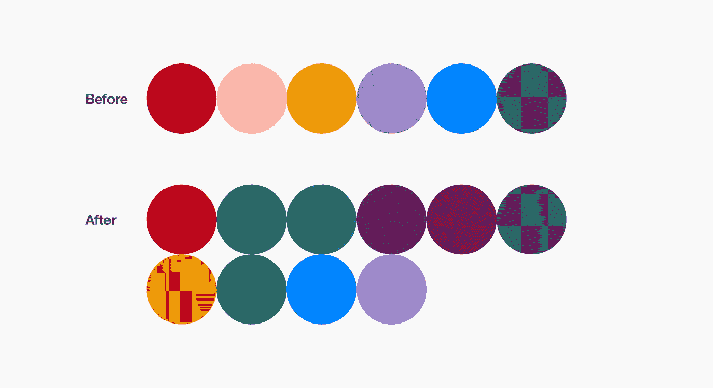
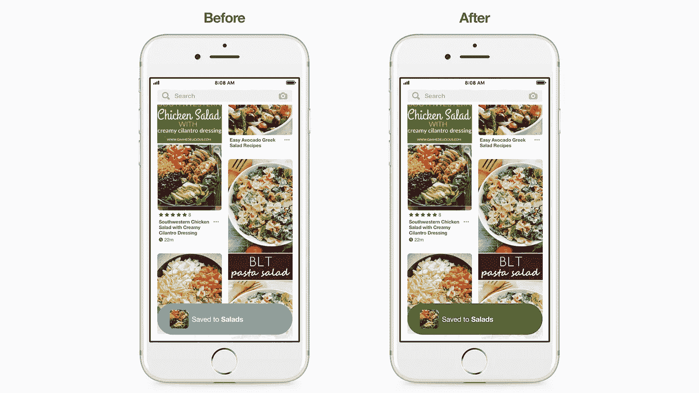
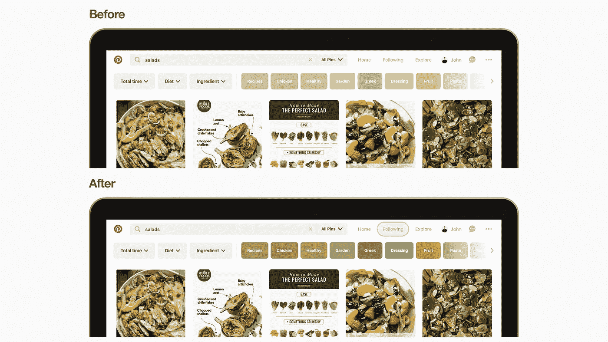
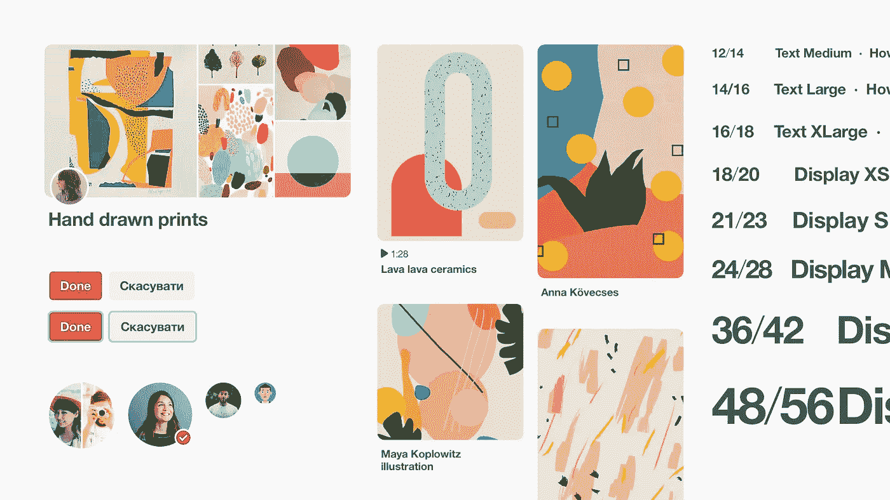

# 包容性产品设计的七个最佳实践

> 原文：<https://medium.com/pinterest-engineering/seven-best-practices-for-inclusive-product-design-9476c61f1e17?source=collection_archive---------0----------------------->

龙成| Pinterest 首席设计师，核心经验

在 Pinterest，我们的使命是帮助你发现并做你喜欢的事情。我们正在为每个人打造一款产品，因为最好的 Pinterest 是包容性的，并且容易被各种能力水平的人使用。这就是为什么今天我们分享我们在过去一年中积累的经验和最佳实践，因为我们[重新设计了 Pinterest](https://newsroom.pinterest.com/en/post/making-pinterest-inclusive-for-all-levels-of-vision) 以使盲人和视障人士更容易访问。

## **1。增加颜色对比度**

Pinterest 产品设计团队挑战了这样一个普遍的假设，即可访问的颜色并不美丽。我们为产品创建了一个 3.00:1 及以上对比度的调色板。

因此，无论您的辅助功能是否打开，文本在彩色背景下都易于阅读。

## **2。使用强大的排版层次**

我们认为好的排版是好设计的关键。我们确保在不使用太多不同灰度的情况下，印刷层次是有意义的。我们依靠强大的字体大小和粗体来创建一个有意义的层次结构，以便信息一目了然。我们还在应用中支持动态字体大小。这样，您可以使用默认的辅助功能将文本的大小更改为最适合您的大小。

## **3。有清晰的焦点指示器**

有视觉和运动障碍的人可以在没有鼠标或触控板的情况下浏览 Pinterest。我们为所有 Pinners 创建了直截了当且显而易见的焦点指示器，因此无论您的能力水平如何，您都可以清晰地使用我们的网站或应用程序。

## **4。不要依赖颜色**

在我们所有的用户流中，我们依赖灰度，只有一个清晰的动作调用颜色。这对色盲的人来说很好，因为我们不依赖颜色来表示信息。相反，我们依靠在用户流中很好地使用排版和空间层次来创造意义和信息结构。

## **5。使用 SVG**

将 png 替换为 SVG，这样当您使用大多数操作系统和浏览器上可用的内置缩放功能时，图标和 UI 组件会呈现得清晰锐利。这使得视力低下的人能够放大并清晰地看到小东西，而不管像素密度和缩放百分比如何。

## **6。考虑屏幕阅读器支持**

屏幕阅读器允许盲人和有视觉障碍的人接收语音反馈。在我们开始这个项目之前，有视觉障碍的人没有 Pinterest 的无缝注册体验，因为我们的注册和新用户体验没有针对屏幕阅读器进行优化。他们在浏览我们的应用程序时也遇到了麻烦，从主页信息到搜索再到他们的个人资料。自那以后，我们进行了重大更新，因此 Pinterest 完全可以与屏幕阅读器一起使用。

## **7。让易访问性成为工程师和设计师的思维模式**

最好的产品在设计和工程过程的每个阶段都是包容的。这就是为什么我们创建了一个全新的 UI 库，其中包括工程师和设计师在构建和设计 Pinterest 时使用的可访问组件。此外，自动化的可访问性检查已经到位，以确保我们为任何新功能都清楚地标记了图标和组件。

凭借这些最佳实践，我们将继续让 Pinterest 更加包容所有人。我们在更新我们的 iOS 和网络平台以满足大多数可访问性标准方面取得了重大进展，我们正在努力将这些变化逐步引入 Android。当你得到它的时候，让我们知道你的想法。

*鸣谢:Scott Andreae、Julia Cochran、Chris Lloyd、Rahul Malik、Shira Netter、Mallika Potter、Mara Sohn、Christian Vuerings、袁小珊、Joey Zingarelli、Linnea Zulch 以及 Pinterest 无障碍工作组的其他成员。*