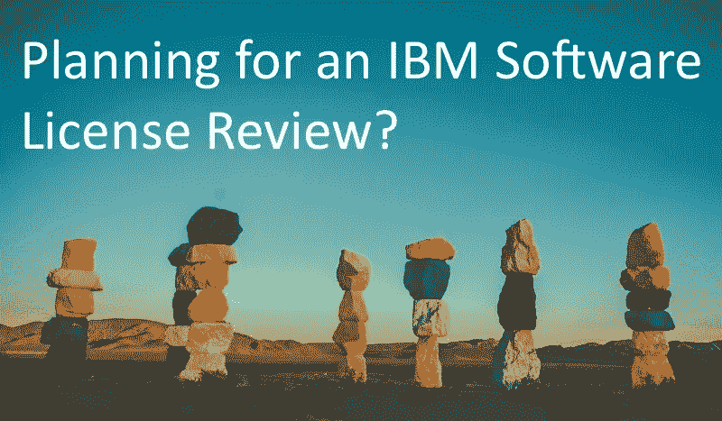

# 规划 IBM 软件许可证审查的七个考虑事项

> 原文：<https://medium.com/version-1/seven-considerations-for-planning-for-an-ibm-software-license-review-ccadc218a1fb?source=collection_archive---------1----------------------->

Photo by [Tim Trad](https://unsplash.com/@timtrad?utm_source=unsplash&utm_medium=referral&utm_content=creditCopyText) on [Unsplash](https://unsplash.com/s/photos/seven?utm_source=unsplash&utm_medium=referral&utm_content=creditCopyText)

不是“*如果”*而是“*”当“*您将被 IBM 联系进行 IBM 软件许可审查。即使您签订了 IBM 企业许可协议(ELA ),您仍然需要在续约 3 年之前进行自我声明(软审计)。

由于 IBM 的许可审查是必然的，所以您的组织做好准备才是有意义的。现在的一些计划可能有助于避免以后为额外的 IBM 许可证支付一大笔未编入预算的费用。

在我们与众多企业的日常合作中，我们的许可证顾问已经交付了数百个供应商审核项目，目的是控制审核流程并降低未编入预算的成本。基于这一经验，我们准备了一些关键步骤，供您在计划下一次 IBM 软件许可审查时考虑。

1.  **有审核函回复流程**

当您的组织收到来自 IBM 的审计信时，它通常会被发送到 CIO 或 CFO 的办公室。已经商定了一个简单的流程来处理 IBM(或另一个供应商)的审计信，这将确保它被快速传递给正确的人。它还允许通知其他利益相关者，以便他们为会议中出现的主题做好准备。

**2。制定审计响应计划**

开发一个 IBM 许可证审计响应计划将帮助您的组织快速建立一个项目来为审计辩护。审计响应计划中的许多任务适用于任何大型供应商审计，但是您还应该考虑 IBM 审计的特定任务，例如:

同意审计范围

从 Passport Advantage 生成权利清单报告

从 ILMT 运行许可证审计快照报告

拥有一个审核响应计划还可以让你从过去的审核中吸取经验教训。

**3。建立一个 IBM 审计响应团队**

IBM 审计需要您组织中几个团队的支持。让审计响应团队的成员事先达成一致将是一个明显的优势。在 [RACI](https://en.wikipedia.org/wiki/Responsibility_assignment_matrix) 图中就角色和职责达成一致也将加快决策过程。我们建议来自以下业务领域的代表:

首席财务官办公室

软件资产管理

金融

法律

信息技术运营

项目管理办公室

第三方顾问

**4。更新 IBM 的指定联系人**

您的组织将通过[电子通知](https://www.ibm.com/support/pages/node/718119)经常收到 IBM 关于产品变更的更新

他们还将从 Passport Advantage 门户网站收到有关 IBM 授权变更的更新。

合适的人得到这些更新了吗——他们还在组织中吗？

定期检查谁是[指定的 IBM 联系人](https://www.ibm.com/software/passportadvantage/pa_contacts.html#designate)将确保您不会错过任何可能与审计相关的重要通知。

**5。了解您的 IBM 许可权利**

随着产品的升级和 IBM S&S 的更新或取消，您的 IBM 许可证权利会随着时间的推移而改变。至少每年对您的 IBM 权利进行一次审查，这将突出任何可能在审计中出现的不足或变化，并给您时间来解决这些问题。

**6。检查 ILMT/比格菲克斯的健康状况**

如果您的组织正在利用随需应变许可规则，最新的 BigFix 和 IBM 许可证度量工具(ILMT)部署是至关重要的。您需要确保每个季度这些工具都运行正常，并且生成审计报告，以便在审计员提出请求时做好准备。如果对 BigFix 或 ILMT 的数据质量有任何疑问，在你还有时间纠正任何问题时，进行一次健康检查。

**7。获得 IBM 许可的帮助**

IBM 许可规则很复杂。即使是很小的部署错误，其代价也是巨大的。在进行任何基础架构更改之前，请寻求建议，例如:

物理到虚拟的迁移

向 VMware 集群添加节点

服务器的额外 CPU

这将有助于您避免日后的合规风险和未编入预算的成本。

IBM 软件许可审查总是会给你的组织带来压力、潜在的代价和破坏性。但是，如果您实施了一些建议的步骤，您可以减轻负担，并显著降低任何未编入预算的成本。

第 1 版的许可证专家在帮助企业准备审核和支持您顺利完成审核、降低未编入预算的成本和风险方面拥有丰富的经验。如果您的供应商已经与您联系并需要指导，或者您希望在[审核](https://www.version1.com/it-service/software-asset-management/license-audit/)时做好更多准备，那么[请联系我们](https://www.version1.com/contact/)以了解我们如何提供帮助。

**关于作者**

*Jason 是第 1 版 SAM 的负责人，我们的独立许可顾问(涵盖企业许可的所有方面)为全球客户提供专业知识，确保客户从其资产中获得最佳价值。如果您想了解有关降低许可证审核成本和风险的更多信息，请立即联系第 1 版的独立许可专家。*

**关于版本 1**

*为什么选择版本 1？我们将永远把你，顾客放在第一位。我们不受供应商限制，为众多在 Oracle、Microsoft 和 IBM 等领域拥有丰富专业知识的企业供应商提供独立的许可建议和指导。我们可以支持您对您的软件资产做出更好、更明智的决策；确保您了解做出正确决策的选项，以降低成本和风险，并持续保持许可证合规性*

资源:

[在此设置您的 IBM 认证](https://www.ibm.com/support/pages/node/718119)

[ILMT 概述](https://www.ibm.com/support/knowledgecenter/en/SS8JFY_9.2.0/com.ibm.lmt.doc/welcome/LMT_welcome.html)