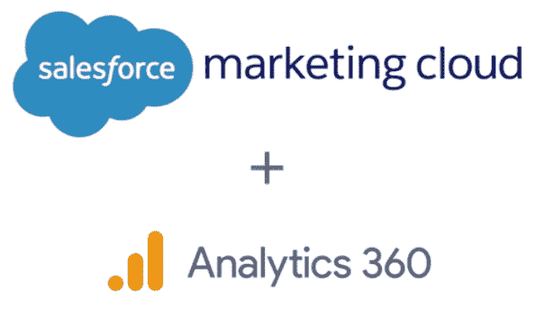
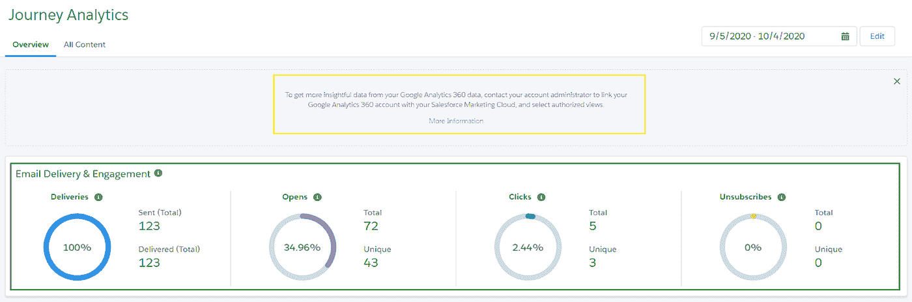
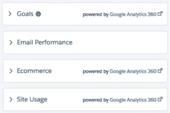
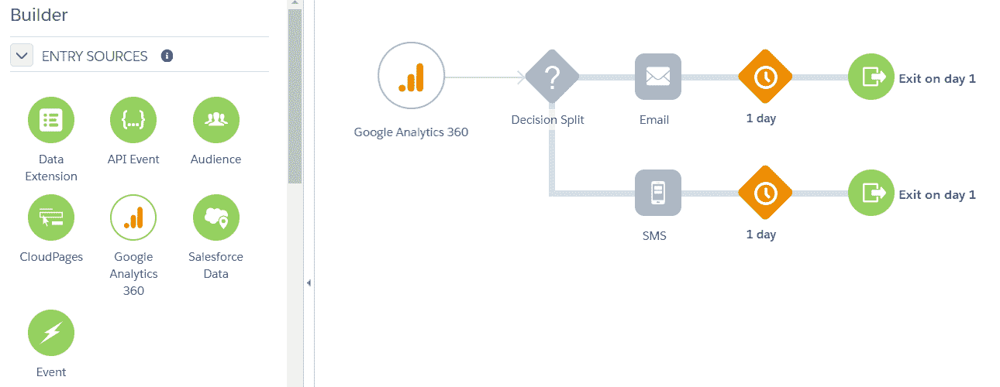
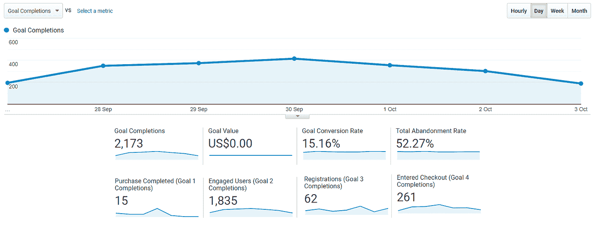
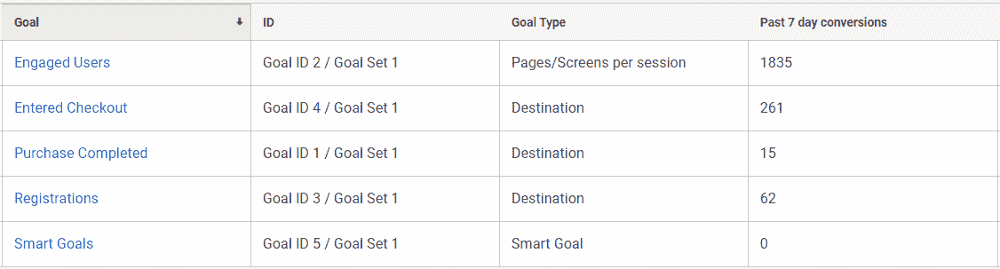

# SFMC GA360 集成优势

> 原文：<https://medium.com/globant/sfmc-ga360-integration-benefits-7df7a976953a?source=collection_archive---------0----------------------->

首先，请允许我分享一篇来自 2017 年 11 月的[文章](https://www.blog.google/products/marketingplatform/360/google-analytics-360-salesforce)，在这篇文章中，谷歌和 Salesforce 宣布了他们的产品谷歌分析 360 和 Salesforce 营销云之间的无缝集成合作伙伴关系。

SFMC GA360 integration

如果你想知道为什么我要分享一篇 3 年前的文章，请继续阅读。

关于我们将在本文中进一步讨论的产品和服务的一般信息:

*   **Google Analytics** 是一款非常流行的数字分析工具，被大多数网站和移动应用程序所使用。
*   **Salesforce 营销云**是营销自动化领域的市场领导者之一，它允许数字营销人员有效地管理他们的在线活动。
*   **Journey builder** 是一款在 SFMC 上市的产品，用于创建和激活多渠道营销活动，以接触客户。

对于任何已激活的旅程，默认的分析仪表板可用于在 SFMC 进行报告，提供以下基本统计数据:

1.  给料速度
2.  开放率
3.  点击率
4.  退订率

这在下面的绿色框中突出显示:

Journey Analytics in SFMC

上面黄色框中突出显示的部分建议用户启用 GA360 集成以获得更深入的见解。这个特别的通知激发了我写这篇文章的灵感，这篇文章详细介绍了集成带来的好处。

因此，如果您的组织或客户在孤岛中使用这两种产品，那么这就是您想要的发展方向，您可以将这两种产品联系起来，并了解从您的旅程活动中到达网站的访问者的全面视图。

集成所需的几个先决条件是:

1.  谷歌分析 360(高级账户)
2.  SFMC 帐户中可用的旅程生成器
3.  提供 GA360 连接器(付费功能)

在您的生产环境中配置和实施集成后，您可以直接在您的 sales force marketing cloud journey Analytics 仪表板中轻松查看启用了 Google Analytics 集成的每个旅程的所有主要 Google Analytics 指标和报告。

**第一个好处**:

成功整合后，旅程分析仪表板中启用了多个选项卡(突出显示为“由 Google Analytics 360 支持”)。

Analytics post integration

1.  **目标**:完成率、转换率和废弃率指标。
2.  **电子商务**:围绕收入、交易和订单价值的指标。
3.  **站点使用**:页面访问、会话、反弹等指标。

**注意**:报告界面具有高度的可配置性和直观性，只需点击几下鼠标即可启用许多部分。

这些 GA 支持的报告帮助我们了解我们的旅程和与消费者的沟通在推动流量和实现 GA 中的配置目标方面的有效性。

直接在 SFMC 旅程分析仪表板中分析 GA 报告有助于我们将目标和用户交互归因于特定的旅程。这也有助于预算和理解特定活动的投资回报率。

**第二个好处**:

在我们的旅程构建器营销活动中，使用 GA 受众作为入口来源。条目来源是我们在 SFMC 实例中维护的客户列表。这有助于旅程构建者了解进入此旅程的客户将来自哪里。

Journey builder in SFMC

通常情况下，大多数旅程运行于数据扩展或直接来自 SFDC 或某种具有客户属性的用户数据库的数据，但随着 GA360 集成的启用，我们可以有效地重新定位从 GA360 管理中配置的**受众**导出的用户。

这些受众只不过是 GA360 捕获的用户中的**部分**，这些用户是通过我们的旅程构建器活动通信发送给用户的电子邮件或短信登陆网站的。并且他们在网站上实现了一个或多个目标。

目标可以是用户注册、用户填写联系我们表单、用户向购物车添加商品、用户在网站上购买产品。根据网站目标的不同，目标可以有不同的性质。下面给出了示例截图:

Goals conversion seen in GA

Goals setting in GA

上面显示的 GA 目标来自 GA 提供的[模拟账户](https://support.google.com/analytics/answer/6367342?hl=en)。

**收尾思路**:

为了在您的营销活动中有效地使用 GA 数据，并获得用户活动的整体视图，这种集成是未来的发展方向。

快乐融合！！！

感谢您抽出时间阅读我的文章。