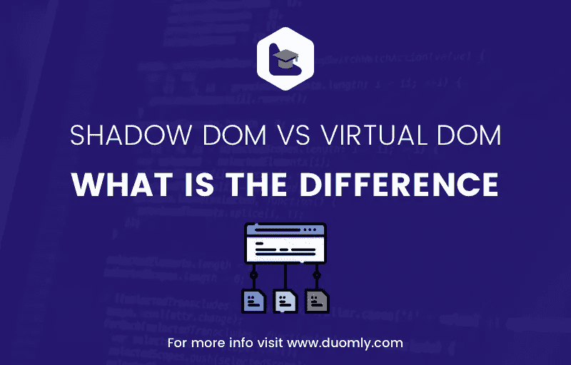
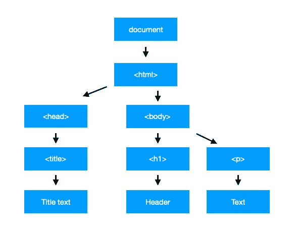

# 影子 DOM 和虚拟 DOM——有什么区别？

> 原文：<https://medium.com/duomly-blockchain-online-courses/shadow-dom-vs-virtual-dom-what-is-the-difference-f2611da536ab?source=collection_archive---------0----------------------->

[Duomly — programming online courses](https://www.duomly.com)

本文最初发表于:[https://www . blog . duomly . com/what-is-the-difference-between-shadow-DOM-and-virtual-DOM/](https://www.blog.duomly.com/what-is-the-difference-between-shadow-dom-and-virtual-dom/)

DOM(文档对象模型)是前端的一个基本概念，当然，每个试图学习编程的人都不止一次听说过它。对于初学者来说，理解它到底是什么以及如何操纵它并不那么容易。DOM 操作并不容易，最重要的是，它带来了很多性能问题。

如今，随着 Angular、React.js 或 Vue.js 等渐进式 web 框架的出现，DOM 有两个基本概念:**影子 DOM** 和**虚拟 DOM** 。

在这篇文章中，我想解释一下:

*   什么是文档对象模型(DOM)，
*   什么是影子王国，
*   什么是虚拟 DOM，
*   影子 DOM 和虚拟 DOM 有什么区别

我也会试着告诉你它们之间的区别，以及各自带来的优缺点。

让我们从解释什么是 DOM 开始。

[Virtual DOM vs Shadow DOM](https://youtu.be/l71h0IAYtck)

# 1.什么是 DOM？

新手经常误导 DOM，把他们创建的网站或应用程序当作 HTML 结构。但是 HTML 在浏览器解析之后就变成了 DOM，然后就变成了 DOM。根据定义，DOM 是 HTML 或 XML 文档的 API，它创建了一个可以被访问和操作的逻辑结构。换句话说，Javascript 可以访问文档对象模型并对其进行更改。实现文档对象模型的原因是为了提供一个标准的编程接口，它可以在不同的环境中与任何编程语言一起使用。
通过 DOM 修改，我们可以理解添加、删除或修改网站的元素，赋予它们不同的行为等。

每个浏览器都有一个全局对象，叫做窗口。在窗口内部，有不同的属性和方法。window 对象中的一个属性是一个文档，在这个文档中我们可以找到许多属性和方法，这些属性和方法可以用来访问 DOM 元素并与之交互。

DOM 的图形表示如下例所示:

[Duomly — programming online courses](https://www.duomly.co)

如你所见，它被创建为一棵树。它从主文档对象开始，然后创建对象，元素导致和，以此类推。
每个对象将来自网站的 HTML 元素表示为一个对象，具有允许修改它的属性、特性和方法。

# 2.阴影 DOM

Shadow DOM 是一个用来构建基于组件的应用和网站的工具。影子 DOM 是小块的，它并不代表整个文档对象模型。我们可以把它看作一个子树或者一个单独的 DOM 元素。影子 DOM 可以想象成创建 DOM 的砖块。

DOM 和 Shadow DOM 的主要区别在于它的创建方式和行为方式。通常我们创建的 DOM 节点被放在其他元素中，就像我们之前看到的树一样。在 Shadow DOM 的情况下，我们创建一个作用域树，它连接到元素，但与子元素分开。它叫做影子树，它所依附的元素叫做影子宿主。在这里，我们得到了阴影 DOM 的一个巨大优势，我们将添加到阴影 DOM 的所有东西都是本地的，甚至是样式。

让我们解释一下为什么 Shadow DOM 如此有用，它解决了什么问题。首先，它隔离了 DOM，所以组件的 DOM 是一个独立的元素，不会出现在全局 DOM 中。它有助于解决的另一个问题是 CSS 的作用域，这意味着在单个影子 DOM 元素中创建的样式是孤立的，并保持在影子 DOM 的作用域内。它大大简化了样式，因为我们不必太担心命名空间，我们可以使用简单的选择器和类名。此外，我们可以认为应用程序是由块构建的(它实际上是基于组件的)，而不是一个巨大的全局对象。

影子 DOM 会影响应用程序的性能。正如本文开头所说的，当我们想要操作 DOM 时，会有很多性能问题，因为每一次更改都会重新呈现整个对象。在阴影的情况下，DOM 浏览器知道应该更新哪一部分。

# 3.虚拟 DOM

虚拟 DOM 是 React.js 和 Vue.js 使用的 DOM 概念。在虚拟 DOM 概念中，DOM 的副本保存在内存中，当 DOM 发生任何变化时，都会进行比较以找出差异。然后浏览器知道哪些元素被改变了，可以只更新应用程序的那些部分，以避免重新呈现所有的 DOM。这样做是为了提高 UI 库的性能。正如我们所知，从 DOM 中的前一段开始，每个元素都被重新呈现，不管它是否被改变。

让我们一步步深入检查虚拟 DOM 是如何工作的。因此，首先，对虚拟 DOM 进行更改，而不是对原始 DOM 进行更改，然后将虚拟 DOM 与文档对象模型进行比较，这个过程称为“区分”。当发现差异时，浏览器就知道应该更新原始 DOM 中的哪些元素并完成更新。在虚拟 DOM 概念中，可以一次应用多个更改，以避免每次元素更改都要重新呈现。

虚拟 DOM 解决的最大问题是 DOM 操作的性能改进。

# 4.影子 DOM 和虚拟 DOM 的区别

两者唯一的共同点是它们都有助于解决性能问题。两者都创建文档对象模型的单独实例；除此之外，这两个概念是不同的。虚拟 DOM 创建整个 DOM 对象的副本，而影子 DOM 创建 DOM 对象的小部分，这些小部分对于它们所代表的元素有它们自己的、隔离的作用域。

# 结论

DOM 概念在前端编程中非常重要，但是随着技术和新库的发展，文档对象模型也得到了改进。使用渐进式 web 框架，我们可以使用影子 DOM 和虚拟 DOM 来避免性能问题，并更快、更有效地修改 DOM。现在，随着技术的发展，如何与 DOM 对象交互而不影响性能已经不再是一个需要担心的问题了。

我希望这篇文章有助于理解什么是 DOM 以及虚拟和影子 DOM 概念是如何工作的。此外，我还解释了它们之间的主要区别以及它们所解决的问题。

好好编码！

[Duomly — programming online courses](https://www.duomly.com)

感谢您的阅读！

本文由我们的队友安娜提供。