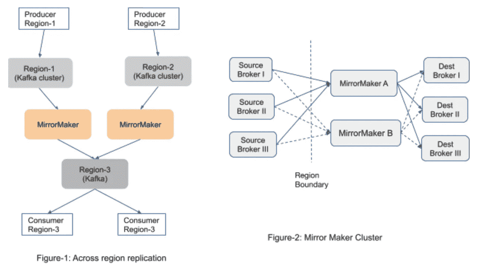

# 浅镜

> 原文：<https://medium.com/pinterest-engineering/shallow-mirror-f543b14bb25?source=collection_archive---------2----------------------->

# Kafka MirrorMaker 的增强功能可降低 CPU/内存压力

Henry Cai |软件工程师，数据工程

Pinterest 使用 [Kafka](https://www.confluent.io/blog/running-kafka-at-scale-at-pinterest/) 作为数据传输的主干。作为我们基础设施的一部分， [Kafka MirrorMaker](https://cwiki.apache.org/confluence/pages/viewpage.action?pageId=27846330) v1 用于复制分布在多个地区的不同 Kafka 集群之间的流量。Kafka MirrorMaker 是在不同 Kafka 集群之间复制/聚合数据的强大工具。图 1 显示了使用 MirrorMaker 在两个或多个区域之间复制流量的典型设置。图 2 显示了一个 MirrorMaker v1 集群如何在多节点设置中工作。

虽然 Kafka Mirrormaker 满足了我们最初的需求，但我们开始看到几个可伸缩性问题。

## **因交通量增加导致 OOM**

在流量高峰期，我们经常看到 CPU 峰值和内存不足(OOM)频繁发生。进一步的诊断显示，大部分 CPU 时间花在消息解压缩和重新压缩上；内存使用量通常是我们通过网络获取的字节数的 2-10 倍。这也解释了 OOMs 的部分根本原因。

在对 Kafka MirrorMaker 的内部进行进一步调查后，我们确认，除了解压缩之外，Kafka MirrorMaker 内部多个位置的数据(缓冲区)复制也导致了内存使用量的增加。图 3 显示了 Kafka MirrorMaker 过程的内部结构，该过程由复制数据的各个阶段组成。

消息处理过程中有这么多阶段的原因是因为 Kafka MirrorMaker 的设计允许消息在发送之前由自定义插件进行检查/转换，因此消息需要解压缩并从网络原始字节转换为 Java ConsumerRecord 对象。但是在 Pinterest 部署中，我们仅仅使用 MirrorMaker 作为复制引擎在 Kafka 集群之间传输字节。源集群和目的集群通常具有相似的设置，并且源集群中的消息已经被适当地压缩和批处理。

我们首先想到的是将原始字节从接收者的套接字缓冲区直接复制到发送者的套接字缓冲区，因为我们只关心消息复制。然而，我们很快意识到，为了使有效载荷可读，响应包需要重新组装。图 5 是网络上的典型 Kafka FetchResponse 消息(消费者在 MirrorMaker 节点上收到的消息):

图 5 显示了 FetchResponse 的结构。如果来自不同主题和分区的数据驻留在相同的源节点上，则这些数据通常被一起打包在相同的网络消息中。类似地，从 MirrorMaker 发送到目标 Kafka 集群的 Kafka ProduceRequest 消息也将多个主题/分区的数据打包在一起，如果这些分区位于同一目标节点上的话。不能保证源群集和目标群集之间的分区到节点映射是相同的。因此，我们知道我们需要分解字节来重新打包。但是我们能不能跳过解压缩/重新压缩，这是最占用 CPU/内存的操作？

Figure-6: MemoryRecords Data Structure

从每个分区的 MemoryRecords 数据结构(图 6)中，我们可以看到分区内的消息是按照记录批次的顺序组织的，每个批次内的记录都被压缩了，但是批次头没有被压缩。因此，如果我们可以按原样传递 RecordBatch，而不深入批内部，我们就可以跳过压缩阶段。

这让我们设计了一个改进的 Kafka MirrorMaker，称为 Shallow Mirror，逻辑如下(图 7):

1.  我们将**浅层次地**迭代 MemoryRecords 结构中的记录批，而不是深度迭代记录批中的记录
2.  我们将**浅显地**为消息复制(共享)ByteBuffer 中的指针，而不是将字节深度复制和反序列化到对象中

我们没有编写新的镜像产品，而是决定深入 Kafka 生产者/消费者库，引入原始字节模式。当原始字节模式打开时，使用者将把与 RecordBatch 相对应的原始字节返回给应用程序客户端，应用程序客户端将把 RecordBatch 原始字节传递给生产者以发送到目的地，否则它将按照旧的方式工作。我们选择增强消费者/生产者 API，以便其他用例可以采用该特性(例如 MirrorMaker v2)。我们还在[卡夫卡 KIP-712](https://cwiki.apache.org/confluence/display/KAFKA/KIP-712%3A+Shallow+Mirroring) 中提出了我们的浅层镜面增强。

在 2020 年末，我们在生产中部署了浅镜像，由于节省了 CPU/内存/GC，我们看到了显著的扩展和性能改进。图 8 和图 9 显示了启用浅层镜像前后 CPU/内存使用的变化。

虽然这个策略原则上听起来不错，但我们在实施过程中遇到了几个障碍。下一节将介绍我们在浅层镜像实现过程中学到的经验。

## **字节缓冲区陷阱**

我们在接收方和发送方之间传递字节缓冲区指针以避免深度复制，但我们很快意识到我们需要修改字节缓冲区。图 10 显示了 RecordBatch 字节缓冲区的头字段。猜测哪些内容需要更改？

Figure-10: RecordBatch data structure

是，BaseOffset 字段。传入消息中的 BaseOffset 表示源卡夫卡集群中的卡夫卡消息偏移，但它们在目标集群中不会具有相同的偏移。一旦我们开始更改字节缓冲区，我们就必须注意缓冲区的读/写模式以及偏移、位置、限制和标记。

## **第一批**

在产品部署之后，有时我们注意到我们得到的消息比我们要求的更多。看看下面的例子:

当源代理只发送消息 A、B 和 C 时，后端的使用者会在 A、B 和 C 之前收到更多的消息。这种情况时有发生。我们将此问题追溯到消息是如何存储在源代理端的。

在源代理端，消息由 RecordBatch 存储。在此示例中，消息 1、2 和 3 存储在第一批中，而 4、5 和 6 存储在第二批中。当消费者从 offset 3 请求消息时，代理实际上分两批发回所有 6 条消息(因为 Kafka 代理利用 sendFile API 消除了到用户空间的缓冲区拷贝)，并依赖消费者来进行过滤。基于这种理解，我们知道我们必须在将第一批返回给客户之前对其进行裁剪。

## **小批量**

最初的原型适用于第一个主题。然而，当我们转到第二个卡夫卡主题时，我们注意到 MirrorMaker 和目标代理之间的出站消息吞吐量开始下降。第二个卡夫卡主题有什么特别之处？当我们分析该主题的原始字节时，我们注意到该主题的批处理大小非常小(平均几百个字节)。

Figure 13: Batch size for the small batch messages

当批处理大小小时，我们会损失大量网络效率(请记住，网络缓冲区和数据包通常以千字节大小组织)。我们尝试通过增加 Kafka 的 max . in fly . requests 配置来增加出站流并行性，并尝试使用多个 TCP 连接，但这没有帮助，因为目标代理正在顺序处理回复消息以保持消息排序。

但是，我们注意到网络性能只是出站流量的问题，而不是入站流量的问题。通过查看入站 FetchResponse 消息和出站 ProduceRequest 消息，我们注意到一个奇偶校验异常。入站和出站消息都使用 MemoryRecords 数据结构来捕获一个主题/分区中的数据(参见图 6 中的 MemoryRecords 数据结构)。但是入站 MemoryRecords 包含多个记录批，而出站 memory records 只包含一个记录批。我们修改了生产者库代码来放松这个约束，这解决了那个用例的吞吐量问题。

## **消息再次转换…在代理中**

一切看起来都很美好，直到我们的 SRE 工程师注意到代理上的消息转换:

Figure-14: Message conversion stats chart

图 14 显示了消息转换发生在代理内部。简单介绍一下消息转换，这是 Kafka 代理需要将消息从一种格式转换为另一种格式的过程，通常发生在生产者和代理使用不同的消息格式或不同的消息压缩算法时。消息转换是 Kafka 上高 CPU 使用率和低吞吐量的关键根源之一。

如果到目前为止您还在使用我们的产品，您会发现我们已经花费了大量精力来减少 MirrorMaker 节点上的 CPU/内存使用，以跳过不必要的消息转换，现在问题已经转移到了水管的后半部分(代理)。我们检查了代理代码，并意识到它在多个 RecordBatches 输入上重建了整个批处理，因此我们修复了这个问题。

## **未来工作**

我们希望通过提交 Kafka KIP 提案将这项工作回馈给 Kafka 社区: [KIP-712](https://cwiki.apache.org/confluence/display/KAFKA/KIP-712%3A+Shallow+Mirroring) 。请随意在此参与讨论[或扩展这项工作以支持更多用例，如 Kafka MirrorMaker v2。](https://www.mail-archive.com/dev@kafka.apache.org/msg116025.html)

**确认**

*我们要感谢 Pinterest 日志团队(安布德·夏尔马、瓦希德·哈什米安* *等人)和 Apache 社区成员的集思广益、深入审查和指导。*