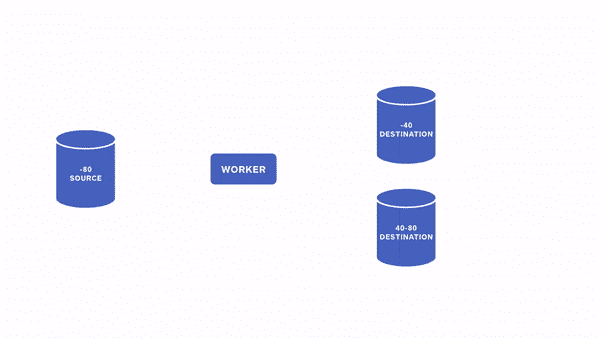
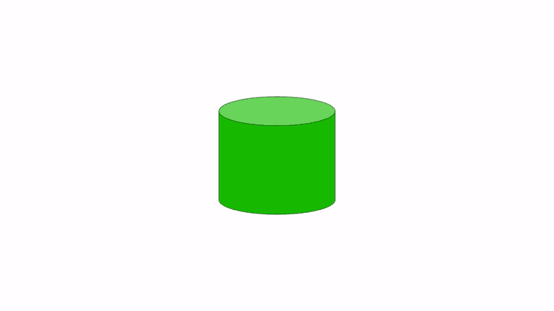

# 具有一致快照的碎片分割

> 原文：<https://medium.com/square-corner-blog/shard-splits-with-consistent-snapshots-adcf622842dd?source=collection_archive---------3----------------------->

## 如何复制一张太大而无法一次拍摄的照片


> 注意，我们已经行动了！如果您想继续了解 Square 的最新技术内容，请访问我们的新家[https://developer.squareup.com/blog](https://developer.squareup.com/blog)

# 将碎片分成更小的碎片

在 Square，我们的数据库中插入了大量数据。为了让 MySQL 能够处理负载，我们使用 Vitess 对数据进行分片。因为我们接收的数据量非常大，而且数据量还在增加，所以我们还没有完成，因为我们已经对数据库进行了一次分割。相反，我们需要不断缩小碎片，这样每个单独的 MySQL 数据库就不必一次处理太多的数据。

理论上，这非常简单。我们已经决定了切分哪一列，所以我们需要做的就是检查每个表中的每一行，并使用哈希算法来决定该行将最终出现在哪个新的切分中。


这里的问题更多的是规模问题。当需要分割时，我们的碎片大小往往在 1tb 左右。对这么多数据的任何操作都需要时间。在此期间，数据不断进入系统，我们不能告诉客户“不要着急，我们只需要花几个小时来维护数据库，好吗？”

碎片分裂是一个渐进的过程。在这里，我将向您介绍这个过程，以及 Vitess 如何在对应用程序层影响最小的情况下做到这一点。我还将解释我们正在添加到 Vitess 中的一个新特性，它将在许多情况下使这个过程更加有效。

当分割碎片时，一个人可以分割成至少两块，但一个人也可以分割成更多的碎片，例如一对四或甚至一对八。为了简单起见，我只讨论一对二，但是概念是一样的。

第一步是建立目标数据库并复制表结构。一旦完成，目的碎片就准备好接收它们的数据份额了。

# 先看大局

下一步是进行所谓的“在线克隆”，这意味着检查每个表，并将行复制到散列所指向的目的碎片。这是在不获取源表上任何特殊锁的情况下完成的。在这个阶段结束时，我们在目标分片中有很多数据，但是因为我们没有保护自己免受并发更新的影响，所以它肯定是不一致的。因为当我们复制数据时，源数据库不断地得到插入、更新和删除，所以副本现在有来自不同时间点的不同部分。一个很好的视觉例子是，当你拍摄全景照片时，照片中有东西在移动。


[Photo](https://www.flickr.com/photos/lastnightat3am/22082180276) by [lastnightat3am](https://www.flickr.com/photos/lastnightat3am/) is licensed under [CC BY 2.0](https://creativecommons.org/licenses/by/2.0/)

在这个阶段的最后，我们有了正确的图片背景。数据可能存在异常、不一致和其他问题，但这是意料之中的，没问题。我们不必满足于正常世界的物理学；在软件方面，我们可以拥有超能力！

但是我想得太多了。。。

# 打扫

为了填充细节，我们必须进行下一步，即“离线克隆”这意味着使源碎片群集中的一个节点离线—我们关闭对其中一个副本的所有查询和复制，wazam 是一个稳定的复制点。现在我们检查源中的所有表，并与我们复制的行进行比较。任何差异都将在我们发现时得到解决。这比原始副本快得多，尽管我们必须再次扫描所有表的所有行，原因很简单，因为读取比写入数据库快得多。读取只需要获取一个锁并进行读取，而写入必须获取锁，写入事务日志，更新内存中的表(如果一个页面已满，则溢出！)，更新索引，将更改复制到副本等。可以说，写数据比读数据要多得多，在第二步中，我们主要是在读。



在完成此阶段之前，我们希望确保跟踪更改，因此我们打开了从源到两个目标的 vReplication。vReplication，有时也称为过滤复制，是一种考虑到分片的复制。只有属于目标碎片的行被复制。源群集仍在进行所有的读取和写入，但更改会被复制到目标碎片，因此它们拥有最新的数据并准备好接管。

# 我们的分机

在某些环境中，不可能像这样暂停到单个数据库的复制。如果你在亚马逊的 [Aurora](https://aws.amazon.com/rds/aurora/) 上，你只能控制对整个集群的复制，而不能控制对单个节点的复制。在 Square，我们提供数据库的方式使我们很难控制复制。我们的解决方案是在一个不同的环境中设置一个额外的节点，由我们自己托管和控制。这非常耗时，所以当我加入时，改善这种情况是我的起步项目。

[乔恩·蒂森](https://twitter.com/tirsen)给我指了 mysqldump 的方向。要进行在线备份，mysqldump 也有同样的问题，即移动的目标很难复制。他们的解决方案很酷，我们最终也使用了它。

你可以自己阅读 mysqldump 的有趣代码[这里](https://github.com/mysql/mysql-server/blob/8.0/client/dump/single_transaction_connection_provider.cc)。以下是该文件的注释:

```
To get a consistent backup we lock the server and flush all the tables. 
This is done with FLUSH TABLES WITH READ LOCK (FTWRL).       
FTWRL does following:         
1\. Acquire a global read lock so that other clients can still query the database.         
2\. Close all open tables.
3\. No further commits is allowed. This will ensure that any further connections will view the same state of all the databases which is ideal state to take backup.
```

这是 mysqldump 将用于从源进行所有读取的连接提供程序。

这种方法表面上很简单，但实际上有很多非常复杂的机制。首先，我们确保通过使用`FLUSH TABLES WITH READ LOCK` (FTWRL)在每个表上获取一个巨大的读锁来暂停对源的所有更新。这相当于暂停复制—现在没有任何事务处理完成。

然后，我们根据需要打开尽可能多的事务连接。当打开它们时，我们指定我们对获得一致的快照事务感兴趣，这在这种情况下非常有用。这给了我们一幅稳定的数据库图——如果东西移动了，MySQL 会努力为我们重新创建原始状态。由于我们首先使用 FTWRL 暂停了所有更新，现在我们有了一堆事务，它们都指向数据库发展过程中的同一个时间点。简而言之，我们冻结了时间！

现在，我们可以释放表锁，并允许副本服务器继续从其主服务器接收复制流量。

使用这个事务稳定的数据库视图，我们现在可以检查数据库并修复由第一个副本引入的不一致。

这有助于更好地利用资源—副本仍然可以参与读取查询，并且不会落后于复制流量，而且我们没有设置整个节点的大任务，只是为了能够分割成更小的碎片。

# 我们的结果



对我们来说，这一改变使得分割碎片变得更快。使用我们的旧流程，我们可以每周进行几次拆分，现在我们可以每天进行几次。MySQL 团队中一些非常聪明的人已经为我们所依赖的特性付出了很长时间的努力，我们利用他们的工作是非常明智的。

这篇文章是 Square[Vitess 系列](/square-corner-blog/sharding-cash-10280fa3ef3b)的一部分。