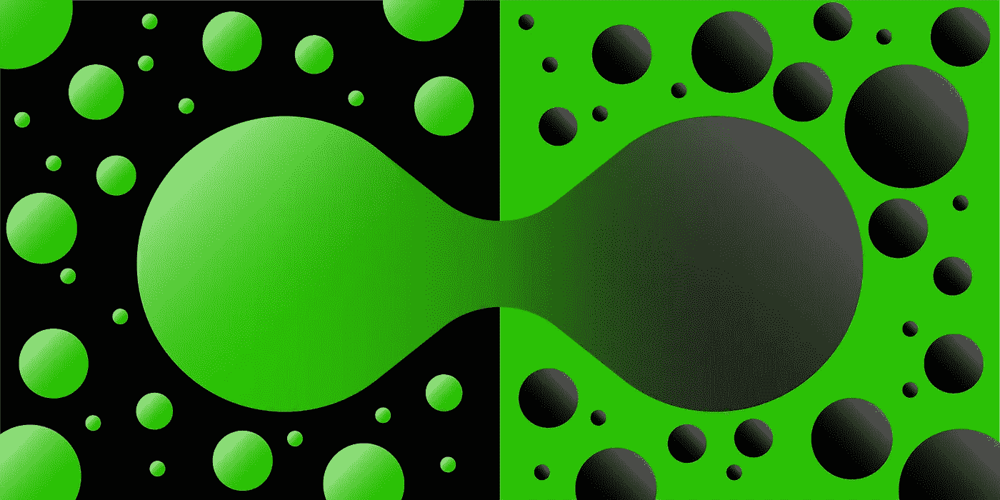
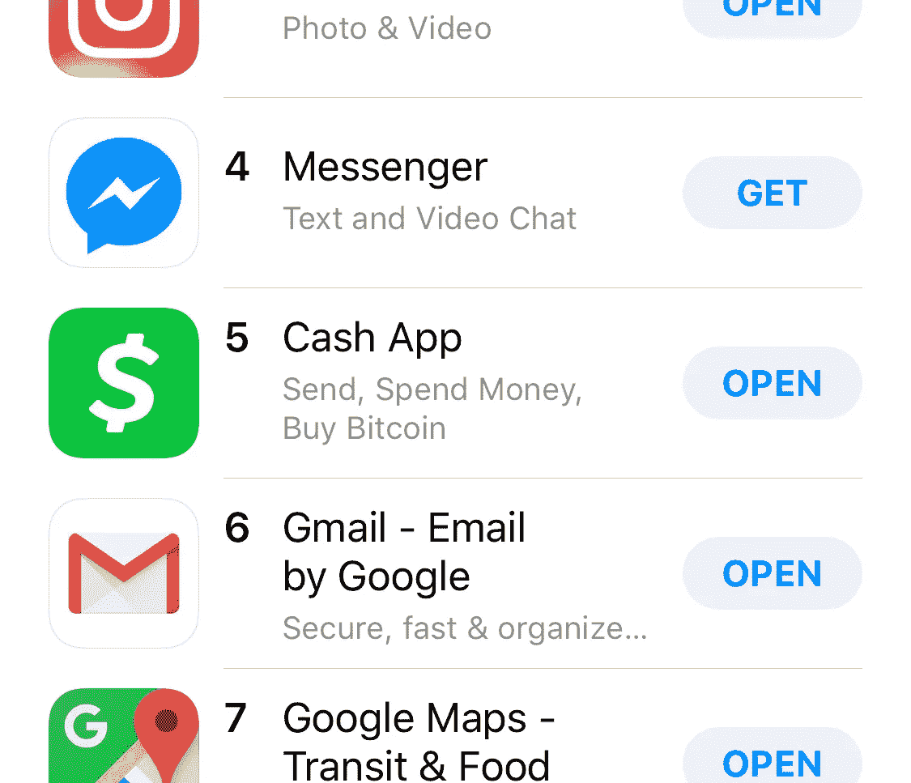
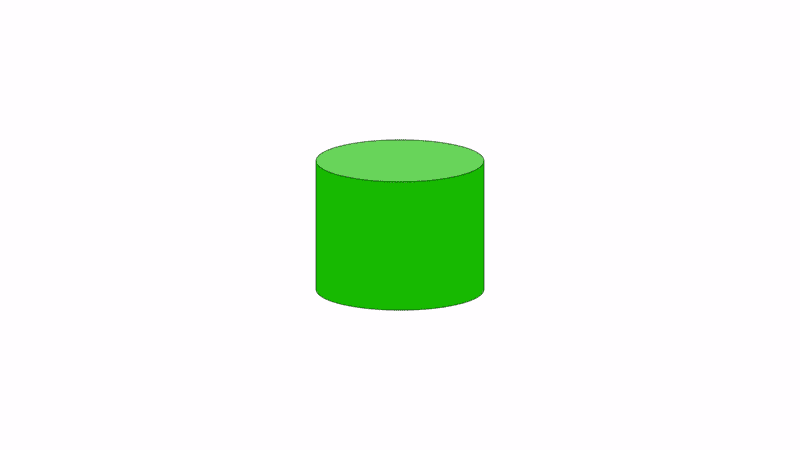
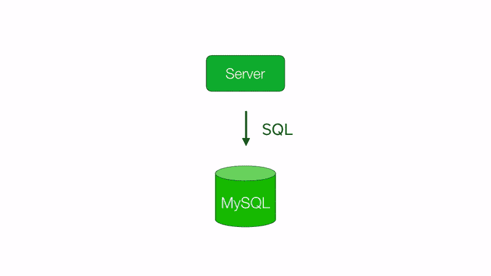
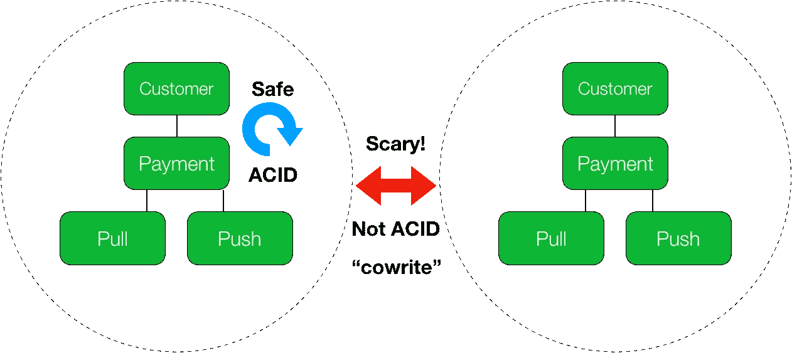
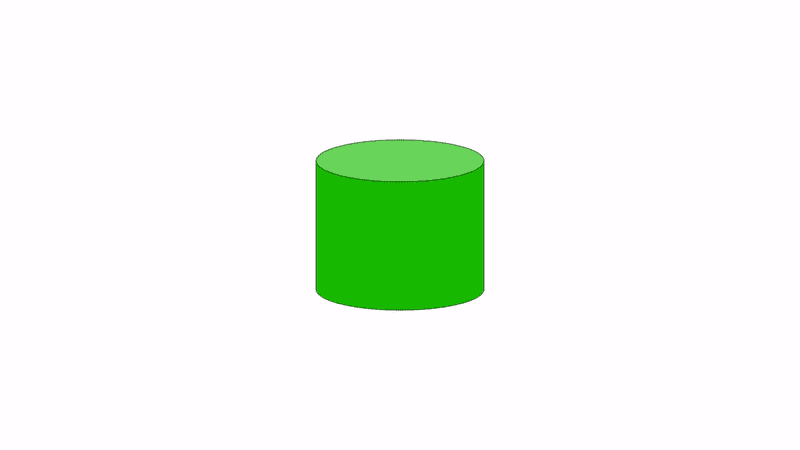

# 分割现金

> 原文：<https://medium.com/square-corner-blog/sharding-cash-10280fa3ef3b?source=collection_archive---------0----------------------->

## *一个要有的好问题:用 Vitess 放大* [*@CashApp*](http://twitter.com/CashApp) *数据库。*



> 注意，我们已经行动了！如果您想继续了解 Square 的最新技术内容，请访问我们的新家[https://developer.squareup.com/blog](https://developer.squareup.com/blog)

*随着 2018 年底的临近，我们正在庆祝首款 shard split for Cash 应用的周年纪念日，并发布了一系列博客文章，解释我们如何使用 Vitess 进行横向扩展。快速增长是艰难的，它并不总是一帆风顺的。我们很高兴能够深入了解我们一路走来学到的许多东西。将会有关于主要领域模型重构、分布式死锁、处理跨分片查询、操作以及我们如何重建 Vitess 分片过程的故事。敬请关注。*

这是一个星期五的清晨，在加拿大多伦多郊外的基奇纳，我正准备开始今年最后一次碎片分割的最后几个程序。如果运气好的话，我们将在受到周五高峰流量的冲击之前完成拆分，周五是 Cash App 一周中最紧张的一天。

几乎就在一年前，在我们旧厨房办公室的一个会议室里:这是我职业生涯中最艰难的事情之一的高潮。“分片团队”的另一名全职成员，Mike Pawliszyn(T12)通宵工作，为我们的第一个分片拆分运行拆分克隆和 diffs，现在已经精疲力尽睡过头了。杰西·威尔逊和艾伦·鲍林坐在我旁边，他们是现金乐队的早期成员。我的手指颤抖着按下回车键，这可能是我职业生涯中执行的最具戏剧性的命令之一。

```
vtctlclient MigrateServedFrom main/- MASTER
```

该命令是“垂直分割”过程的最后一步。它将一组特定表的主流量从一个数据库迁移到另一个数据库中这些表的克隆。克隆通过重放 MySQL 事务日志(“binlogs”)来保持最新。这种分片是为了将我们不会分片的表与将来会进一步分片的表分开。

在我运行这个命令之后，我们将完成第一次(许多次)分片。

如果没有明显的数据丢失，这是不可逆的。

我非常害怕。

我站起来，在房间里踱来踱去。真的是这样吗？我们都考虑到了吗？如果我错过了什么呢？如果我把一切都搞砸了怎么办？



Cash App’s popularity has continued to grow — seen here at #5 in Apple’s App Store

让我们回到 2016 年末。现金增长惊人，在交通高峰时难以支撑。我们按照经典的剧本进行横向扩展:缓存、移出历史数据、副本读取、购买昂贵的硬件。但这还不够。所有这些都为我们赢得了时间，但是我们的发展速度也非常快，我们需要一个能够让我们无限扩展的解决方案。我们还有最后一件事要做。

我们不得不分开。

Cash 最初是在黑客周期间作为一个简单的实验建立的。它建立在一个 MySQL 数据库之上。这些年来，产品越来越受欢迎，团队也不断壮大。代码库增长到超过 50 万行代码。这个数据库越来越大。现在是时候把它分成许多较小的数据库了。去*碎片*它。



碎片是一件可怕的事情。每一行代码都假设我们只有一个数据库。几十年来，关系数据库完善了您拥有数据库的幻觉，而实际上，您只是成千上万并发用户中的一员。我们称之为酸性交易。当你分片时，你分裂了单个数据库并打破了幻觉。如果你的代码没有意识到，事情会以不好的方式出错。💥

如果你把它归结为两个部分:

1.  你必须能够分割数据库，或者我们称之为*碎片分割*。
2.  现在你有了许多数据库碎片，你必须能够*将查询*路由到正确的数据库碎片。

我们开始为这个问题设计我们自己的解决方案——但是当我们围绕 Square 进行社会化设计时，有人向我们提到了这个叫做 Vitess 的东西。YouTube 上的 Vitess 正是为了完成这一任务而建立的。当我们开始研究 Vitess 时，它仍处于早期阶段。文档是新生的。缺乏特色。但是有一些东西在那里，创作者 Sugu Sougoumarane 非常响应和乐于助人。我们决定花些时间看看 Vitess 是否能为我们工作。

Vitess 本质上是一个运行在多个 MySQL 实例之上的分布式数据库。如果你只有一个 MySQL 数据库，你可以在你的应用和 MySQL 之间插入 Vitess，然后分割你的数据库，同时保持一个单一数据库的假象。您对 Vitess 使用 SQL，Vitess 将 SQL 路由到正确的 MySQL shard。



问题在于这种幻觉是不完美的。您可以拥有跨越多个碎片的事务，但是这些事务并不是完全 ACID 的。有时，一个查询需要分散到多个分片，这样的查询与一个分片的查询具有完全不同的性能和运行时间特征。我们的代码没有意识到这些错觉的不完美。

与 Square 一样，Cash App 的客户也信任我们。我们绝不会以牺牲数据一致性来换取可用性。Vitess 的其他用户(如 YouTube)可以做出不同的取舍——也许偶尔删除一条评论对他们来说并不是世界末日。但不是我们。所以我们要做的第一件事就是改变我们的应用程序代码，这样它就不会在代码的关键资金处理部分进行跨分片交易。跨分片事务可能会部分失败，这对我们来说是不可接受的。

我们引入代码库的最重要的想法是*实体组*的概念。我们可以以这样一种方式配置 Vitess，使得一个实体组的所有成员通过分片保持在一起。简而言之，当你在一个实体团体中时，一切都是安全的。幻觉又一次完美了。然而，当您跨越实体组时，事情可能会变得可怕。👻

在我们的案例中，我们的主要实体组是客户。单个客户的数据中的事务总是安全的，并且是完全 ACID 的，但是跨多个客户的事务(我们称之为“cowrites”)则不是，我们必须采取预防措施来维护完整性。



这是对我们代码的一个重大改变——这是 [Jesse Wilson](https://twitter.com/jessewilson) 将在本系列即将发布的帖子中讨论的。

一年后，在那个寒冷的 11 月早晨，我们回到了办公室。我已经在办公室紧张地走了一段时间了。艾伦和杰西告诉我会没事的。如果我们在一天的高峰交通中走得太远，我们将无法完成碎片分割。是时候了…

我坐下来，按下回车键。

我们都目不转睛地盯着各种监控屏幕。

"查询流量正在减少."

"交通现在在新的碎片上."

我们的警报系统只有一个页面，错误很快就会消失。我们的停机时间不到一秒钟。

成功了。



我们正在庆祝第一个 shard split for Cash 应用程序的周年纪念日，并发布了一系列帖子，讨论我们如何使用 Vitess 进行扩展。

接下来是我们的 Vitess 系列:

*   [装修款](/square-corner-blog/remodeling-cash-app-payments-539e1f6c4276)
*   [分布式死锁](/square-corner-blog/abstracting-sharding-with-vitess-and-distributed-deadlocks-3128d7c8ffd1)
*   [跨分片查询&查找表](/square-corner-blog/cross-shard-queries-lookup-tables-9d5d0ed847c1)
*   [具有一致快照的分片拆分](/square-corner-blog/shard-splits-with-consistent-snapshots-adcf622842dd)
*   [操作指南](/square-corner-blog/operating-vitess-d90eb01e5b4d)

敬请期待！

我们确实在交通高峰前完成了分流！
主流量迁移最近变得可逆，因此不再像过去那样容易引起焦虑。